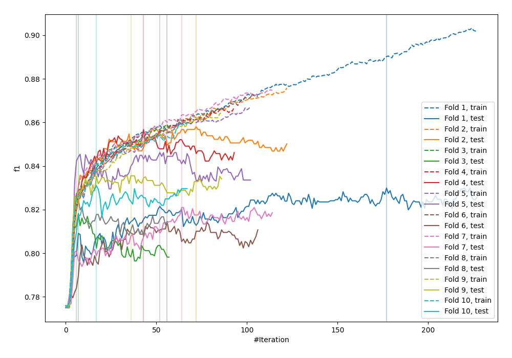
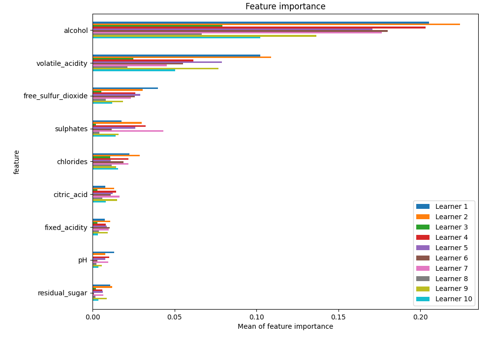
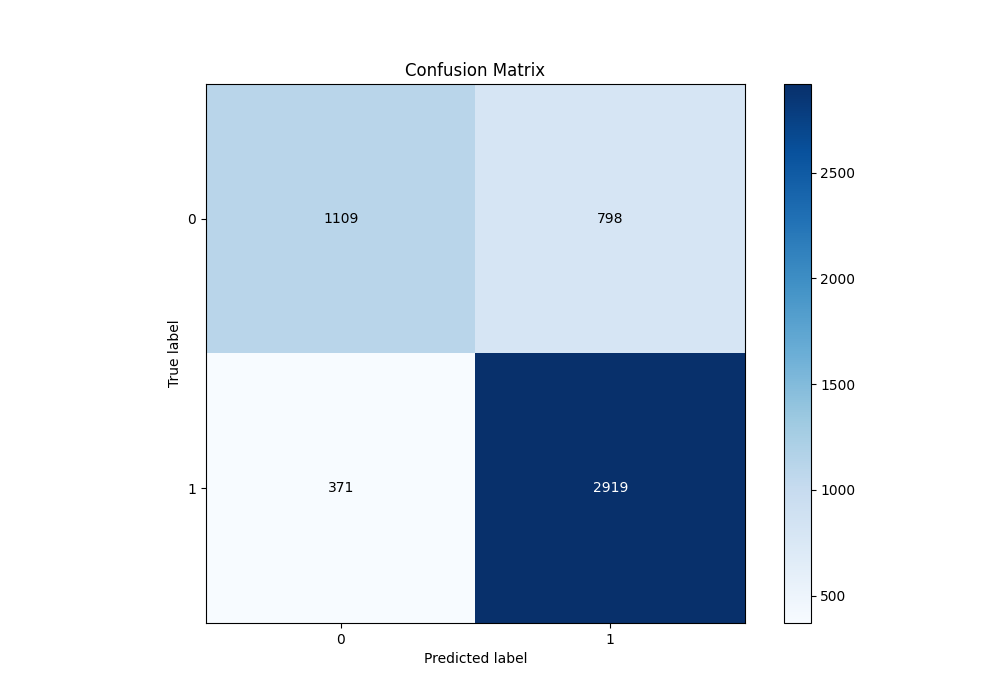
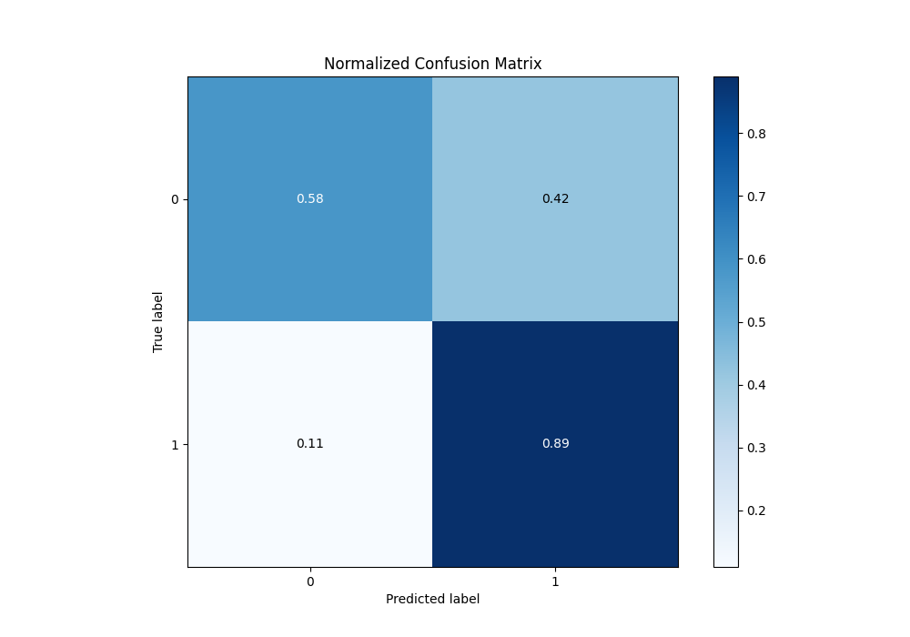
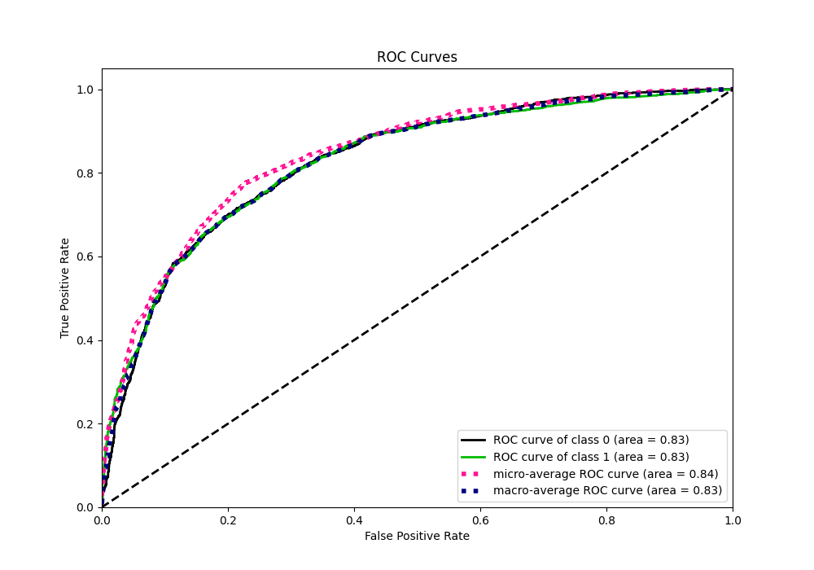
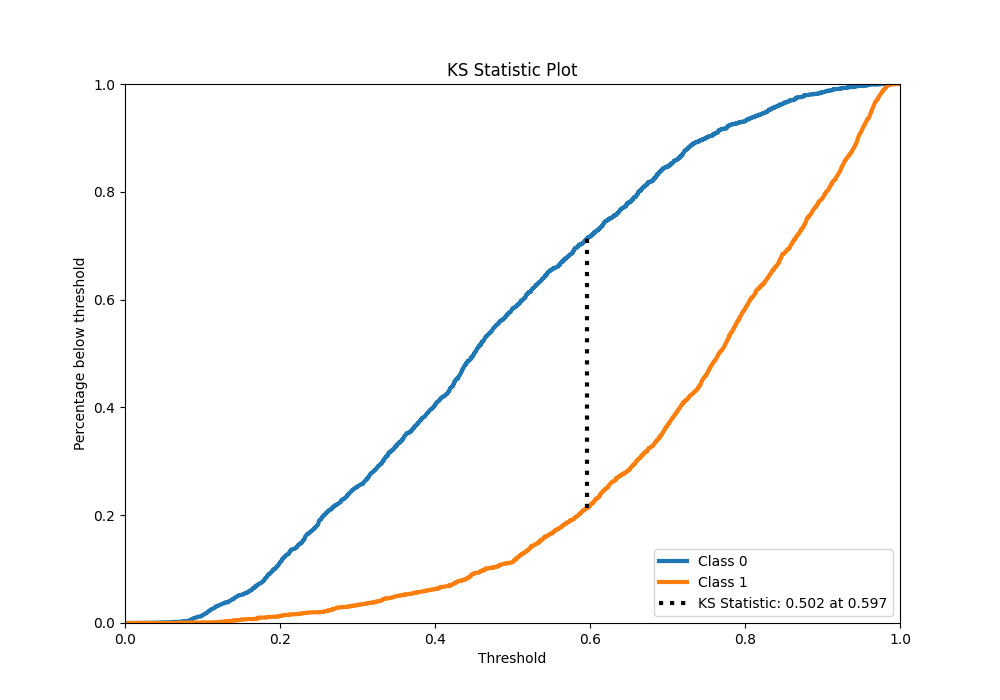
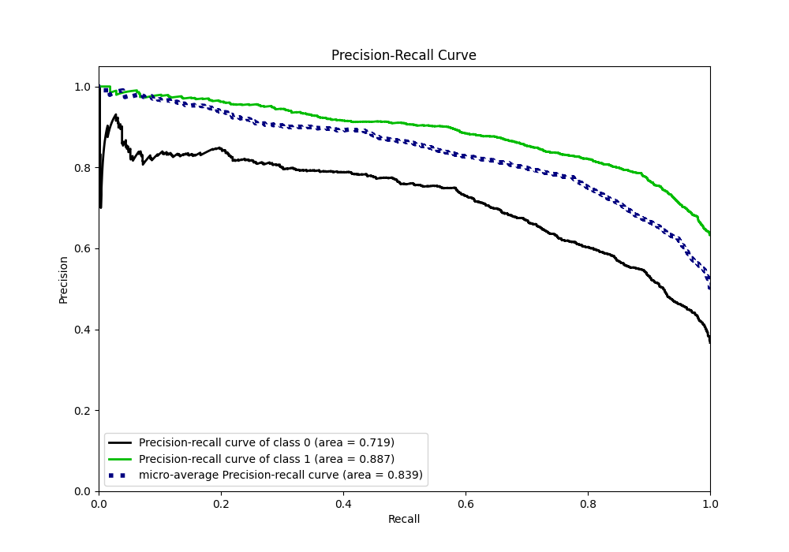
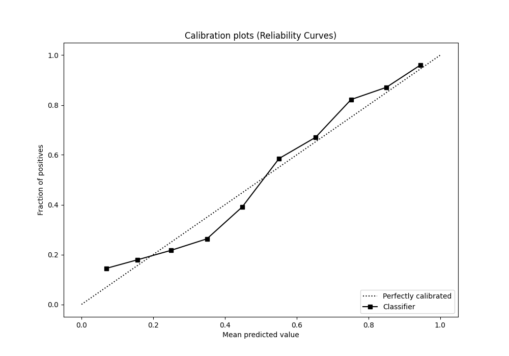
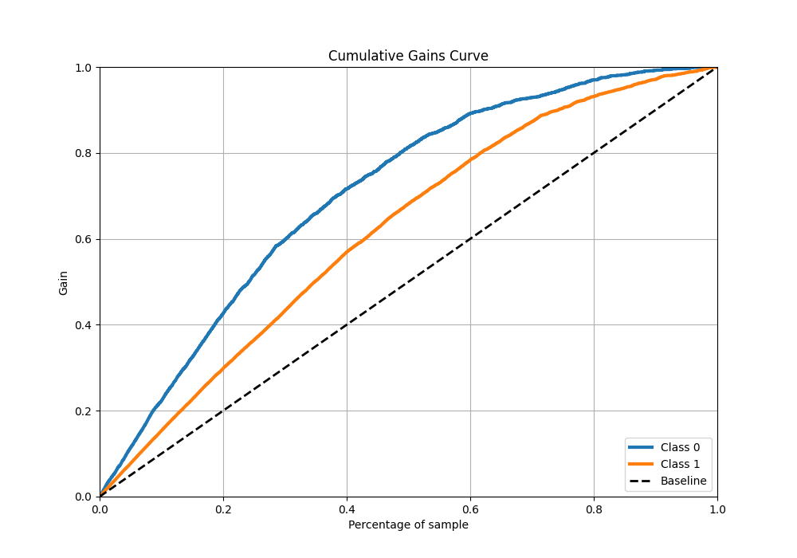
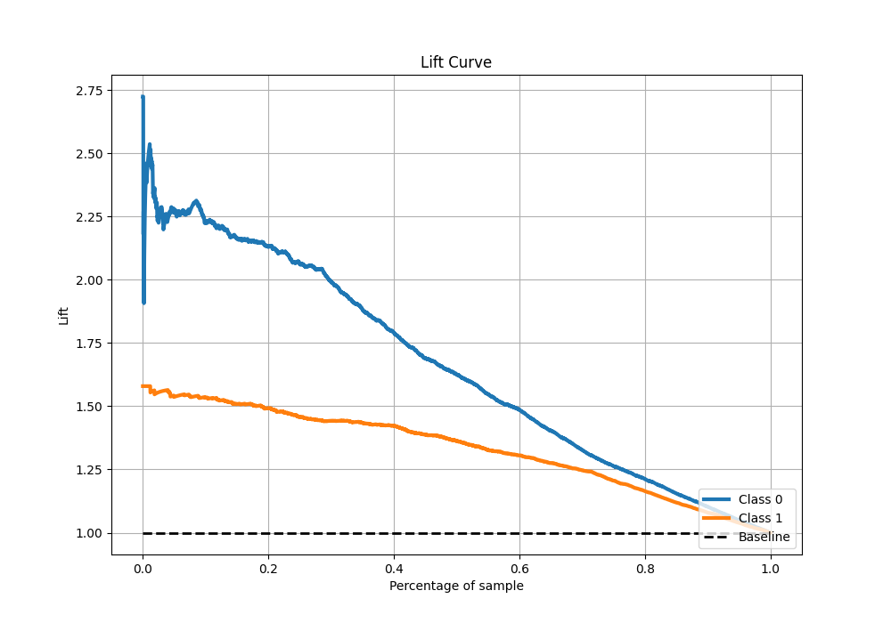

# Summary of 14_Xgboost

[<< Go back](../README.md)

## Extreme Gradient Boosting (Xgboost)
- **n_jobs**: -1
- **objective**: binary:logistic
- **eta**: 0.1
- **max_depth**: 7
- **min_child_weight**: 25
- **subsample**: 0.9
- **colsample_bytree**: 0.6
- **eval_metric**: f1
- **explain_level**: 1

## Validation
 - **validation_type**: kfold
 - **k_folds**: 10
 - **shuffle**: True
 - **stratify**: True
 - **random_seed**: 12

## Optimized metric
f1

## Training time

10.8 seconds

## Metric details
|           |    score |   threshold |
|:----------|---------:|------------:|
| logloss   | 0.494574 | nan         |
| auc       | 0.826931 | nan         |
| f1        | 0.833167 |   0.499362  |
| accuracy  | 0.775063 |   0.499362  |
| precision | 0.989899 |   0.960913  |
| recall    | 1        |   0.0354002 |
| mcc       | 0.500624 |   0.499362  |

## Metric details with threshold from accuracy metric
|           |    score |   threshold |
|:----------|---------:|------------:|
| logloss   | 0.494574 |  nan        |
| auc       | 0.826931 |  nan        |
| f1        | 0.833167 |    0.499362 |
| accuracy  | 0.775063 |    0.499362 |
| precision | 0.785311 |    0.499362 |
| recall    | 0.887234 |    0.499362 |
| mcc       | 0.500624 |    0.499362 |

## Confusion matrix (at threshold=0.499362)
|              |   Predicted as 0 |   Predicted as 1 |
|:-------------|-----------------:|-----------------:|
| Labeled as 0 |             1109 |              798 |
| Labeled as 1 |              371 |             2919 |

## Learning curves

## Permutation-based Importance

## Confusion Matrix

## Normalized Confusion Matrix

## ROC Curve

## Kolmogorov-Smirnov Statistic

## Precision-Recall Curve

## Calibration Curve

## Cumulative Gains Curve

## Lift Curve

[<< Go back](../README.md)
