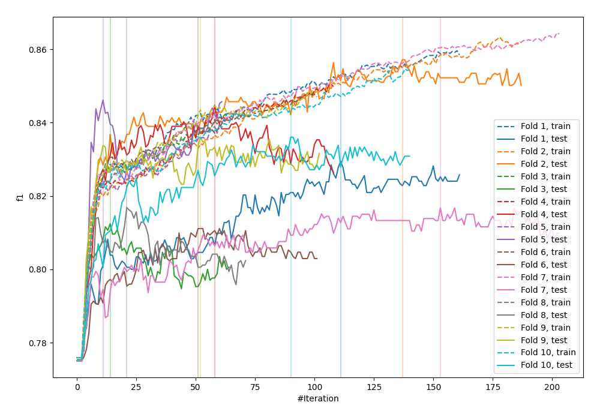
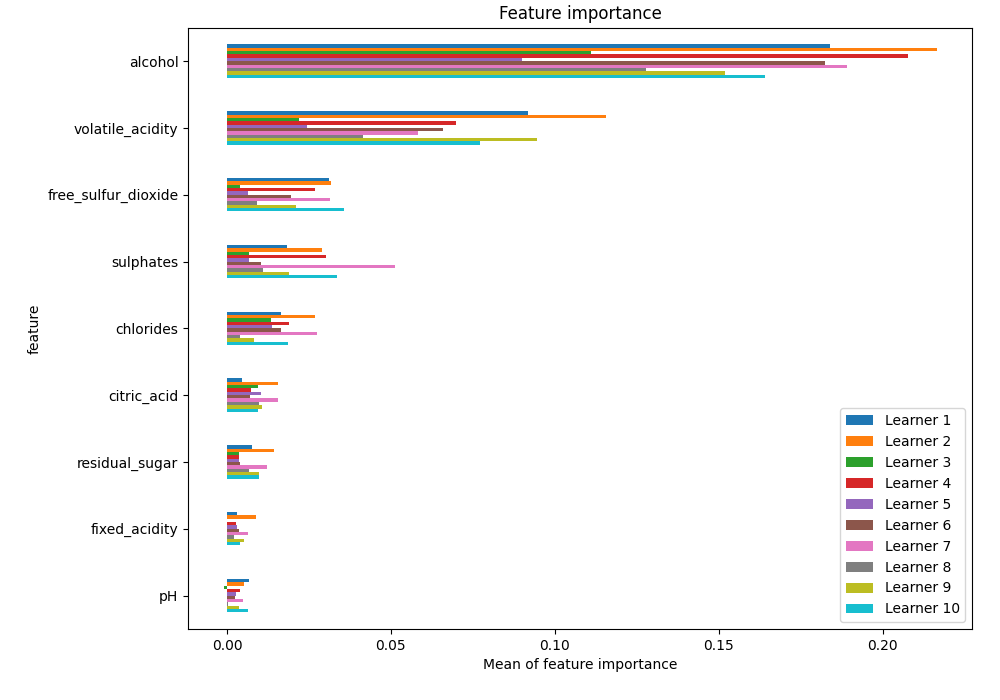
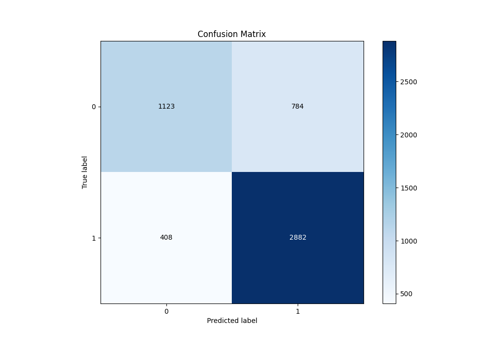
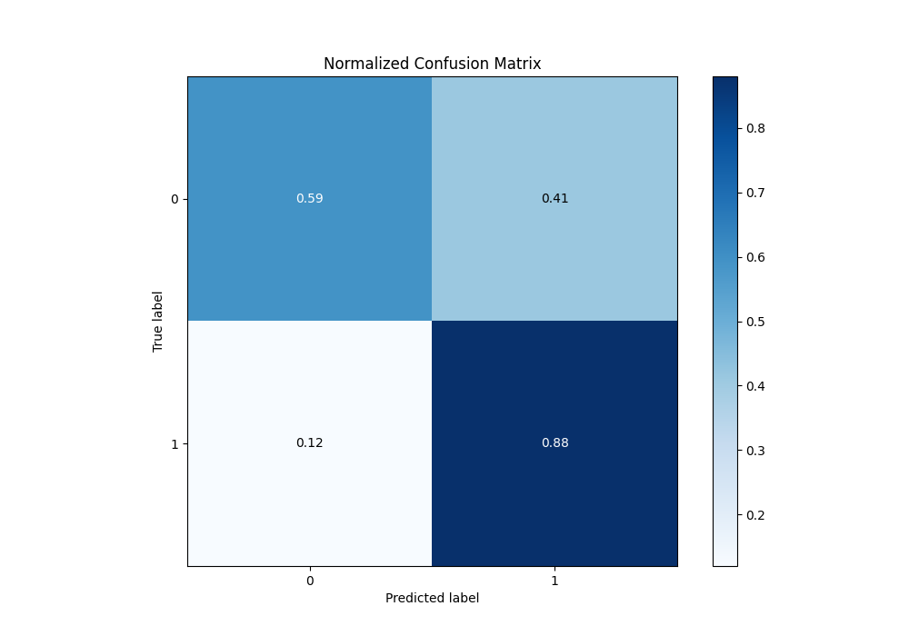
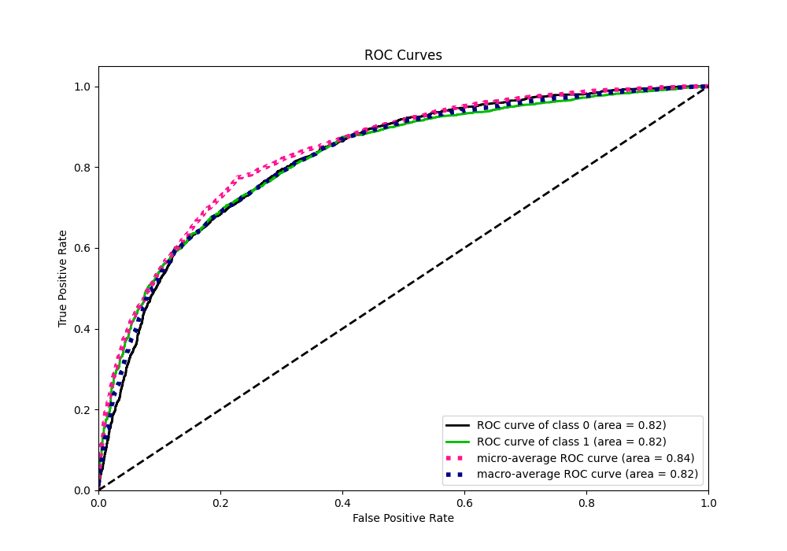
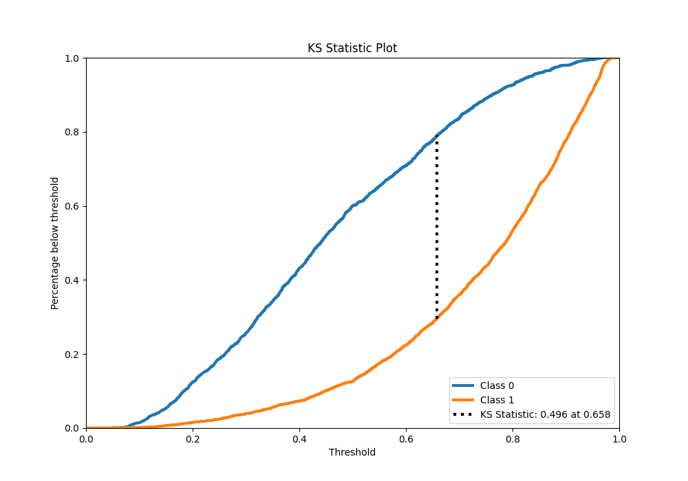
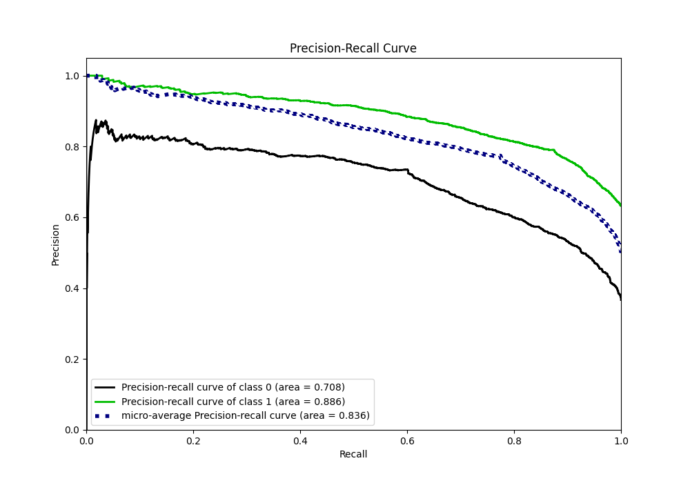
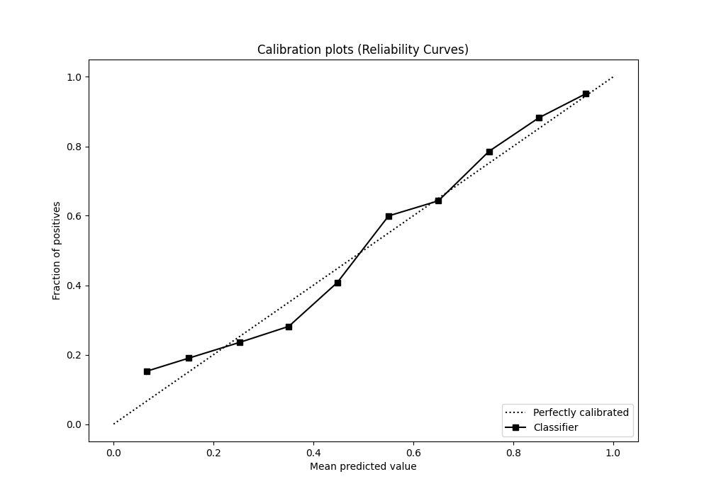
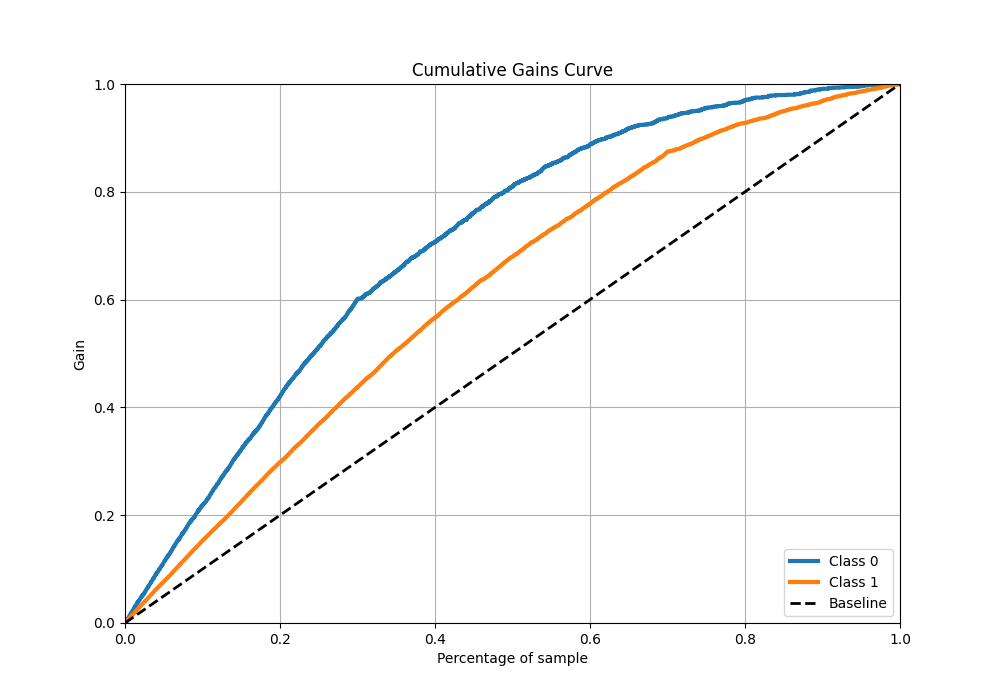
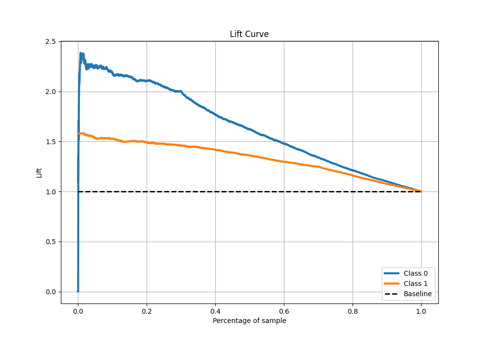

# Summary of 16_Xgboost

[<< Go back](../README.md)

## Extreme Gradient Boosting (Xgboost)
- **n_jobs**: -1
- **objective**: binary:logistic
- **eta**: 0.1
- **max_depth**: 6
- **min_child_weight**: 50
- **subsample**: 0.9
- **colsample_bytree**: 0.7
- **eval_metric**: f1
- **explain_level**: 1

## Validation
 - **validation_type**: kfold
 - **k_folds**: 10
 - **shuffle**: True
 - **stratify**: True
 - **random_seed**: 12

## Optimized metric
f1

## Training time

12.3 seconds

## Metric details
|           |    score |   threshold |
|:----------|---------:|------------:|
| logloss   | 0.496356 |  nan        |
| auc       | 0.823948 |  nan        |
| f1        | 0.828637 |    0.493668 |
| accuracy  | 0.770637 |    0.493668 |
| precision | 0.986395 |    0.964981 |
| recall    | 1        |    0.03719  |
| mcc       | 0.492363 |    0.505286 |

## Metric details with threshold from accuracy metric
|           |    score |   threshold |
|:----------|---------:|------------:|
| logloss   | 0.496356 |  nan        |
| auc       | 0.823948 |  nan        |
| f1        | 0.828637 |    0.493668 |
| accuracy  | 0.770637 |    0.493668 |
| precision | 0.786143 |    0.493668 |
| recall    | 0.875988 |    0.493668 |
| mcc       | 0.491498 |    0.493668 |

## Confusion matrix (at threshold=0.493668)
|              |   Predicted as 0 |   Predicted as 1 |
|:-------------|-----------------:|-----------------:|
| Labeled as 0 |             1123 |              784 |
| Labeled as 1 |              408 |             2882 |

## Learning curves

## Permutation-based Importance

## Confusion Matrix

## Normalized Confusion Matrix

## ROC Curve

## Kolmogorov-Smirnov Statistic

## Precision-Recall Curve

## Calibration Curve

## Cumulative Gains Curve

## Lift Curve

[<< Go back](../README.md)
