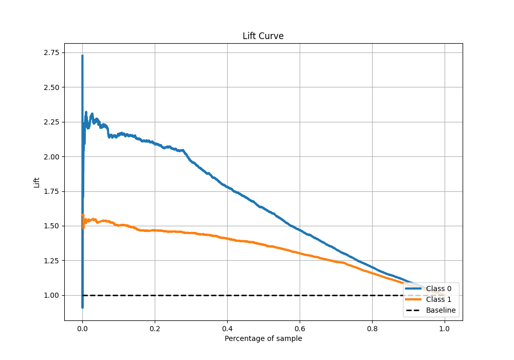

# Summary of 17_Xgboost

[<< Go back](../README.md)

## Extreme Gradient Boosting (Xgboost)
- **n_jobs**: -1
- **objective**: binary:logistic
- **eta**: 0.1
- **max_depth**: 4
- **min_child_weight**: 25
- **subsample**: 0.7
- **colsample_bytree**: 0.7
- **eval_metric**: f1
- **explain_level**: 1

## Validation
 - **validation_type**: kfold
 - **k_folds**: 10
 - **shuffle**: True
 - **stratify**: True
 - **random_seed**: 12

## Optimized metric
f1

## Training time

11.6 seconds

## Metric details
|           |    score |   threshold |
|:----------|---------:|------------:|
| logloss   | 0.505867 | nan         |
| auc       | 0.821221 | nan         |
| f1        | 0.831114 |   0.496676  |
| accuracy  | 0.770637 |   0.496676  |
| precision | 0.979592 |   0.963672  |
| recall    | 1        |   0.0265364 |
| mcc       | 0.490008 |   0.505081  |

## Metric details with threshold from accuracy metric
|           |    score |   threshold |
|:----------|---------:|------------:|
| logloss   | 0.505867 |  nan        |
| auc       | 0.821221 |  nan        |
| f1        | 0.831114 |    0.496676 |
| accuracy  | 0.770637 |    0.496676 |
| precision | 0.778397 |    0.496676 |
| recall    | 0.891489 |    0.496676 |
| mcc       | 0.489669 |    0.496676 |

## Confusion matrix (at threshold=0.496676)
|              |   Predicted as 0 |   Predicted as 1 |
|:-------------|-----------------:|-----------------:|
| Labeled as 0 |             1072 |              835 |
| Labeled as 1 |              357 |             2933 |

## Learning curves

## Permutation-based Importance

## Confusion Matrix

## Normalized Confusion Matrix

## ROC Curve

## Kolmogorov-Smirnov Statistic

## Precision-Recall Curve

## Calibration Curve

## Cumulative Gains Curve

## Lift Curve

[<< Go back](../README.md)
