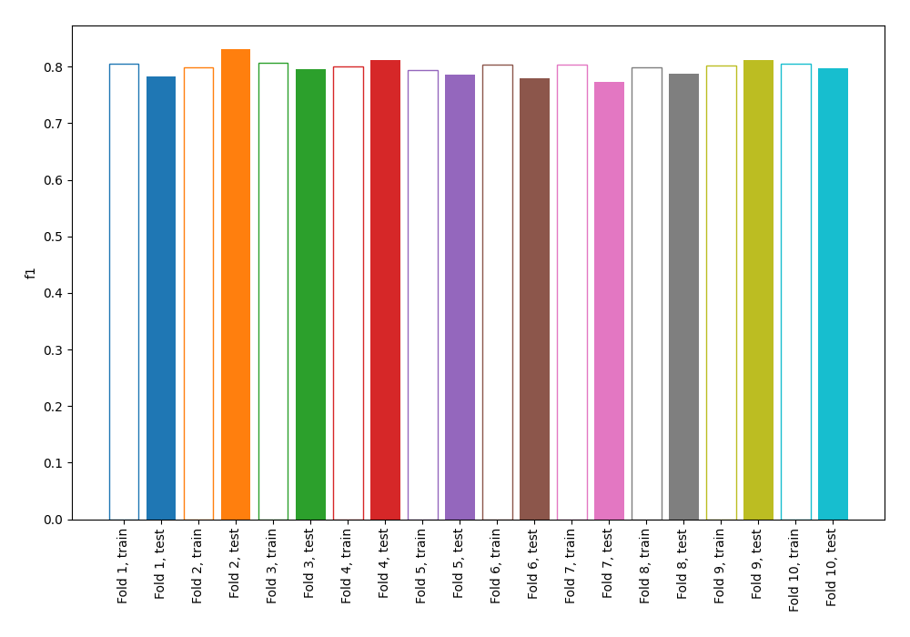
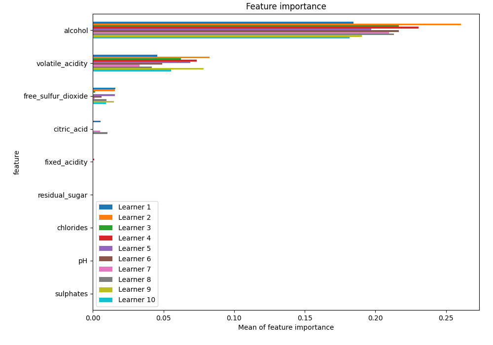
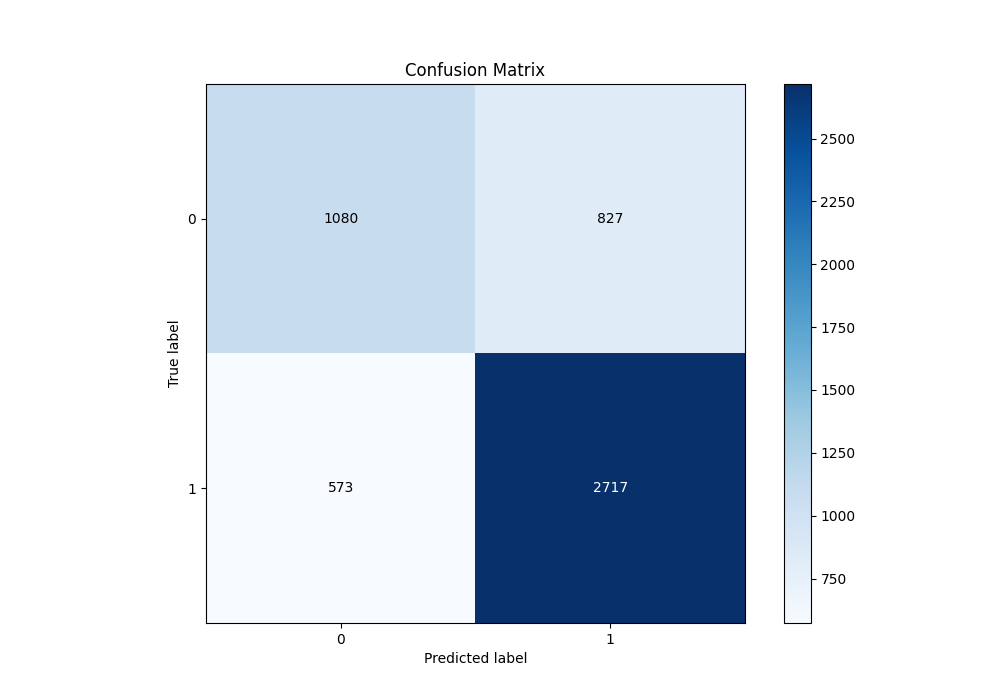
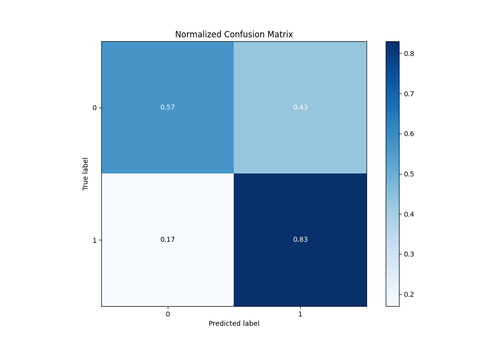
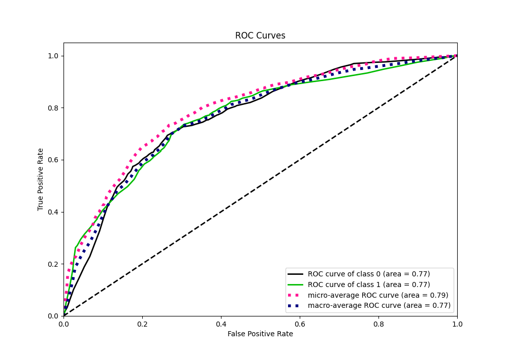
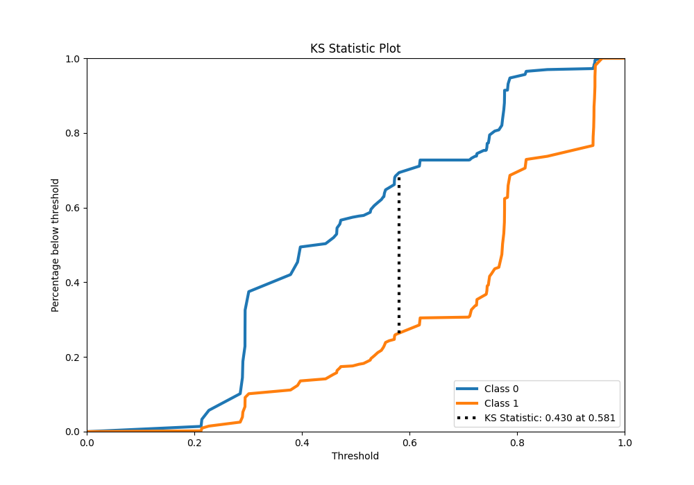
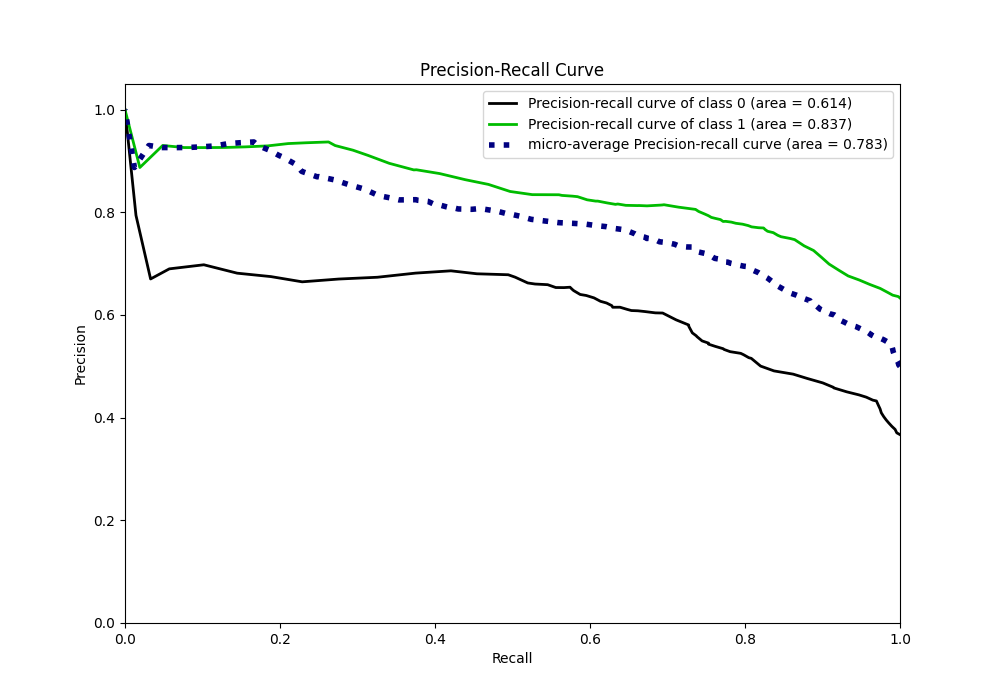
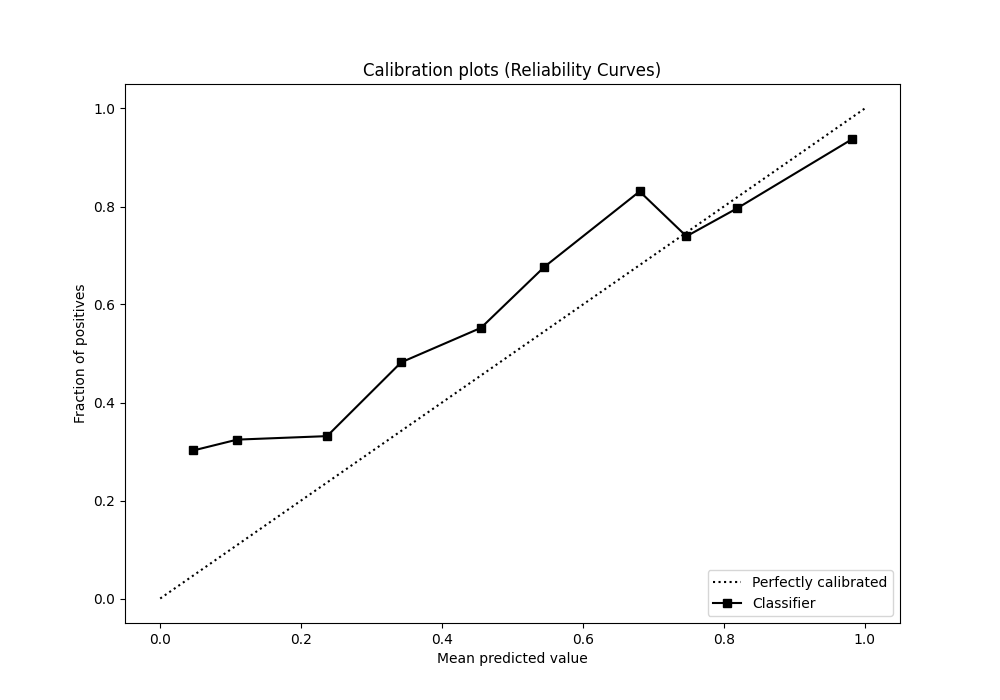
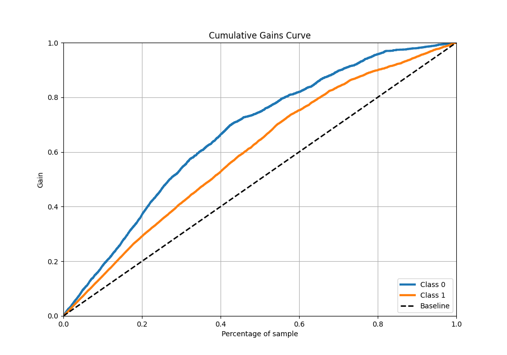
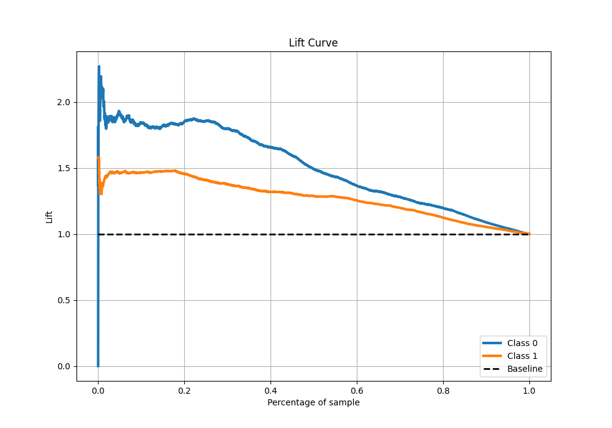

# Summary of 1_DecisionTree

[<< Go back](../README.md)

## Decision Tree
- **n_jobs**: -1
- **criterion**: gini
- **max_depth**: 3
- **explain_level**: 1

## Validation
 - **validation_type**: kfold
 - **k_folds**: 10
 - **shuffle**: True
 - **stratify**: True
 - **random_seed**: 12

## Optimized metric
f1

## Training time

9.0 seconds

## Metric details
|           |    score |   threshold |
|:----------|---------:|------------:|
| logloss   | 0.545377 |  nan        |
| auc       | 0.765114 |  nan        |
| f1        | 0.801184 |    0.397134 |
| accuracy  | 0.730614 |    0.472393 |
| precision | 0.935523 |    0.941246 |
| recall    | 1        |    0.191281 |
| mcc       | 0.413975 |    0.572603 |

## Metric details with threshold from accuracy metric
|           |    score |   threshold |
|:----------|---------:|------------:|
| logloss   | 0.545377 |  nan        |
| auc       | 0.765114 |  nan        |
| f1        | 0.795142 |    0.472393 |
| accuracy  | 0.730614 |    0.472393 |
| precision | 0.766648 |    0.472393 |
| recall    | 0.825836 |    0.472393 |
| mcc       | 0.405849 |    0.472393 |

## Confusion matrix (at threshold=0.472393)
|              |   Predicted as 0 |   Predicted as 1 |
|:-------------|-----------------:|-----------------:|
| Labeled as 0 |             1080 |              827 |
| Labeled as 1 |              573 |             2717 |

## Learning curves

## Permutation-based Importance

## Confusion Matrix

## Normalized Confusion Matrix

## ROC Curve

## Kolmogorov-Smirnov Statistic

## Precision-Recall Curve

## Calibration Curve

## Cumulative Gains Curve

## Lift Curve

[<< Go back](../README.md)
