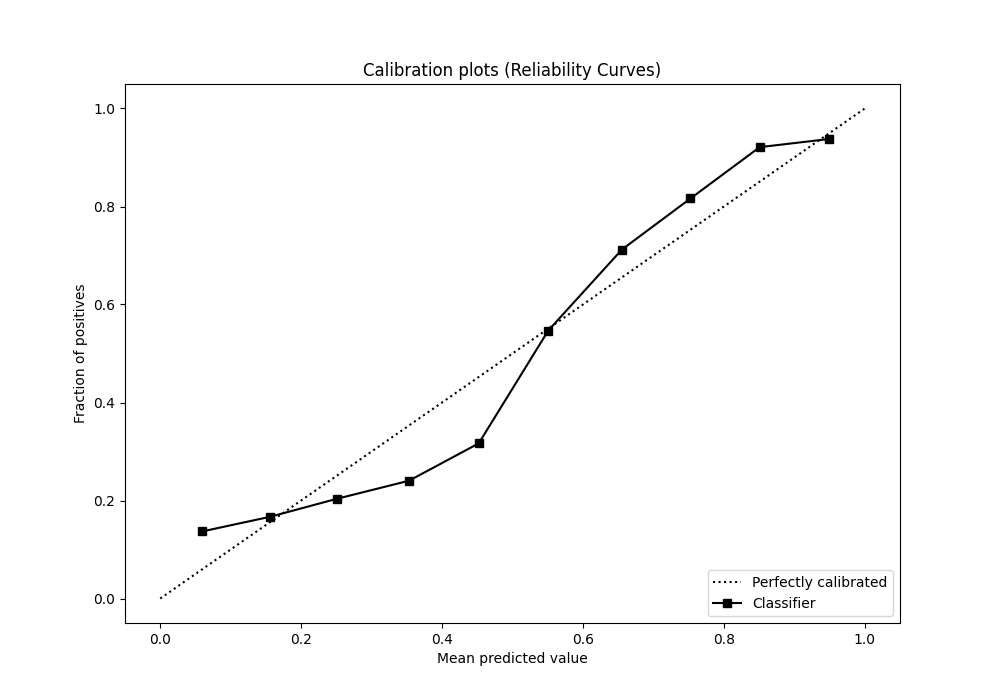

# Summary of 20_Xgboost

[<< Go back](../README.md)

## Extreme Gradient Boosting (Xgboost)
- **n_jobs**: -1
- **objective**: binary:logistic
- **eta**: 0.05
- **max_depth**: 7
- **min_child_weight**: 1
- **subsample**: 0.9
- **colsample_bytree**: 0.9
- **eval_metric**: f1
- **explain_level**: 1

## Validation
 - **validation_type**: kfold
 - **k_folds**: 10
 - **shuffle**: True
 - **stratify**: True
 - **random_seed**: 12

## Optimized metric
f1

## Training time

15.1 seconds

## Metric details
|           |    score |   threshold |
|:----------|---------:|------------:|
| logloss   | 0.475193 | nan         |
| auc       | 0.848818 | nan         |
| f1        | 0.848476 |   0.495864  |
| accuracy  | 0.797191 |   0.495864  |
| precision | 0.959184 |   0.978245  |
| recall    | 1        |   0.0235621 |
| mcc       | 0.556308 |   0.604903  |

## Metric details with threshold from accuracy metric
|           |    score |   threshold |
|:----------|---------:|------------:|
| logloss   | 0.475193 |  nan        |
| auc       | 0.848818 |  nan        |
| f1        | 0.848476 |    0.495864 |
| accuracy  | 0.797191 |    0.495864 |
| precision | 0.804965 |    0.495864 |
| recall    | 0.89696  |    0.495864 |
| mcc       | 0.551927 |    0.495864 |

## Confusion matrix (at threshold=0.495864)
|              |   Predicted as 0 |   Predicted as 1 |
|:-------------|-----------------:|-----------------:|
| Labeled as 0 |             1192 |              715 |
| Labeled as 1 |              339 |             2951 |

## Learning curves

## Permutation-based Importance

## Confusion Matrix

## Normalized Confusion Matrix

## ROC Curve

## Kolmogorov-Smirnov Statistic

## Precision-Recall Curve

## Calibration Curve

## Cumulative Gains Curve

## Lift Curve

[<< Go back](../README.md)
