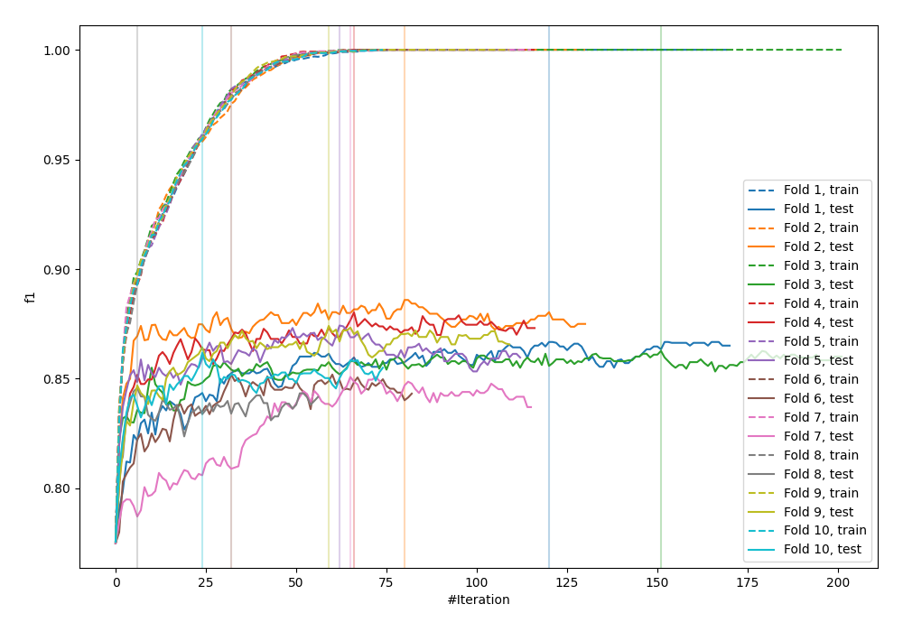
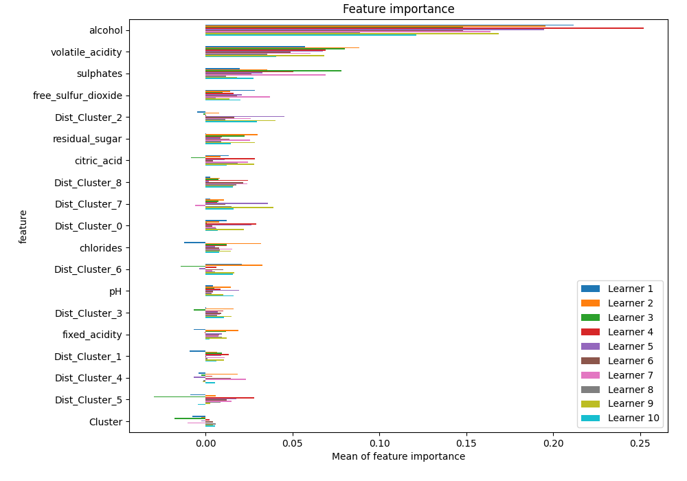
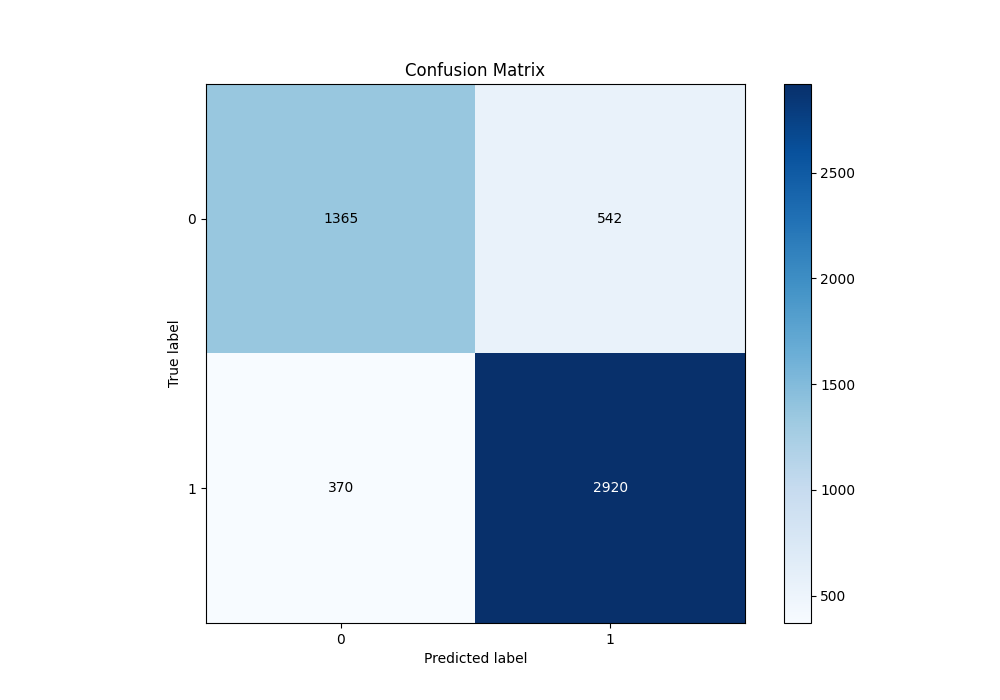
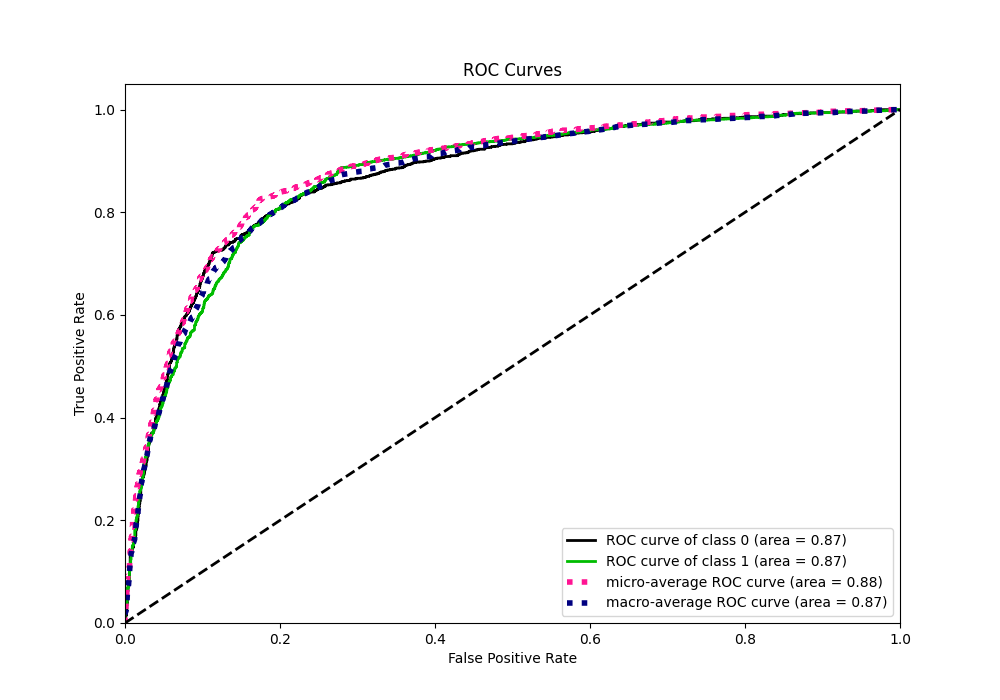
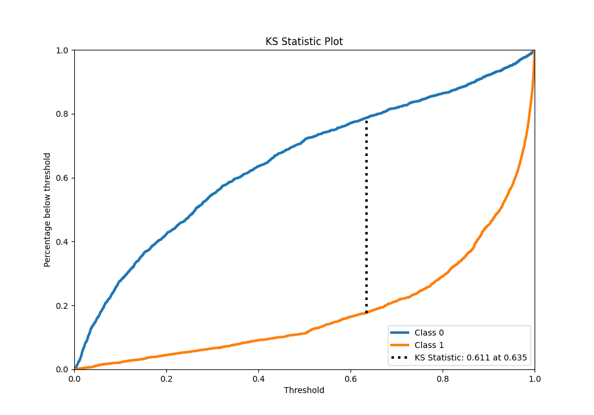
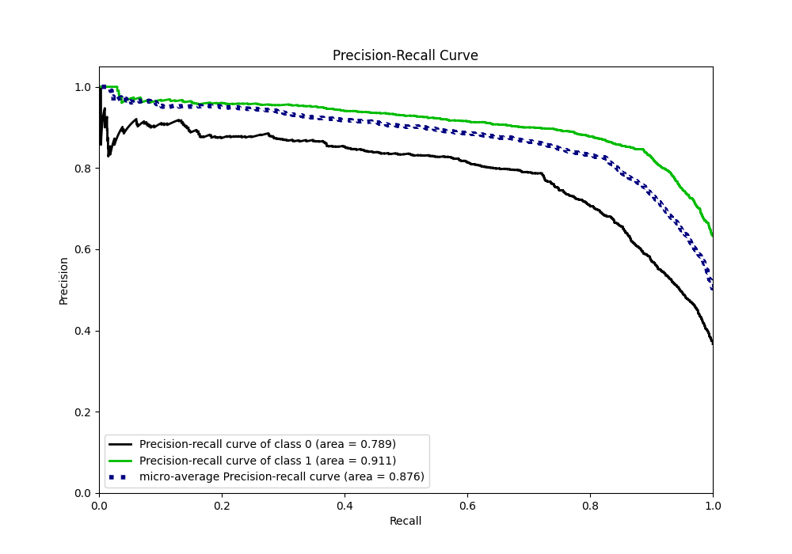
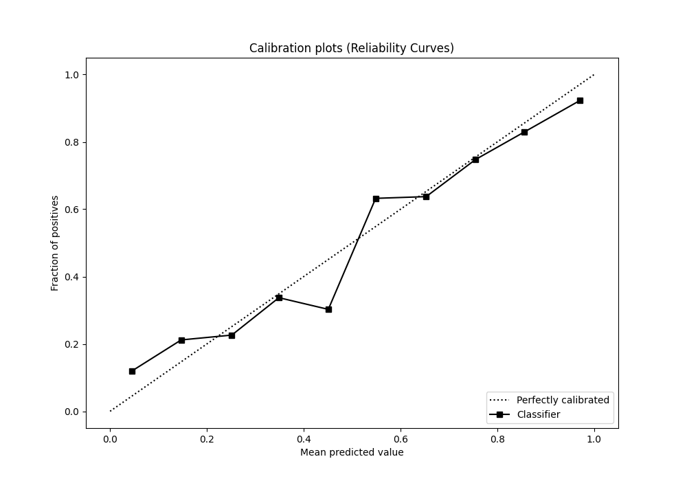
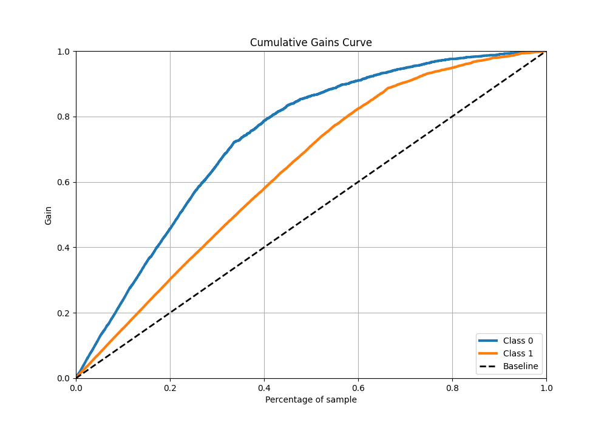
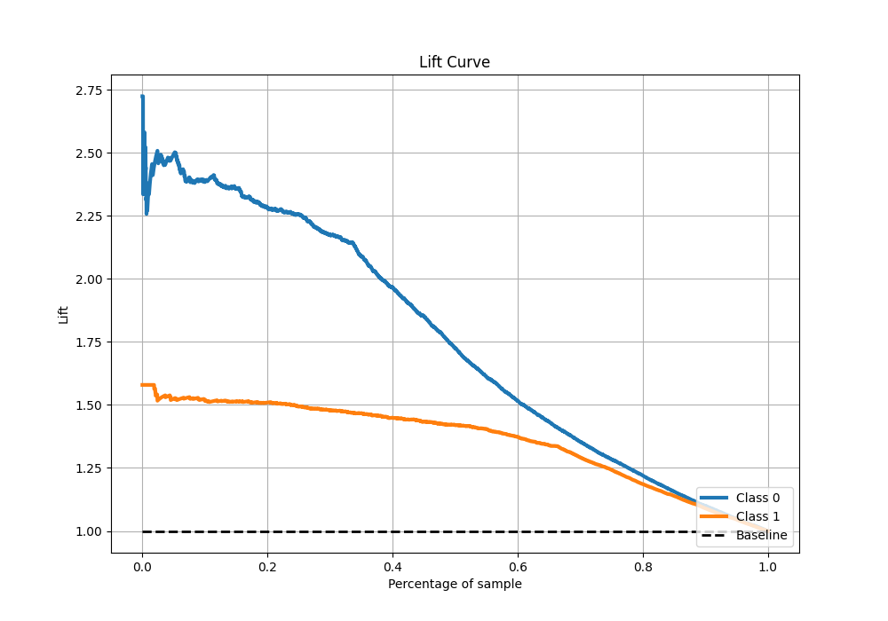

# Summary of 22_LightGBM_KMeansFeatures

[<< Go back](../README.md)

## LightGBM
- **n_jobs**: -1
- **objective**: binary
- **num_leaves**: 63
- **learning_rate**: 0.2
- **feature_fraction**: 0.5
- **bagging_fraction**: 1.0
- **min_data_in_leaf**: 10
- **metric**: custom
- **custom_eval_metric_name**: f1
- **explain_level**: 1

## Validation
 - **validation_type**: kfold
 - **k_folds**: 10
 - **shuffle**: True
 - **stratify**: True
 - **random_seed**: 12

## Optimized metric
f1

## Training time

29.4 seconds

## Metric details
|           |    score |     threshold |
|:----------|---------:|--------------:|
| logloss   | 0.452562 | nan           |
| auc       | 0.870758 | nan           |
| f1        | 0.864929 |   0.499598    |
| accuracy  | 0.824514 |   0.499598    |
| precision | 0.969697 |   0.998273    |
| recall    | 1        |   0.000702325 |
| mcc       | 0.616608 |   0.499598    |

## Metric details with threshold from accuracy metric
|           |    score |   threshold |
|:----------|---------:|------------:|
| logloss   | 0.452562 |  nan        |
| auc       | 0.870758 |  nan        |
| f1        | 0.864929 |    0.499598 |
| accuracy  | 0.824514 |    0.499598 |
| precision | 0.843443 |    0.499598 |
| recall    | 0.887538 |    0.499598 |
| mcc       | 0.616608 |    0.499598 |

## Confusion matrix (at threshold=0.499598)
|              |   Predicted as 0 |   Predicted as 1 |
|:-------------|-----------------:|-----------------:|
| Labeled as 0 |             1365 |              542 |
| Labeled as 1 |              370 |             2920 |

## Learning curves

## Permutation-based Importance

## Confusion Matrix

## Normalized Confusion Matrix

## ROC Curve

## Kolmogorov-Smirnov Statistic

## Precision-Recall Curve

## Calibration Curve

## Cumulative Gains Curve

## Lift Curve

[<< Go back](../README.md)
