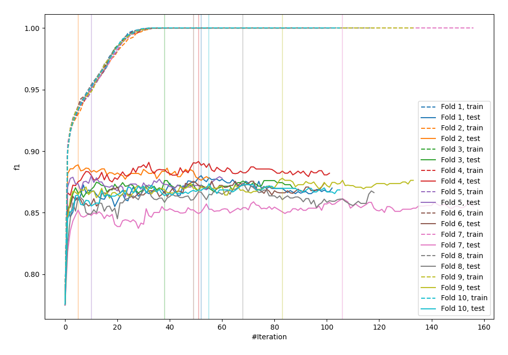

# Summary of 22_LightGBM_Stacked

[<< Go back](../README.md)

## LightGBM
- **n_jobs**: -1
- **objective**: binary
- **num_leaves**: 63
- **learning_rate**: 0.2
- **feature_fraction**: 0.5
- **bagging_fraction**: 1.0
- **min_data_in_leaf**: 10
- **metric**: custom
- **custom_eval_metric_name**: f1
- **explain_level**: 1

## Validation
 - **validation_type**: kfold
 - **k_folds**: 10
 - **shuffle**: True
 - **stratify**: True
 - **random_seed**: 12

## Optimized metric
f1

## Training time

33.5 seconds

## Metric details
|           |    score |     threshold |
|:----------|---------:|--------------:|
| logloss   | 0.472353 | nan           |
| auc       | 0.87587  | nan           |
| f1        | 0.877779 |   0.504948    |
| accuracy  | 0.842409 |   0.504948    |
| precision | 0.979592 |   0.999335    |
| recall    | 1        |   3.58736e-05 |
| mcc       | 0.65706  |   0.504948    |

## Metric details with threshold from accuracy metric
|           |    score |   threshold |
|:----------|---------:|------------:|
| logloss   | 0.472353 |  nan        |
| auc       | 0.87587  |  nan        |
| f1        | 0.877779 |    0.504948 |
| accuracy  | 0.842409 |    0.504948 |
| precision | 0.86221  |    0.504948 |
| recall    | 0.893921 |    0.504948 |
| mcc       | 0.65706  |    0.504948 |

## Confusion matrix (at threshold=0.504948)
|              |   Predicted as 0 |   Predicted as 1 |
|:-------------|-----------------:|-----------------:|
| Labeled as 0 |             1437 |              470 |
| Labeled as 1 |              349 |             2941 |

## Learning curves

## Permutation-based Importance

## Confusion Matrix

## Normalized Confusion Matrix

## ROC Curve

## Kolmogorov-Smirnov Statistic

## Precision-Recall Curve

## Calibration Curve

## Cumulative Gains Curve

## Lift Curve

[<< Go back](../README.md)
