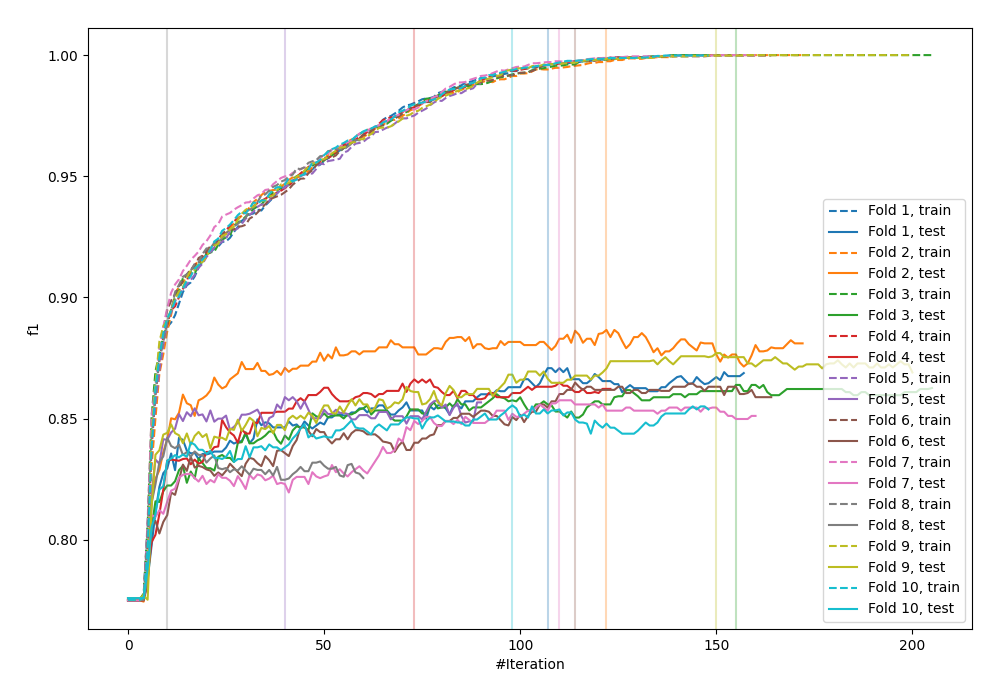

# Summary of 24_LightGBM_KMeansFeatures

[<< Go back](../README.md)

## LightGBM
- **n_jobs**: -1
- **objective**: binary
- **num_leaves**: 95
- **learning_rate**: 0.05
- **feature_fraction**: 1.0
- **bagging_fraction**: 1.0
- **min_data_in_leaf**: 10
- **metric**: custom
- **custom_eval_metric_name**: f1
- **explain_level**: 1

## Validation
 - **validation_type**: kfold
 - **k_folds**: 10
 - **shuffle**: True
 - **stratify**: True
 - **random_seed**: 12

## Optimized metric
f1

## Training time

43.5 seconds

## Metric details
|           |    score |   threshold |
|:----------|---------:|------------:|
| logloss   | 0.435643 | nan         |
| auc       | 0.869754 | nan         |
| f1        | 0.862855 |   0.494065  |
| accuracy  | 0.820473 |   0.494065  |
| precision | 0.984848 |   0.991265  |
| recall    | 1        |   0.0121463 |
| mcc       | 0.60657  |   0.494065  |

## Metric details with threshold from accuracy metric
|           |    score |   threshold |
|:----------|---------:|------------:|
| logloss   | 0.435643 |  nan        |
| auc       | 0.869754 |  nan        |
| f1        | 0.862855 |    0.494065 |
| accuracy  | 0.820473 |    0.494065 |
| precision | 0.835468 |    0.494065 |
| recall    | 0.892097 |    0.494065 |
| mcc       | 0.60657  |    0.494065 |

## Confusion matrix (at threshold=0.494065)
|              |   Predicted as 0 |   Predicted as 1 |
|:-------------|-----------------:|-----------------:|
| Labeled as 0 |             1329 |              578 |
| Labeled as 1 |              355 |             2935 |

## Learning curves

## Permutation-based Importance

## Confusion Matrix

## Normalized Confusion Matrix

## ROC Curve

## Kolmogorov-Smirnov Statistic

## Precision-Recall Curve

## Calibration Curve

## Cumulative Gains Curve

## Lift Curve

[<< Go back](../README.md)
