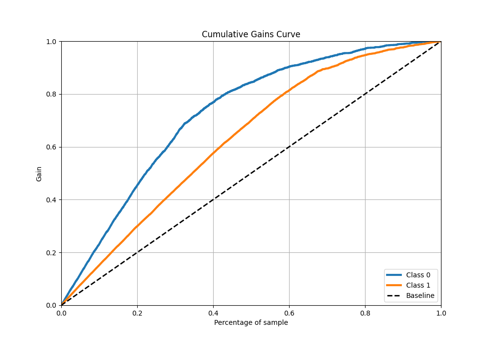

# Summary of 25_LightGBM

[<< Go back](../README.md)

## LightGBM
- **n_jobs**: -1
- **objective**: binary
- **num_leaves**: 63
- **learning_rate**: 0.2
- **feature_fraction**: 0.5
- **bagging_fraction**: 1.0
- **min_data_in_leaf**: 30
- **metric**: custom
- **custom_eval_metric_name**: f1
- **explain_level**: 1

## Validation
 - **validation_type**: kfold
 - **k_folds**: 10
 - **shuffle**: True
 - **stratify**: True
 - **random_seed**: 12

## Optimized metric
f1

## Training time

20.8 seconds

## Metric details
|           |    score |    threshold |
|:----------|---------:|-------------:|
| logloss   | 0.461754 | nan          |
| auc       | 0.857115 | nan          |
| f1        | 0.857269 |   0.497895   |
| accuracy  | 0.813161 |   0.497895   |
| precision | 0.97992  |   0.995341   |
| recall    | 1        |   0.00216126 |
| mcc       | 0.590362 |   0.497895   |

## Metric details with threshold from accuracy metric
|           |    score |   threshold |
|:----------|---------:|------------:|
| logloss   | 0.461754 |  nan        |
| auc       | 0.857115 |  nan        |
| f1        | 0.857269 |    0.497895 |
| accuracy  | 0.813161 |    0.497895 |
| precision | 0.83006  |    0.497895 |
| recall    | 0.886322 |    0.497895 |
| mcc       | 0.590362 |    0.497895 |

## Confusion matrix (at threshold=0.497895)
|              |   Predicted as 0 |   Predicted as 1 |
|:-------------|-----------------:|-----------------:|
| Labeled as 0 |             1310 |              597 |
| Labeled as 1 |              374 |             2916 |

## Learning curves

## Permutation-based Importance

## Confusion Matrix

## Normalized Confusion Matrix

## ROC Curve

## Kolmogorov-Smirnov Statistic

## Precision-Recall Curve

## Calibration Curve

## Cumulative Gains Curve

## Lift Curve

[<< Go back](../README.md)
