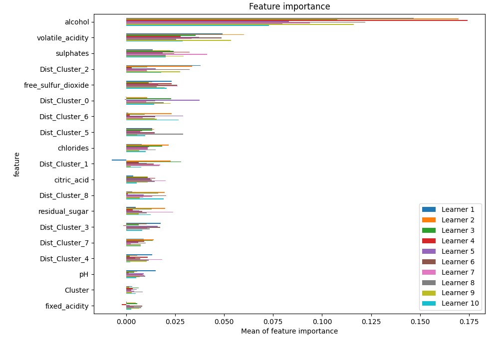

# Summary of 26_LightGBM_KMeansFeatures

[<< Go back](../README.md)

## LightGBM
- **n_jobs**: -1
- **objective**: binary
- **num_leaves**: 127
- **learning_rate**: 0.05
- **feature_fraction**: 0.5
- **bagging_fraction**: 0.5
- **min_data_in_leaf**: 20
- **metric**: custom
- **custom_eval_metric_name**: f1
- **explain_level**: 1

## Validation
 - **validation_type**: kfold
 - **k_folds**: 10
 - **shuffle**: True
 - **stratify**: True
 - **random_seed**: 12

## Optimized metric
f1

## Training time

46.8 seconds

## Metric details
|           |    score |    threshold |
|:----------|---------:|-------------:|
| logloss   | 0.427647 | nan          |
| auc       | 0.874549 | nan          |
| f1        | 0.866088 |   0.497239   |
| accuracy  | 0.824707 |   0.497239   |
| precision | 0.986395 |   0.990353   |
| recall    | 1        |   0.00855302 |
| mcc       | 0.615954 |   0.497239   |

## Metric details with threshold from accuracy metric
|           |    score |   threshold |
|:----------|---------:|------------:|
| logloss   | 0.427647 |  nan        |
| auc       | 0.874549 |  nan        |
| f1        | 0.866088 |    0.497239 |
| accuracy  | 0.824707 |    0.497239 |
| precision | 0.838599 |    0.497239 |
| recall    | 0.895441 |    0.497239 |
| mcc       | 0.615954 |    0.497239 |

## Confusion matrix (at threshold=0.497239)
|              |   Predicted as 0 |   Predicted as 1 |
|:-------------|-----------------:|-----------------:|
| Labeled as 0 |             1340 |              567 |
| Labeled as 1 |              344 |             2946 |

## Learning curves

## Permutation-based Importance

## Confusion Matrix

## Normalized Confusion Matrix

## ROC Curve

## Kolmogorov-Smirnov Statistic

## Precision-Recall Curve

## Calibration Curve

## Cumulative Gains Curve

## Lift Curve

[<< Go back](../README.md)
