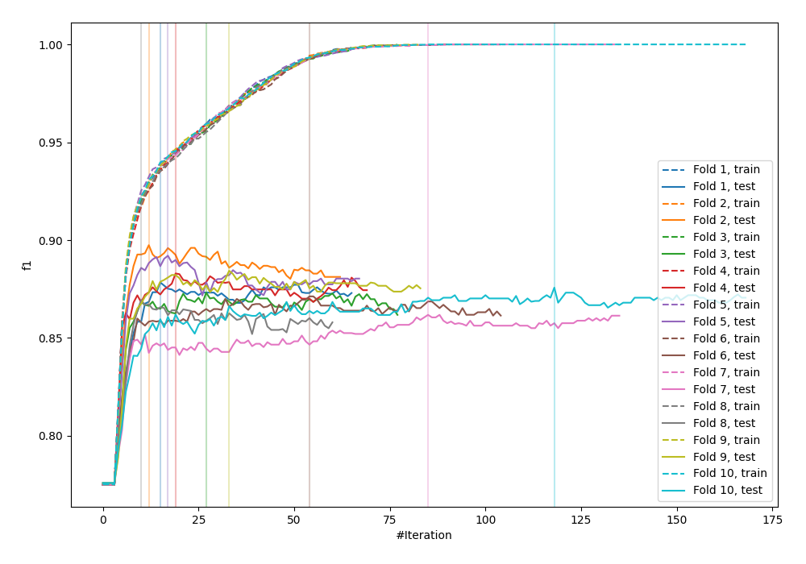
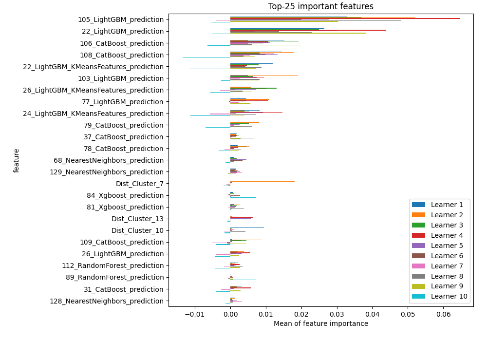
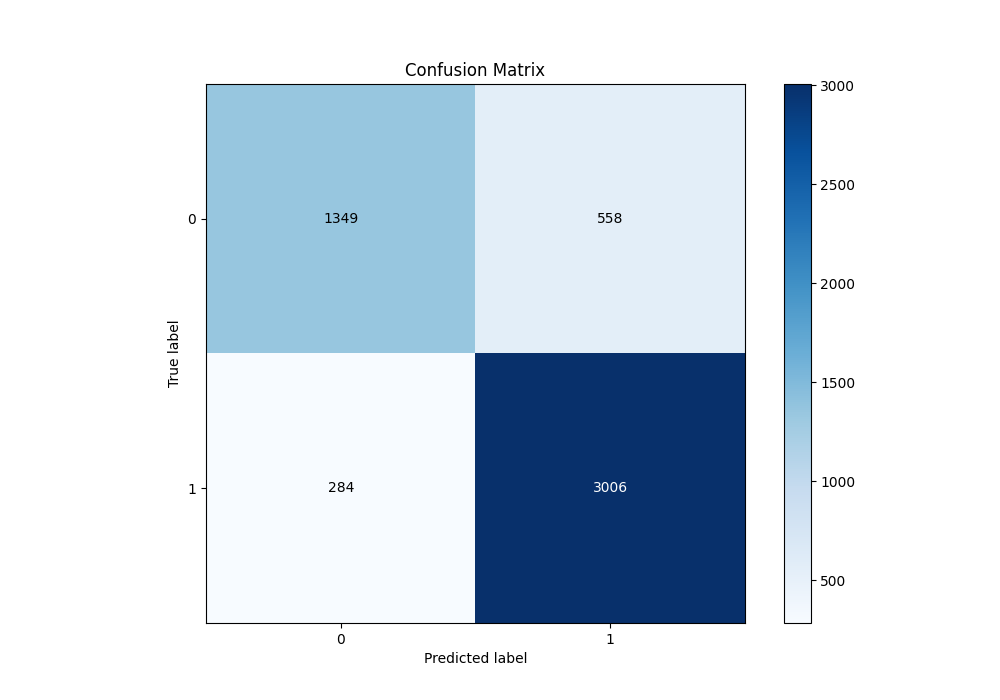
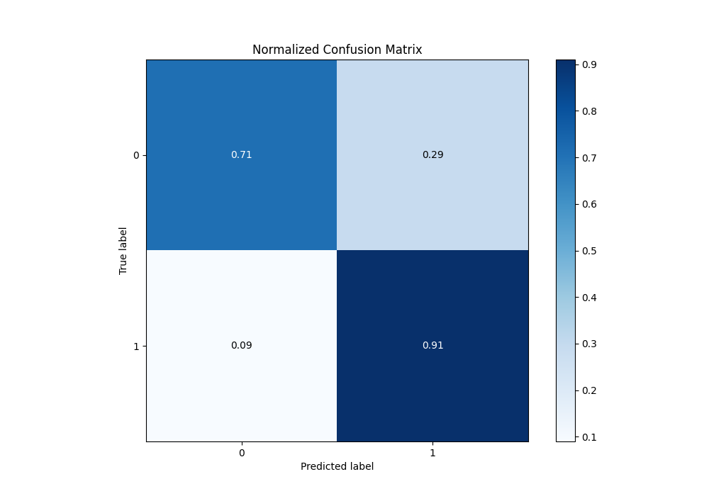
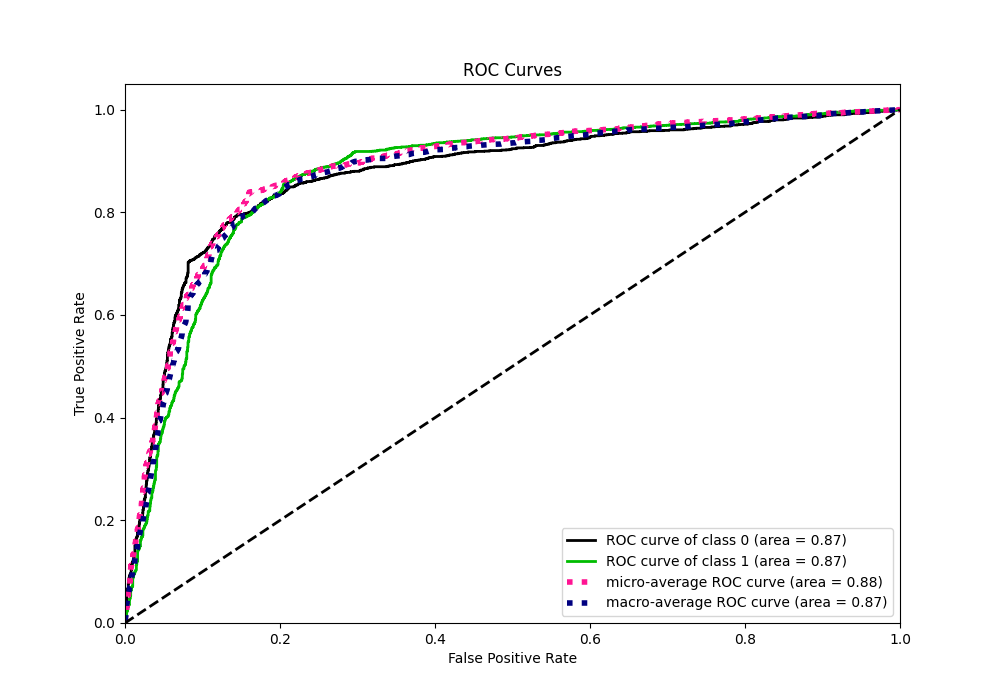
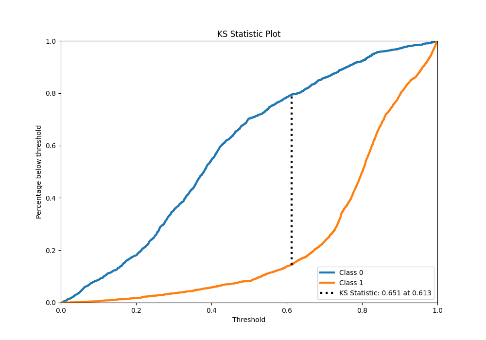
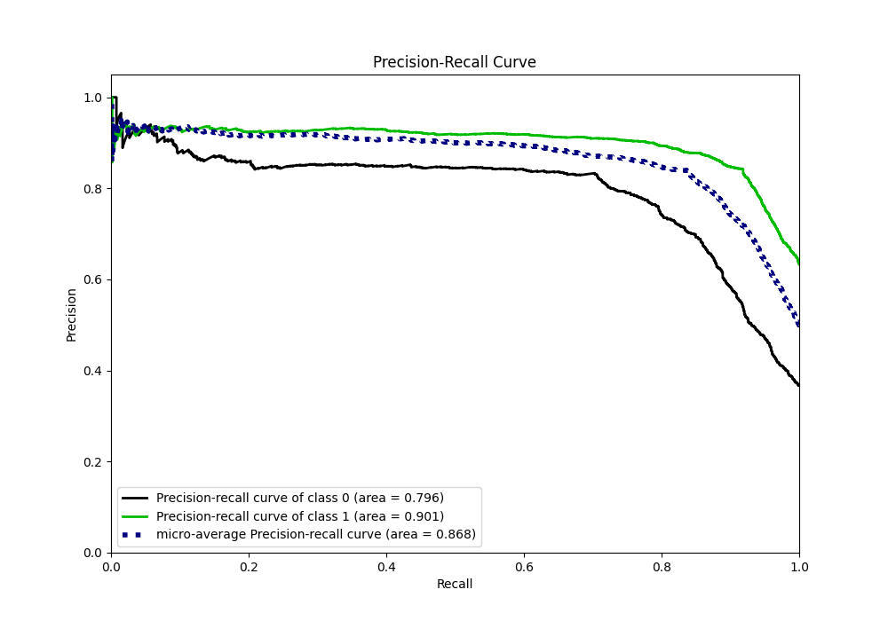
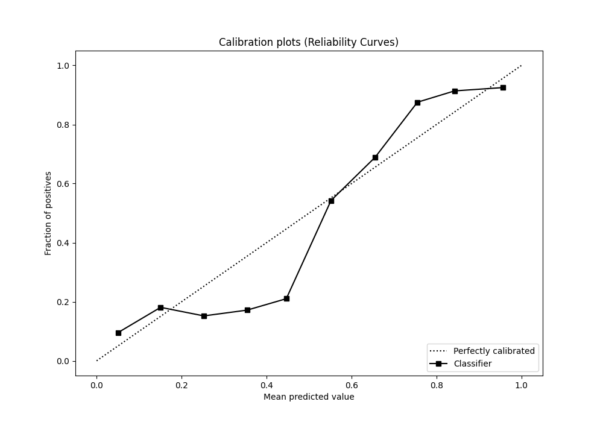
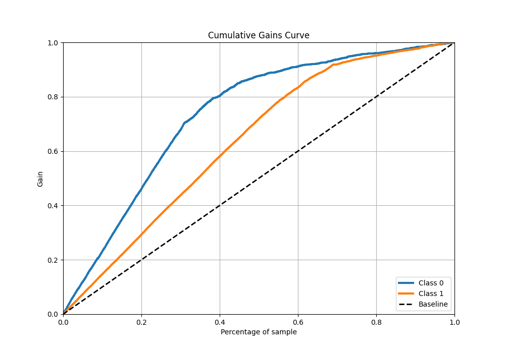
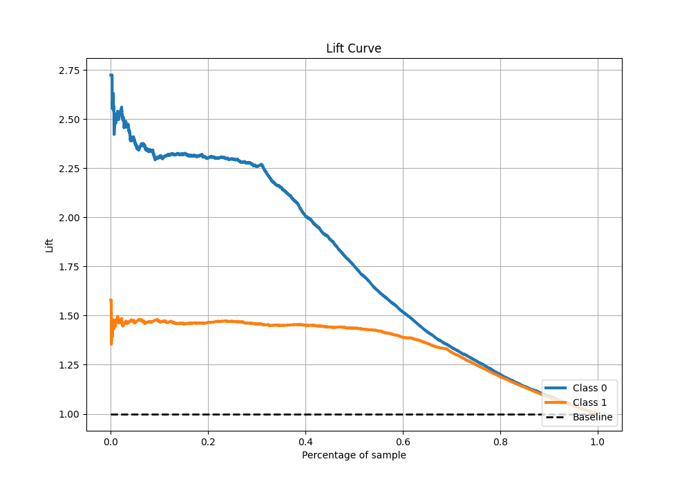

# Summary of 26_LightGBM_KMeansFeatures_Stacked

[<< Go back](../README.md)

## LightGBM
- **n_jobs**: -1
- **objective**: binary
- **num_leaves**: 127
- **learning_rate**: 0.05
- **feature_fraction**: 0.5
- **bagging_fraction**: 0.5
- **min_data_in_leaf**: 20
- **metric**: custom
- **custom_eval_metric_name**: f1
- **explain_level**: 1

## Validation
 - **validation_type**: kfold
 - **k_folds**: 10
 - **shuffle**: True
 - **stratify**: True
 - **random_seed**: 12

## Optimized metric
f1

## Training time

49.7 seconds

## Metric details
|           |    score |    threshold |
|:----------|---------:|-------------:|
| logloss   | 0.444717 | nan          |
| auc       | 0.873483 | nan          |
| f1        | 0.877152 |   0.508834   |
| accuracy  | 0.837983 |   0.508834   |
| precision | 0.936667 |   0.969193   |
| recall    | 1        |   0.00366922 |
| mcc       | 0.645164 |   0.584173   |

## Metric details with threshold from accuracy metric
|           |    score |   threshold |
|:----------|---------:|------------:|
| logloss   | 0.444717 |  nan        |
| auc       | 0.873483 |  nan        |
| f1        | 0.877152 |    0.508834 |
| accuracy  | 0.837983 |    0.508834 |
| precision | 0.843434 |    0.508834 |
| recall    | 0.913678 |    0.508834 |
| mcc       | 0.644842 |    0.508834 |

## Confusion matrix (at threshold=0.508834)
|              |   Predicted as 0 |   Predicted as 1 |
|:-------------|-----------------:|-----------------:|
| Labeled as 0 |             1349 |              558 |
| Labeled as 1 |              284 |             3006 |

## Learning curves

## Permutation-based Importance

## Confusion Matrix

## Normalized Confusion Matrix

## ROC Curve

## Kolmogorov-Smirnov Statistic

## Precision-Recall Curve

## Calibration Curve

## Cumulative Gains Curve

## Lift Curve

[<< Go back](../README.md)
