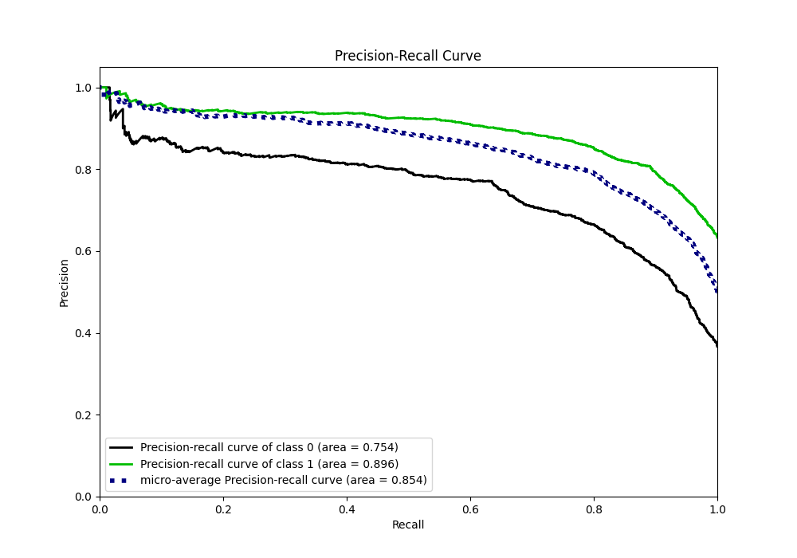

# Summary of 28_LightGBM

[<< Go back](../README.md)

## LightGBM
- **n_jobs**: -1
- **objective**: binary
- **num_leaves**: 31
- **learning_rate**: 0.1
- **feature_fraction**: 0.8
- **bagging_fraction**: 0.8
- **min_data_in_leaf**: 5
- **metric**: custom
- **custom_eval_metric_name**: f1
- **explain_level**: 1

## Validation
 - **validation_type**: kfold
 - **k_folds**: 10
 - **shuffle**: True
 - **stratify**: True
 - **random_seed**: 12

## Optimized metric
f1

## Training time

18.0 seconds

## Metric details
|           |    score |    threshold |
|:----------|---------:|-------------:|
| logloss   | 0.471842 | nan          |
| auc       | 0.849005 | nan          |
| f1        | 0.846054 |   0.50213    |
| accuracy  | 0.795459 |   0.50213    |
| precision | 0.979592 |   0.987714   |
| recall    | 1        |   0.00347626 |
| mcc       | 0.552017 |   0.615691   |

## Metric details with threshold from accuracy metric
|           |    score |   threshold |
|:----------|---------:|------------:|
| logloss   | 0.471842 |   nan       |
| auc       | 0.849005 |   nan       |
| f1        | 0.846054 |     0.50213 |
| accuracy  | 0.795459 |     0.50213 |
| precision | 0.808022 |     0.50213 |
| recall    | 0.887842 |     0.50213 |
| mcc       | 0.548758 |     0.50213 |

## Confusion matrix (at threshold=0.50213)
|              |   Predicted as 0 |   Predicted as 1 |
|:-------------|-----------------:|-----------------:|
| Labeled as 0 |             1213 |              694 |
| Labeled as 1 |              369 |             2921 |

## Learning curves

## Permutation-based Importance

## Confusion Matrix

## Normalized Confusion Matrix

## ROC Curve

## Kolmogorov-Smirnov Statistic

## Precision-Recall Curve

## Calibration Curve

## Cumulative Gains Curve

## Lift Curve

[<< Go back](../README.md)
