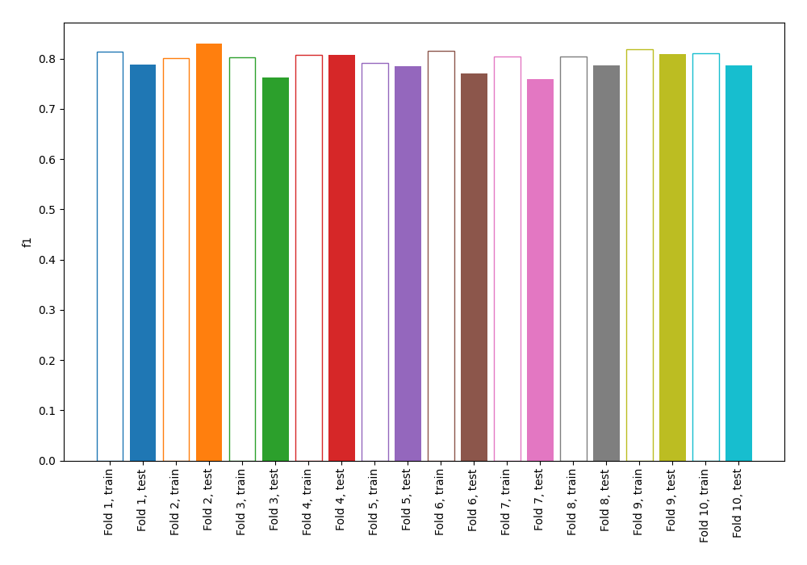
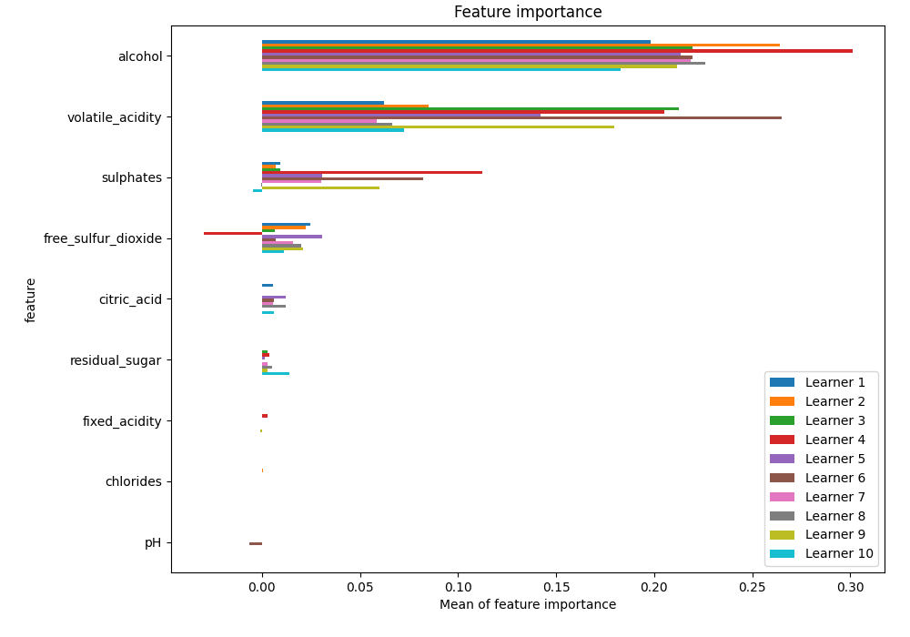
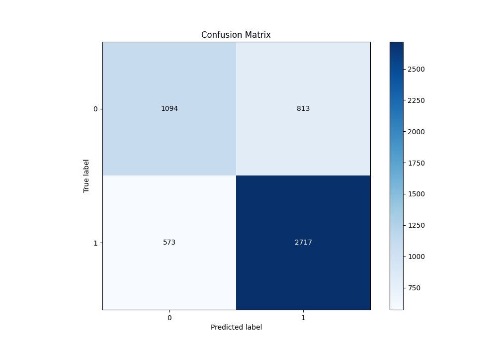
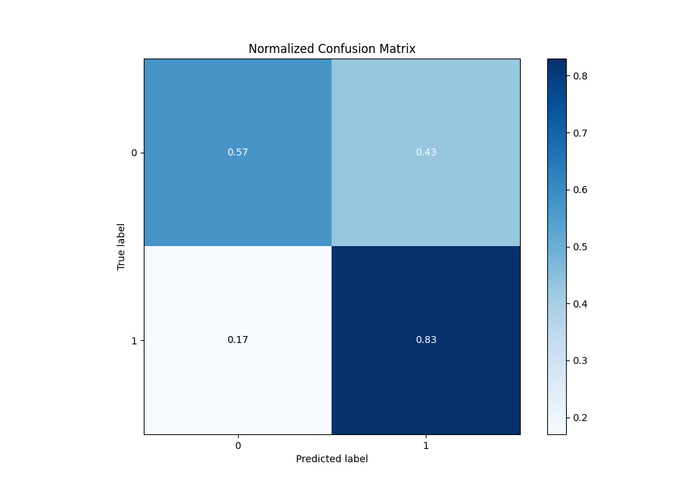
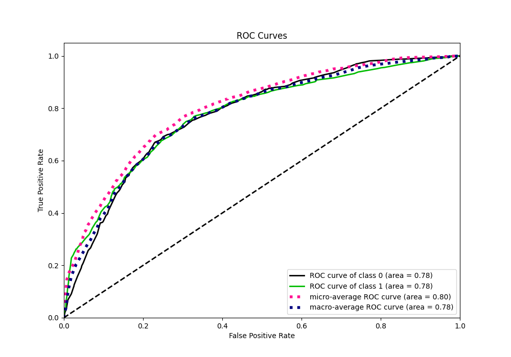
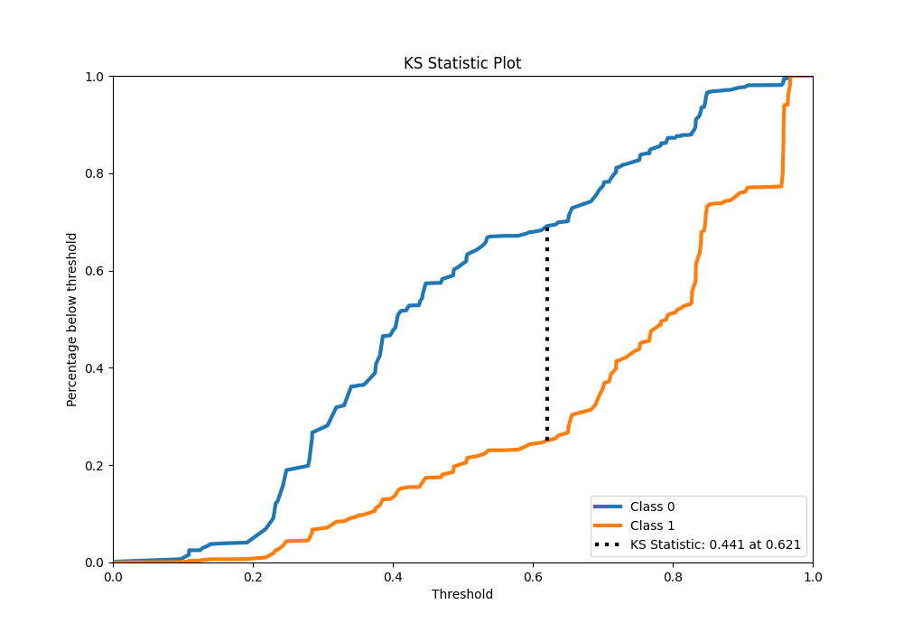
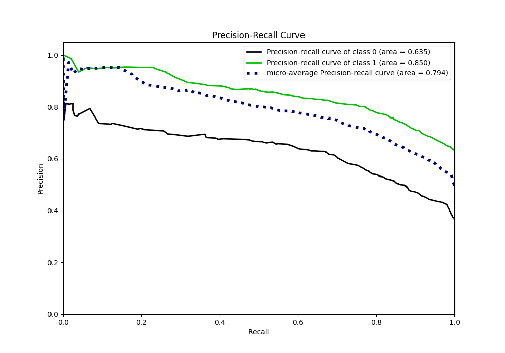
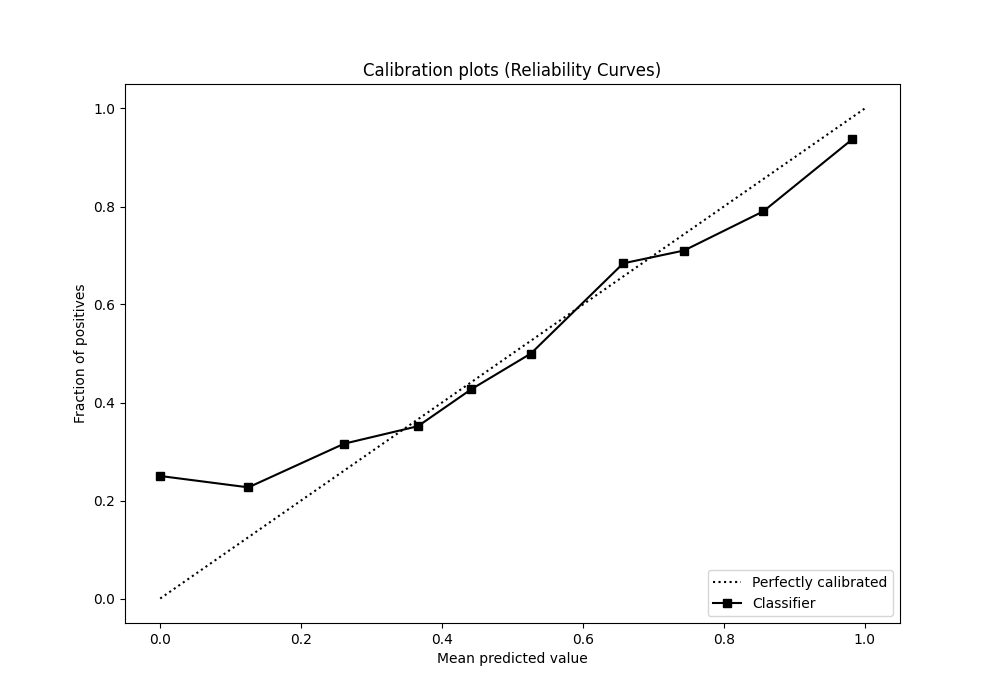
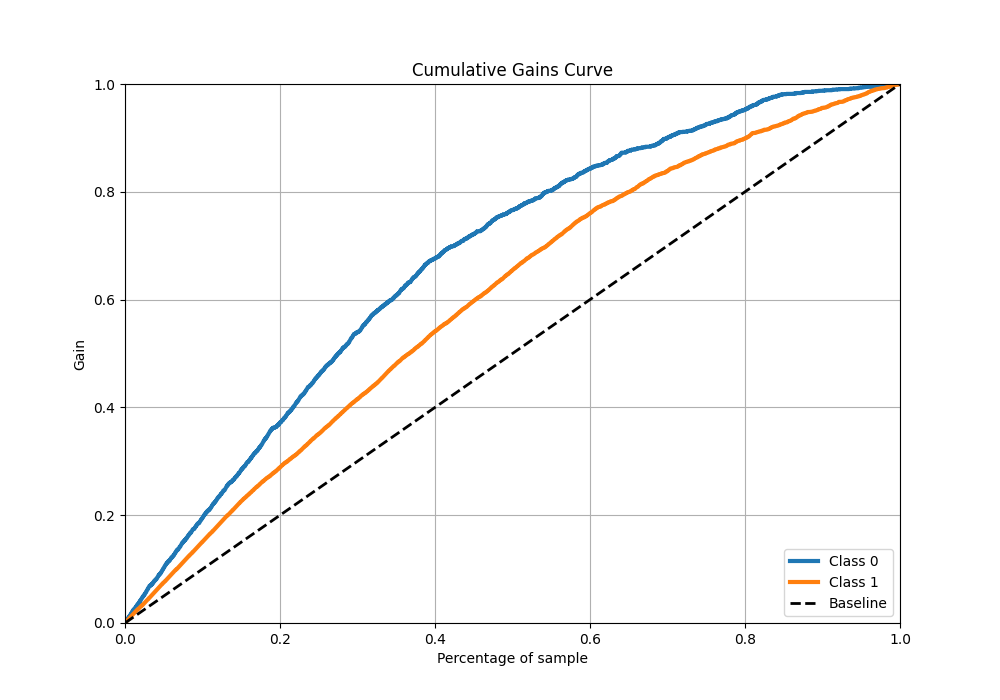
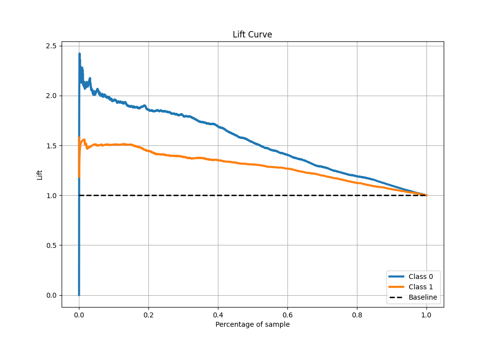

# Summary of 2_DecisionTree

[<< Go back](../README.md)

## Decision Tree
- **n_jobs**: -1
- **criterion**: gini
- **max_depth**: 4
- **explain_level**: 1

## Validation
 - **validation_type**: kfold
 - **k_folds**: 10
 - **shuffle**: True
 - **stratify**: True
 - **random_seed**: 12

## Optimized metric
f1

## Training time

12.0 seconds

## Metric details
|           |    score |   threshold |
|:----------|---------:|------------:|
| logloss   | 0.542962 |  nan        |
| auc       | 0.77597  |  nan        |
| f1        | 0.798561 |    0.43871  |
| accuracy  | 0.733308 |    0.44713  |
| precision | 0.95539  |    0.957895 |
| recall    | 0.999696 |    0        |
| mcc       | 0.433477 |    0.578947 |

## Metric details with threshold from accuracy metric
|           |    score |   threshold |
|:----------|---------:|------------:|
| logloss   | 0.542962 |   nan       |
| auc       | 0.77597  |   nan       |
| f1        | 0.796774 |     0.44713 |
| accuracy  | 0.733308 |     0.44713 |
| precision | 0.769688 |     0.44713 |
| recall    | 0.825836 |     0.44713 |
| mcc       | 0.412523 |     0.44713 |

## Confusion matrix (at threshold=0.44713)
|              |   Predicted as 0 |   Predicted as 1 |
|:-------------|-----------------:|-----------------:|
| Labeled as 0 |             1094 |              813 |
| Labeled as 1 |              573 |             2717 |

## Learning curves

## Permutation-based Importance

## Confusion Matrix

## Normalized Confusion Matrix

## ROC Curve

## Kolmogorov-Smirnov Statistic

## Precision-Recall Curve

## Calibration Curve

## Cumulative Gains Curve

## Lift Curve

[<< Go back](../README.md)
