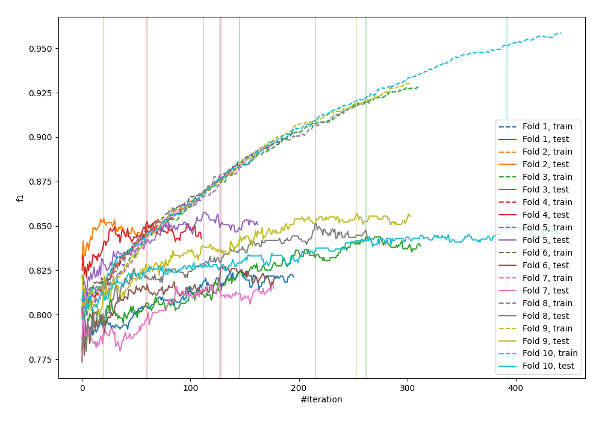
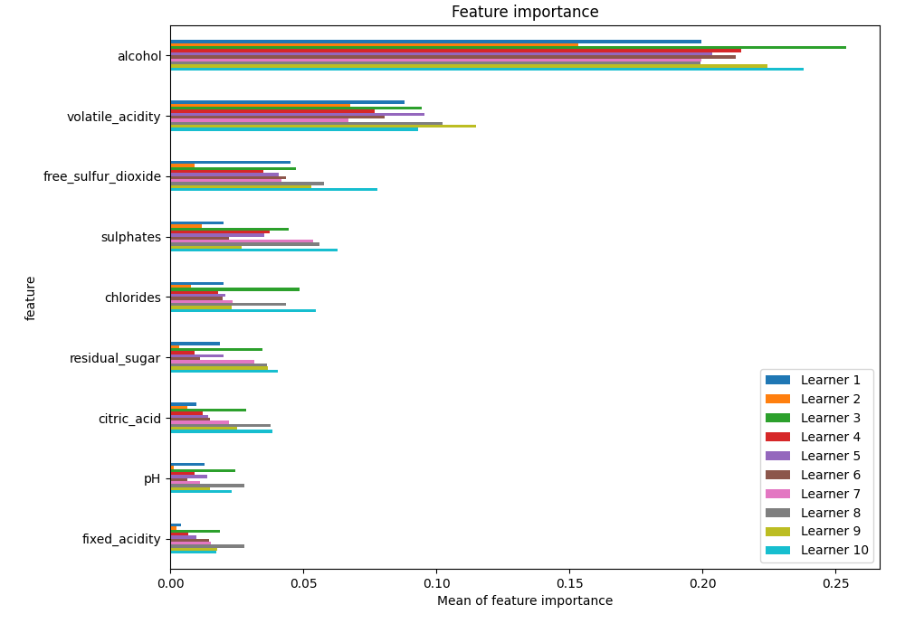
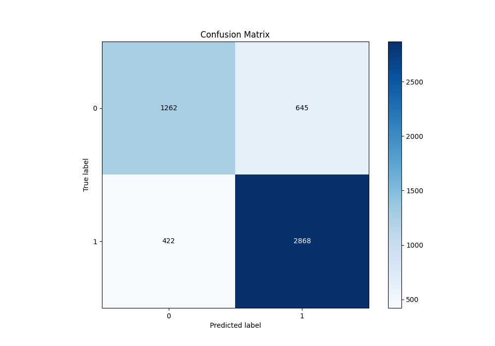
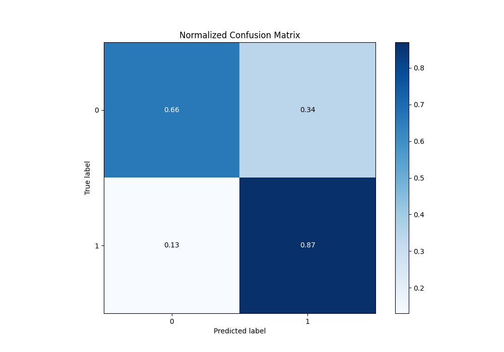
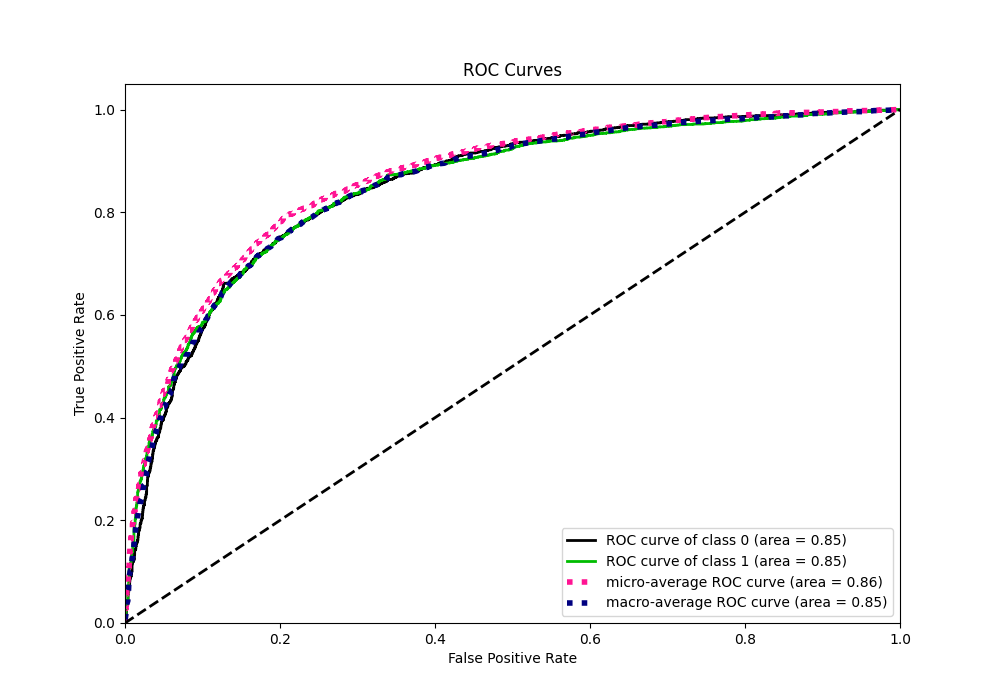
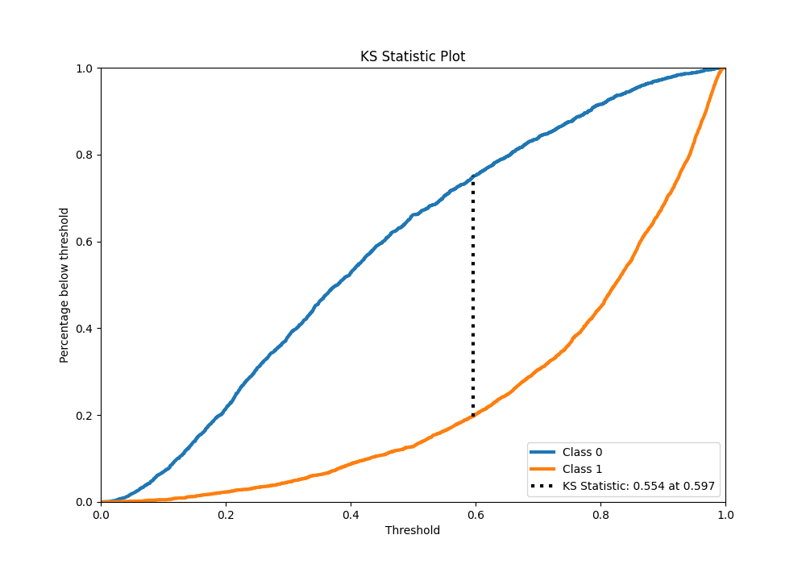
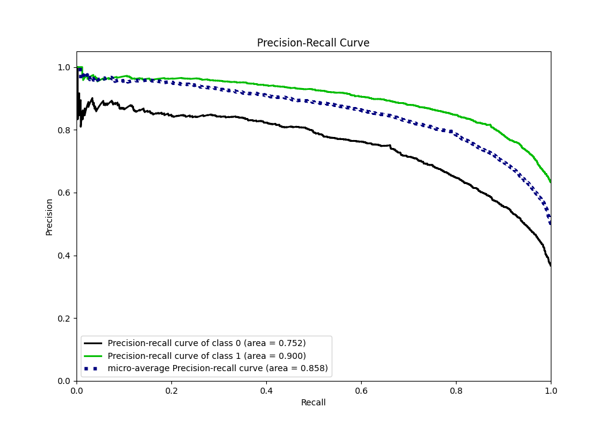
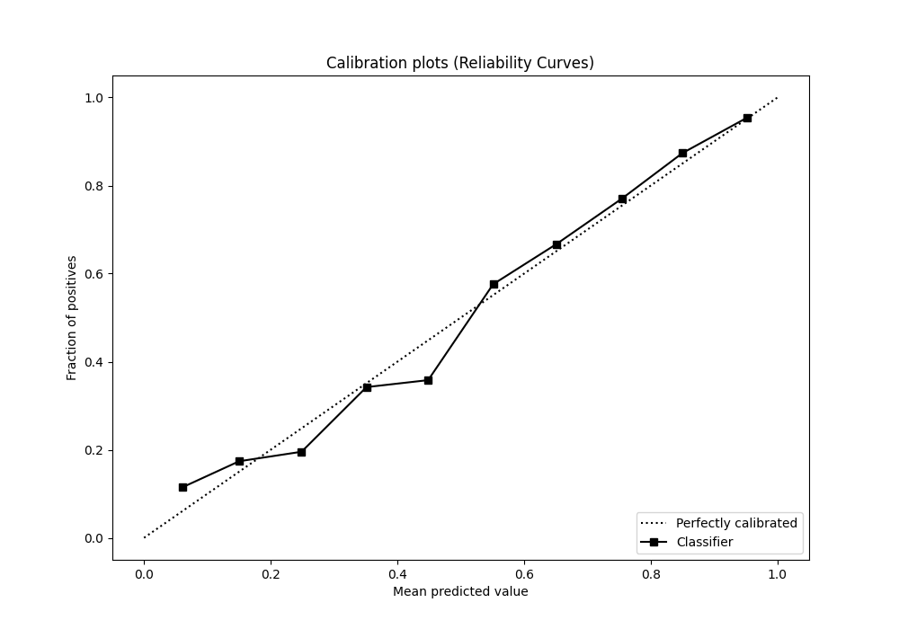
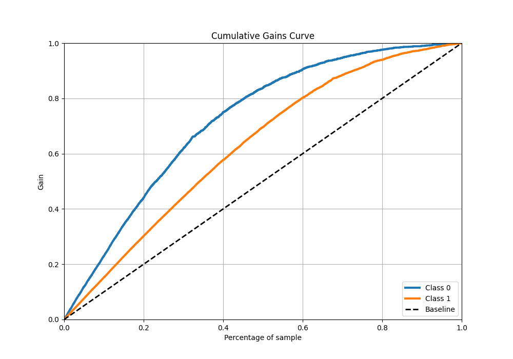
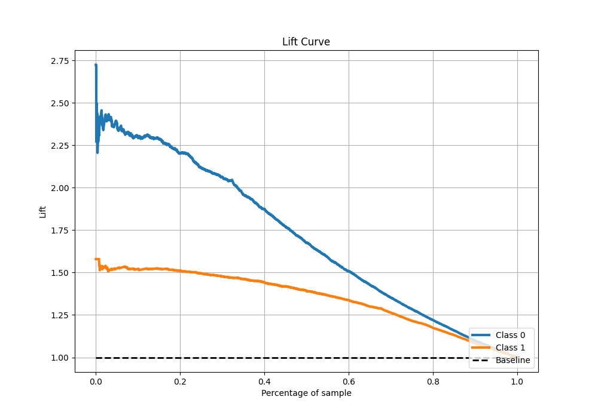

# Summary of 34_CatBoost

[<< Go back](../README.md)

## CatBoost
- **n_jobs**: -1
- **learning_rate**: 0.1
- **depth**: 6
- **rsm**: 0.7
- **loss_function**: Logloss
- **eval_metric**: F1
- **explain_level**: 1

## Validation
 - **validation_type**: kfold
 - **k_folds**: 10
 - **shuffle**: True
 - **stratify**: True
 - **random_seed**: 12

## Optimized metric
f1

## Training time

10.5 seconds

## Metric details
|           |    score |    threshold |
|:----------|---------:|-------------:|
| logloss   | 0.463263 | nan          |
| auc       | 0.850032 | nan          |
| f1        | 0.843157 |   0.50136    |
| accuracy  | 0.794689 |   0.50136    |
| precision | 0.97151  |   0.968021   |
| recall    | 1        |   0.00845914 |
| mcc       | 0.549416 |   0.50136    |

## Metric details with threshold from accuracy metric
|           |    score |   threshold |
|:----------|---------:|------------:|
| logloss   | 0.463263 |   nan       |
| auc       | 0.850032 |   nan       |
| f1        | 0.843157 |     0.50136 |
| accuracy  | 0.794689 |     0.50136 |
| precision | 0.816396 |     0.50136 |
| recall    | 0.871733 |     0.50136 |
| mcc       | 0.549416 |     0.50136 |

## Confusion matrix (at threshold=0.50136)
|              |   Predicted as 0 |   Predicted as 1 |
|:-------------|-----------------:|-----------------:|
| Labeled as 0 |             1262 |              645 |
| Labeled as 1 |              422 |             2868 |

## Learning curves

## Permutation-based Importance

## Confusion Matrix

## Normalized Confusion Matrix

## ROC Curve

## Kolmogorov-Smirnov Statistic

## Precision-Recall Curve

## Calibration Curve

## Cumulative Gains Curve

## Lift Curve

[<< Go back](../README.md)
