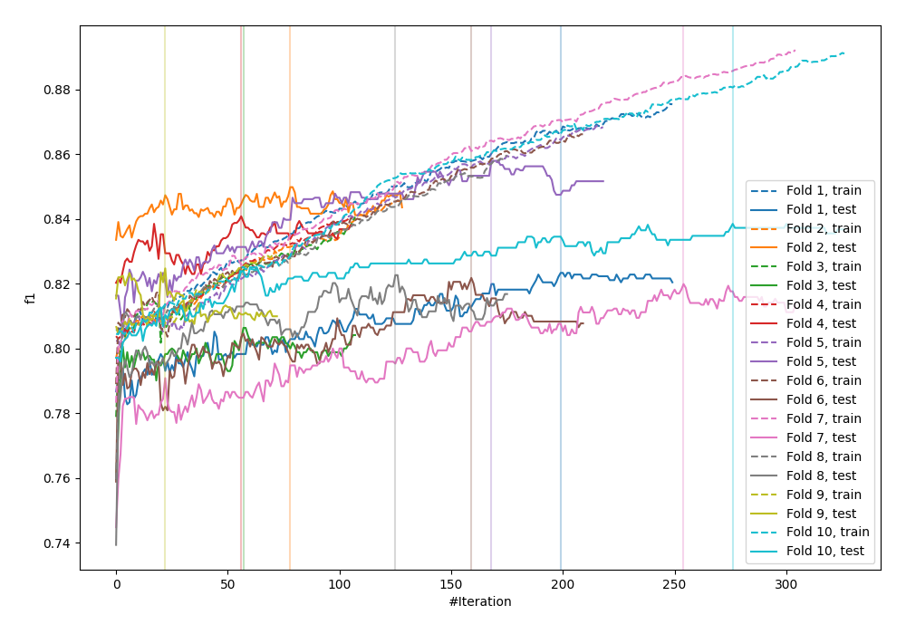
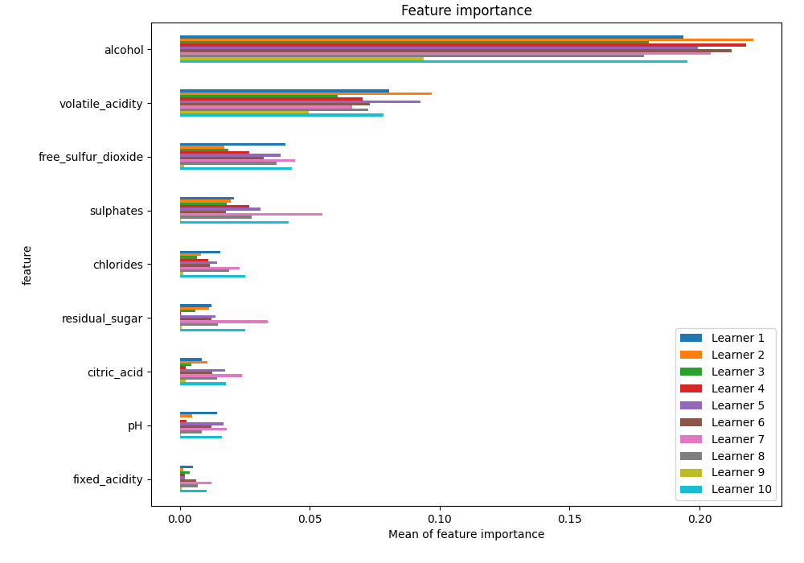
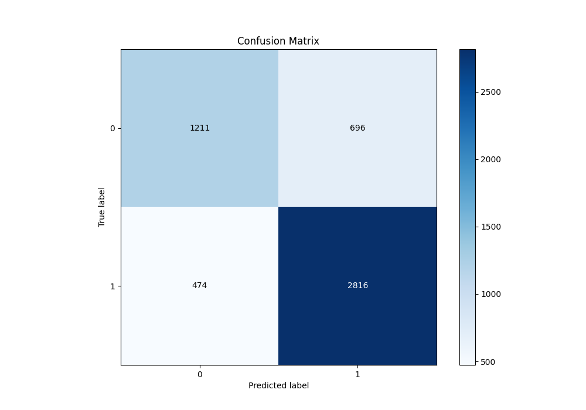
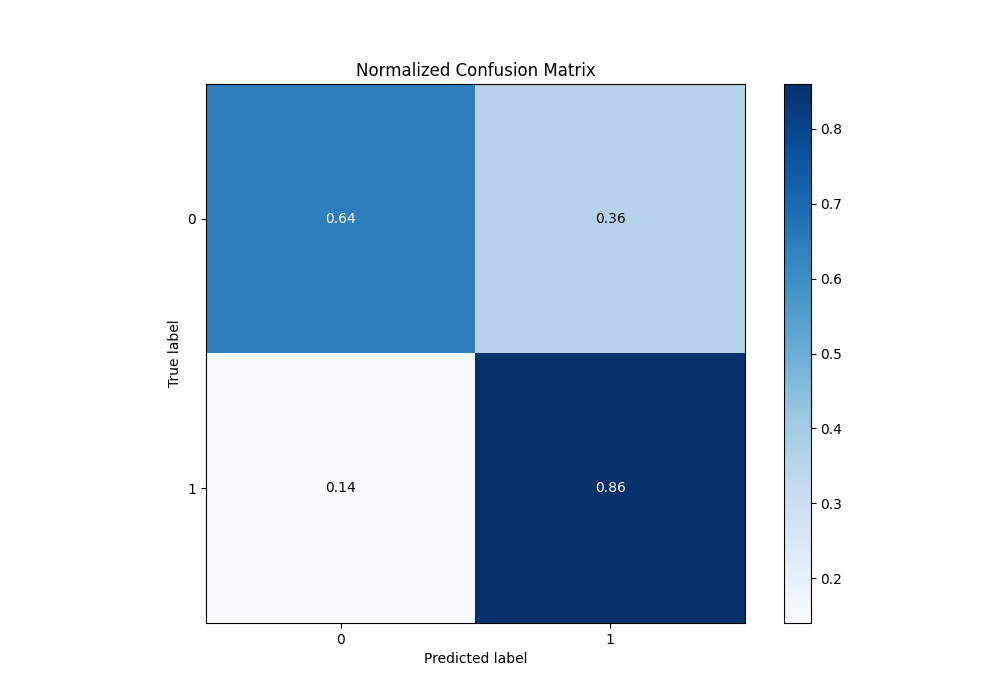
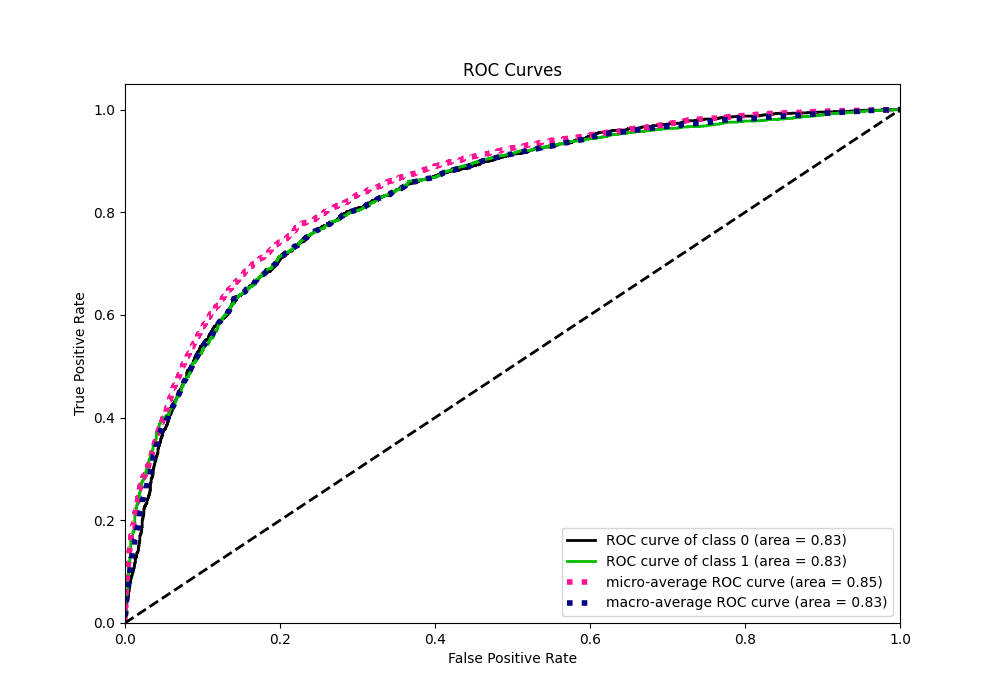
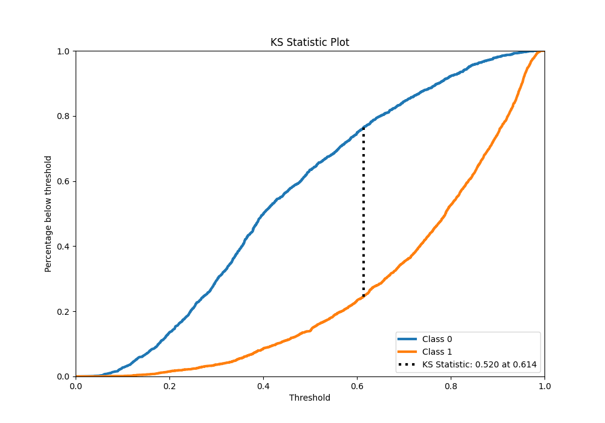
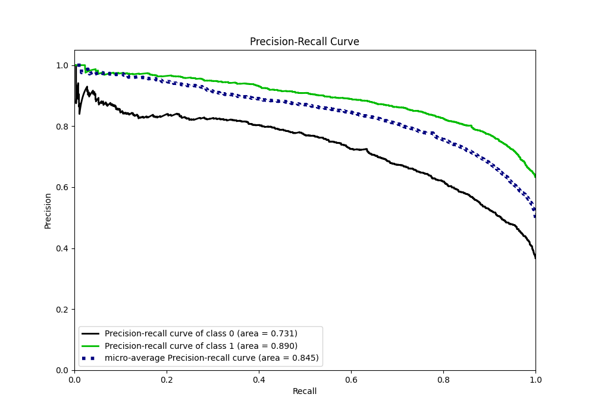
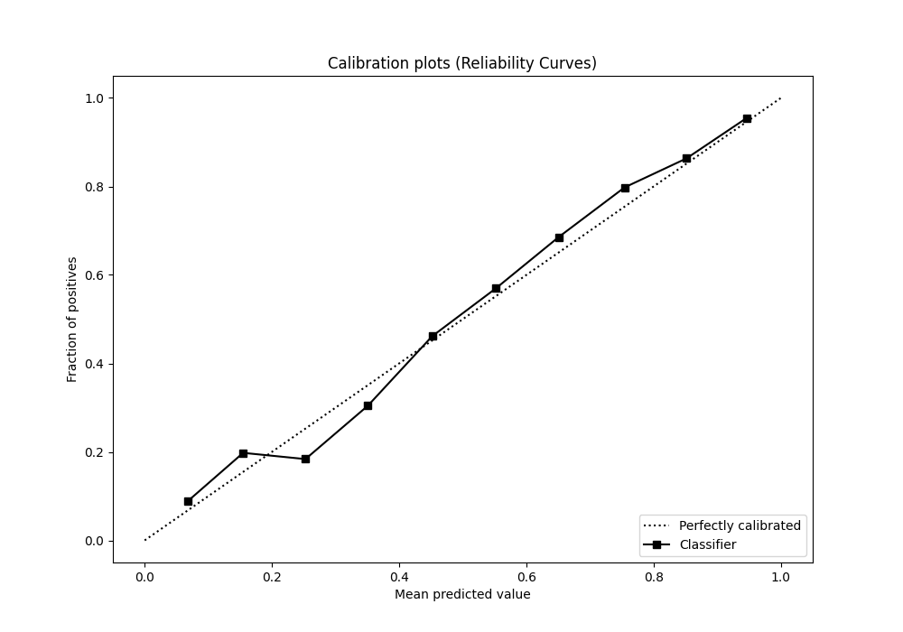
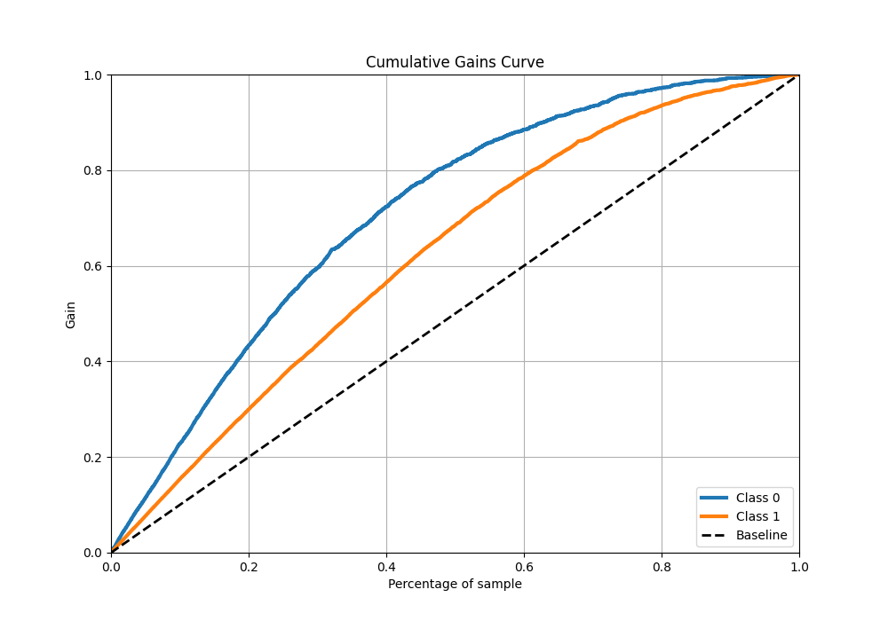
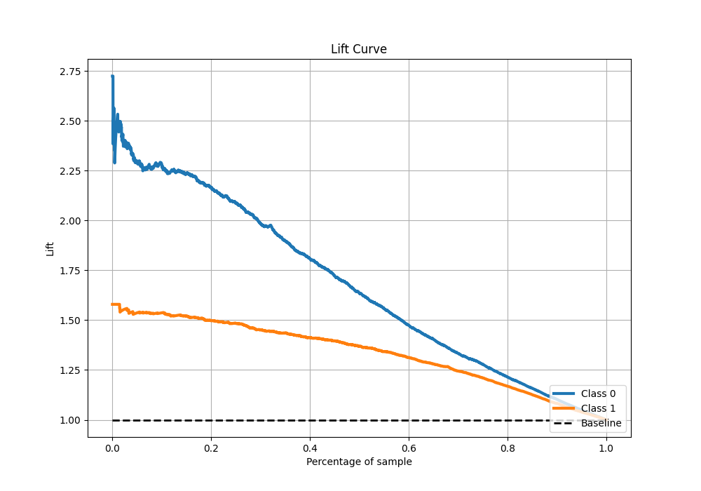

# Summary of 35_CatBoost

[<< Go back](../README.md)

## CatBoost
- **n_jobs**: -1
- **learning_rate**: 0.1
- **depth**: 4
- **rsm**: 0.7
- **loss_function**: Logloss
- **eval_metric**: F1
- **explain_level**: 1

## Validation
 - **validation_type**: kfold
 - **k_folds**: 10
 - **shuffle**: True
 - **stratify**: True
 - **random_seed**: 12

## Optimized metric
f1

## Training time

10.1 seconds

## Metric details
|           |    score |   threshold |
|:----------|---------:|------------:|
| logloss   | 0.484499 | nan         |
| auc       | 0.832713 | nan         |
| f1        | 0.831059 |   0.43332   |
| accuracy  | 0.77487  |   0.502325  |
| precision | 0.986395 |   0.967839  |
| recall    | 1        |   0.0221709 |
| mcc       | 0.50552  |   0.502325  |

## Metric details with threshold from accuracy metric
|           |    score |   threshold |
|:----------|---------:|------------:|
| logloss   | 0.484499 |  nan        |
| auc       | 0.832713 |  nan        |
| f1        | 0.827992 |    0.502325 |
| accuracy  | 0.77487  |    0.502325 |
| precision | 0.801822 |    0.502325 |
| recall    | 0.855927 |    0.502325 |
| mcc       | 0.50552  |    0.502325 |

## Confusion matrix (at threshold=0.502325)
|              |   Predicted as 0 |   Predicted as 1 |
|:-------------|-----------------:|-----------------:|
| Labeled as 0 |             1211 |              696 |
| Labeled as 1 |              474 |             2816 |

## Learning curves

## Permutation-based Importance

## Confusion Matrix

## Normalized Confusion Matrix

## ROC Curve

## Kolmogorov-Smirnov Statistic

## Precision-Recall Curve

## Calibration Curve

## Cumulative Gains Curve

## Lift Curve

[<< Go back](../README.md)
