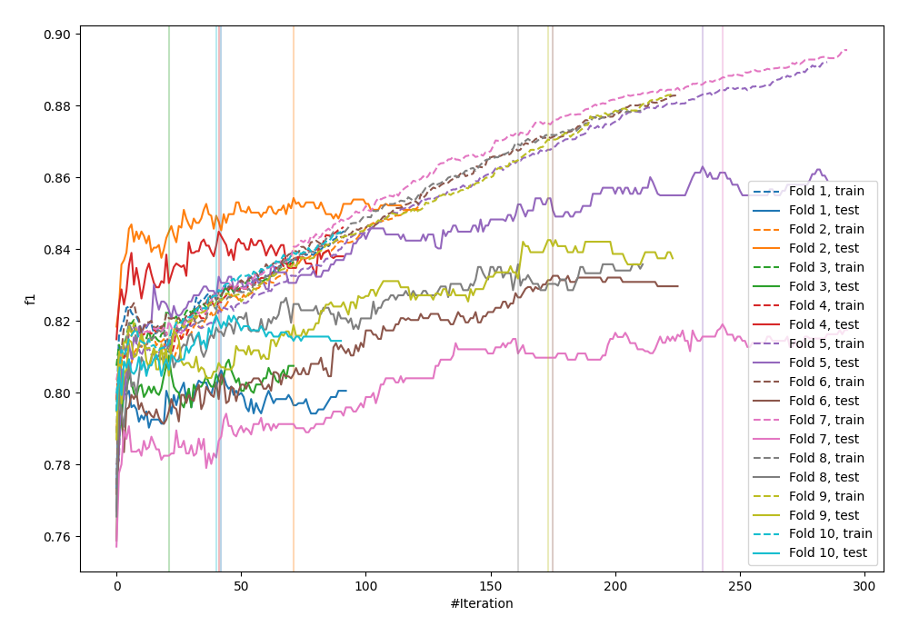
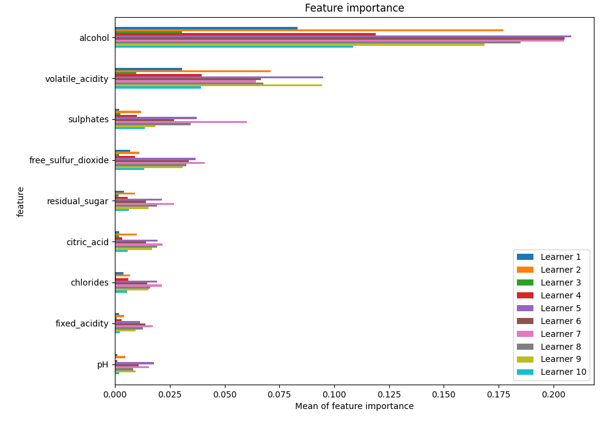
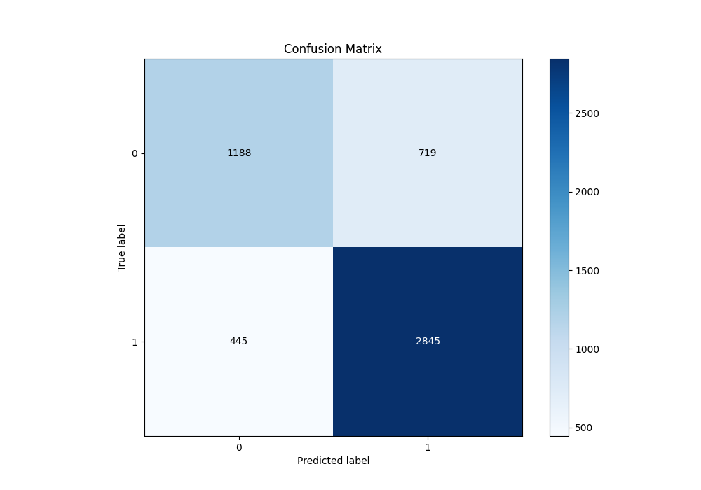
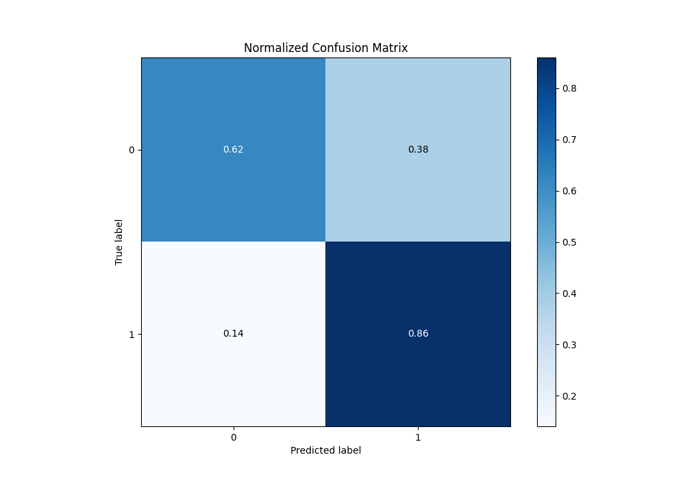
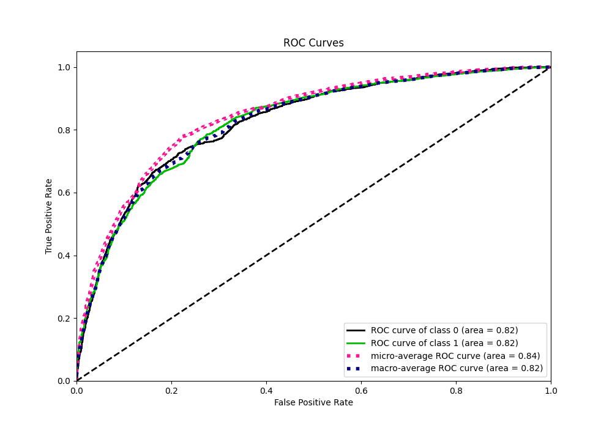
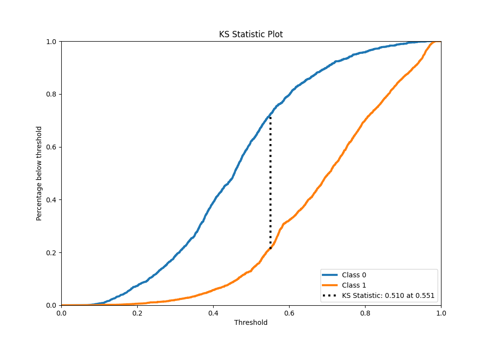
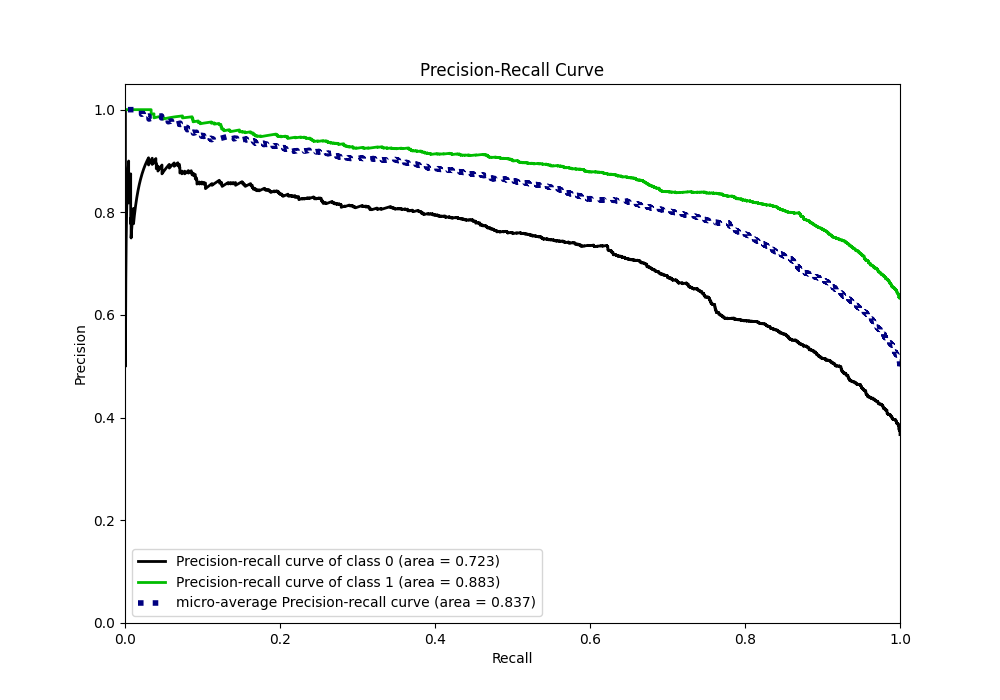
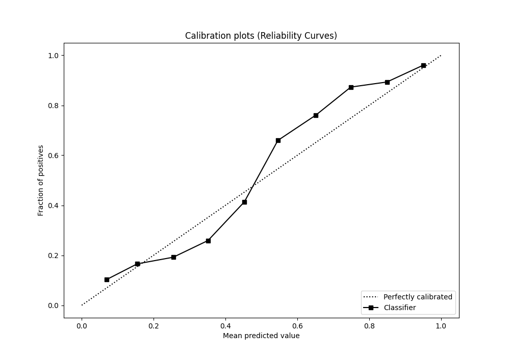
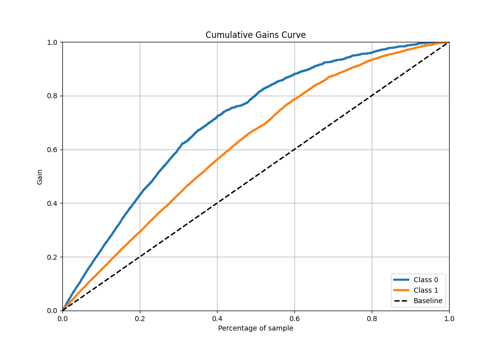
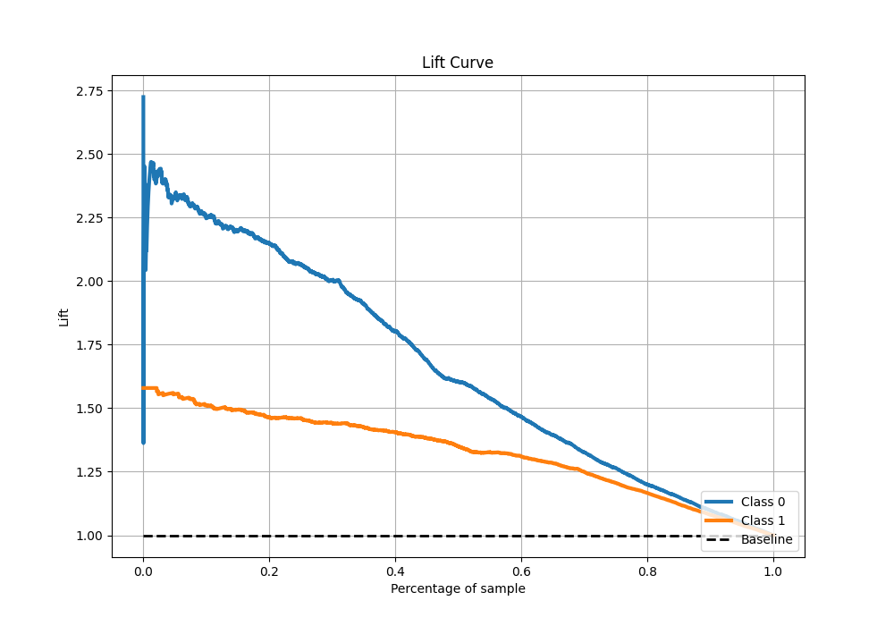

# Summary of 36_CatBoost

[<< Go back](../README.md)

## CatBoost
- **n_jobs**: -1
- **learning_rate**: 0.025
- **depth**: 8
- **rsm**: 1.0
- **loss_function**: Logloss
- **eval_metric**: F1
- **explain_level**: 1

## Validation
 - **validation_type**: kfold
 - **k_folds**: 10
 - **shuffle**: True
 - **stratify**: True
 - **random_seed**: 12

## Optimized metric
f1

## Training time

11.9 seconds

## Metric details
|           |    score |   threshold |
|:----------|---------:|------------:|
| logloss   | 0.509607 |  nan        |
| auc       | 0.824533 |  nan        |
| f1        | 0.830992 |    0.496382 |
| accuracy  | 0.776025 |    0.501971 |
| precision | 0.986395 |    0.958124 |
| recall    | 1        |    0.047464 |
| mcc       | 0.509369 |    0.525511 |

## Metric details with threshold from accuracy metric
|           |    score |   threshold |
|:----------|---------:|------------:|
| logloss   | 0.509607 |  nan        |
| auc       | 0.824533 |  nan        |
| f1        | 0.830172 |    0.501971 |
| accuracy  | 0.776025 |    0.501971 |
| precision | 0.79826  |    0.501971 |
| recall    | 0.864742 |    0.501971 |
| mcc       | 0.506376 |    0.501971 |

## Confusion matrix (at threshold=0.501971)
|              |   Predicted as 0 |   Predicted as 1 |
|:-------------|-----------------:|-----------------:|
| Labeled as 0 |             1188 |              719 |
| Labeled as 1 |              445 |             2845 |

## Learning curves

## Permutation-based Importance

## Confusion Matrix

## Normalized Confusion Matrix

## ROC Curve

## Kolmogorov-Smirnov Statistic

## Precision-Recall Curve

## Calibration Curve

## Cumulative Gains Curve

## Lift Curve

[<< Go back](../README.md)
