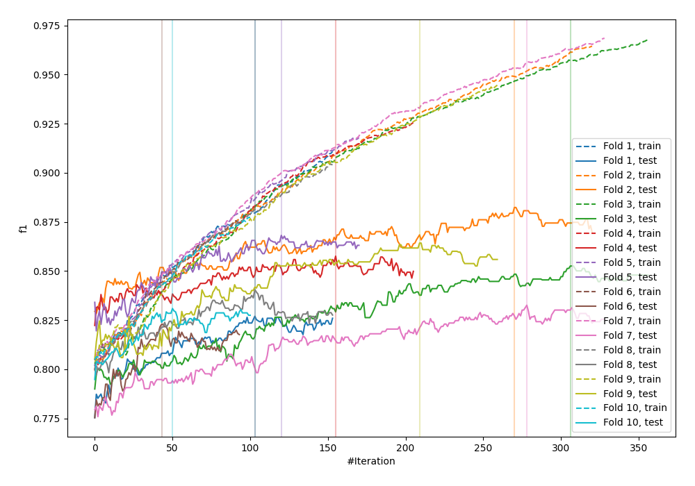
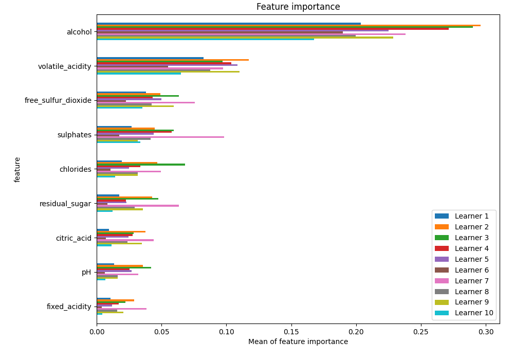
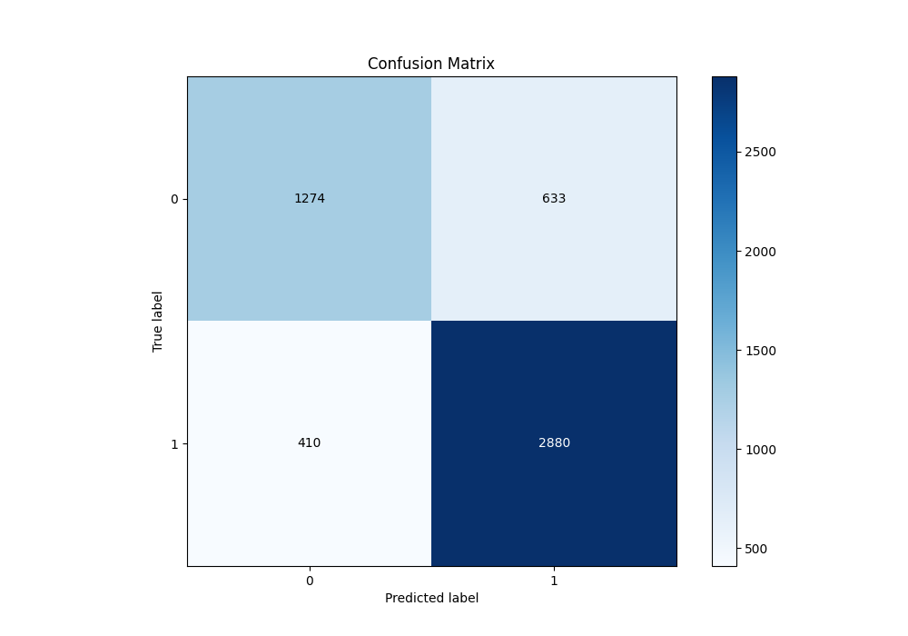
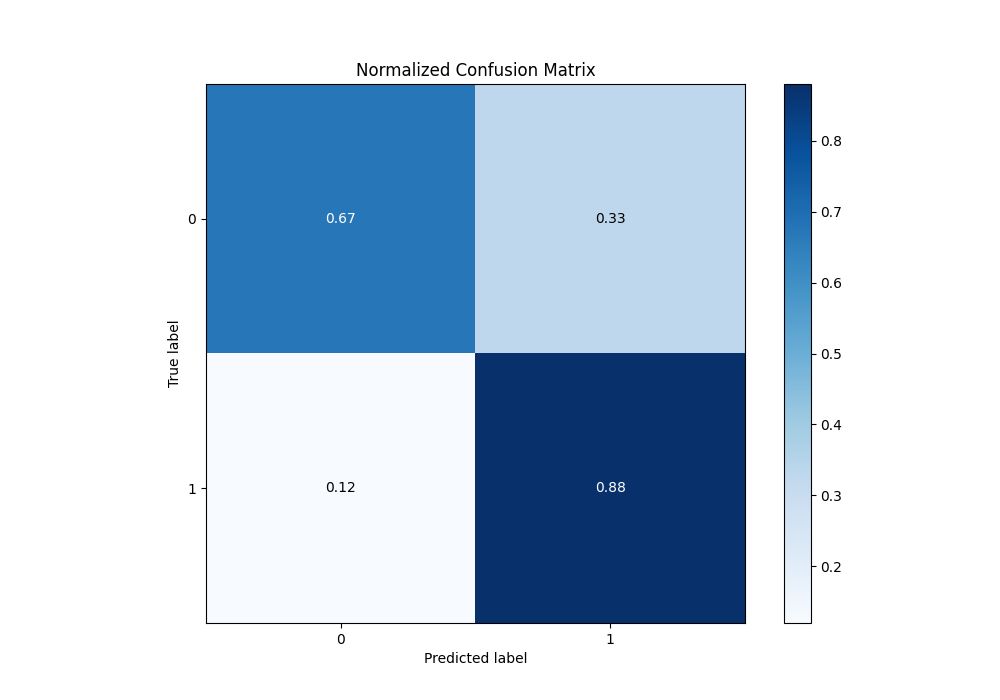
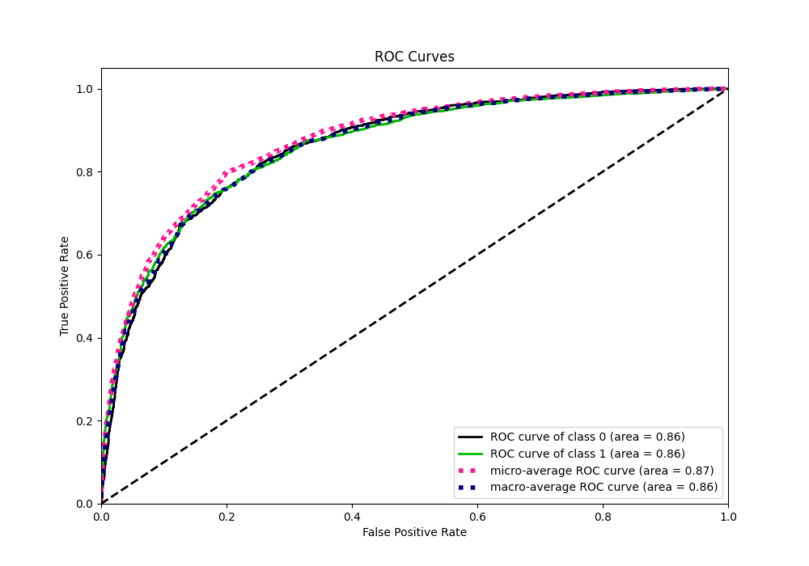
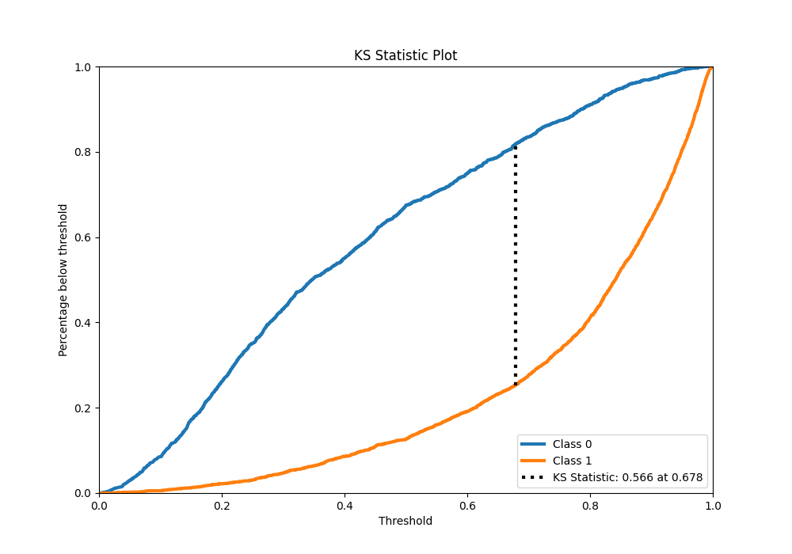
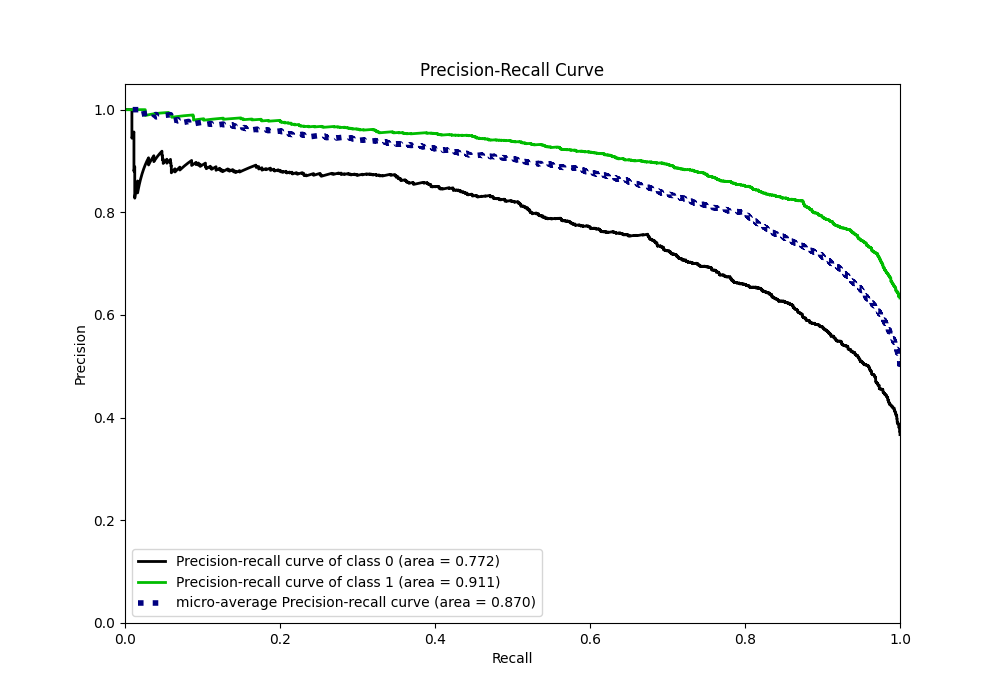
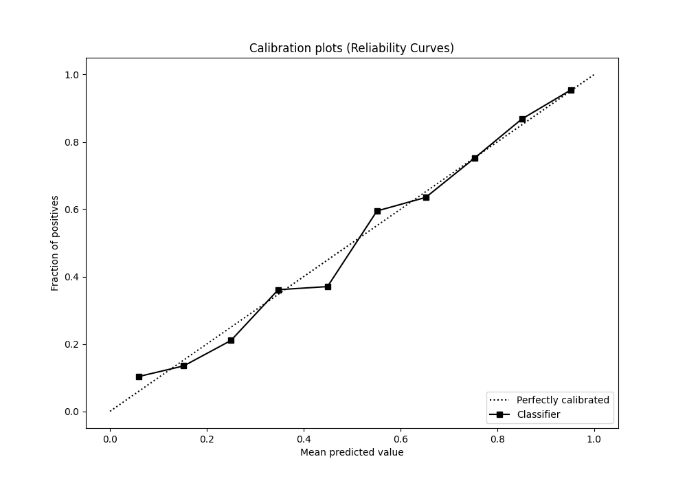
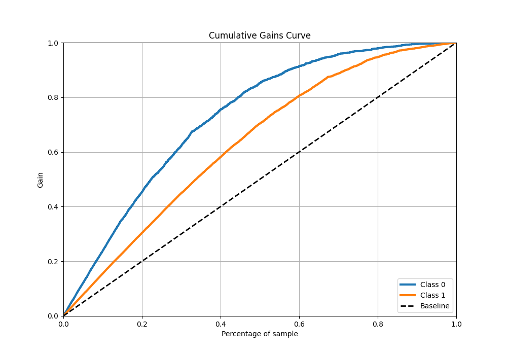
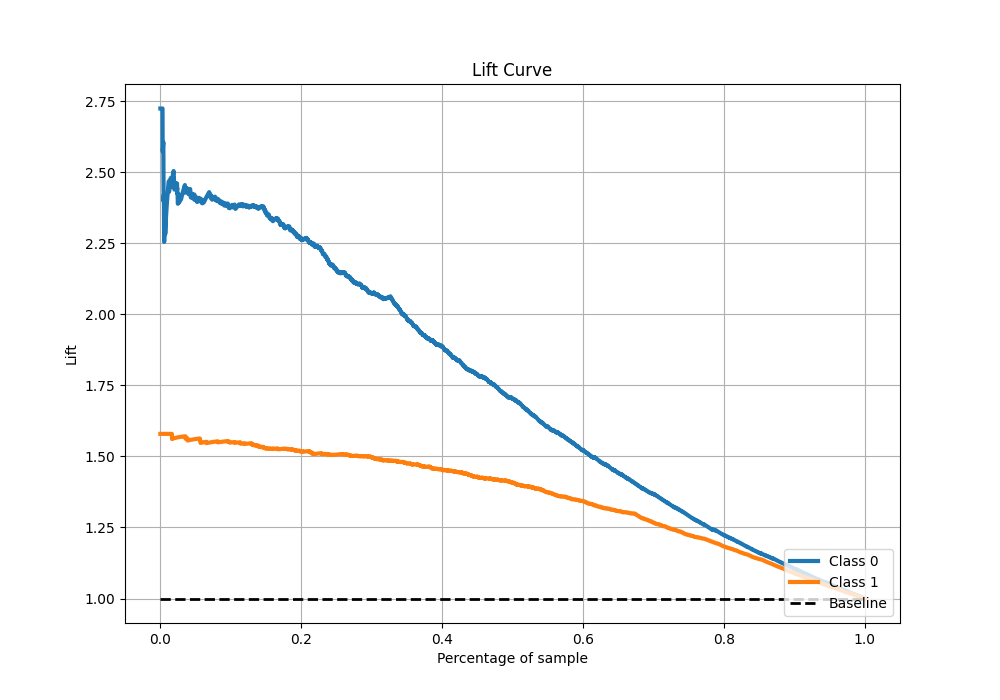

# Summary of 37_CatBoost

[<< Go back](../README.md)

## CatBoost
- **n_jobs**: -1
- **learning_rate**: 0.1
- **depth**: 7
- **rsm**: 0.8
- **loss_function**: Logloss
- **eval_metric**: F1
- **explain_level**: 1

## Validation
 - **validation_type**: kfold
 - **k_folds**: 10
 - **shuffle**: True
 - **stratify**: True
 - **random_seed**: 12

## Optimized metric
f1

## Training time

13.0 seconds

## Metric details
|           |    score |    threshold |
|:----------|---------:|-------------:|
| logloss   | 0.446718 | nan          |
| auc       | 0.860886 | nan          |
| f1        | 0.846685 |   0.49619    |
| accuracy  | 0.799307 |   0.49619    |
| precision | 0.993197 |   0.985633   |
| recall    | 1        |   0.00350389 |
| mcc       | 0.559653 |   0.49619    |

## Metric details with threshold from accuracy metric
|           |    score |   threshold |
|:----------|---------:|------------:|
| logloss   | 0.446718 |   nan       |
| auc       | 0.860886 |   nan       |
| f1        | 0.846685 |     0.49619 |
| accuracy  | 0.799307 |     0.49619 |
| precision | 0.819812 |     0.49619 |
| recall    | 0.87538  |     0.49619 |
| mcc       | 0.559653 |     0.49619 |

## Confusion matrix (at threshold=0.49619)
|              |   Predicted as 0 |   Predicted as 1 |
|:-------------|-----------------:|-----------------:|
| Labeled as 0 |             1274 |              633 |
| Labeled as 1 |              410 |             2880 |

## Learning curves

## Permutation-based Importance

## Confusion Matrix

## Normalized Confusion Matrix

## ROC Curve

## Kolmogorov-Smirnov Statistic

## Precision-Recall Curve

## Calibration Curve

## Cumulative Gains Curve

## Lift Curve

[<< Go back](../README.md)
