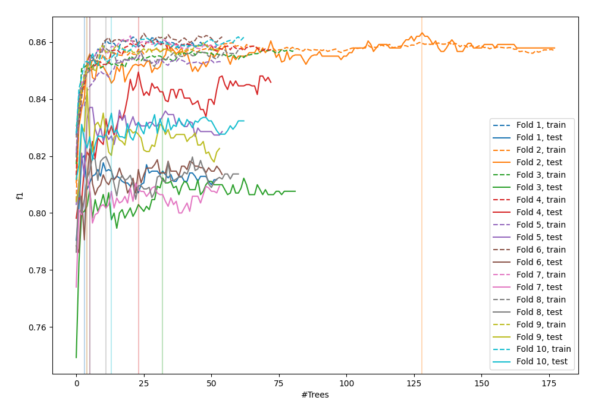
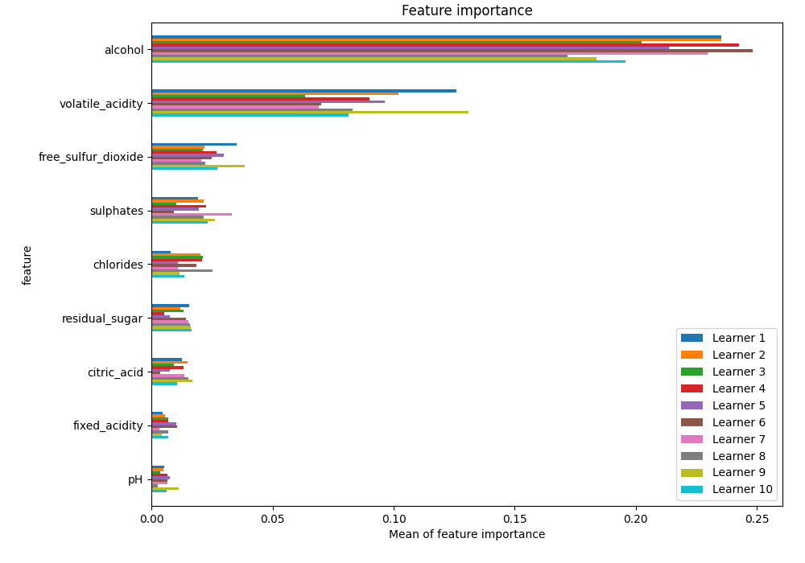
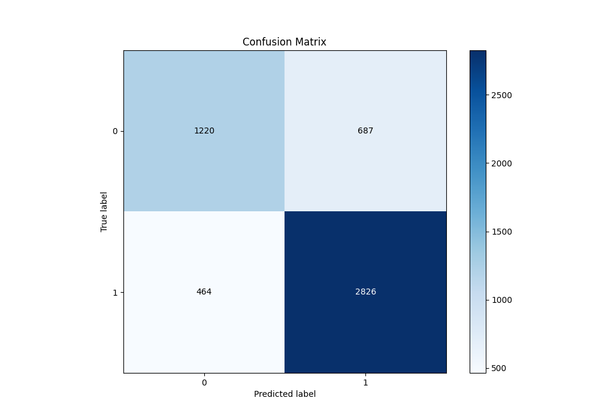
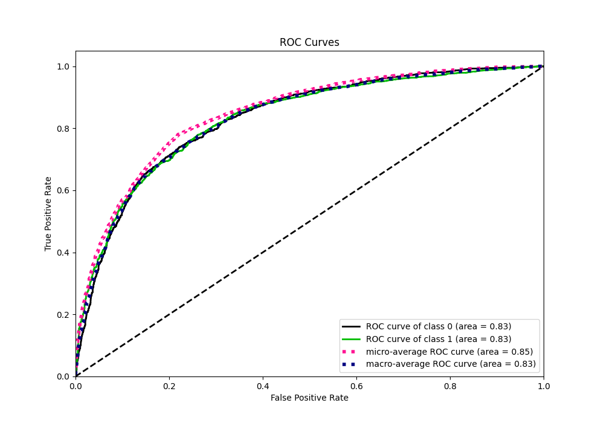
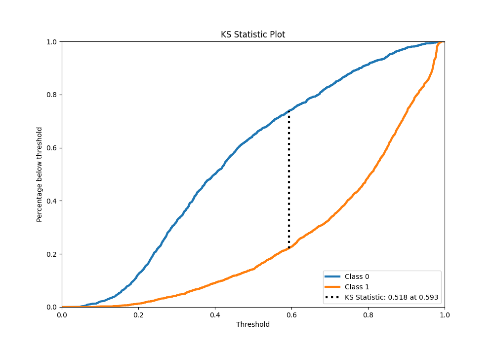
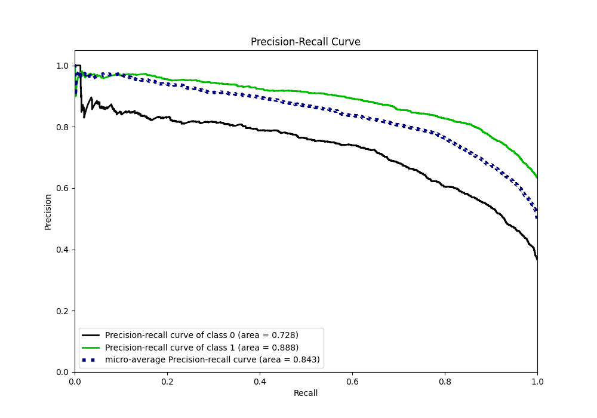
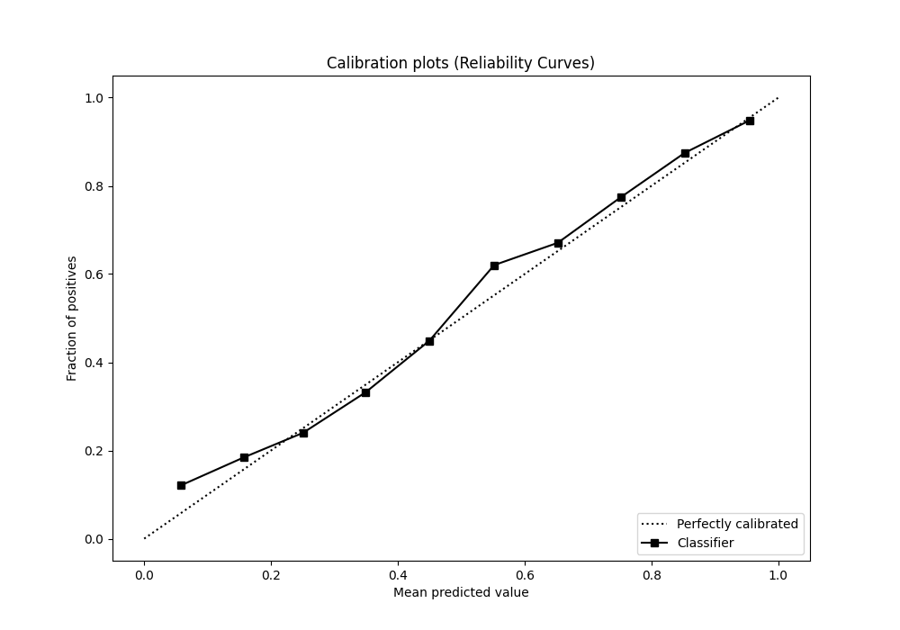
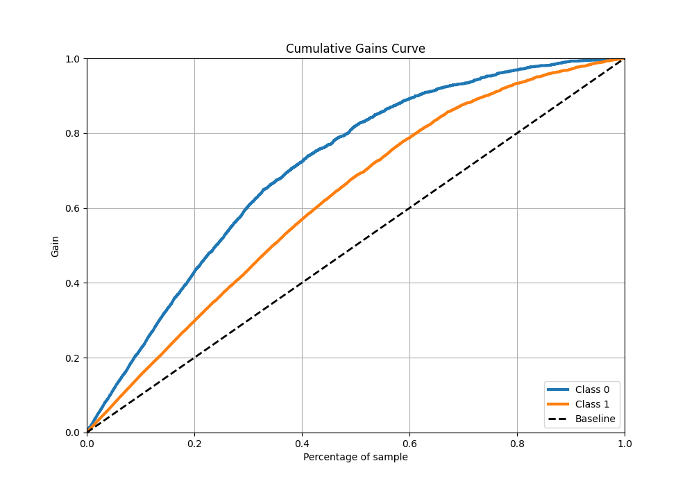
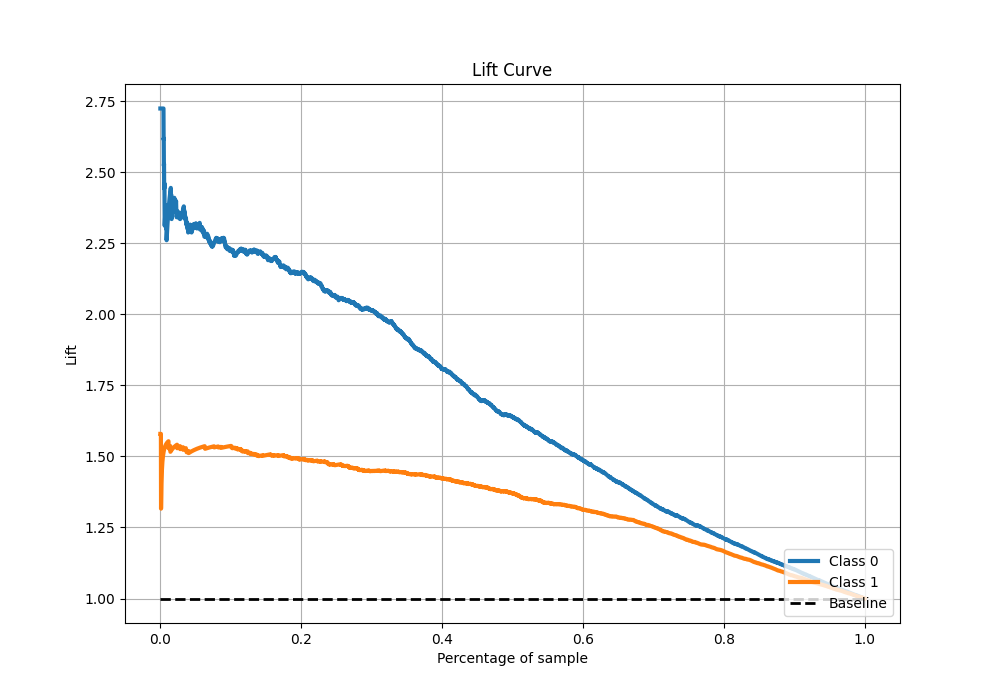

# Summary of 40_RandomForest

[<< Go back](../README.md)

## Random Forest
- **n_jobs**: -1
- **criterion**: gini
- **max_features**: 0.7
- **min_samples_split**: 30
- **max_depth**: 7
- **eval_metric_name**: f1
- **explain_level**: 1

## Validation
 - **validation_type**: kfold
 - **k_folds**: 10
 - **shuffle**: True
 - **stratify**: True
 - **random_seed**: 12

## Optimized metric
f1

## Training time

9.9 seconds

## Metric details
|           |    score |   threshold |
|:----------|---------:|------------:|
| logloss   | 0.484758 |  nan        |
| auc       | 0.831869 |  nan        |
| f1        | 0.83244  |    0.469447 |
| accuracy  | 0.778526 |    0.496839 |
| precision | 0.972222 |    0.954032 |
| recall    | 1        |    0.044021 |
| mcc       | 0.514634 |    0.50646  |

## Metric details with threshold from accuracy metric
|           |    score |   threshold |
|:----------|---------:|------------:|
| logloss   | 0.484758 |  nan        |
| auc       | 0.831869 |  nan        |
| f1        | 0.83081  |    0.496839 |
| accuracy  | 0.778526 |    0.496839 |
| precision | 0.804441 |    0.496839 |
| recall    | 0.858967 |    0.496839 |
| mcc       | 0.513589 |    0.496839 |

## Confusion matrix (at threshold=0.496839)
|              |   Predicted as 0 |   Predicted as 1 |
|:-------------|-----------------:|-----------------:|
| Labeled as 0 |             1220 |              687 |
| Labeled as 1 |              464 |             2826 |

## Learning curves

## Permutation-based Importance

## Confusion Matrix

## Normalized Confusion Matrix

## ROC Curve

## Kolmogorov-Smirnov Statistic

## Precision-Recall Curve

## Calibration Curve

## Cumulative Gains Curve

## Lift Curve

[<< Go back](../README.md)
