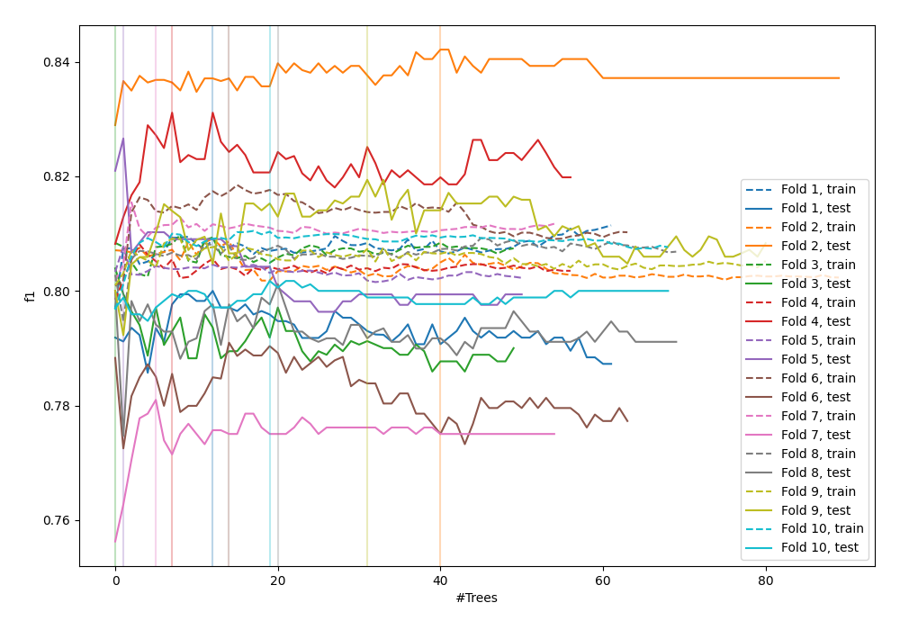
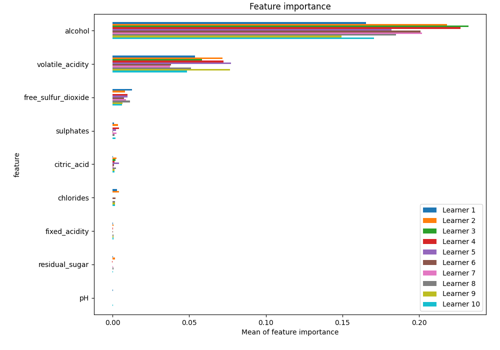
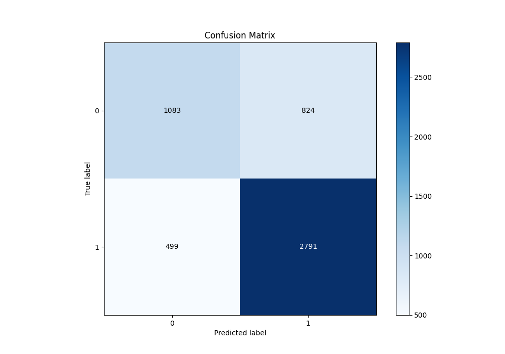
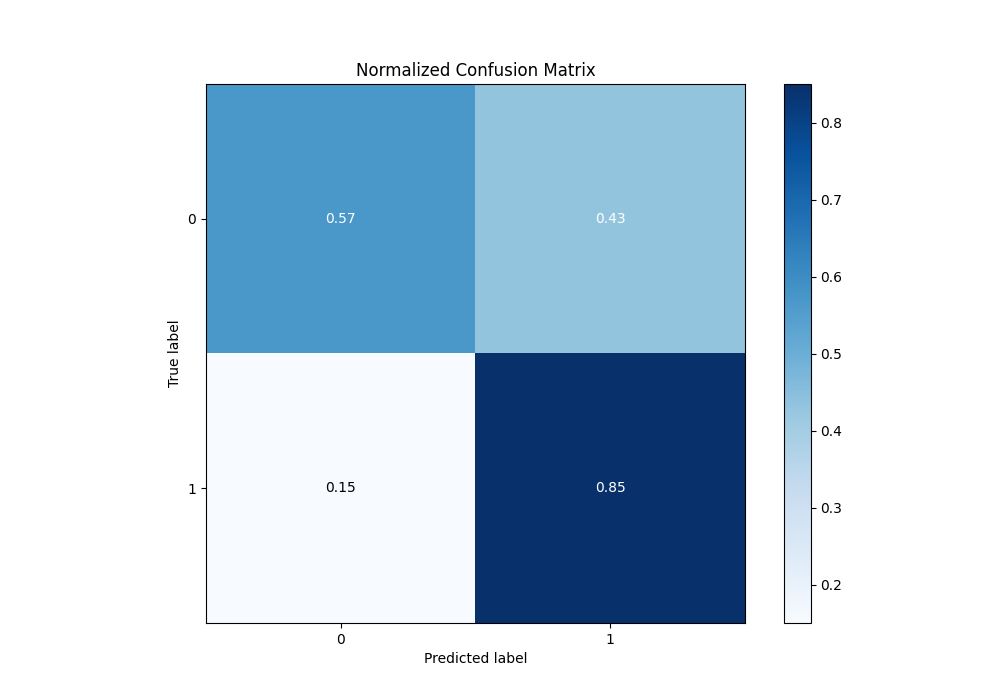
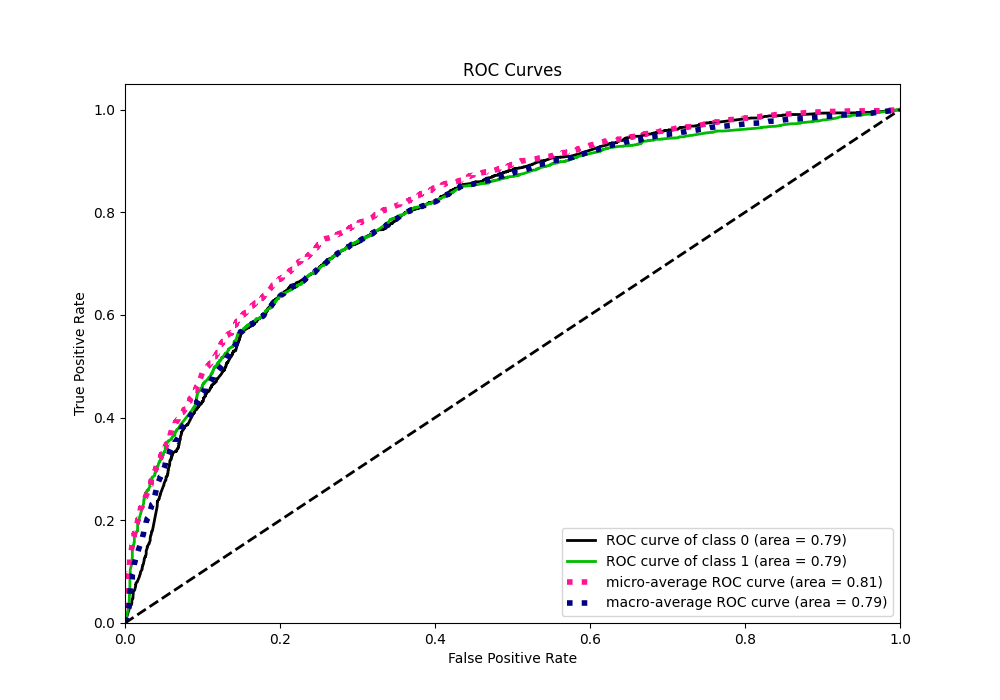
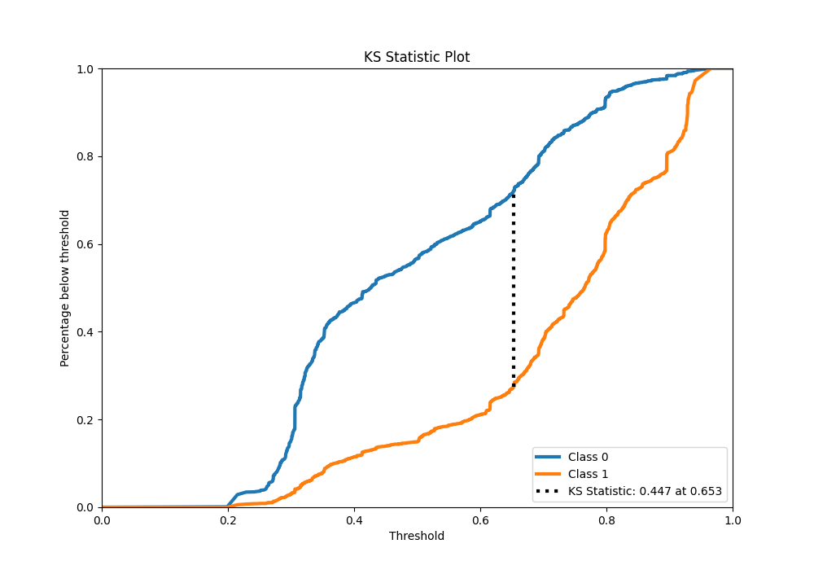
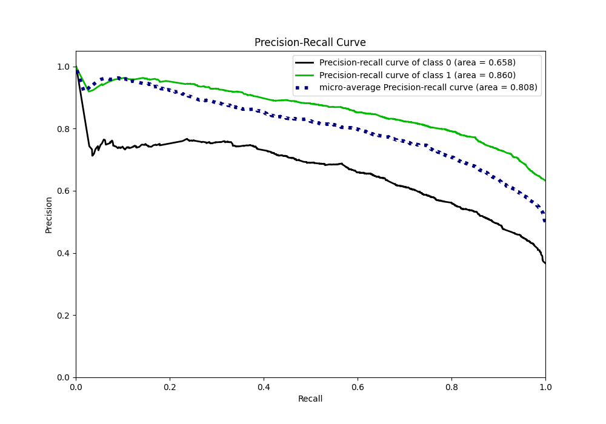
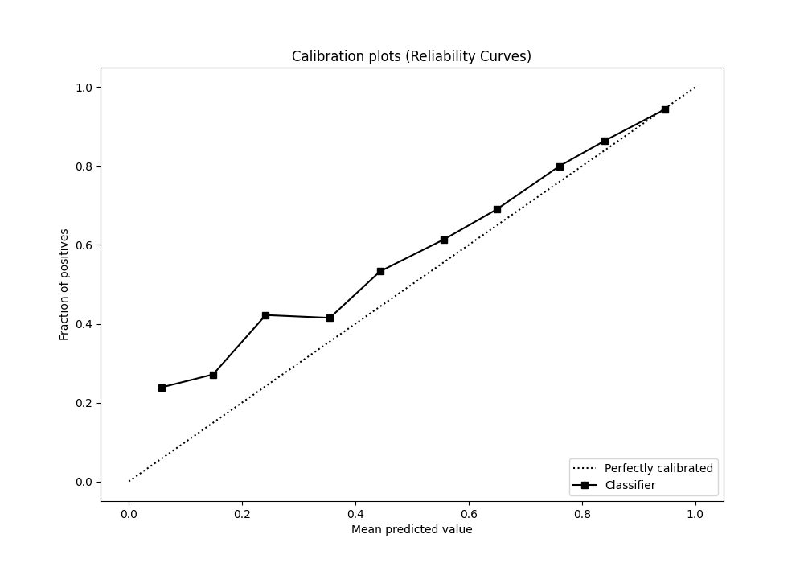
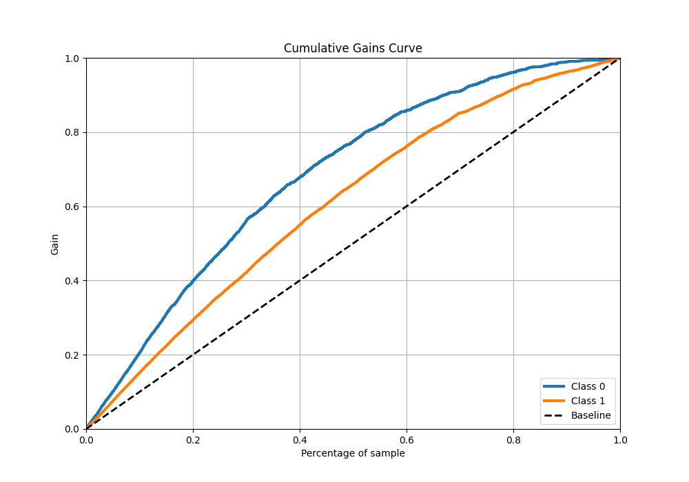
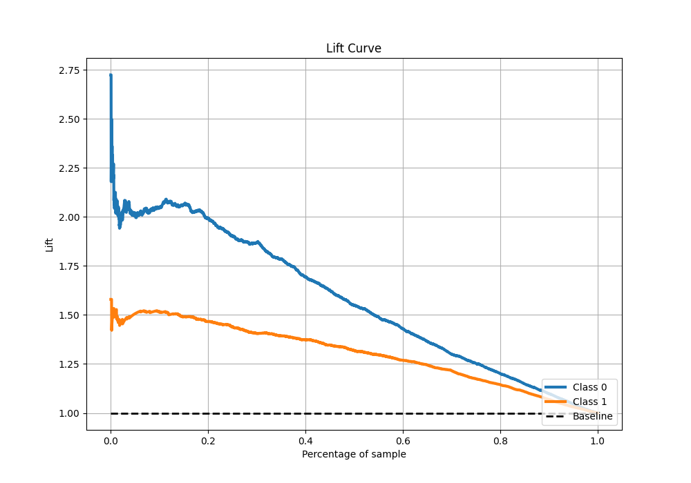

# Summary of 41_RandomForest

[<< Go back](../README.md)

## Random Forest
- **n_jobs**: -1
- **criterion**: gini
- **max_features**: 0.8
- **min_samples_split**: 40
- **max_depth**: 3
- **eval_metric_name**: f1
- **explain_level**: 1

## Validation
 - **validation_type**: kfold
 - **k_folds**: 10
 - **shuffle**: True
 - **stratify**: True
 - **random_seed**: 12

## Optimized metric
f1

## Training time

10.0 seconds

## Metric details
|           |    score |   threshold |
|:----------|---------:|------------:|
| logloss   | 0.527318 |  nan        |
| auc       | 0.792621 |  nan        |
| f1        | 0.809207 |    0.345808 |
| accuracy  | 0.74543  |    0.502871 |
| precision | 0.960317 |    0.922223 |
| recall    | 1        |    0.179    |
| mcc       | 0.439575 |    0.601209 |

## Metric details with threshold from accuracy metric
|           |    score |   threshold |
|:----------|---------:|------------:|
| logloss   | 0.527318 |  nan        |
| auc       | 0.792621 |  nan        |
| f1        | 0.8084   |    0.502871 |
| accuracy  | 0.74543  |    0.502871 |
| precision | 0.772061 |    0.502871 |
| recall    | 0.848328 |    0.502871 |
| mcc       | 0.435969 |    0.502871 |

## Confusion matrix (at threshold=0.502871)
|              |   Predicted as 0 |   Predicted as 1 |
|:-------------|-----------------:|-----------------:|
| Labeled as 0 |             1083 |              824 |
| Labeled as 1 |              499 |             2791 |

## Learning curves

## Permutation-based Importance

## Confusion Matrix

## Normalized Confusion Matrix

## ROC Curve

## Kolmogorov-Smirnov Statistic

## Precision-Recall Curve

## Calibration Curve

## Cumulative Gains Curve

## Lift Curve

[<< Go back](../README.md)
