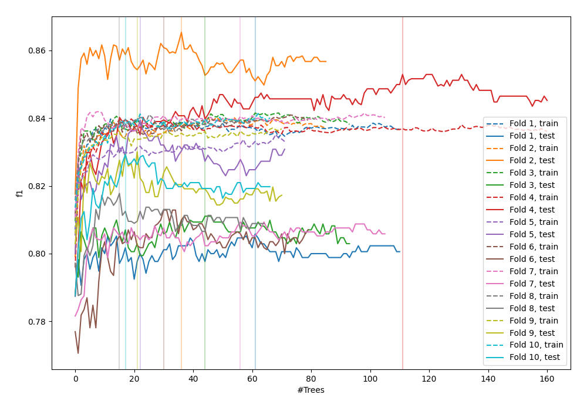
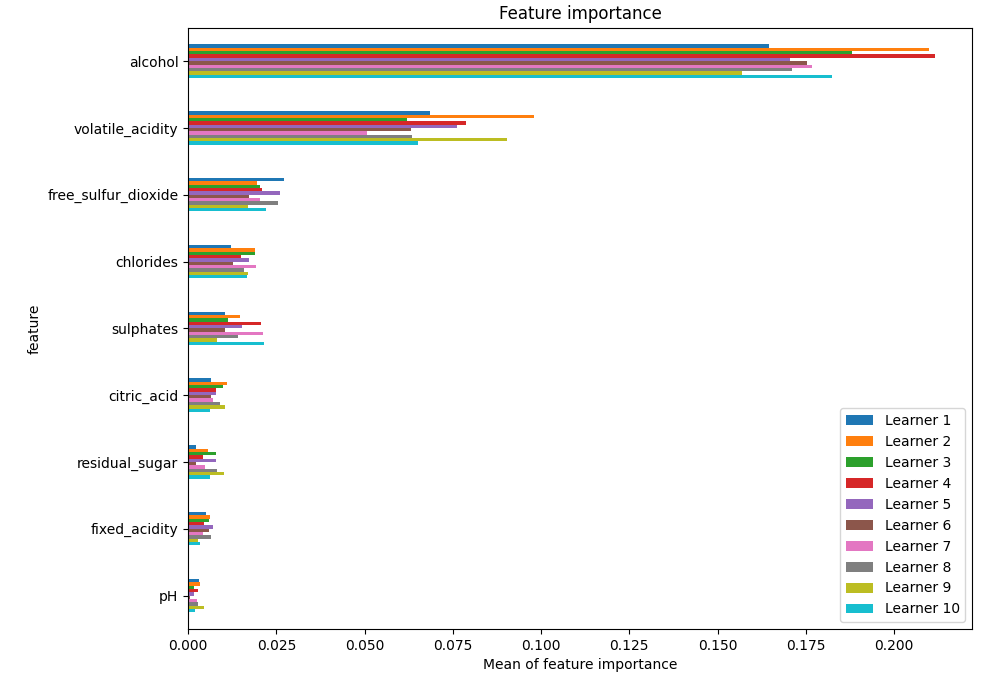
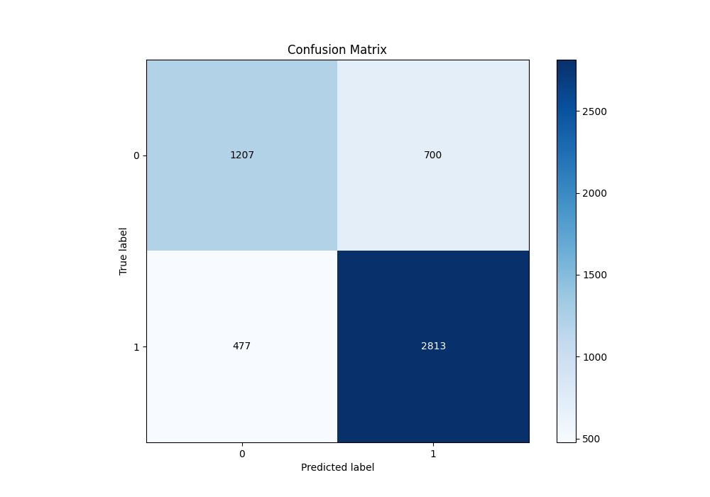
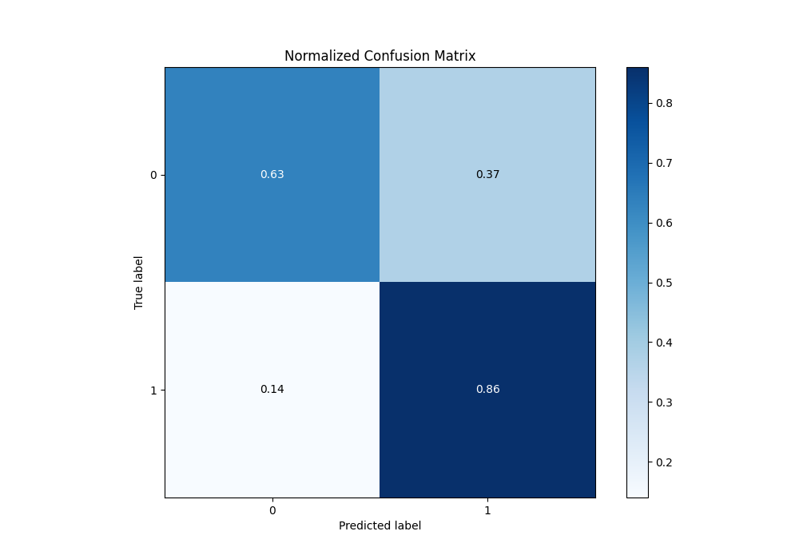
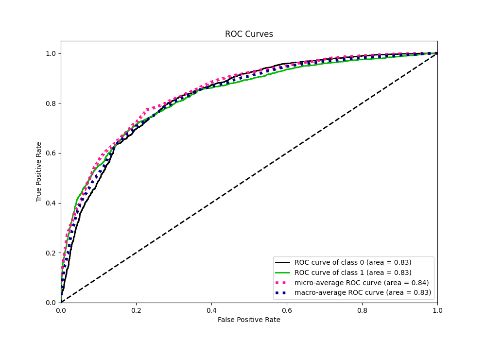
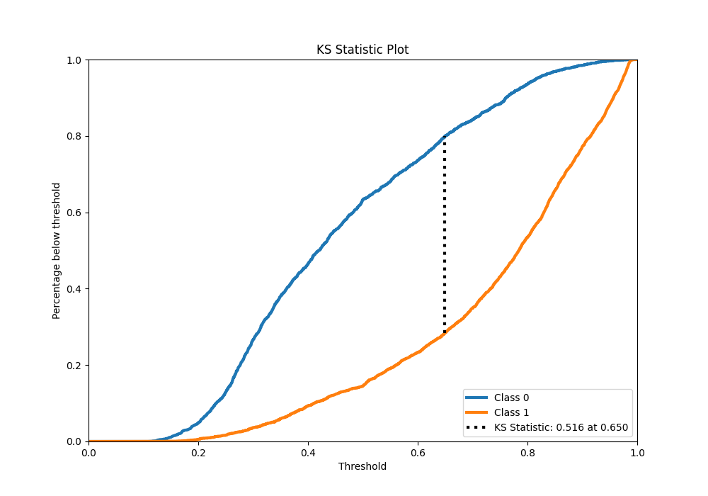
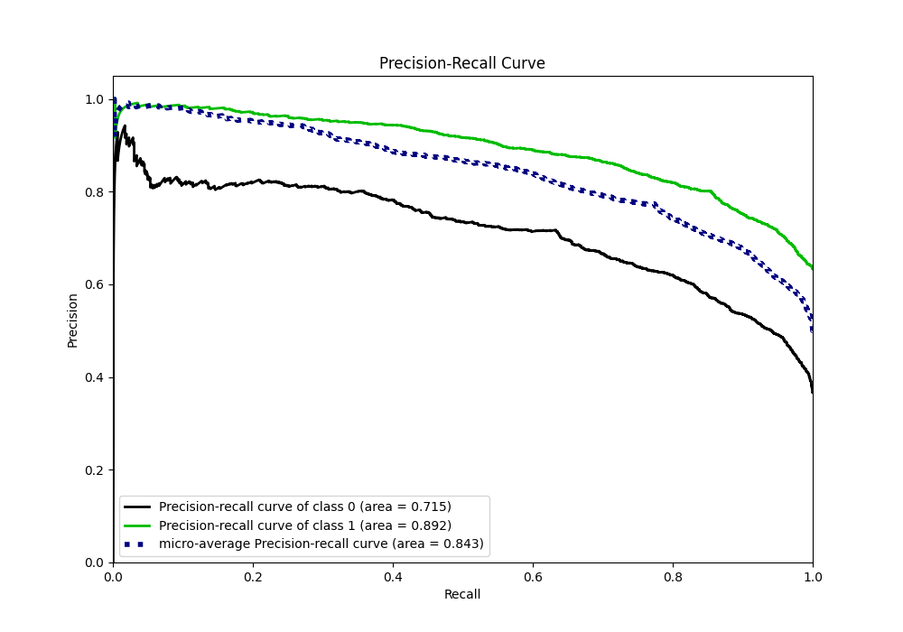
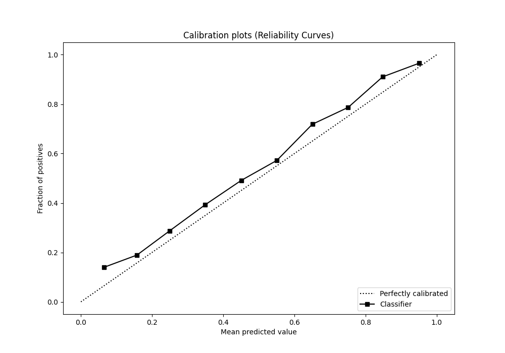
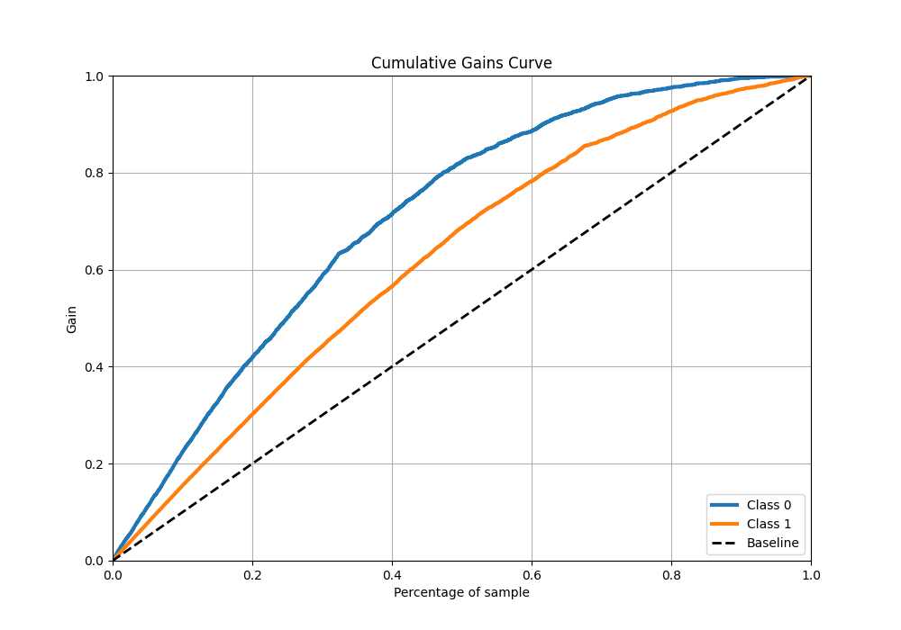
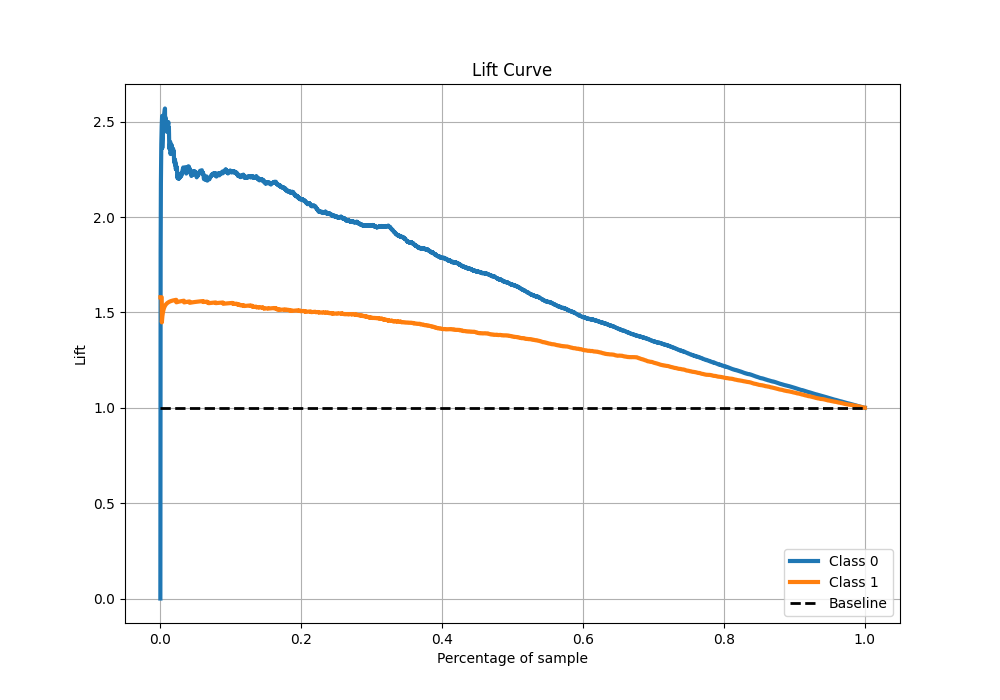

# Summary of 42_RandomForest

[<< Go back](../README.md)

## Random Forest
- **n_jobs**: -1
- **criterion**: entropy
- **max_features**: 0.6
- **min_samples_split**: 50
- **max_depth**: 6
- **eval_metric_name**: f1
- **explain_level**: 1

## Validation
 - **validation_type**: kfold
 - **k_folds**: 10
 - **shuffle**: True
 - **stratify**: True
 - **random_seed**: 12

## Optimized metric
f1

## Training time

11.8 seconds

## Metric details
|           |    score |   threshold |
|:----------|---------:|------------:|
| logloss   | 0.489062 | nan         |
| auc       | 0.82968  | nan         |
| f1        | 0.826988 |   0.500187  |
| accuracy  | 0.773523 |   0.500187  |
| precision | 0.986667 |   0.959906  |
| recall    | 1        |   0.0973187 |
| mcc       | 0.502499 |   0.500187  |

## Metric details with threshold from accuracy metric
|           |    score |   threshold |
|:----------|---------:|------------:|
| logloss   | 0.489062 |  nan        |
| auc       | 0.82968  |  nan        |
| f1        | 0.826988 |    0.500187 |
| accuracy  | 0.773523 |    0.500187 |
| precision | 0.80074  |    0.500187 |
| recall    | 0.855015 |    0.500187 |
| mcc       | 0.502499 |    0.500187 |

## Confusion matrix (at threshold=0.500187)
|              |   Predicted as 0 |   Predicted as 1 |
|:-------------|-----------------:|-----------------:|
| Labeled as 0 |             1207 |              700 |
| Labeled as 1 |              477 |             2813 |

## Learning curves

## Permutation-based Importance

## Confusion Matrix

## Normalized Confusion Matrix

## ROC Curve

## Kolmogorov-Smirnov Statistic

## Precision-Recall Curve

## Calibration Curve

## Cumulative Gains Curve

## Lift Curve

[<< Go back](../README.md)
