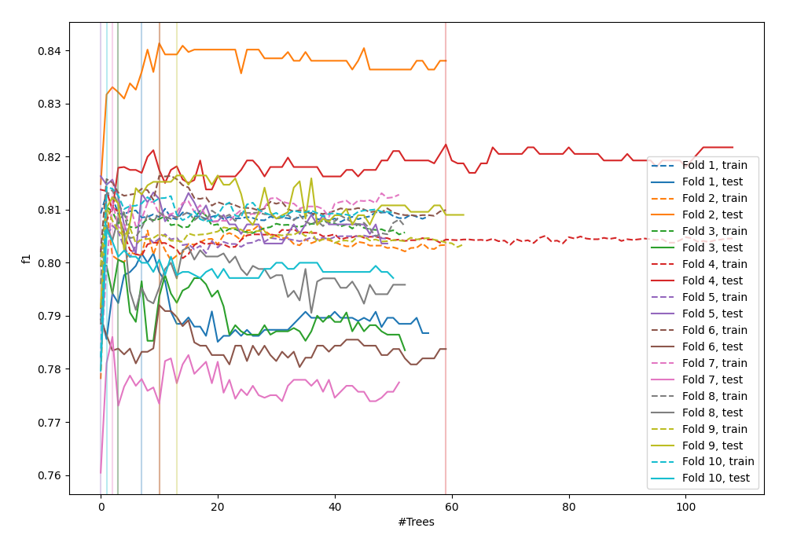
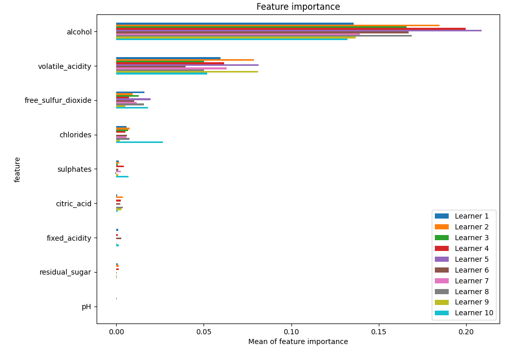
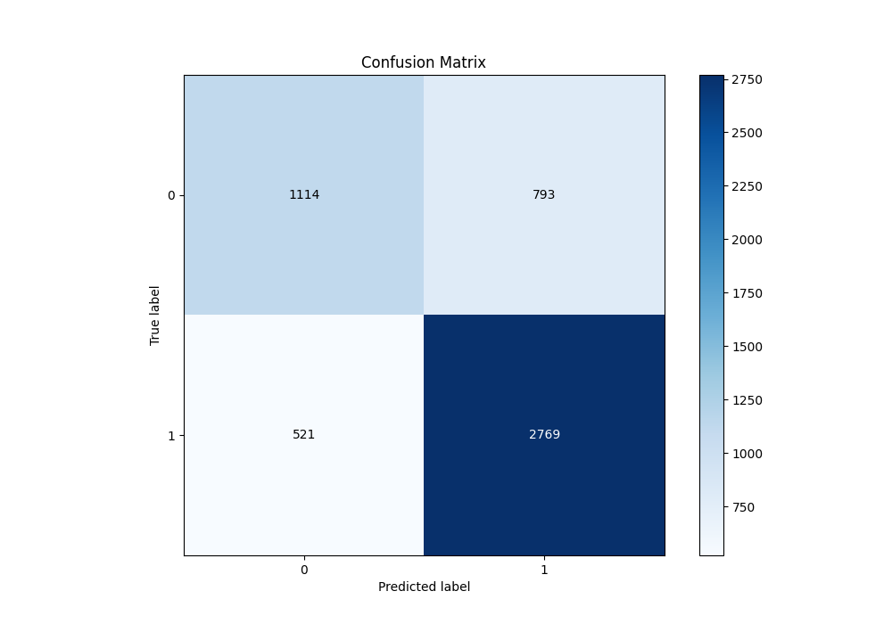
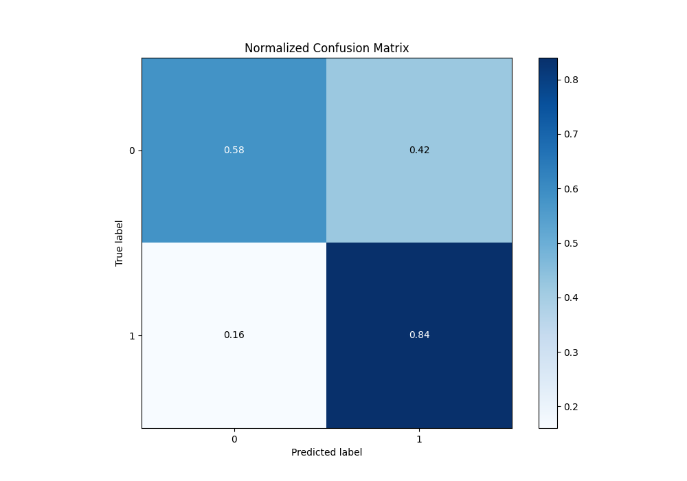
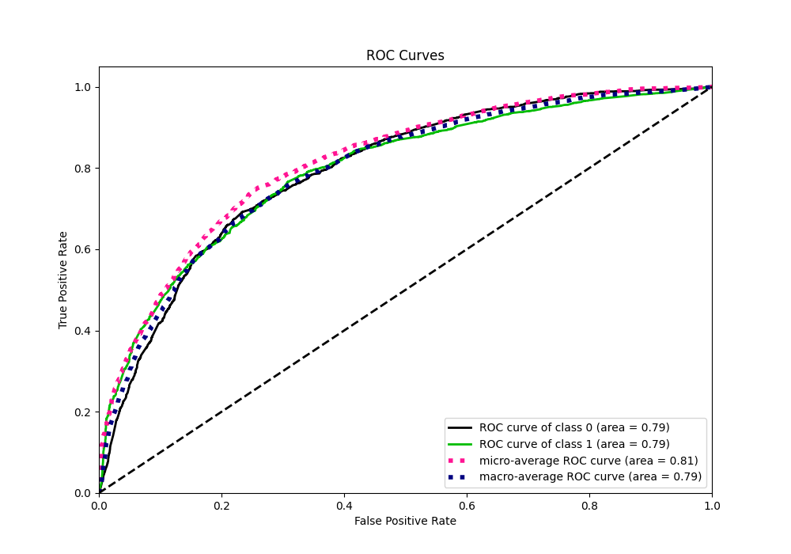
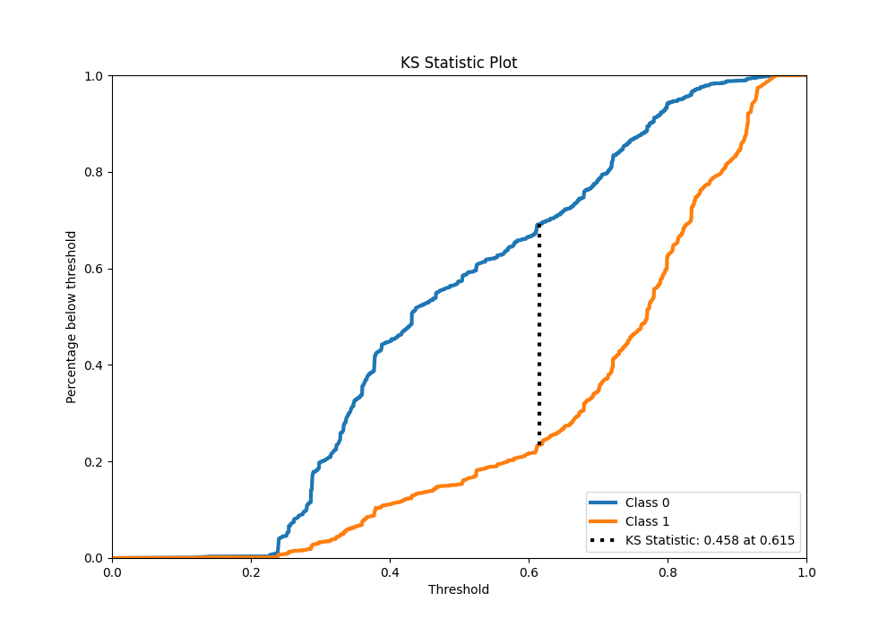
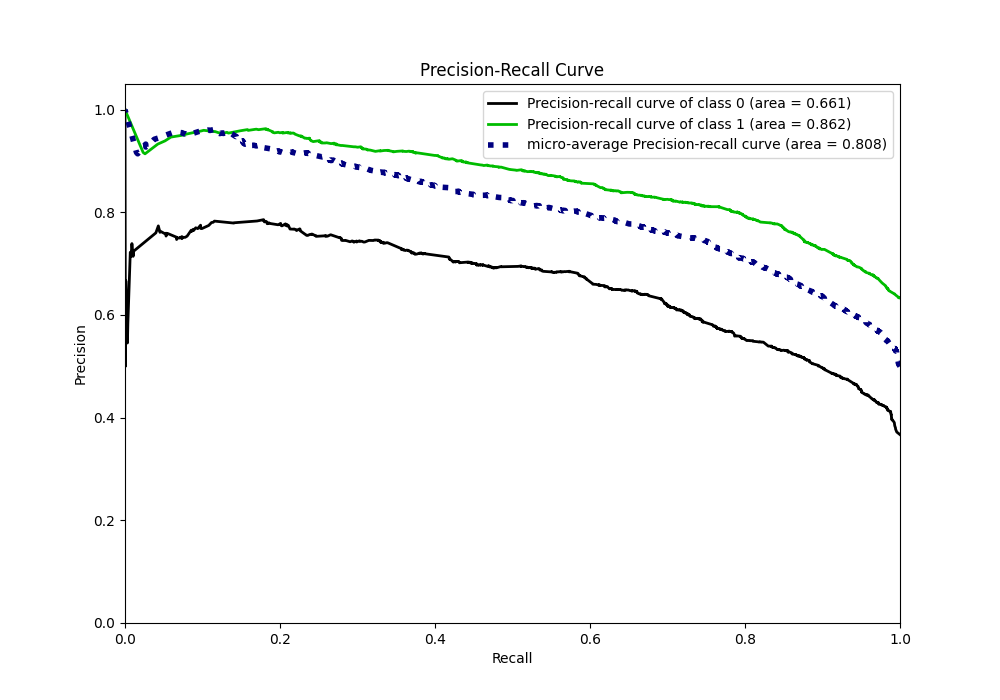
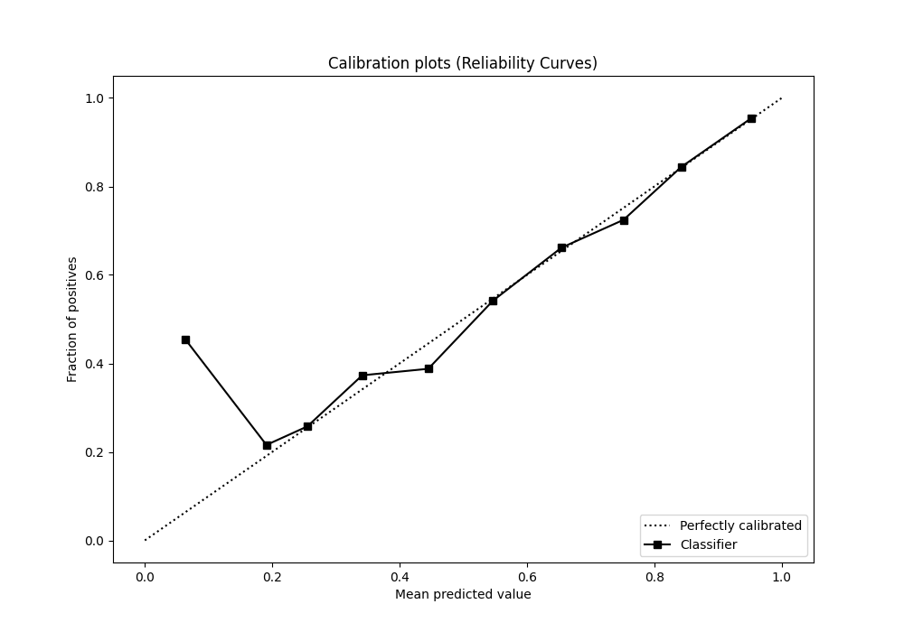
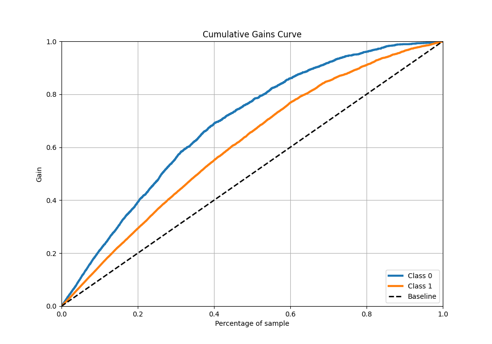
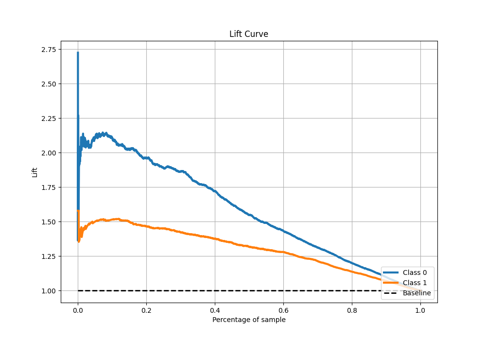

# Summary of 43_RandomForest

[<< Go back](../README.md)

## Random Forest
- **n_jobs**: -1
- **criterion**: gini
- **max_features**: 0.7
- **min_samples_split**: 50
- **max_depth**: 3
- **eval_metric_name**: f1
- **explain_level**: 1

## Validation
 - **validation_type**: kfold
 - **k_folds**: 10
 - **shuffle**: True
 - **stratify**: True
 - **random_seed**: 12

## Optimized metric
f1

## Training time

10.6 seconds

## Metric details
|           |    score |   threshold |
|:----------|---------:|------------:|
| logloss   | 0.527163 | nan         |
| auc       | 0.794263 | nan         |
| f1        | 0.808344 |   0.497055  |
| accuracy  | 0.747162 |   0.504866  |
| precision | 0.961794 |   0.89116   |
| recall    | 1        |   0.0632356 |
| mcc       | 0.449748 |   0.612245  |

## Metric details with threshold from accuracy metric
|           |    score |   threshold |
|:----------|---------:|------------:|
| logloss   | 0.527163 |  nan        |
| auc       | 0.794263 |  nan        |
| f1        | 0.808231 |    0.504866 |
| accuracy  | 0.747162 |    0.504866 |
| precision | 0.777372 |    0.504866 |
| recall    | 0.841641 |    0.504866 |
| mcc       | 0.441955 |    0.504866 |

## Confusion matrix (at threshold=0.504866)
|              |   Predicted as 0 |   Predicted as 1 |
|:-------------|-----------------:|-----------------:|
| Labeled as 0 |             1114 |              793 |
| Labeled as 1 |              521 |             2769 |

## Learning curves

## Permutation-based Importance

## Confusion Matrix

## Normalized Confusion Matrix

## ROC Curve

## Kolmogorov-Smirnov Statistic

## Precision-Recall Curve

## Calibration Curve

## Cumulative Gains Curve

## Lift Curve

[<< Go back](../README.md)
