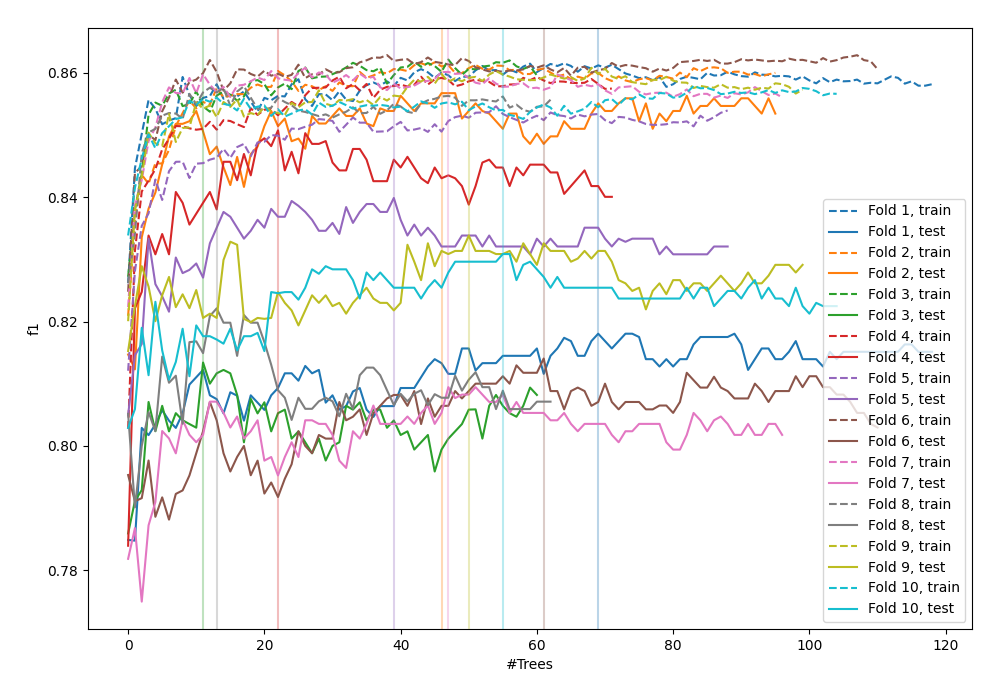
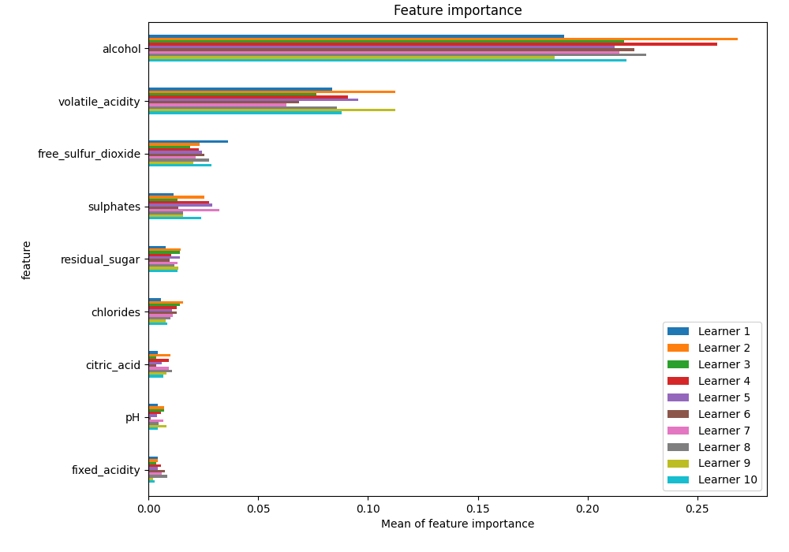
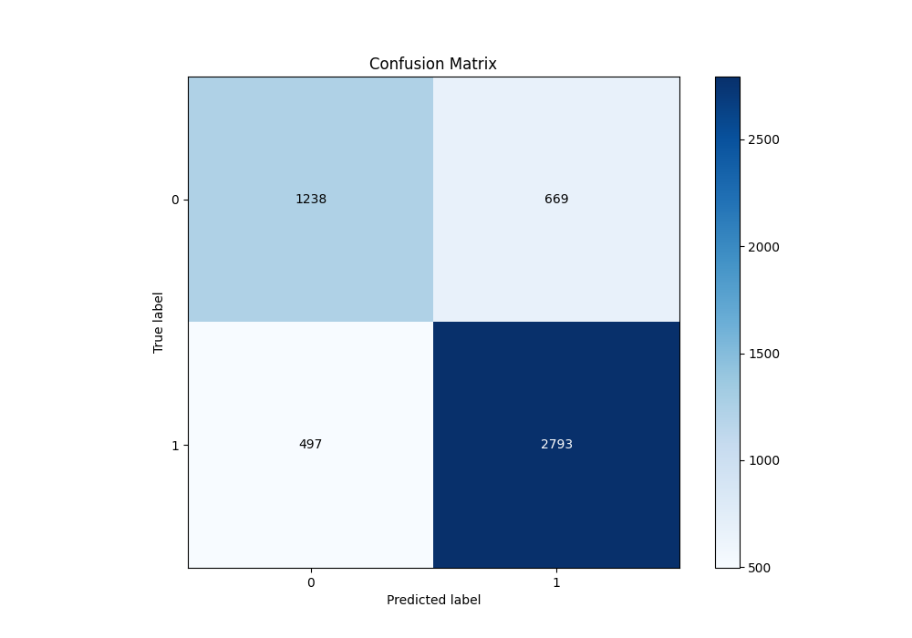
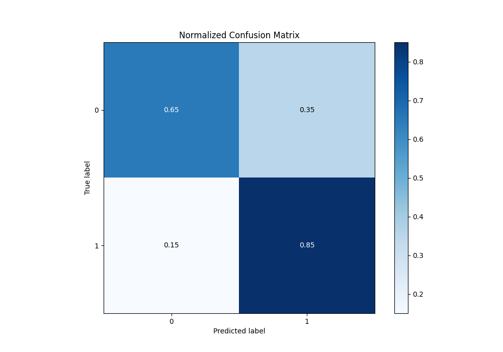
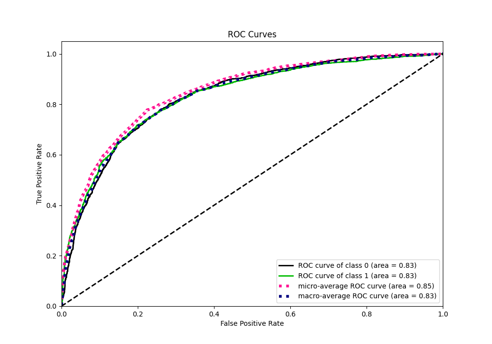
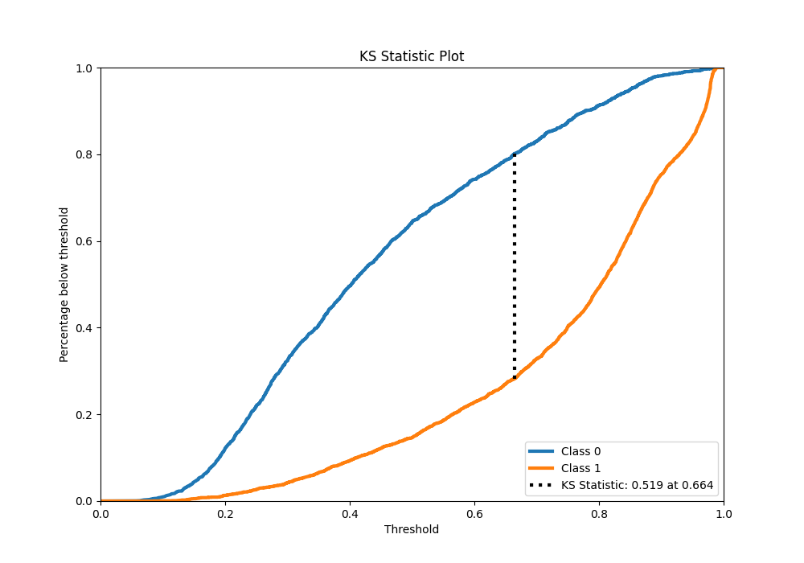
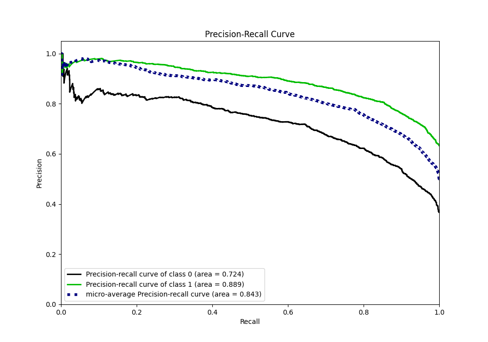
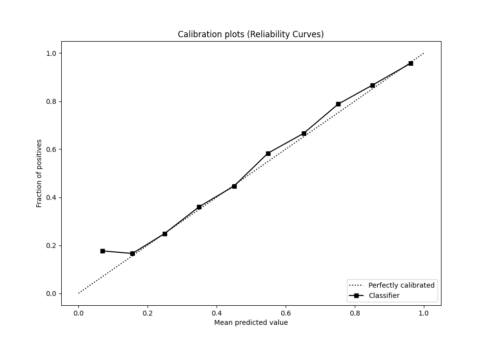
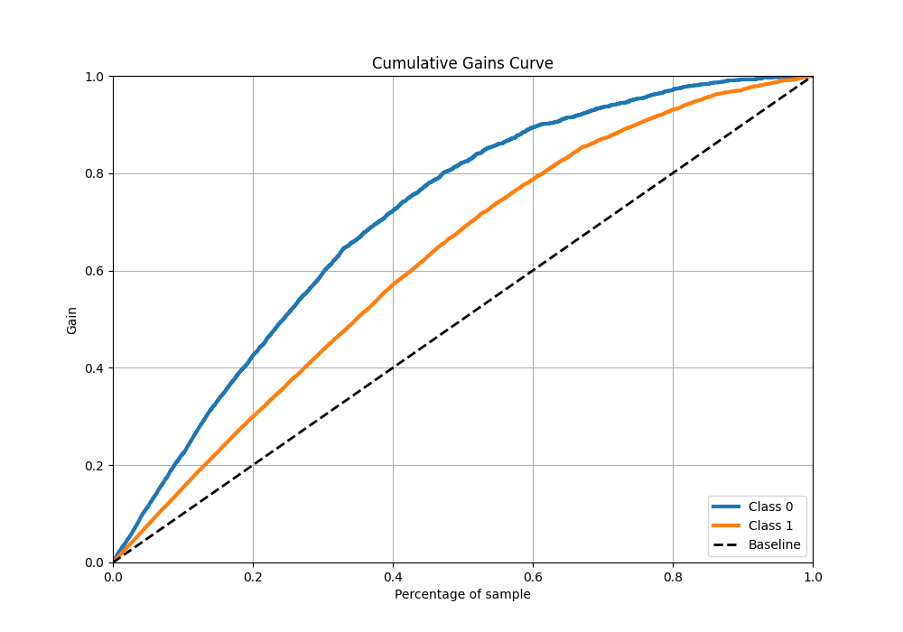
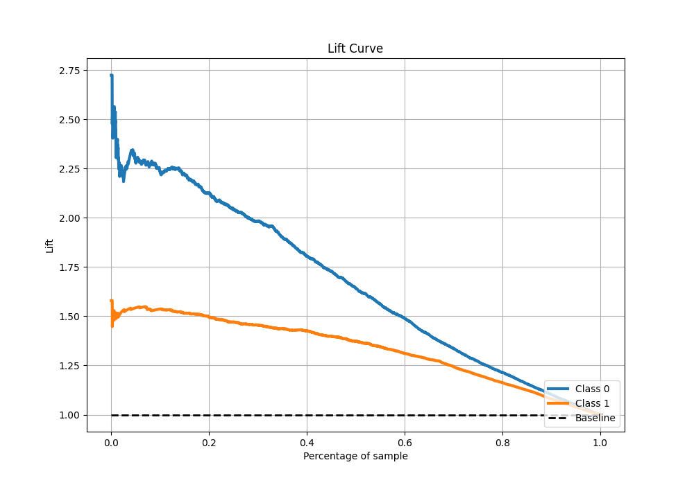

# Summary of 44_RandomForest

[<< Go back](../README.md)

## Random Forest
- **n_jobs**: -1
- **criterion**: gini
- **max_features**: 1.0
- **min_samples_split**: 40
- **max_depth**: 7
- **eval_metric_name**: f1
- **explain_level**: 1

## Validation
 - **validation_type**: kfold
 - **k_folds**: 10
 - **shuffle**: True
 - **stratify**: True
 - **random_seed**: 12

## Optimized metric
f1

## Training time

13.7 seconds

## Metric details
|           |    score |   threshold |
|:----------|---------:|------------:|
| logloss   | 0.484736 | nan         |
| auc       | 0.831512 | nan         |
| f1        | 0.827806 |   0.468837  |
| accuracy  | 0.77564  |   0.50606   |
| precision | 0.980057 |   0.96795   |
| recall    | 1        |   0.0518578 |
| mcc       | 0.509093 |   0.50606   |

## Metric details with threshold from accuracy metric
|           |    score |   threshold |
|:----------|---------:|------------:|
| logloss   | 0.484736 |   nan       |
| auc       | 0.831512 |   nan       |
| f1        | 0.82731  |     0.50606 |
| accuracy  | 0.77564  |     0.50606 |
| precision | 0.806759 |     0.50606 |
| recall    | 0.848936 |     0.50606 |
| mcc       | 0.509093 |     0.50606 |

## Confusion matrix (at threshold=0.50606)
|              |   Predicted as 0 |   Predicted as 1 |
|:-------------|-----------------:|-----------------:|
| Labeled as 0 |             1238 |              669 |
| Labeled as 1 |              497 |             2793 |

## Learning curves

## Permutation-based Importance

## Confusion Matrix

## Normalized Confusion Matrix

## ROC Curve

## Kolmogorov-Smirnov Statistic

## Precision-Recall Curve

## Calibration Curve

## Cumulative Gains Curve

## Lift Curve

[<< Go back](../README.md)
