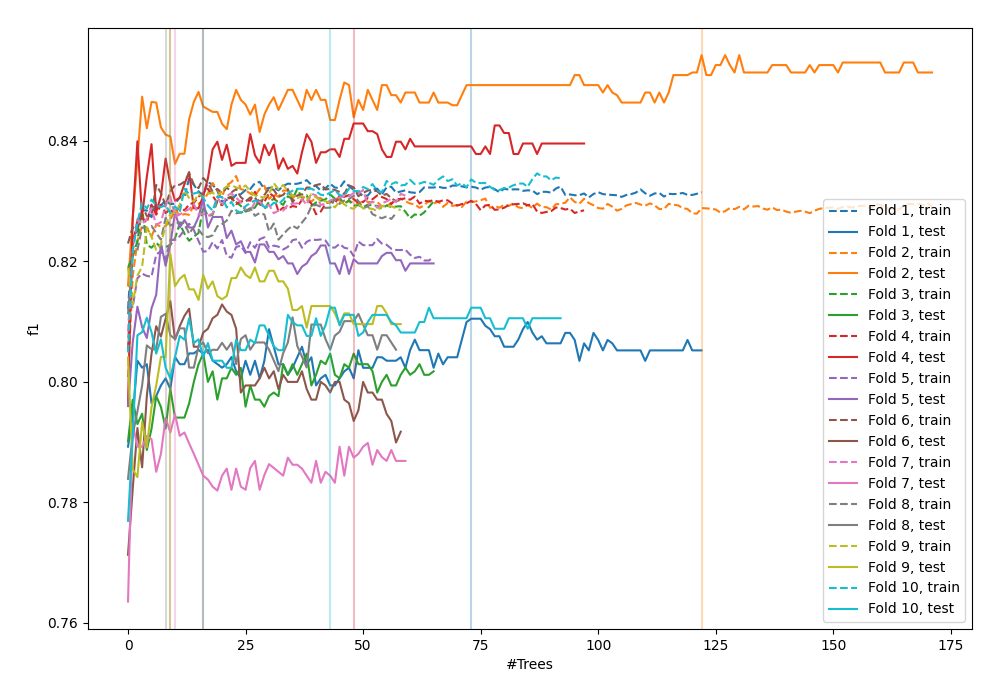
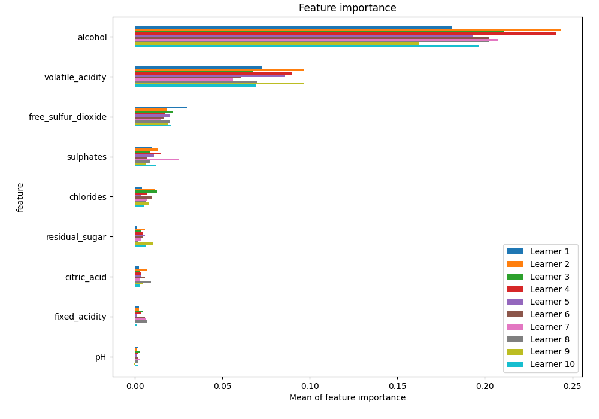
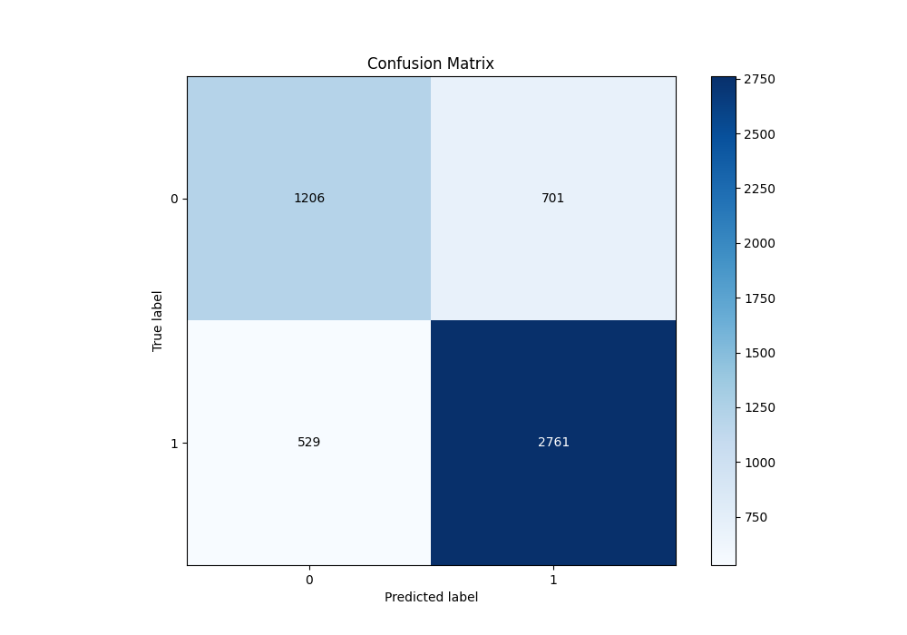
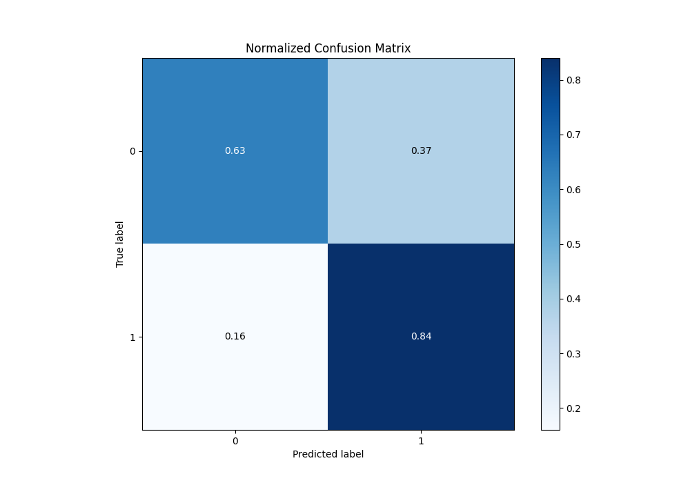
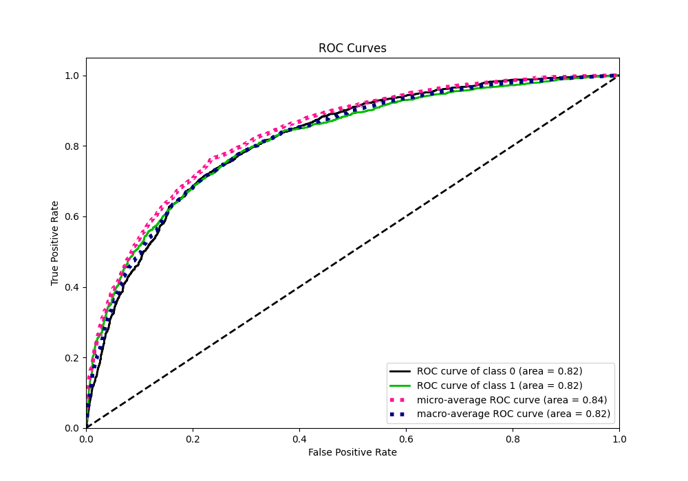
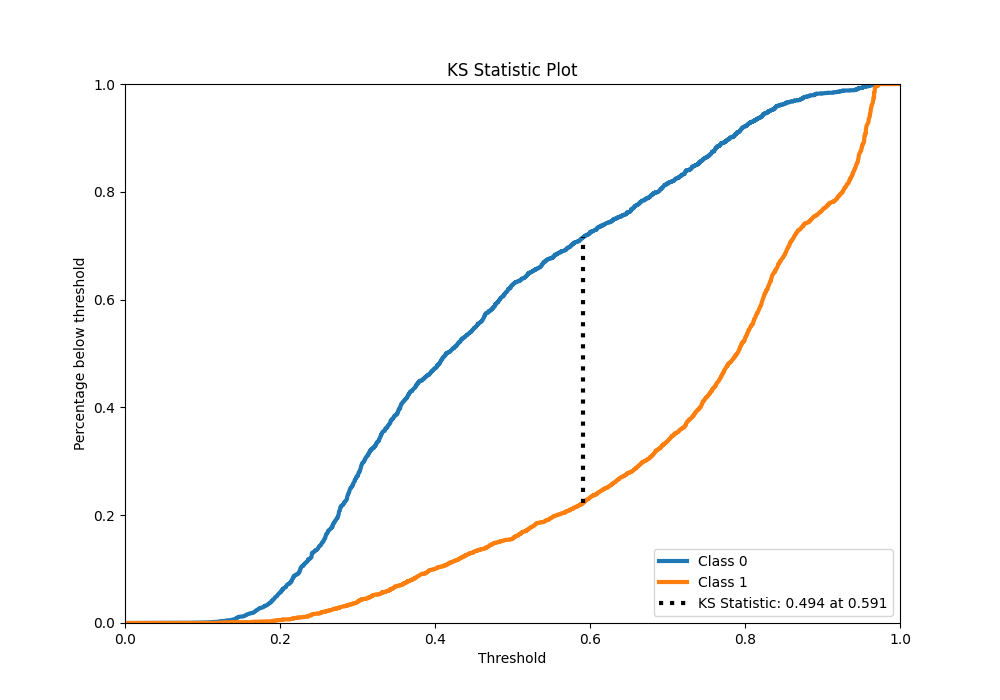
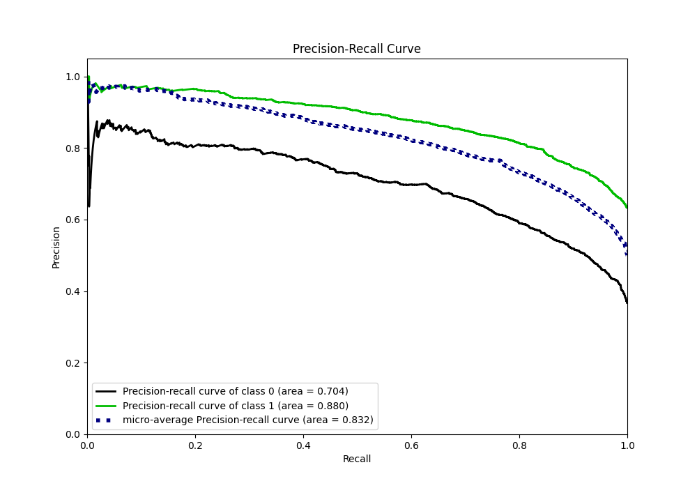
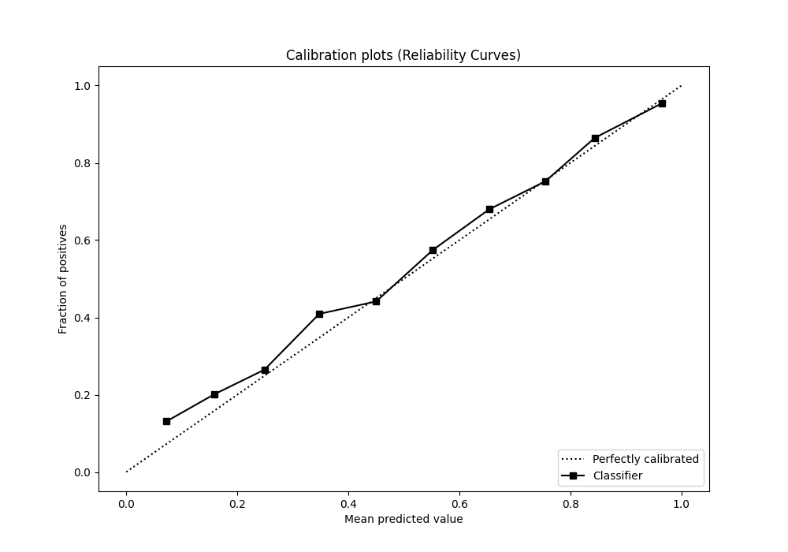
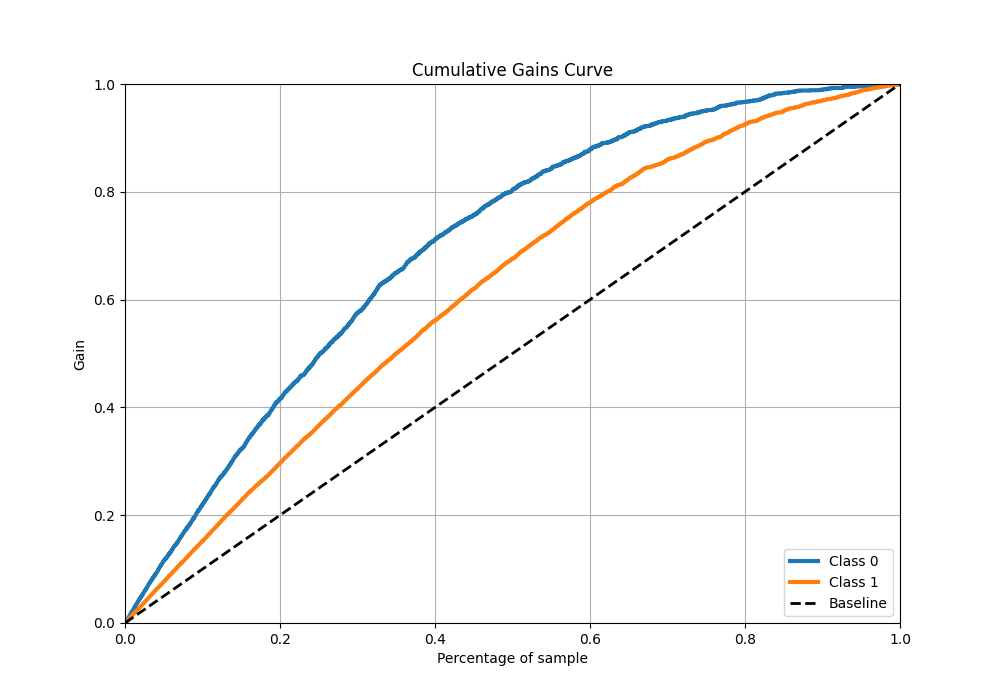
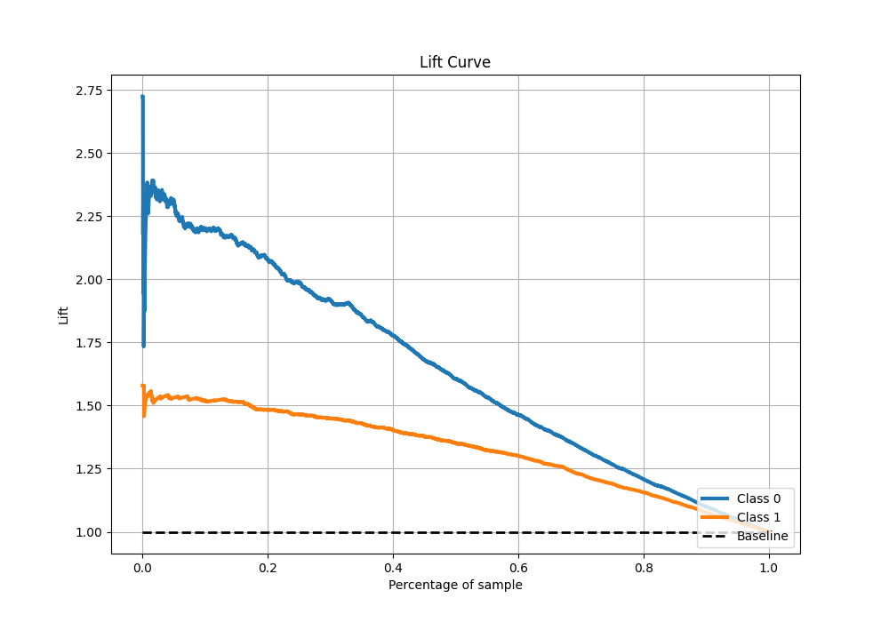

# Summary of 45_RandomForest

[<< Go back](../README.md)

## Random Forest
- **n_jobs**: -1
- **criterion**: gini
- **max_features**: 0.9
- **min_samples_split**: 40
- **max_depth**: 5
- **eval_metric_name**: f1
- **explain_level**: 1

## Validation
 - **validation_type**: kfold
 - **k_folds**: 10
 - **shuffle**: True
 - **stratify**: True
 - **random_seed**: 12

## Optimized metric
f1

## Training time

12.8 seconds

## Metric details
|           |    score |   threshold |
|:----------|---------:|------------:|
| logloss   | 0.500851 | nan         |
| auc       | 0.817727 | nan         |
| f1        | 0.817874 |   0.493893  |
| accuracy  | 0.763325 |   0.503992  |
| precision | 0.973545 |   0.961064  |
| recall    | 1        |   0.0769498 |
| mcc       | 0.484837 |   0.578545  |

## Metric details with threshold from accuracy metric
|           |    score |   threshold |
|:----------|---------:|------------:|
| logloss   | 0.500851 |  nan        |
| auc       | 0.817727 |  nan        |
| f1        | 0.817832 |    0.503992 |
| accuracy  | 0.763325 |    0.503992 |
| precision | 0.797516 |    0.503992 |
| recall    | 0.83921  |    0.503992 |
| mcc       | 0.482002 |    0.503992 |

## Confusion matrix (at threshold=0.503992)
|              |   Predicted as 0 |   Predicted as 1 |
|:-------------|-----------------:|-----------------:|
| Labeled as 0 |             1206 |              701 |
| Labeled as 1 |              529 |             2761 |

## Learning curves

## Permutation-based Importance

## Confusion Matrix

## Normalized Confusion Matrix

## ROC Curve

## Kolmogorov-Smirnov Statistic

## Precision-Recall Curve

## Calibration Curve

## Cumulative Gains Curve

## Lift Curve

[<< Go back](../README.md)
