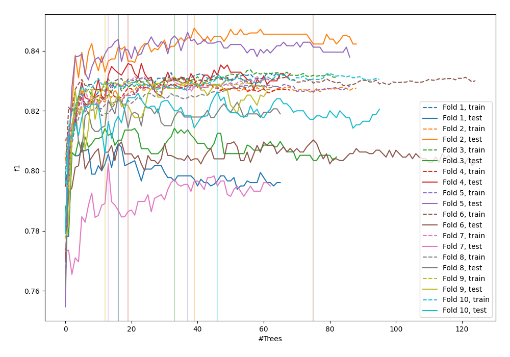
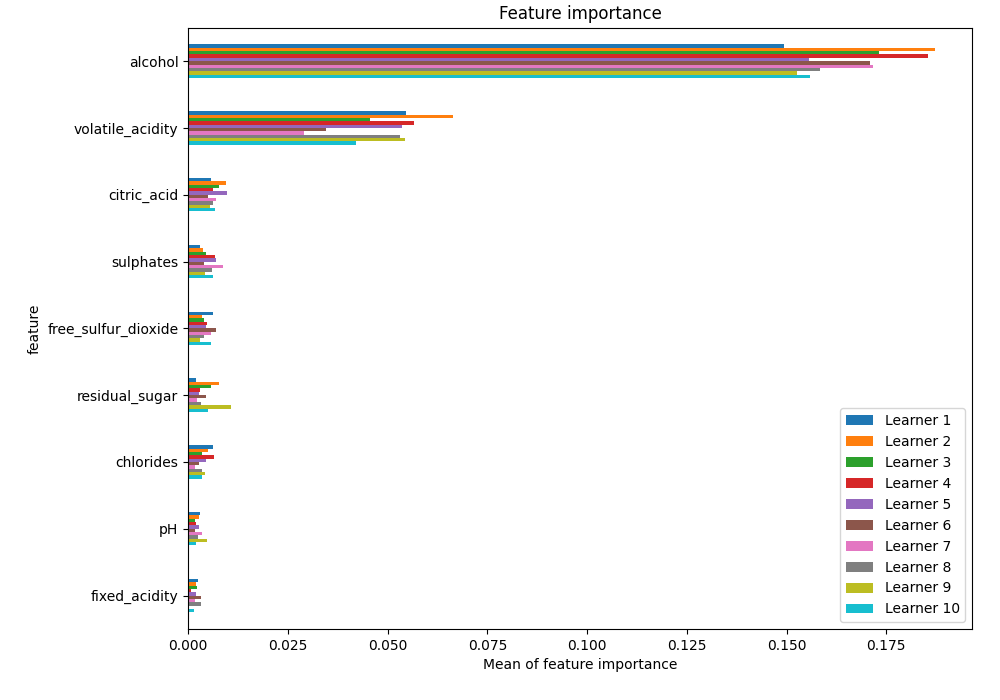
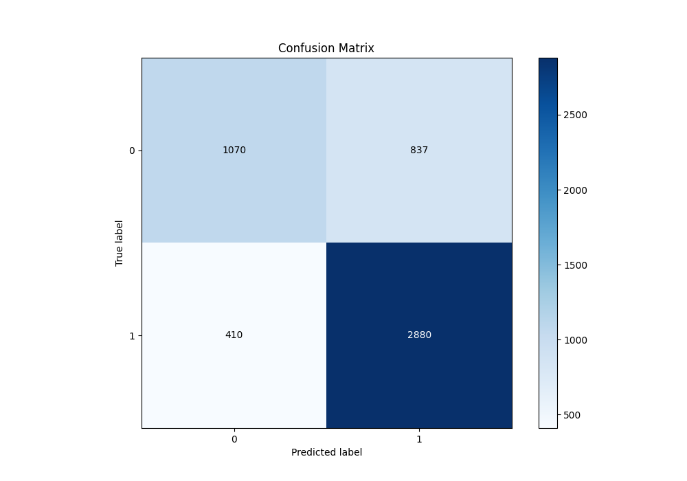
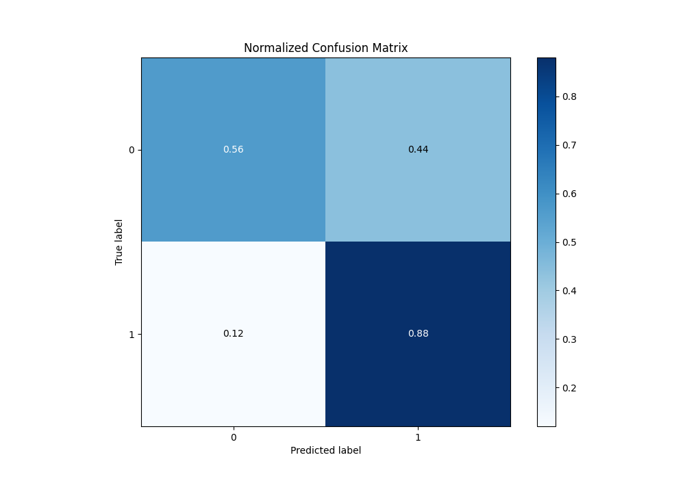
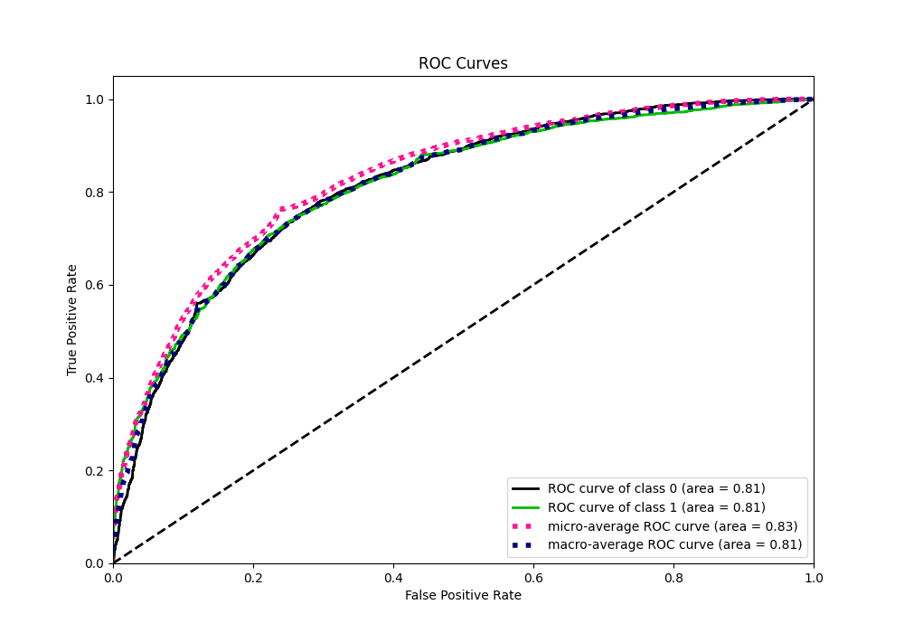
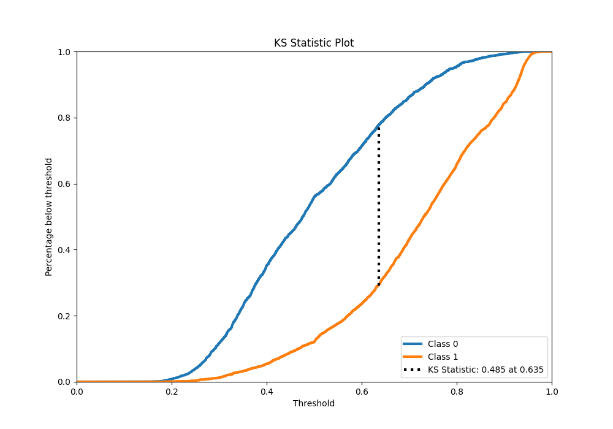
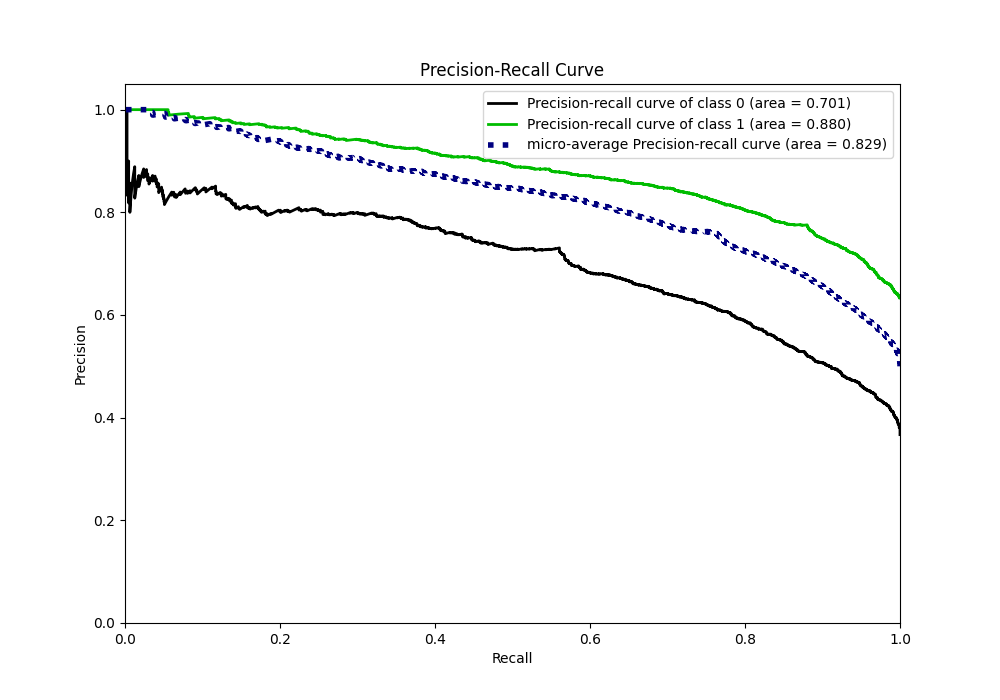
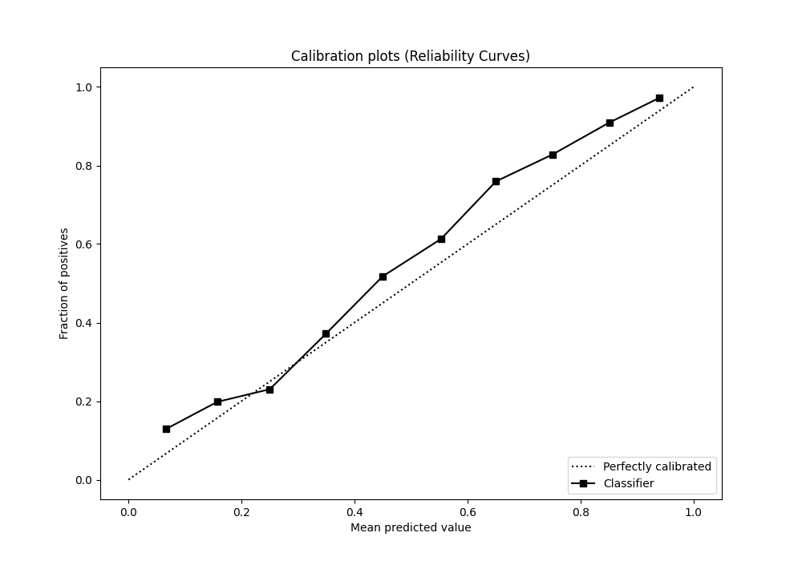
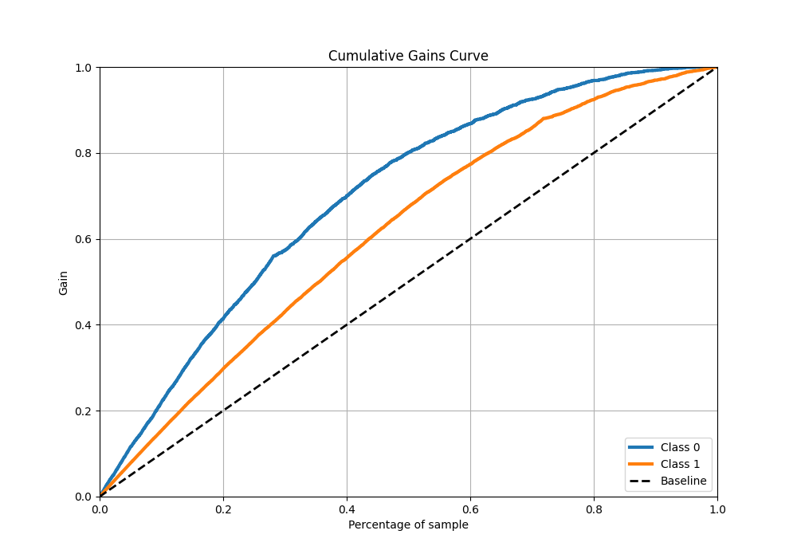
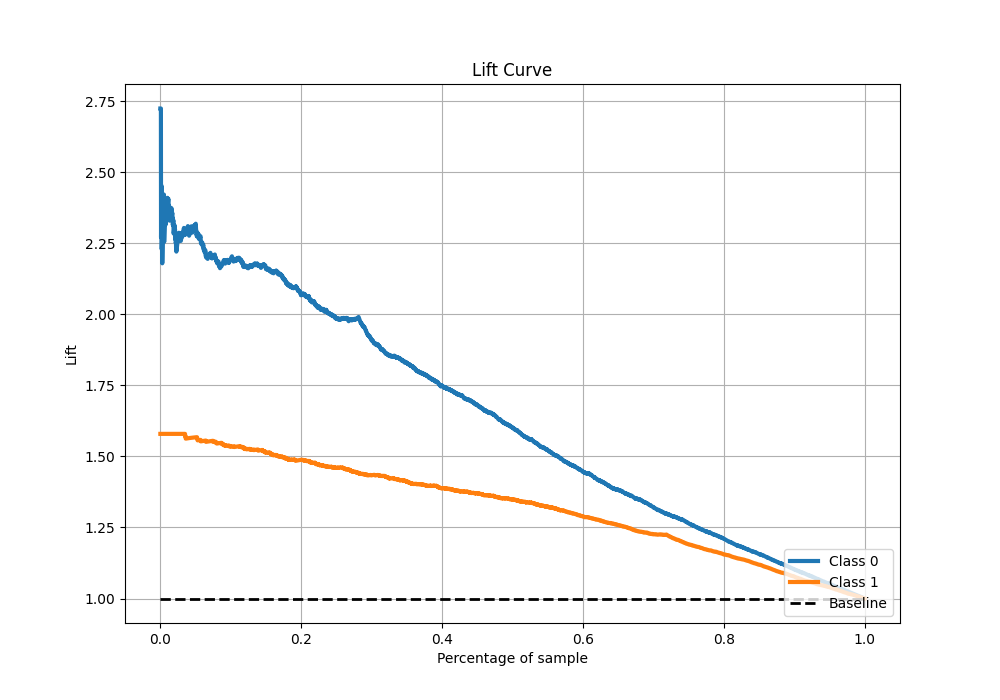

# Summary of 49_ExtraTrees

[<< Go back](../README.md)

## Extra Trees Classifier (Extra Trees)
- **n_jobs**: -1
- **criterion**: gini
- **max_features**: 0.7
- **min_samples_split**: 30
- **max_depth**: 7
- **eval_metric_name**: f1
- **explain_level**: 1

## Validation
 - **validation_type**: kfold
 - **k_folds**: 10
 - **shuffle**: True
 - **stratify**: True
 - **random_seed**: 12

## Optimized metric
f1

## Training time

9.6 seconds

## Metric details
|           |    score |   threshold |
|:----------|---------:|------------:|
| logloss   | 0.514409 |  nan        |
| auc       | 0.813646 |  nan        |
| f1        | 0.822046 |    0.494787 |
| accuracy  | 0.760054 |    0.501684 |
| precision | 1        |    0.940907 |
| recall    | 1        |    0.14078  |
| mcc       | 0.470703 |    0.61958  |

## Metric details with threshold from accuracy metric
|           |    score |   threshold |
|:----------|---------:|------------:|
| logloss   | 0.514409 |  nan        |
| auc       | 0.813646 |  nan        |
| f1        | 0.822035 |    0.501684 |
| accuracy  | 0.760054 |    0.501684 |
| precision | 0.774818 |    0.501684 |
| recall    | 0.87538  |    0.501684 |
| mcc       | 0.466124 |    0.501684 |

## Confusion matrix (at threshold=0.501684)
|              |   Predicted as 0 |   Predicted as 1 |
|:-------------|-----------------:|-----------------:|
| Labeled as 0 |             1070 |              837 |
| Labeled as 1 |              410 |             2880 |

## Learning curves

## Permutation-based Importance

## Confusion Matrix

## Normalized Confusion Matrix

## ROC Curve

## Kolmogorov-Smirnov Statistic

## Precision-Recall Curve

## Calibration Curve

## Cumulative Gains Curve

## Lift Curve

[<< Go back](../README.md)
