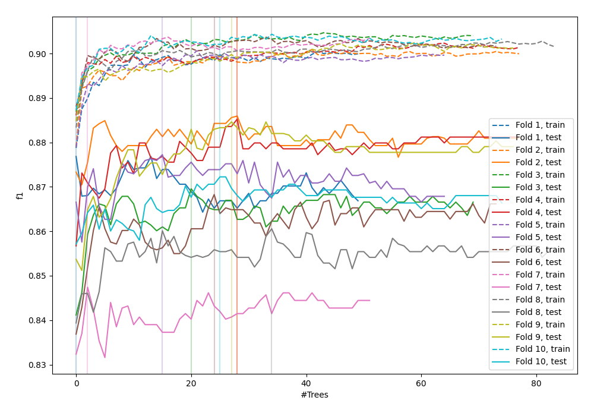
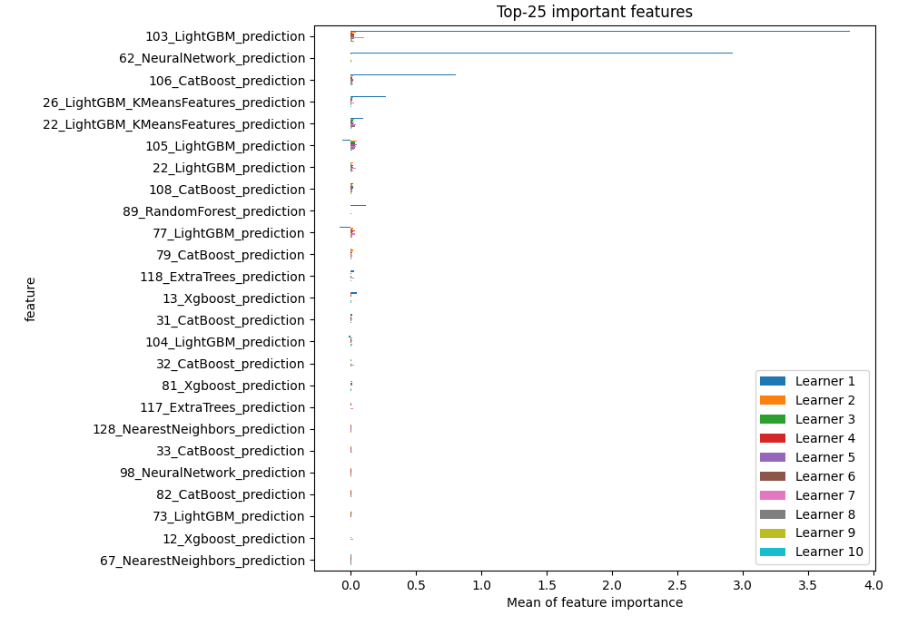
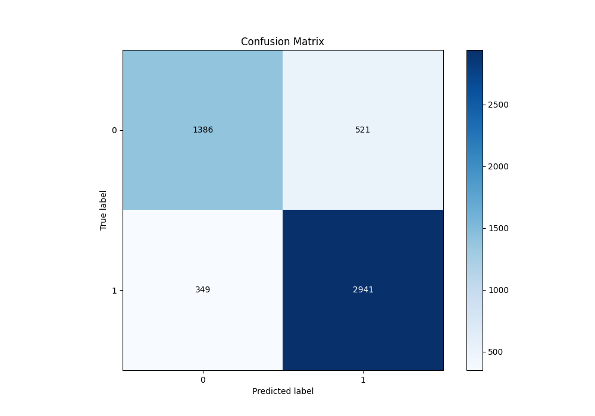
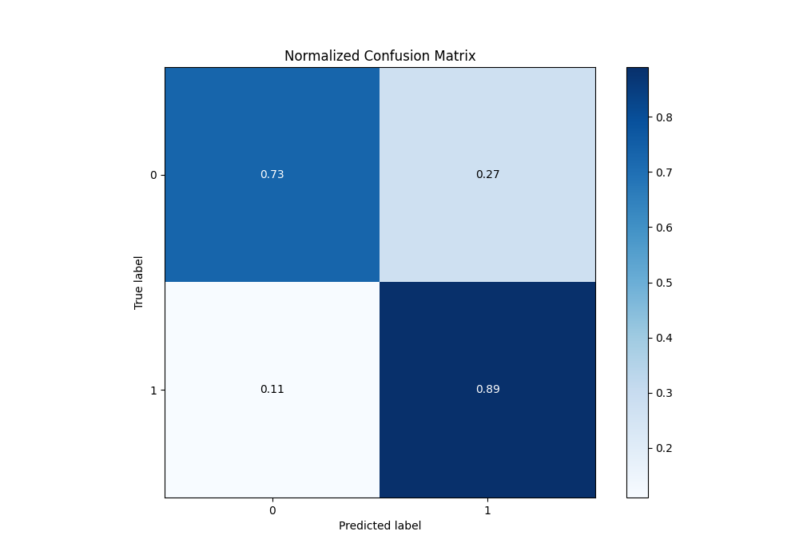
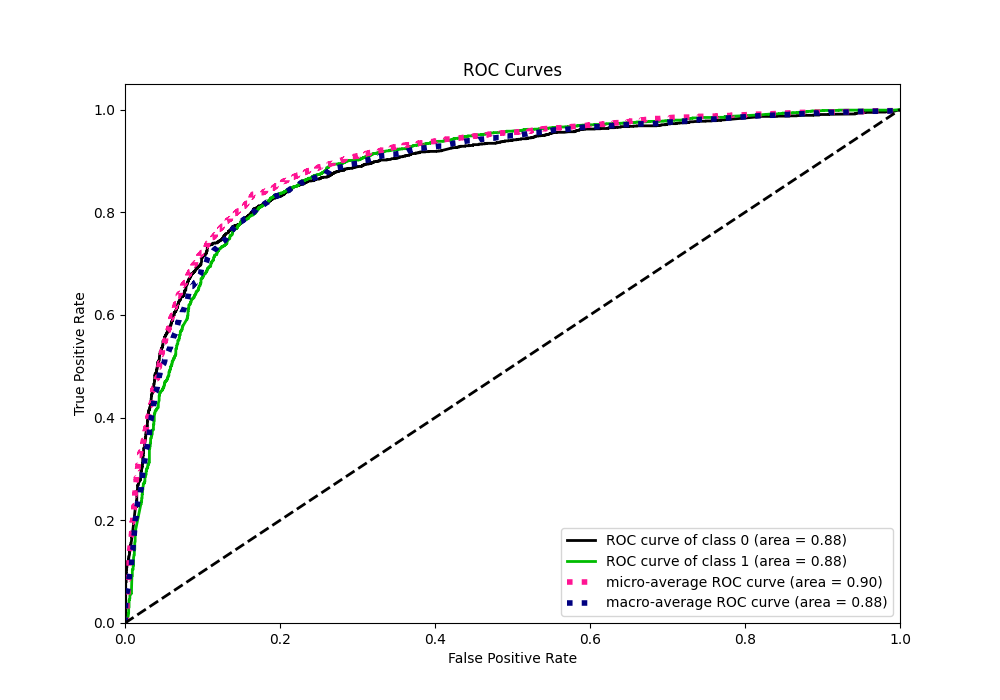
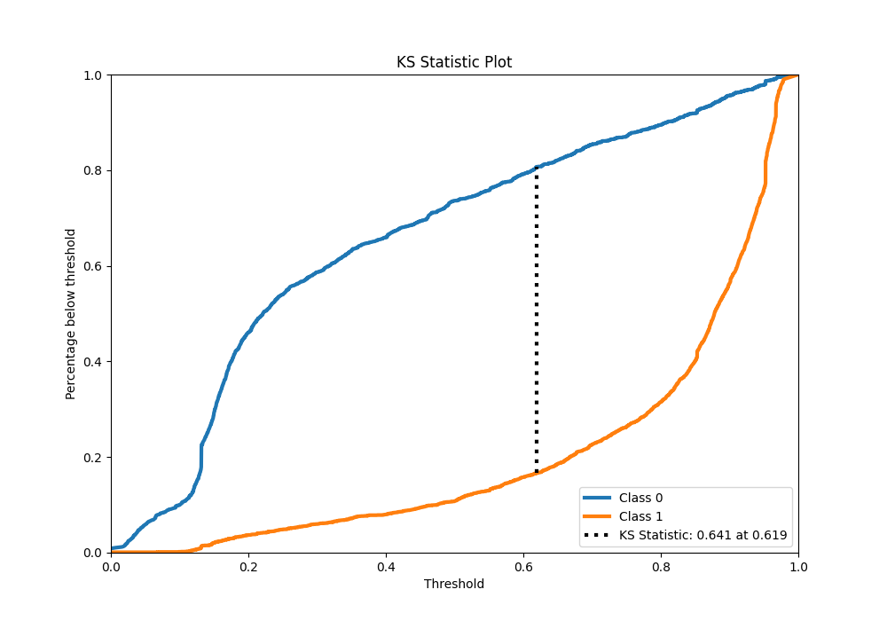
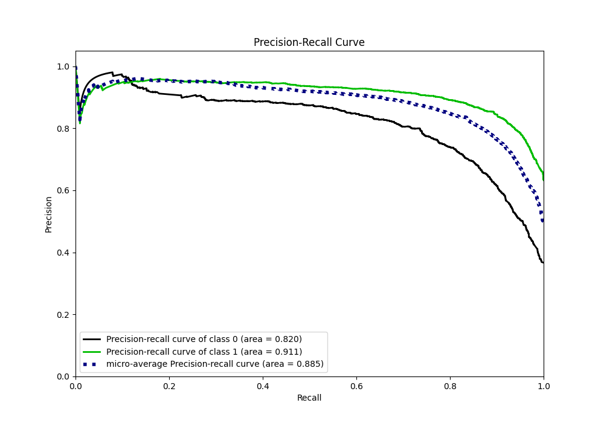
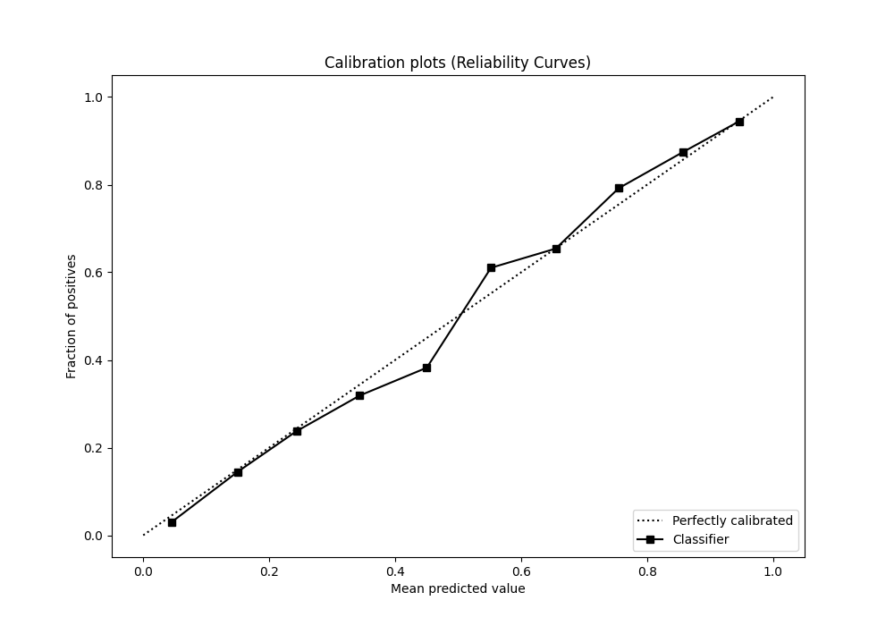
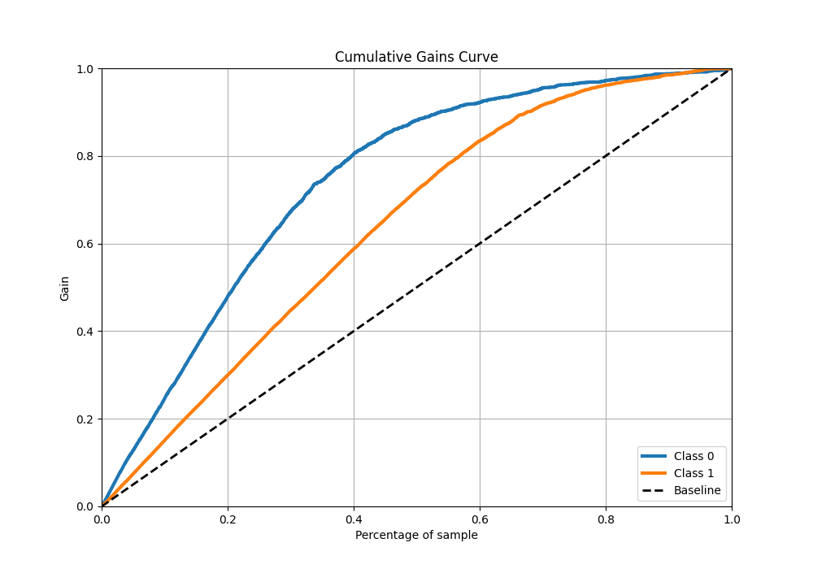
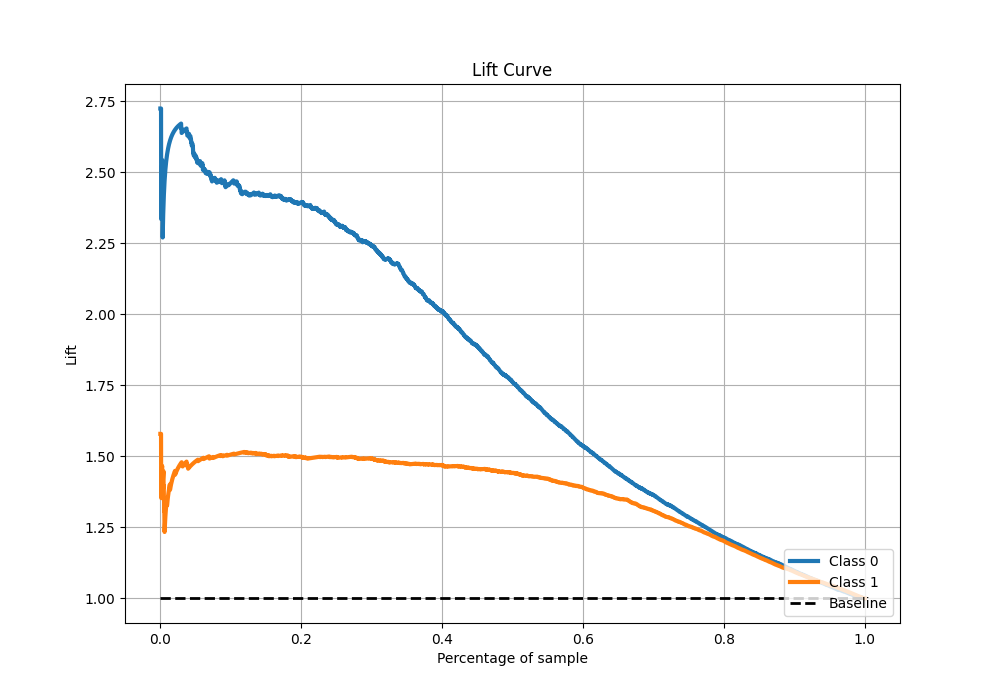

# Summary of 49_ExtraTrees_Stacked

[<< Go back](../README.md)

## Extra Trees Classifier (Extra Trees)
- **n_jobs**: -1
- **criterion**: gini
- **max_features**: 0.7
- **min_samples_split**: 30
- **max_depth**: 7
- **eval_metric_name**: f1
- **explain_level**: 1

## Validation
 - **validation_type**: kfold
 - **k_folds**: 10
 - **shuffle**: True
 - **stratify**: True
 - **random_seed**: 12

## Optimized metric
f1

## Training time

28.6 seconds

## Metric details
|           |    score |   threshold |
|:----------|---------:|------------:|
| logloss   | 0.427381 |  nan        |
| auc       | 0.884566 |  nan        |
| f1        | 0.871149 |    0.490595 |
| accuracy  | 0.832596 |    0.490595 |
| precision | 0.958746 |    0.953232 |
| recall    | 0.999088 |    0        |
| mcc       | 0.635204 |    0.508815 |

## Metric details with threshold from accuracy metric
|           |    score |   threshold |
|:----------|---------:|------------:|
| logloss   | 0.427381 |  nan        |
| auc       | 0.884566 |  nan        |
| f1        | 0.871149 |    0.490595 |
| accuracy  | 0.832596 |    0.490595 |
| precision | 0.849509 |    0.490595 |
| recall    | 0.893921 |    0.490595 |
| mcc       | 0.634386 |    0.490595 |

## Confusion matrix (at threshold=0.490595)
|              |   Predicted as 0 |   Predicted as 1 |
|:-------------|-----------------:|-----------------:|
| Labeled as 0 |             1386 |              521 |
| Labeled as 1 |              349 |             2941 |

## Learning curves

## Permutation-based Importance

## Confusion Matrix

## Normalized Confusion Matrix

## ROC Curve

## Kolmogorov-Smirnov Statistic

## Precision-Recall Curve

## Calibration Curve

## Cumulative Gains Curve

## Lift Curve

[<< Go back](../README.md)
