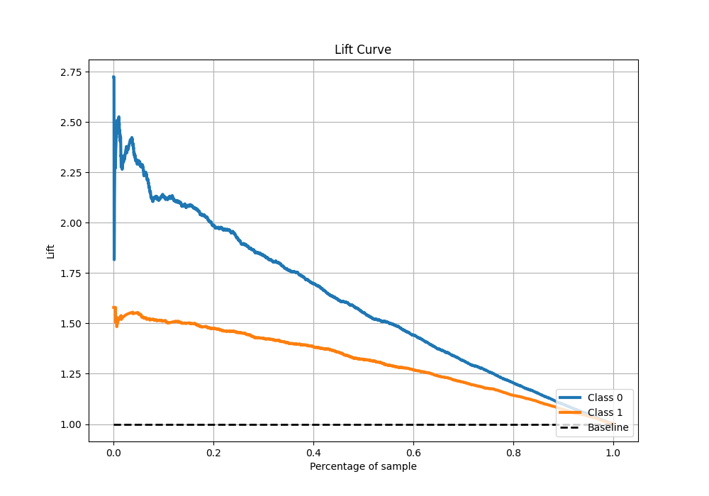

# Summary of 4_Linear

[<< Go back](../README.md)

## Logistic Regression (Linear)
- **n_jobs**: -1
- **explain_level**: 1

## Validation
 - **validation_type**: kfold
 - **k_folds**: 10
 - **shuffle**: True
 - **stratify**: True
 - **random_seed**: 12

## Optimized metric
f1

## Training time

4.5 seconds

## Metric details
|           |    score |   threshold |
|:----------|---------:|------------:|
| logloss   | 0.521    | nan         |
| auc       | 0.797325 | nan         |
| f1        | 0.810338 |   0.427109  |
| accuracy  | 0.739273 |   0.51816   |
| precision | 0.984848 |   0.955641  |
| recall    | 1        |   0.0142486 |
| mcc       | 0.436041 |   0.591166  |

## Metric details with threshold from accuracy metric
|           |    score |   threshold |
|:----------|---------:|------------:|
| logloss   | 0.521    |   nan       |
| auc       | 0.797325 |   nan       |
| f1        | 0.800823 |     0.51816 |
| accuracy  | 0.739273 |     0.51816 |
| precision | 0.775406 |     0.51816 |
| recall    | 0.827964 |     0.51816 |
| mcc       | 0.426579 |     0.51816 |

## Confusion matrix (at threshold=0.51816)
|              |   Predicted as 0 |   Predicted as 1 |
|:-------------|-----------------:|-----------------:|
| Labeled as 0 |             1118 |              789 |
| Labeled as 1 |              566 |             2724 |

## Learning curves

## Coefficients
| feature             |   Learner_1 |   Learner_2 |   Learner_3 |   Learner_4 |   Learner_5 |   Learner_6 |   Learner_7 |   Learner_8 |   Learner_9 |   Learner_10 |
|:--------------------|------------:|------------:|------------:|------------:|------------:|------------:|------------:|------------:|------------:|-------------:|
| intercept           |   2.34594   |   2.31959   |   2.37751   |   2.30354   |   2.22938   |   2.39099   |   2.39186   |   2.33249   |   2.31875   |    2.33625   |
| alcohol             |   1.19545   |   1.17403   |   1.1904    |   1.17024   |   1.17749   |   1.18498   |   1.19599   |   1.17172   |   1.1952    |    1.19872   |
| sulphates           |   0.291448  |   0.288321  |   0.28547   |   0.267917  |   0.268656  |   0.314646  |   0.281864  |   0.298304  |   0.300333  |    0.294064  |
| residual_sugar      |   0.296797  |   0.268302  |   0.28073   |   0.270056  |   0.261001  |   0.28376   |   0.289121  |   0.26468   |   0.25447   |    0.282428  |
| pH                  |   0.121763  |   0.0904784 |   0.123865  |   0.101903  |   0.080484  |   0.116623  |   0.113338  |   0.101674  |   0.0797324 |    0.103295  |
| fixed_acidity       |   0.107026  |   0.0980429 |   0.0784922 |   0.0860179 |   0.0846581 |   0.099044  |   0.0635481 |   0.0575726 |   0.0851977 |    0.0597654 |
| free_sulfur_dioxide |   0.0423216 |   0.0452229 |   0.0191675 |   0.0233772 |   0.0380944 |   0.0657183 |   0.0310435 |   0.0165201 |   0.0378672 |    0.0165021 |
| chlorides           |  -0.22564   |  -0.233639  |  -0.210215  |  -0.267892  |  -0.160918  |  -0.339442  |  -0.357379  |  -0.294331  |  -0.20122   |   -0.215364  |
| citric_acid         |  -0.651135  |  -0.691948  |  -0.693087  |  -0.559677  |  -0.538689  |  -0.737502  |  -0.578437  |  -0.623173  |  -0.624325  |   -0.571116  |
| volatile_acidity    |  -4.09188   |  -3.99646   |  -4.16869   |  -4.08964   |  -3.88      |  -4.13686   |  -4.29162   |  -4.10901   |  -4.05202   |   -4.13249   |

## Permutation-based Importance

## Confusion Matrix

## Normalized Confusion Matrix

## ROC Curve

## Kolmogorov-Smirnov Statistic

## Precision-Recall Curve

## Calibration Curve

## Cumulative Gains Curve

## Lift Curve

[<< Go back](../README.md)
