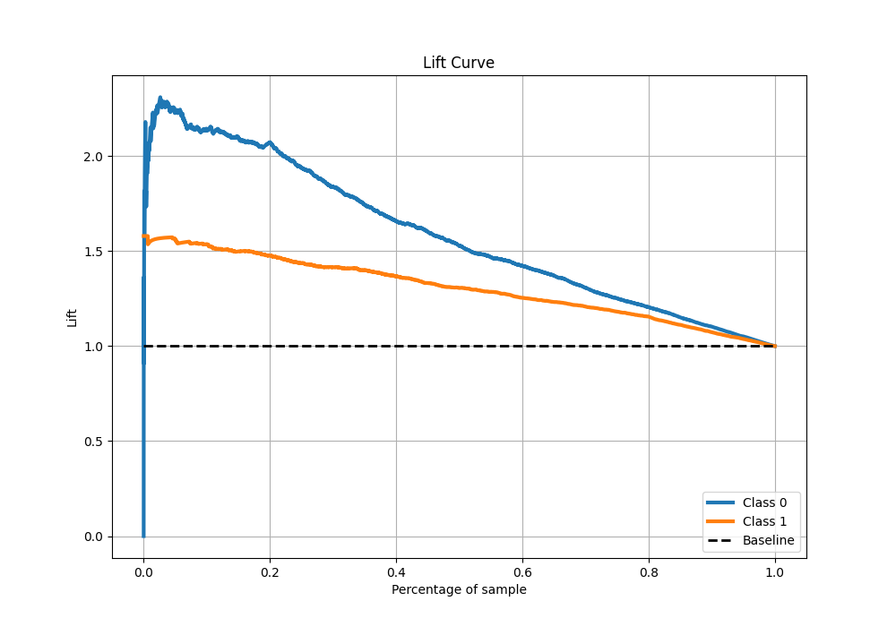

# Summary of 50_ExtraTrees

[<< Go back](../README.md)

## Extra Trees Classifier (Extra Trees)
- **n_jobs**: -1
- **criterion**: gini
- **max_features**: 0.8
- **min_samples_split**: 40
- **max_depth**: 3
- **eval_metric_name**: f1
- **explain_level**: 1

## Validation
 - **validation_type**: kfold
 - **k_folds**: 10
 - **shuffle**: True
 - **stratify**: True
 - **random_seed**: 12

## Optimized metric
f1

## Training time

11.4 seconds

## Metric details
|           |    score |   threshold |
|:----------|---------:|------------:|
| logloss   | 0.553705 |  nan        |
| auc       | 0.791845 |  nan        |
| f1        | 0.815374 |    0.501991 |
| accuracy  | 0.740427 |    0.518842 |
| precision | 0.994949 |    0.878669 |
| recall    | 1        |    0.302953 |
| mcc       | 0.421049 |    0.544104 |

## Metric details with threshold from accuracy metric
|           |    score |   threshold |
|:----------|---------:|------------:|
| logloss   | 0.553705 |  nan        |
| auc       | 0.791845 |  nan        |
| f1        | 0.810241 |    0.518842 |
| accuracy  | 0.740427 |    0.518842 |
| precision | 0.754124 |    0.518842 |
| recall    | 0.87538  |    0.518842 |
| mcc       | 0.418171 |    0.518842 |

## Confusion matrix (at threshold=0.518842)
|              |   Predicted as 0 |   Predicted as 1 |
|:-------------|-----------------:|-----------------:|
| Labeled as 0 |              968 |              939 |
| Labeled as 1 |              410 |             2880 |

## Learning curves

## Permutation-based Importance

## Confusion Matrix

## Normalized Confusion Matrix

## ROC Curve

## Kolmogorov-Smirnov Statistic

## Precision-Recall Curve

## Calibration Curve

## Cumulative Gains Curve

## Lift Curve

[<< Go back](../README.md)
