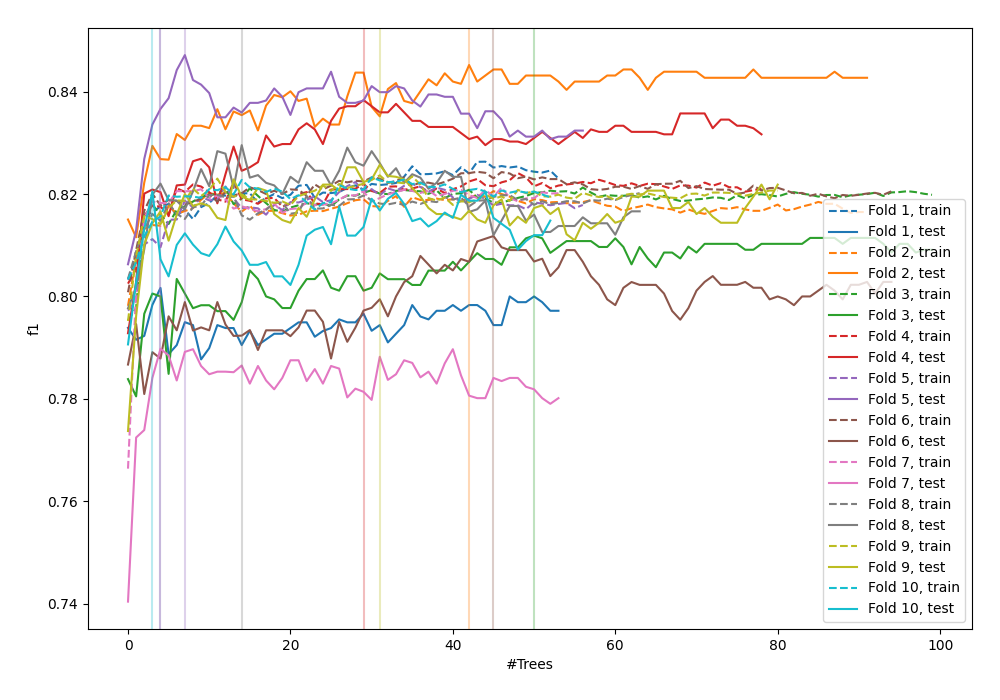
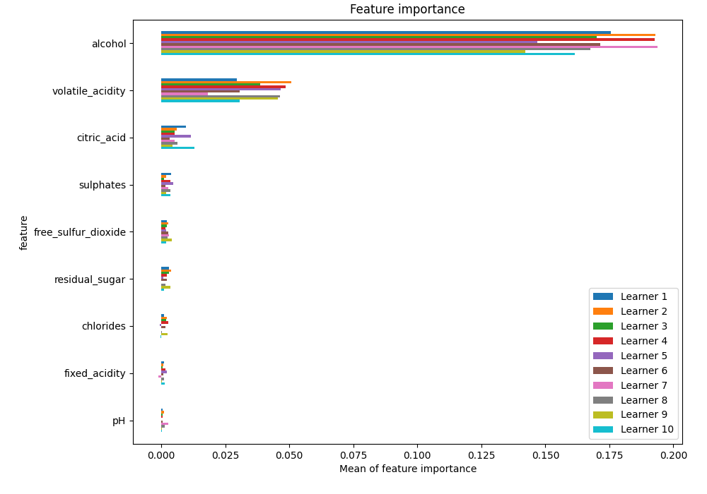
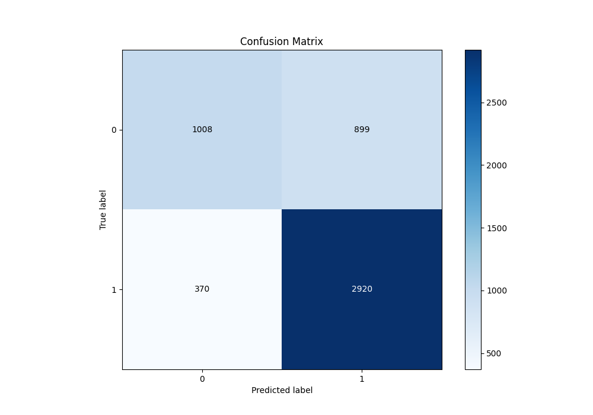
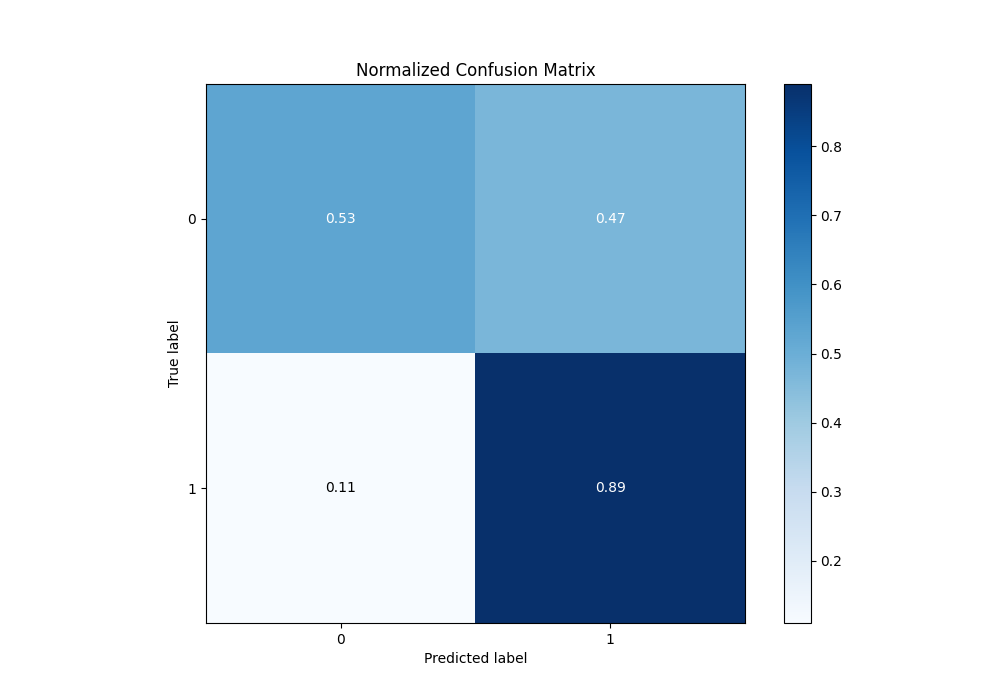
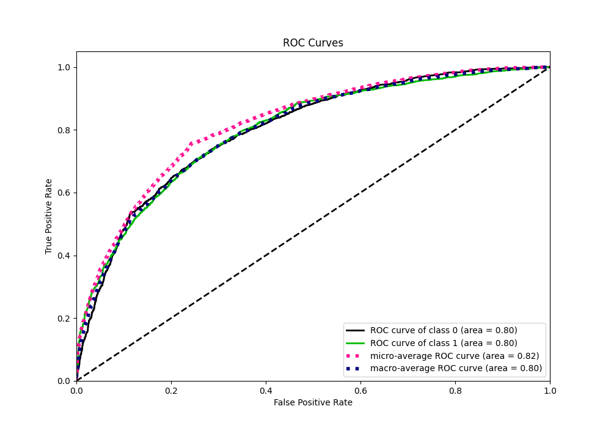
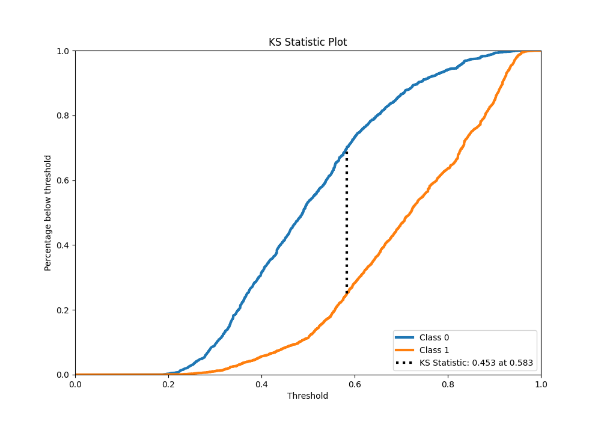
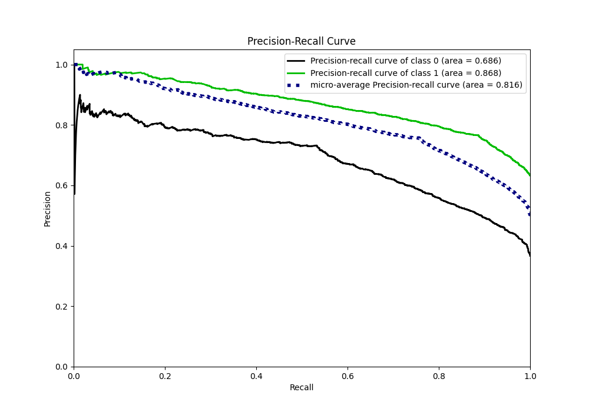
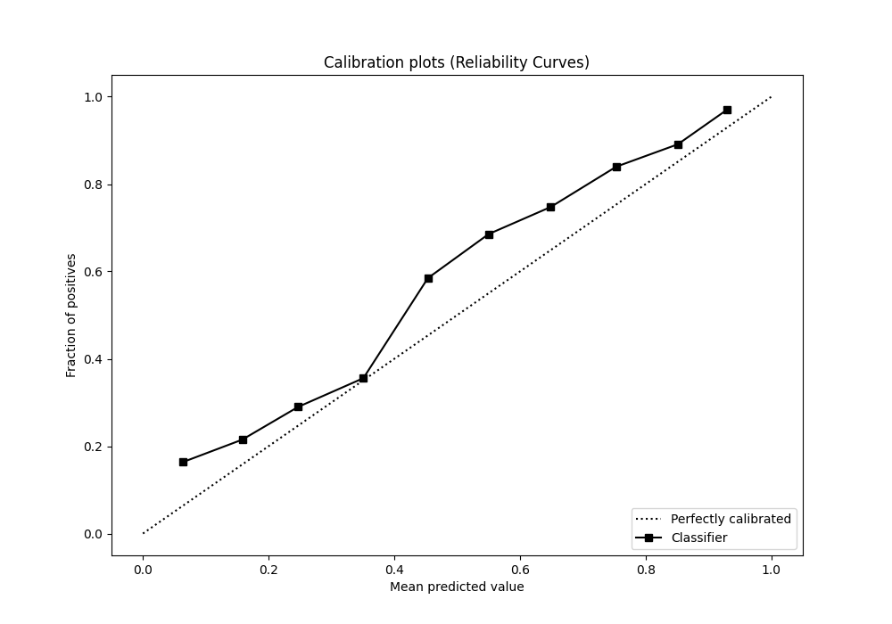
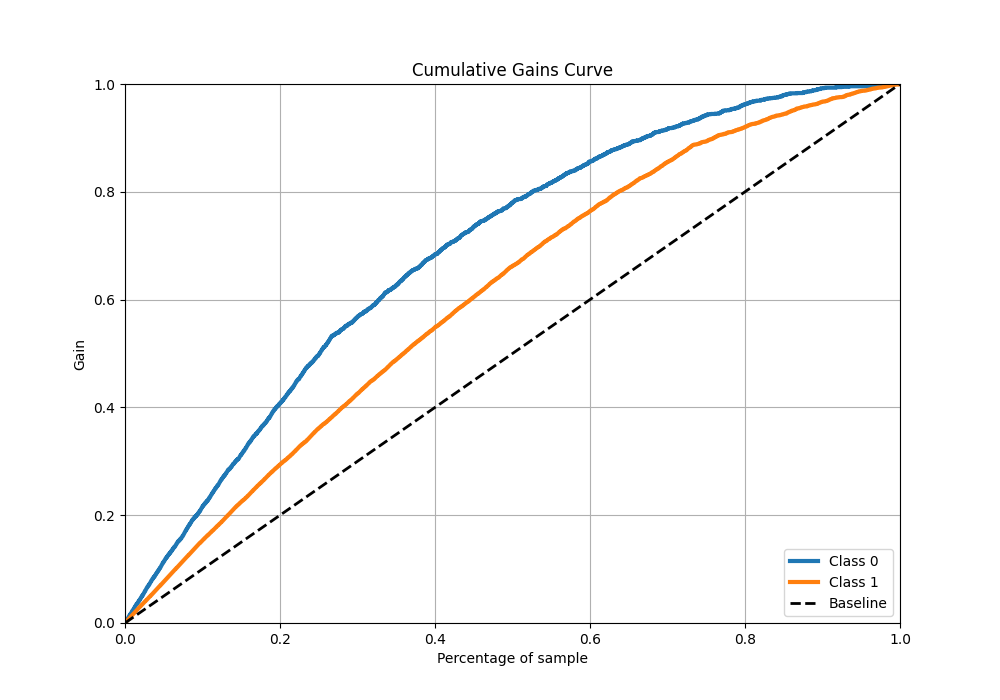
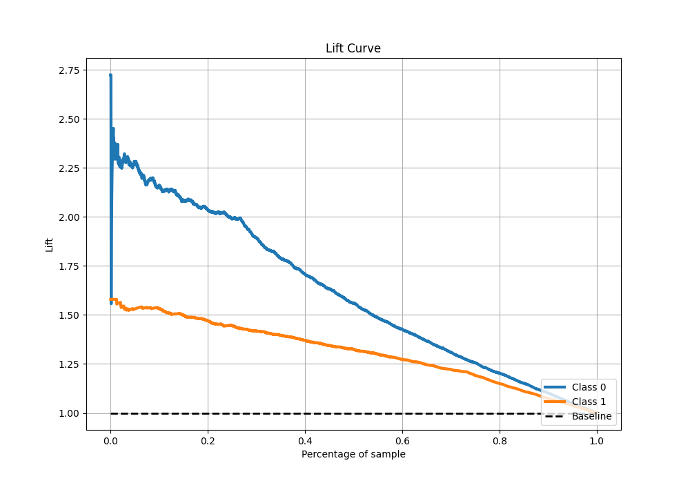

# Summary of 54_ExtraTrees

[<< Go back](../README.md)

## Extra Trees Classifier (Extra Trees)
- **n_jobs**: -1
- **criterion**: gini
- **max_features**: 0.9
- **min_samples_split**: 40
- **max_depth**: 5
- **eval_metric_name**: f1
- **explain_level**: 1

## Validation
 - **validation_type**: kfold
 - **k_folds**: 10
 - **shuffle**: True
 - **stratify**: True
 - **random_seed**: 12

## Optimized metric
f1

## Training time

12.1 seconds

## Metric details
|           |    score |   threshold |
|:----------|---------:|------------:|
| logloss   | 0.526706 |  nan        |
| auc       | 0.800023 |  nan        |
| f1        | 0.821494 |    0.498162 |
| accuracy  | 0.755821 |    0.498162 |
| precision | 0.973843 |    0.902006 |
| recall    | 1        |    0.170567 |
| mcc       | 0.454349 |    0.498162 |

## Metric details with threshold from accuracy metric
|           |    score |   threshold |
|:----------|---------:|------------:|
| logloss   | 0.526706 |  nan        |
| auc       | 0.800023 |  nan        |
| f1        | 0.821494 |    0.498162 |
| accuracy  | 0.755821 |    0.498162 |
| precision | 0.764598 |    0.498162 |
| recall    | 0.887538 |    0.498162 |
| mcc       | 0.454349 |    0.498162 |

## Confusion matrix (at threshold=0.498162)
|              |   Predicted as 0 |   Predicted as 1 |
|:-------------|-----------------:|-----------------:|
| Labeled as 0 |             1008 |              899 |
| Labeled as 1 |              370 |             2920 |

## Learning curves

## Permutation-based Importance

## Confusion Matrix

## Normalized Confusion Matrix

## ROC Curve

## Kolmogorov-Smirnov Statistic

## Precision-Recall Curve

## Calibration Curve

## Cumulative Gains Curve

## Lift Curve

[<< Go back](../README.md)
