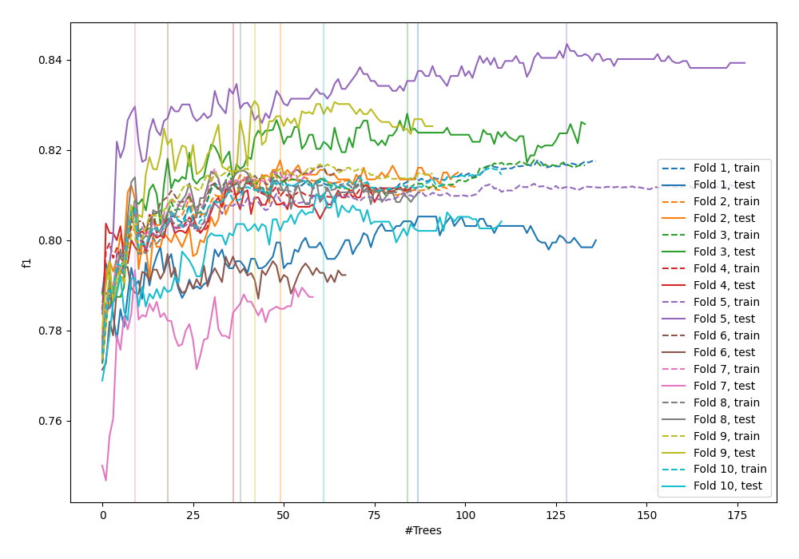
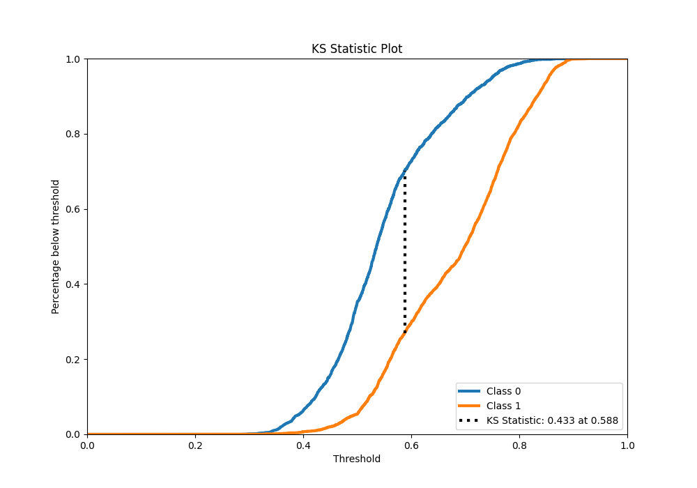

# Summary of 55_ExtraTrees

[<< Go back](../README.md)

## Extra Trees Classifier (Extra Trees)
- **n_jobs**: -1
- **criterion**: gini
- **max_features**: 0.6
- **min_samples_split**: 20
- **max_depth**: 4
- **eval_metric_name**: f1
- **explain_level**: 1

## Validation
 - **validation_type**: kfold
 - **k_folds**: 10
 - **shuffle**: True
 - **stratify**: True
 - **random_seed**: 12

## Optimized metric
f1

## Training time

13.8 seconds

## Metric details
|           |    score |   threshold |
|:----------|---------:|------------:|
| logloss   | 0.557483 |  nan        |
| auc       | 0.79469  |  nan        |
| f1        | 0.813755 |    0.502072 |
| accuracy  | 0.738118 |    0.536761 |
| precision | 0.983936 |    0.844399 |
| recall    | 1        |    0.253366 |
| mcc       | 0.422794 |    0.57054  |

## Metric details with threshold from accuracy metric
|           |    score |   threshold |
|:----------|---------:|------------:|
| logloss   | 0.557483 |  nan        |
| auc       | 0.79469  |  nan        |
| f1        | 0.808553 |    0.536761 |
| accuracy  | 0.738118 |    0.536761 |
| precision | 0.752553 |    0.536761 |
| recall    | 0.873556 |    0.536761 |
| mcc       | 0.412744 |    0.536761 |

## Confusion matrix (at threshold=0.536761)
|              |   Predicted as 0 |   Predicted as 1 |
|:-------------|-----------------:|-----------------:|
| Labeled as 0 |              962 |              945 |
| Labeled as 1 |              416 |             2874 |

## Learning curves

## Permutation-based Importance

## Confusion Matrix

## Normalized Confusion Matrix

## ROC Curve

## Kolmogorov-Smirnov Statistic

## Precision-Recall Curve

## Calibration Curve

## Cumulative Gains Curve

## Lift Curve

[<< Go back](../README.md)
