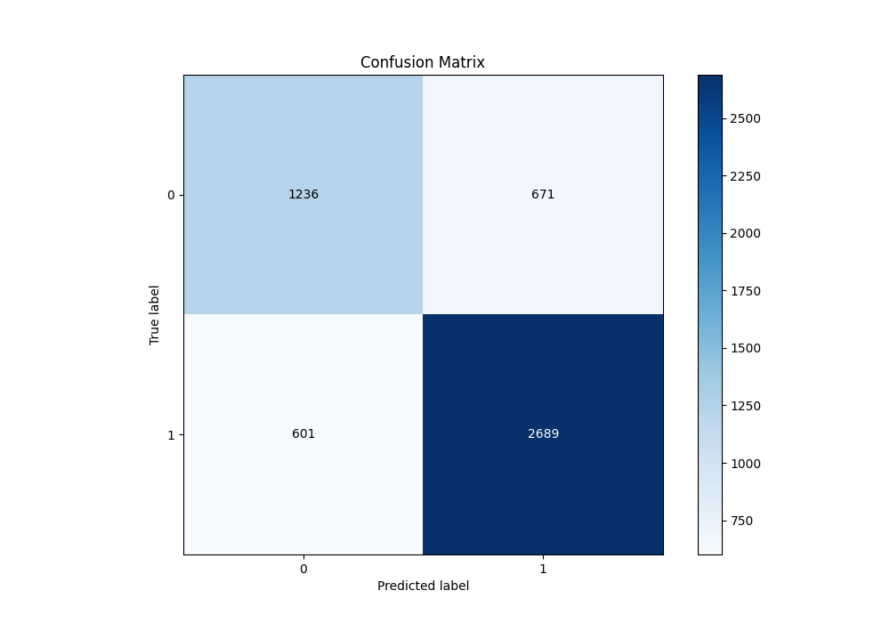

# Summary of 57_NeuralNetwork

[<< Go back](../README.md)

## Neural Network
- **n_jobs**: -1
- **dense_1_size**: 32
- **dense_2_size**: 4
- **learning_rate**: 0.05
- **explain_level**: 1

## Validation
 - **validation_type**: kfold
 - **k_folds**: 10
 - **shuffle**: True
 - **stratify**: True
 - **random_seed**: 12

## Optimized metric
f1

## Training time

8.4 seconds

## Metric details
|           |    score |     threshold |
|:----------|---------:|--------------:|
| logloss   | 0.517235 | nan           |
| auc       | 0.809677 | nan           |
| f1        | 0.815124 |   0.42993     |
| accuracy  | 0.755243 |   0.504066    |
| precision | 0.969697 |   0.99165     |
| recall    | 1        |   0.000595107 |
| mcc       | 0.469283 |   0.504066    |

## Metric details with threshold from accuracy metric
|           |    score |   threshold |
|:----------|---------:|------------:|
| logloss   | 0.517235 |  nan        |
| auc       | 0.809677 |  nan        |
| f1        | 0.808722 |    0.504066 |
| accuracy  | 0.755243 |    0.504066 |
| precision | 0.800298 |    0.504066 |
| recall    | 0.817325 |    0.504066 |
| mcc       | 0.469283 |    0.504066 |

## Confusion matrix (at threshold=0.504066)
|              |   Predicted as 0 |   Predicted as 1 |
|:-------------|-----------------:|-----------------:|
| Labeled as 0 |             1236 |              671 |
| Labeled as 1 |              601 |             2689 |

## Learning curves

## Permutation-based Importance

## Confusion Matrix

## Normalized Confusion Matrix

## ROC Curve

## Kolmogorov-Smirnov Statistic

## Precision-Recall Curve

## Calibration Curve

## Cumulative Gains Curve

## Lift Curve

[<< Go back](../README.md)
