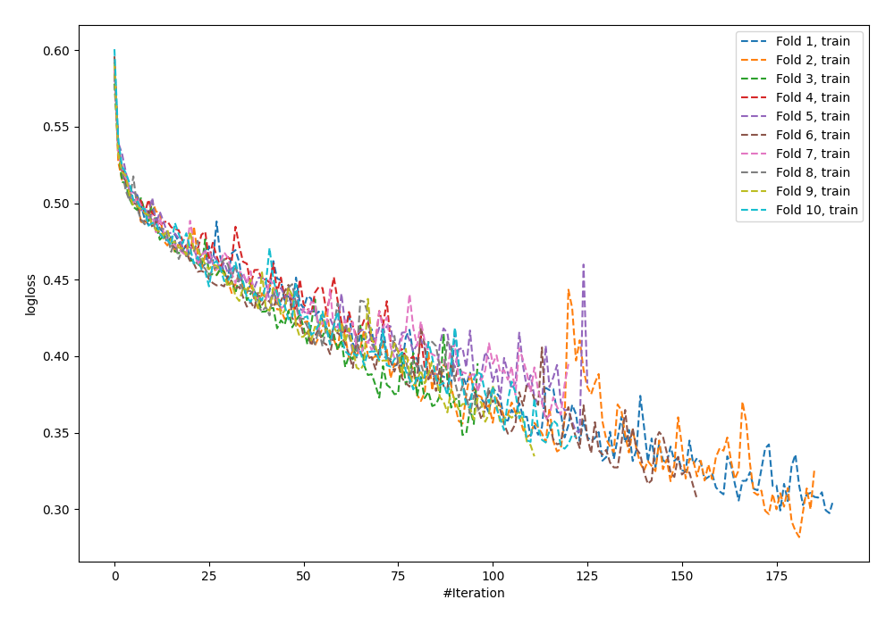
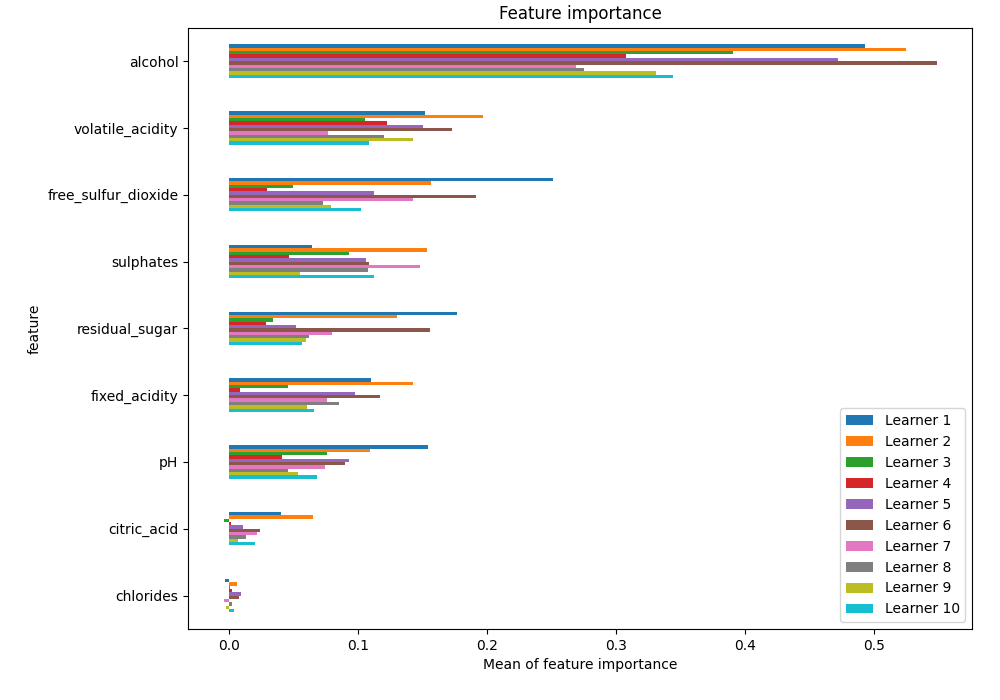
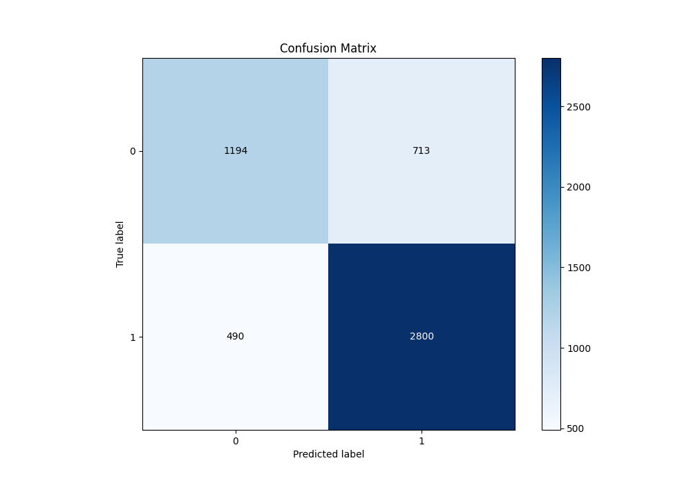
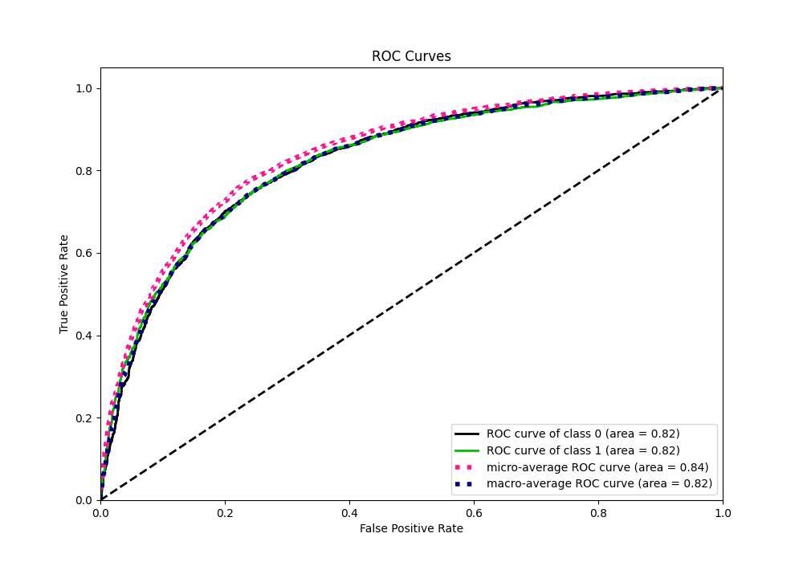
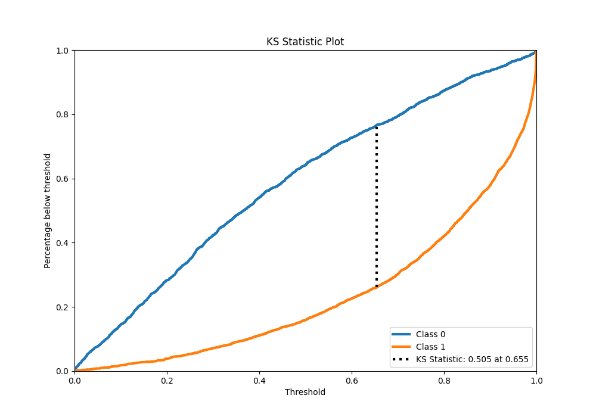
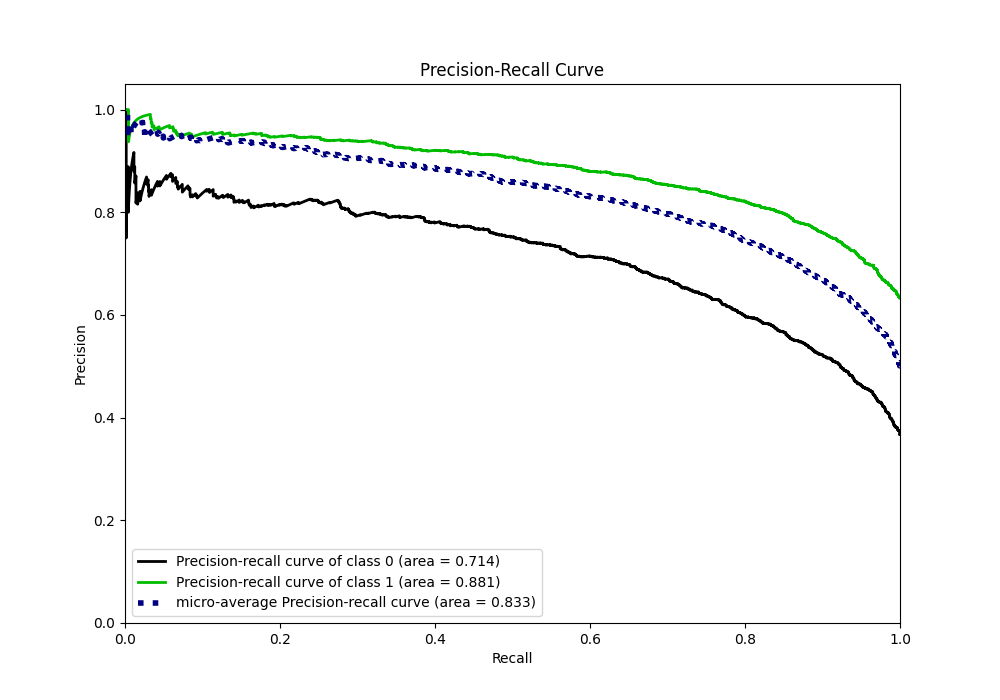
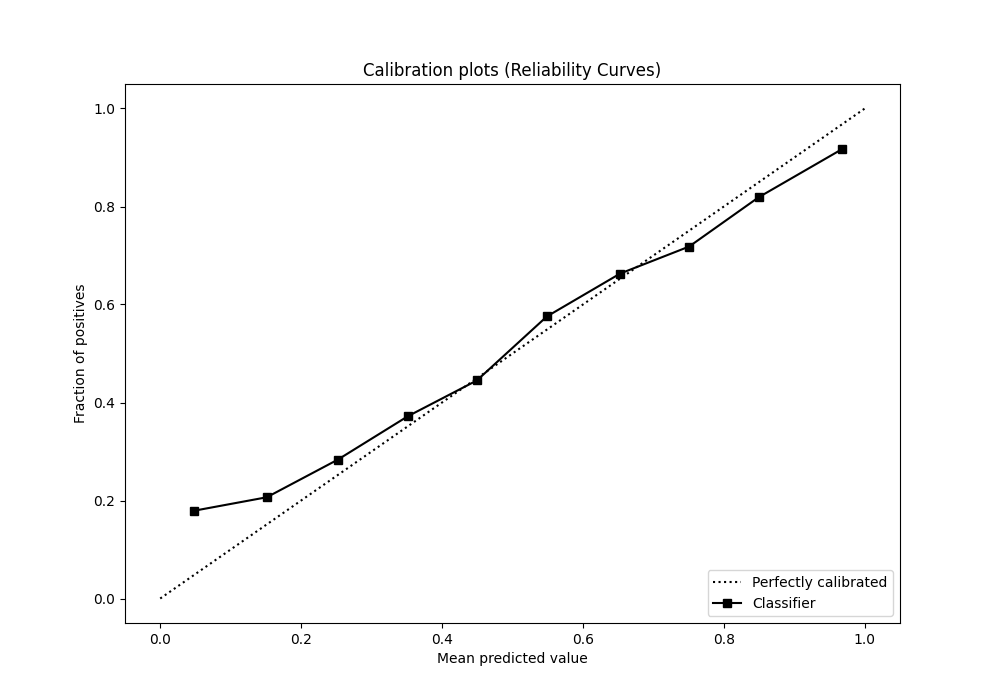
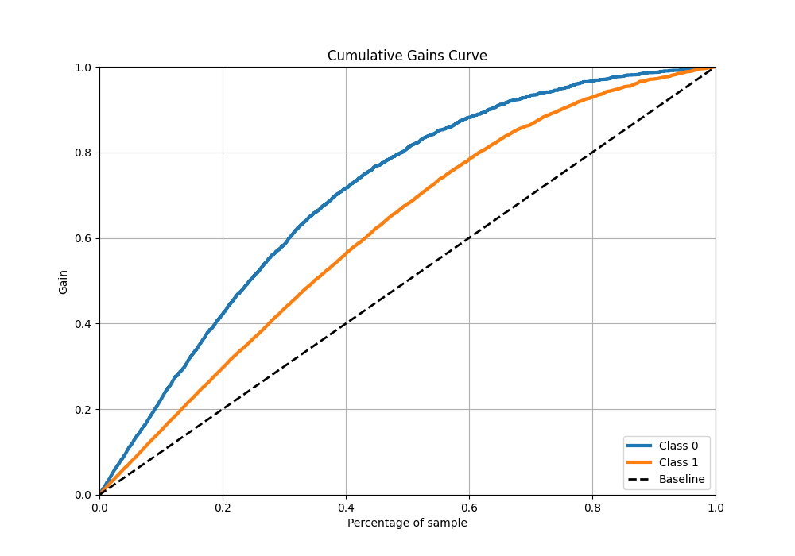
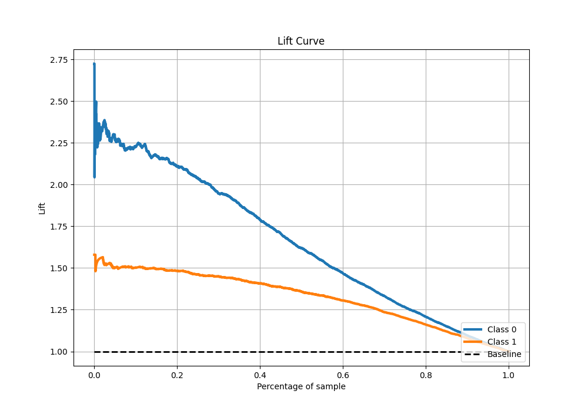

# Summary of 58_NeuralNetwork

[<< Go back](../README.md)

## Neural Network
- **n_jobs**: -1
- **dense_1_size**: 64
- **dense_2_size**: 16
- **learning_rate**: 0.01
- **explain_level**: 1

## Validation
 - **validation_type**: kfold
 - **k_folds**: 10
 - **shuffle**: True
 - **stratify**: True
 - **random_seed**: 12

## Optimized metric
f1

## Training time

16.4 seconds

## Metric details
|           |    score |   threshold |
|:----------|---------:|------------:|
| logloss   | 0.523437 | nan         |
| auc       | 0.823142 | nan         |
| f1        | 0.825163 |   0.409168  |
| accuracy  | 0.76852  |   0.480337  |
| precision | 0.965986 |   0.999253  |
| recall    | 1        |   1.653e-08 |
| mcc       | 0.495069 |   0.56209   |

## Metric details with threshold from accuracy metric
|           |    score |   threshold |
|:----------|---------:|------------:|
| logloss   | 0.523437 |  nan        |
| auc       | 0.823142 |  nan        |
| f1        | 0.823166 |    0.480337 |
| accuracy  | 0.76852  |    0.480337 |
| precision | 0.79704  |    0.480337 |
| recall    | 0.851064 |    0.480337 |
| mcc       | 0.49141  |    0.480337 |

## Confusion matrix (at threshold=0.480337)
|              |   Predicted as 0 |   Predicted as 1 |
|:-------------|-----------------:|-----------------:|
| Labeled as 0 |             1194 |              713 |
| Labeled as 1 |              490 |             2800 |

## Learning curves

## Permutation-based Importance

## Confusion Matrix

## Normalized Confusion Matrix

## ROC Curve

## Kolmogorov-Smirnov Statistic

## Precision-Recall Curve

## Calibration Curve

## Cumulative Gains Curve

## Lift Curve

[<< Go back](../README.md)
