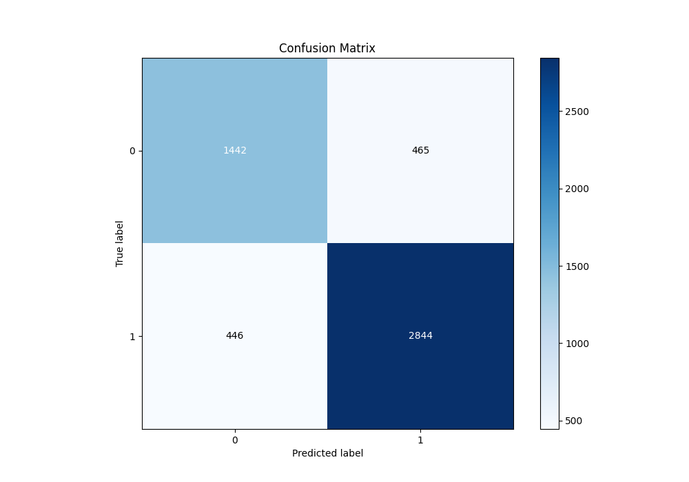

# Summary of 58_NeuralNetwork_Stacked

[<< Go back](../README.md)

## Neural Network
- **n_jobs**: -1
- **dense_1_size**: 64
- **dense_2_size**: 16
- **learning_rate**: 0.01
- **explain_level**: 1

## Validation
 - **validation_type**: kfold
 - **k_folds**: 10
 - **shuffle**: True
 - **stratify**: True
 - **random_seed**: 12

## Optimized metric
f1

## Training time

27.6 seconds

## Metric details
|           |    score |     threshold |
|:----------|---------:|--------------:|
| logloss   | 0.422629 | nan           |
| auc       | 0.880591 | nan           |
| f1        | 0.864929 |   0.451459    |
| accuracy  | 0.824707 |   0.515929    |
| precision | 0.967871 |   0.948933    |
| recall    | 1        |   2.60986e-13 |
| mcc       | 0.622576 |   0.61271     |

## Metric details with threshold from accuracy metric
|           |    score |   threshold |
|:----------|---------:|------------:|
| logloss   | 0.422629 |  nan        |
| auc       | 0.880591 |  nan        |
| f1        | 0.861949 |    0.515929 |
| accuracy  | 0.824707 |    0.515929 |
| precision | 0.859474 |    0.515929 |
| recall    | 0.864438 |    0.515929 |
| mcc       | 0.621921 |    0.515929 |

## Confusion matrix (at threshold=0.515929)
|              |   Predicted as 0 |   Predicted as 1 |
|:-------------|-----------------:|-----------------:|
| Labeled as 0 |             1442 |              465 |
| Labeled as 1 |              446 |             2844 |

## Learning curves

## Permutation-based Importance

## Confusion Matrix

## Normalized Confusion Matrix

## ROC Curve

## Kolmogorov-Smirnov Statistic

## Precision-Recall Curve

## Calibration Curve

## Cumulative Gains Curve

## Lift Curve

[<< Go back](../README.md)
