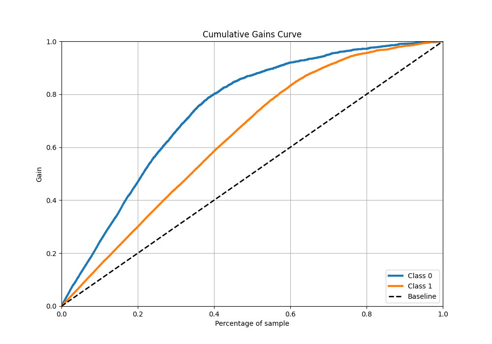

# Summary of 60_NeuralNetwork_Stacked

[<< Go back](../README.md)

## Neural Network
- **n_jobs**: -1
- **dense_1_size**: 32
- **dense_2_size**: 32
- **learning_rate**: 0.05
- **explain_level**: 1

## Validation
 - **validation_type**: kfold
 - **k_folds**: 10
 - **shuffle**: True
 - **stratify**: True
 - **random_seed**: 12

## Optimized metric
f1

## Training time

31.4 seconds

## Metric details
|           |    score |     threshold |
|:----------|---------:|--------------:|
| logloss   | 0.416226 | nan           |
| auc       | 0.878723 | nan           |
| f1        | 0.864946 |   0.500805    |
| accuracy  | 0.8274   |   0.552295    |
| precision | 0.968661 |   0.967317    |
| recall    | 1        |   2.26741e-07 |
| mcc       | 0.627789 |   0.575762    |

## Metric details with threshold from accuracy metric
|           |    score |   threshold |
|:----------|---------:|------------:|
| logloss   | 0.416226 |  nan        |
| auc       | 0.878723 |  nan        |
| f1        | 0.86407  |    0.552295 |
| accuracy  | 0.8274   |    0.552295 |
| precision | 0.86159  |    0.552295 |
| recall    | 0.866565 |    0.552295 |
| mcc       | 0.627732 |    0.552295 |

## Confusion matrix (at threshold=0.552295)
|              |   Predicted as 0 |   Predicted as 1 |
|:-------------|-----------------:|-----------------:|
| Labeled as 0 |             1449 |              458 |
| Labeled as 1 |              439 |             2851 |

## Learning curves

## Permutation-based Importance

## Confusion Matrix

## Normalized Confusion Matrix

## ROC Curve

## Kolmogorov-Smirnov Statistic

## Precision-Recall Curve

## Calibration Curve

## Cumulative Gains Curve

## Lift Curve

[<< Go back](../README.md)
