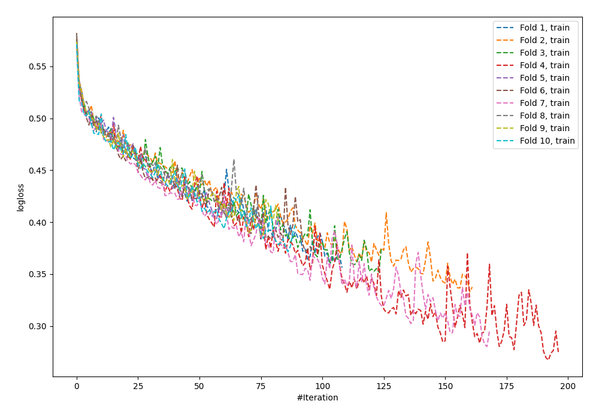
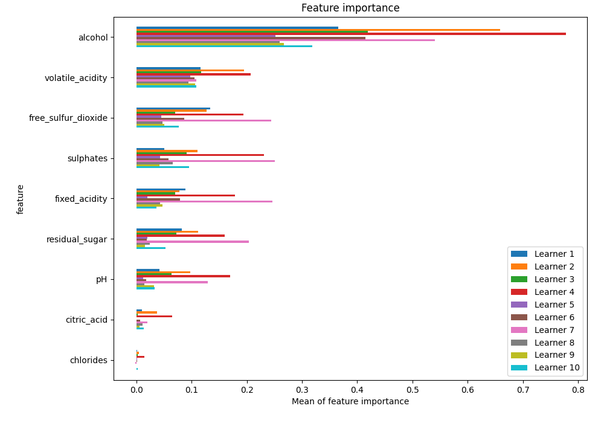
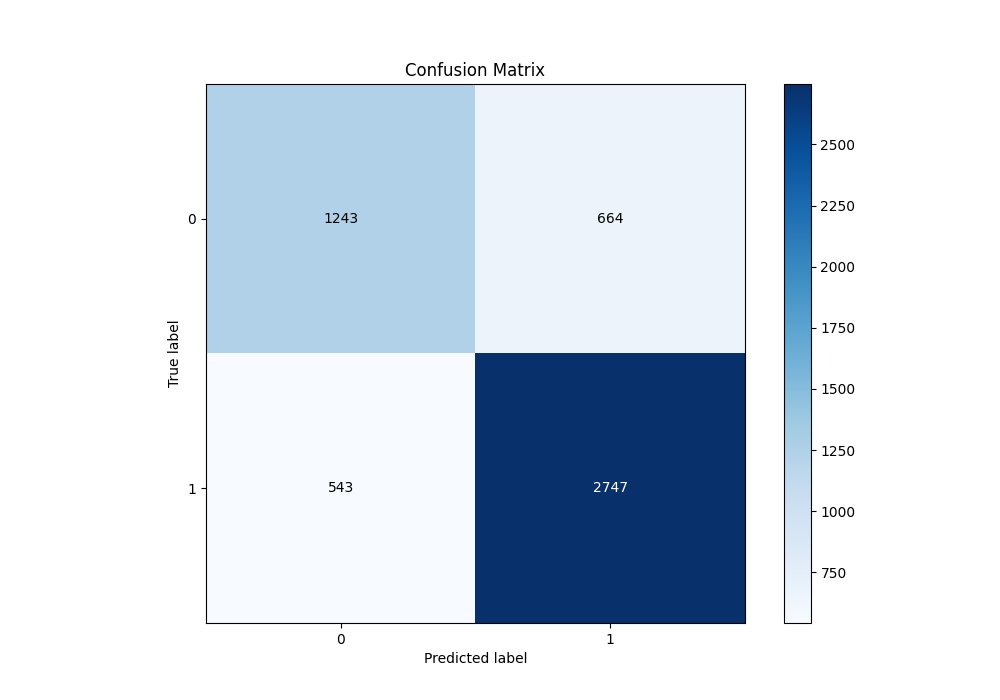
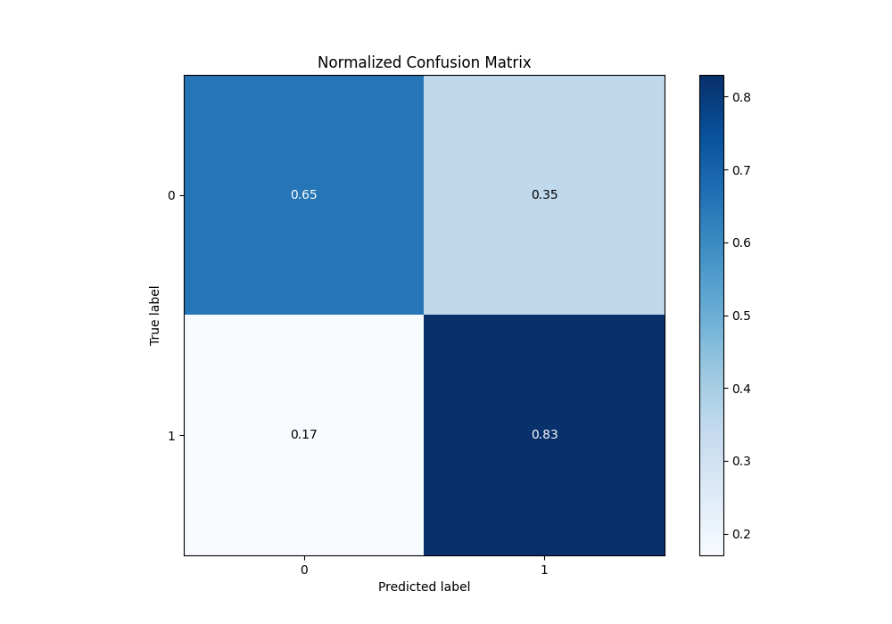
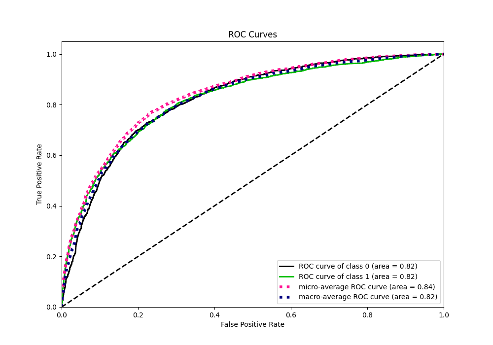
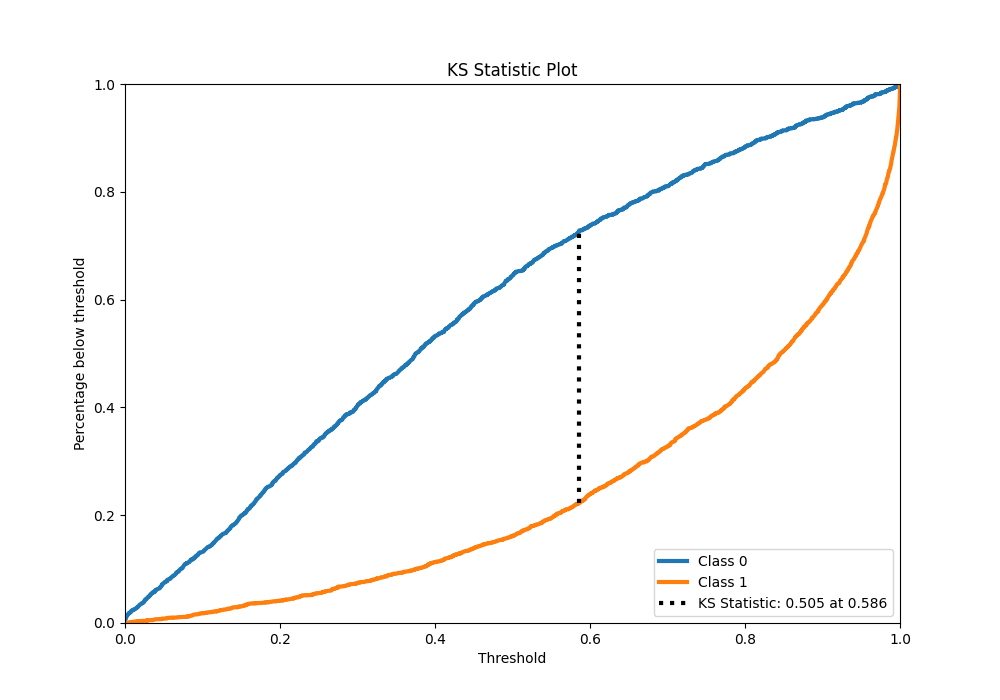
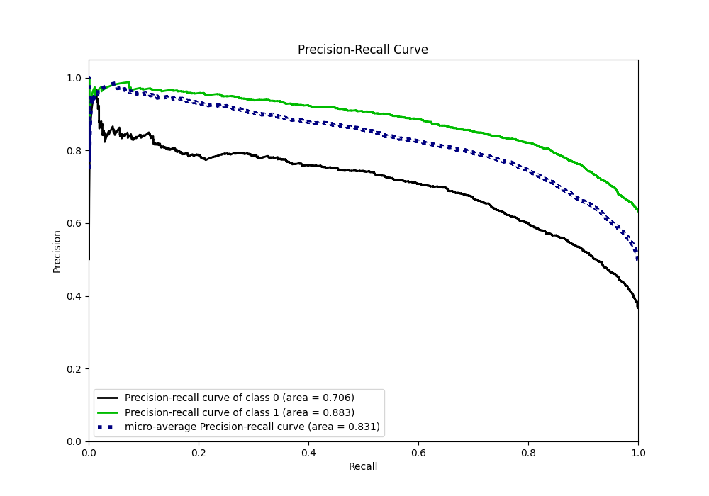
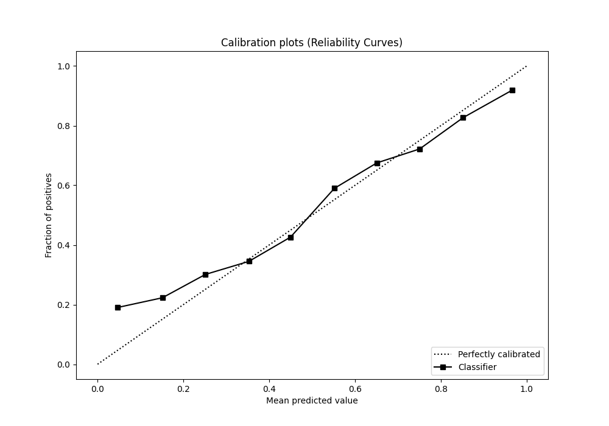
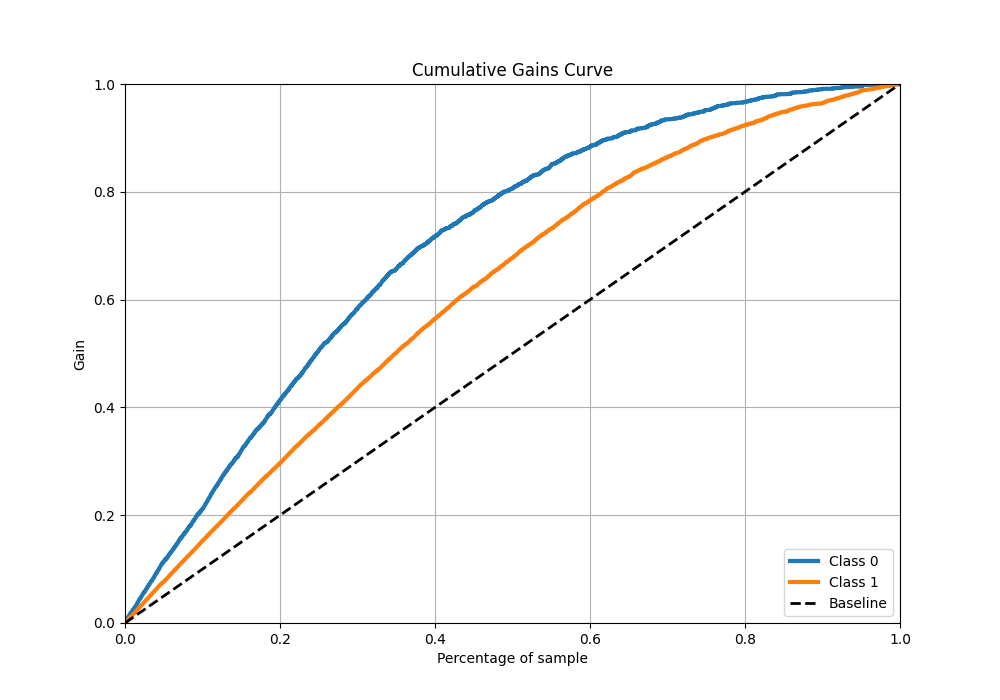
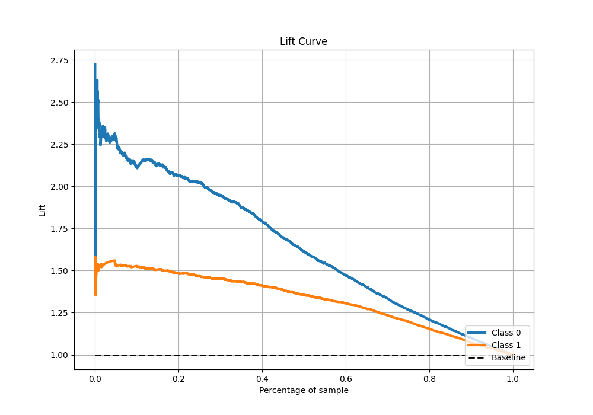

# Summary of 61_NeuralNetwork

[<< Go back](../README.md)

## Neural Network
- **n_jobs**: -1
- **dense_1_size**: 64
- **dense_2_size**: 16
- **learning_rate**: 0.01
- **explain_level**: 1

## Validation
 - **validation_type**: kfold
 - **k_folds**: 10
 - **shuffle**: True
 - **stratify**: True
 - **random_seed**: 12

## Optimized metric
f1

## Training time

17.1 seconds

## Metric details
|           |    score |     threshold |
|:----------|---------:|--------------:|
| logloss   | 0.522668 | nan           |
| auc       | 0.821252 | nan           |
| f1        | 0.822905 |   0.387137    |
| accuracy  | 0.767751 |   0.505159    |
| precision | 0.984848 |   0.998211    |
| recall    | 1        |   2.08284e-14 |
| mcc       | 0.49589  |   0.554994    |

## Metric details with threshold from accuracy metric
|           |    score |   threshold |
|:----------|---------:|------------:|
| logloss   | 0.522668 |  nan        |
| auc       | 0.821252 |  nan        |
| f1        | 0.819878 |    0.505159 |
| accuracy  | 0.767751 |    0.505159 |
| precision | 0.805336 |    0.505159 |
| recall    | 0.834954 |    0.505159 |
| mcc       | 0.49398  |    0.505159 |

## Confusion matrix (at threshold=0.505159)
|              |   Predicted as 0 |   Predicted as 1 |
|:-------------|-----------------:|-----------------:|
| Labeled as 0 |             1243 |              664 |
| Labeled as 1 |              543 |             2747 |

## Learning curves

## Permutation-based Importance

## Confusion Matrix

## Normalized Confusion Matrix

## ROC Curve

## Kolmogorov-Smirnov Statistic

## Precision-Recall Curve

## Calibration Curve

## Cumulative Gains Curve

## Lift Curve

[<< Go back](../README.md)
