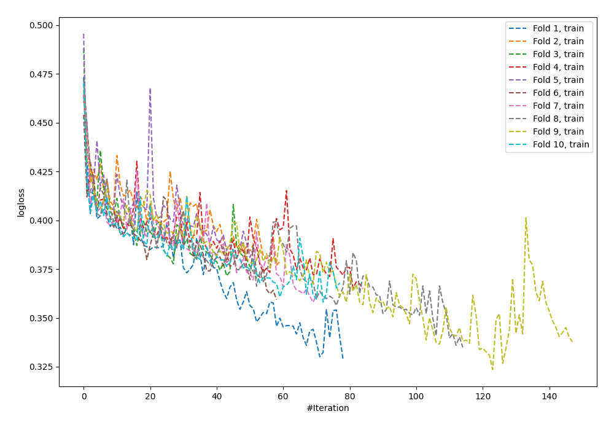
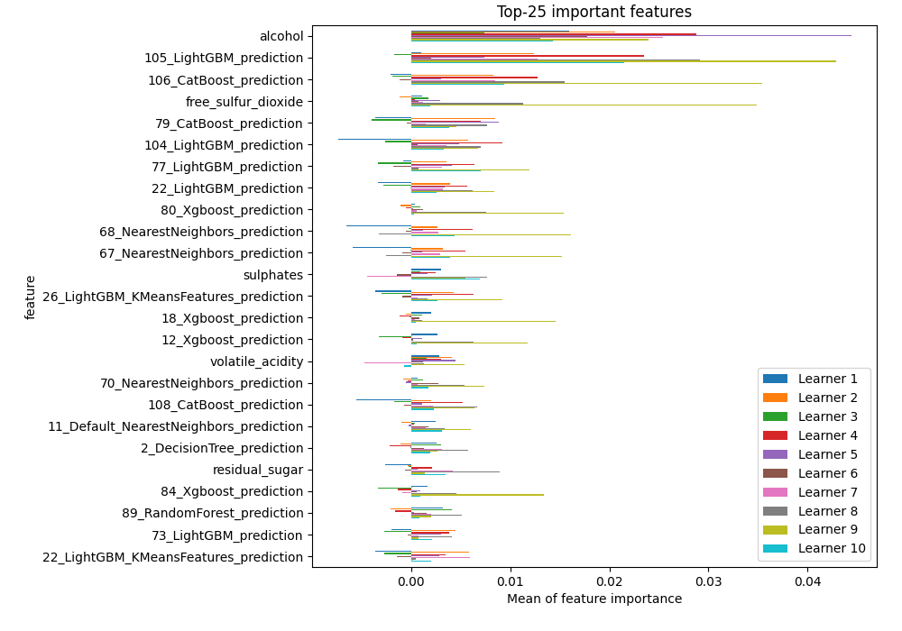
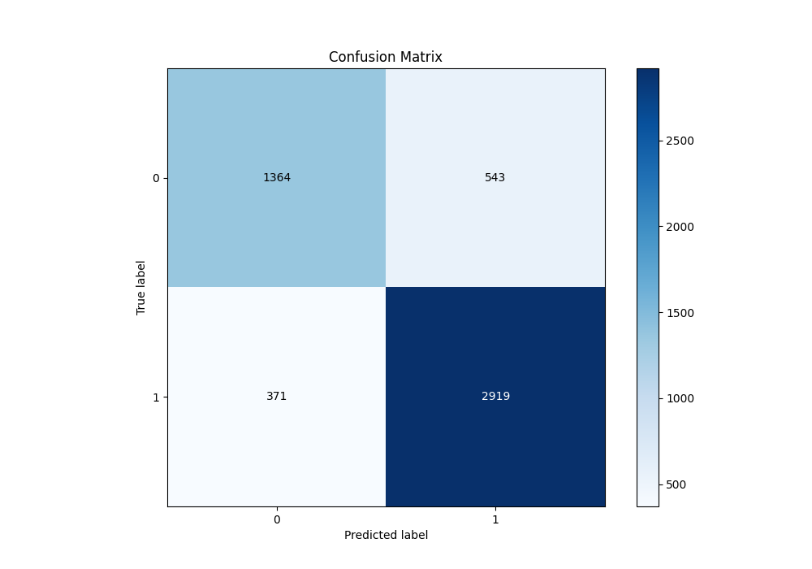
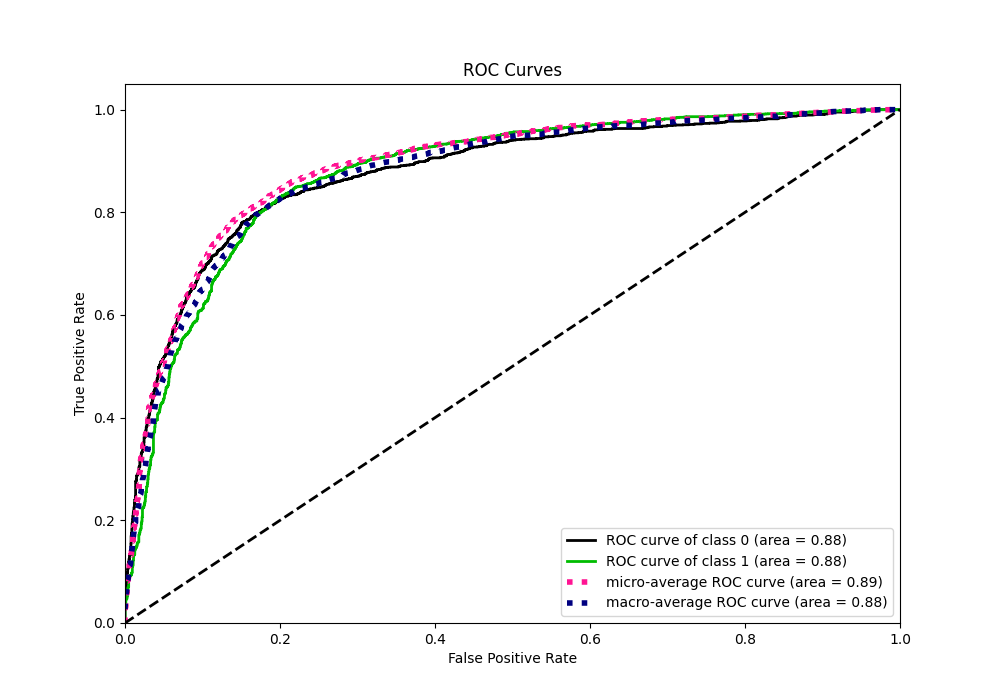
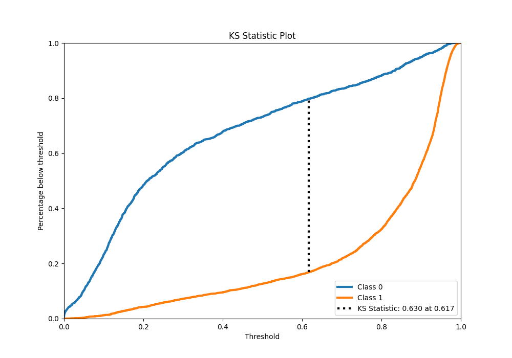
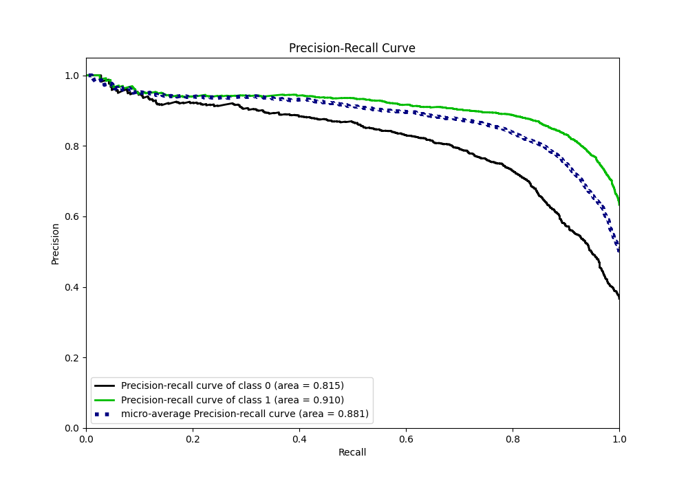
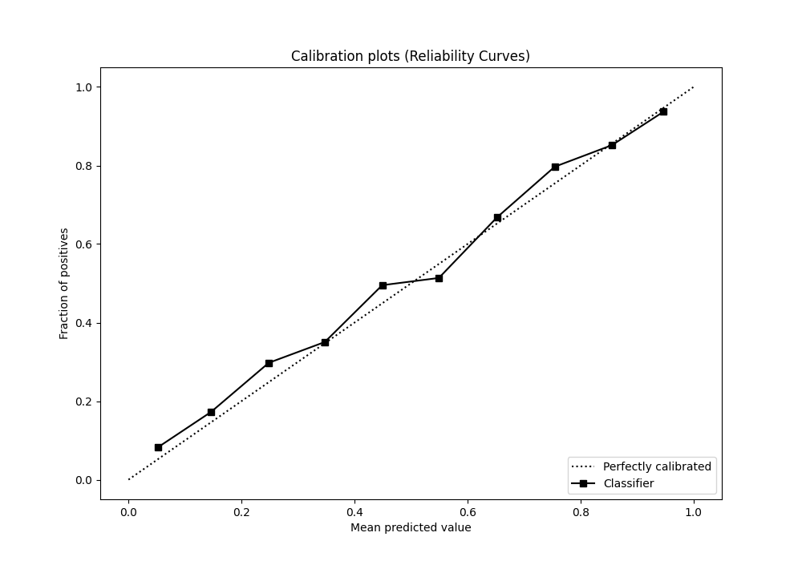
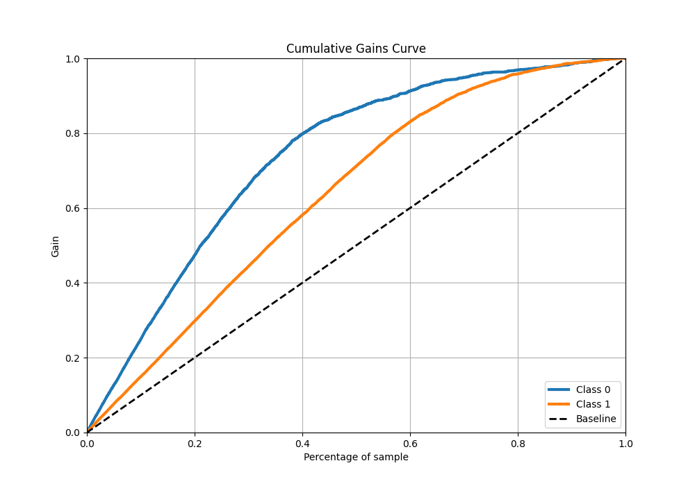
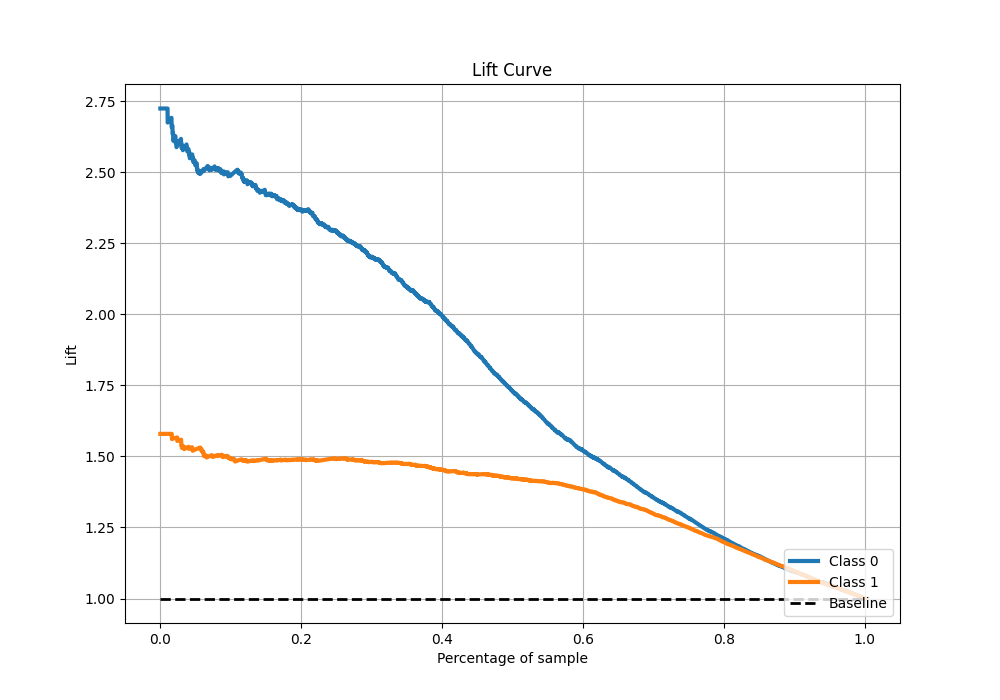

# Summary of 61_NeuralNetwork_Stacked

[<< Go back](../README.md)

## Neural Network
- **n_jobs**: -1
- **dense_1_size**: 64
- **dense_2_size**: 16
- **learning_rate**: 0.01
- **explain_level**: 1

## Validation
 - **validation_type**: kfold
 - **k_folds**: 10
 - **shuffle**: True
 - **stratify**: True
 - **random_seed**: 12

## Optimized metric
f1

## Training time

33.8 seconds

## Metric details
|           |    score |     threshold |
|:----------|---------:|--------------:|
| logloss   | 0.417984 | nan           |
| auc       | 0.876833 | nan           |
| f1        | 0.865188 |   0.410197    |
| accuracy  | 0.824129 |   0.462618    |
| precision | 0.986395 |   0.974727    |
| recall    | 1        |   5.71531e-10 |
| mcc       | 0.623192 |   0.579779    |

## Metric details with threshold from accuracy metric
|           |    score |   threshold |
|:----------|---------:|------------:|
| logloss   | 0.417984 |  nan        |
| auc       | 0.876833 |  nan        |
| f1        | 0.864633 |    0.462618 |
| accuracy  | 0.824129 |    0.462618 |
| precision | 0.843154 |    0.462618 |
| recall    | 0.887234 |    0.462618 |
| mcc       | 0.615761 |    0.462618 |

## Confusion matrix (at threshold=0.462618)
|              |   Predicted as 0 |   Predicted as 1 |
|:-------------|-----------------:|-----------------:|
| Labeled as 0 |             1364 |              543 |
| Labeled as 1 |              371 |             2919 |

## Learning curves

## Permutation-based Importance

## Confusion Matrix

## Normalized Confusion Matrix

## ROC Curve

## Kolmogorov-Smirnov Statistic

## Precision-Recall Curve

## Calibration Curve

## Cumulative Gains Curve

## Lift Curve

[<< Go back](../README.md)
