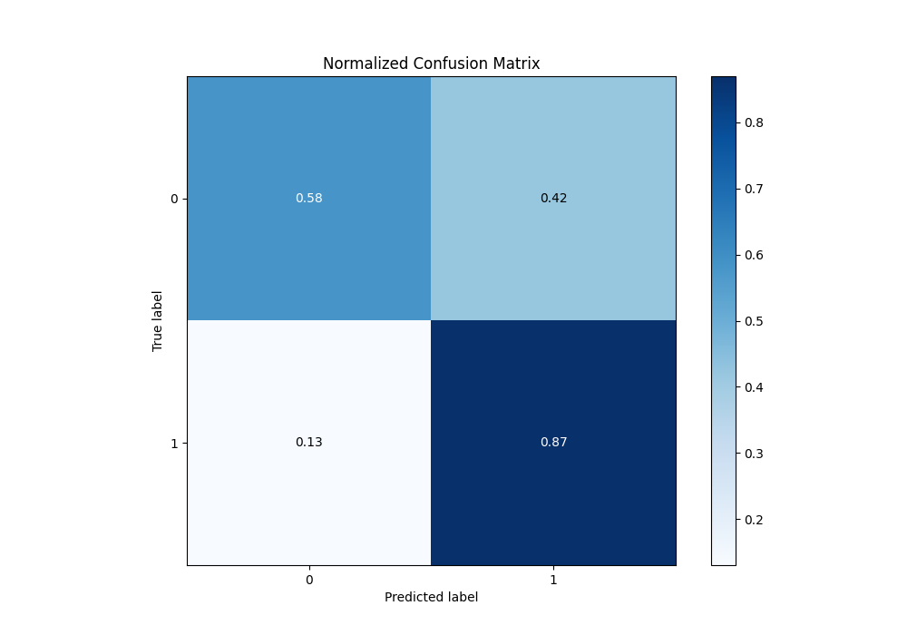

# Summary of 62_NeuralNetwork

[<< Go back](../README.md)

## Neural Network
- **n_jobs**: -1
- **dense_1_size**: 64
- **dense_2_size**: 4
- **learning_rate**: 0.01
- **explain_level**: 1

## Validation
 - **validation_type**: kfold
 - **k_folds**: 10
 - **shuffle**: True
 - **stratify**: True
 - **random_seed**: 12

## Optimized metric
f1

## Training time

16.8 seconds

## Metric details
|           |    score |     threshold |
|:----------|---------:|--------------:|
| logloss   | 0.501772 | nan           |
| auc       | 0.822867 | nan           |
| f1        | 0.823462 |   0.452883    |
| accuracy  | 0.76294  |   0.466006    |
| precision | 0.964646 |   0.990572    |
| recall    | 1        |   6.07567e-08 |
| mcc       | 0.483294 |   0.54756     |

## Metric details with threshold from accuracy metric
|           |    score |   threshold |
|:----------|---------:|------------:|
| logloss   | 0.501772 |  nan        |
| auc       | 0.822867 |  nan        |
| f1        | 0.822887 |    0.466006 |
| accuracy  | 0.76294  |    0.466006 |
| precision | 0.780687 |    0.466006 |
| recall    | 0.869909 |    0.466006 |
| mcc       | 0.473982 |    0.466006 |

## Confusion matrix (at threshold=0.466006)
|              |   Predicted as 0 |   Predicted as 1 |
|:-------------|-----------------:|-----------------:|
| Labeled as 0 |             1103 |              804 |
| Labeled as 1 |              428 |             2862 |

## Learning curves

## Permutation-based Importance

## Confusion Matrix

## Normalized Confusion Matrix

## ROC Curve

## Kolmogorov-Smirnov Statistic

## Precision-Recall Curve

## Calibration Curve

## Cumulative Gains Curve

## Lift Curve

[<< Go back](../README.md)
