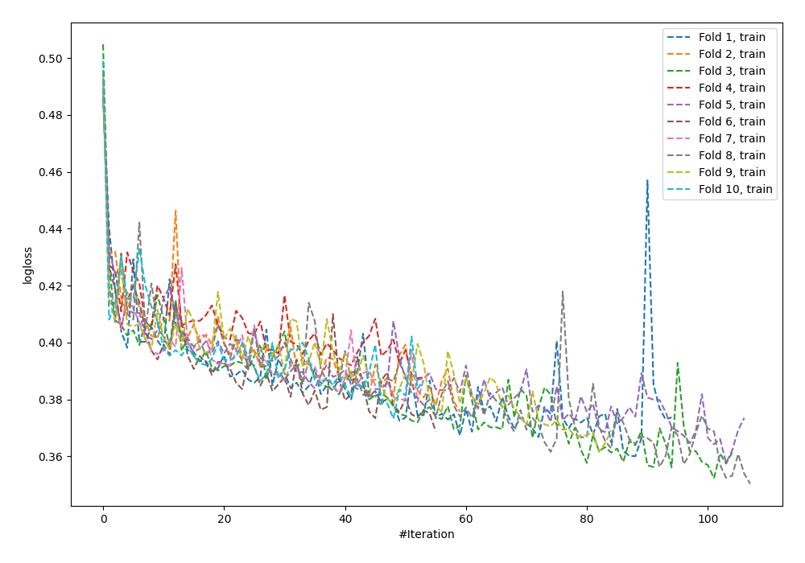
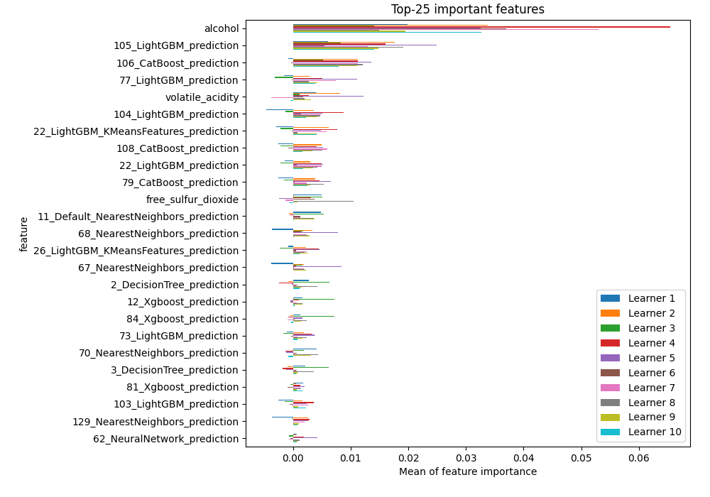
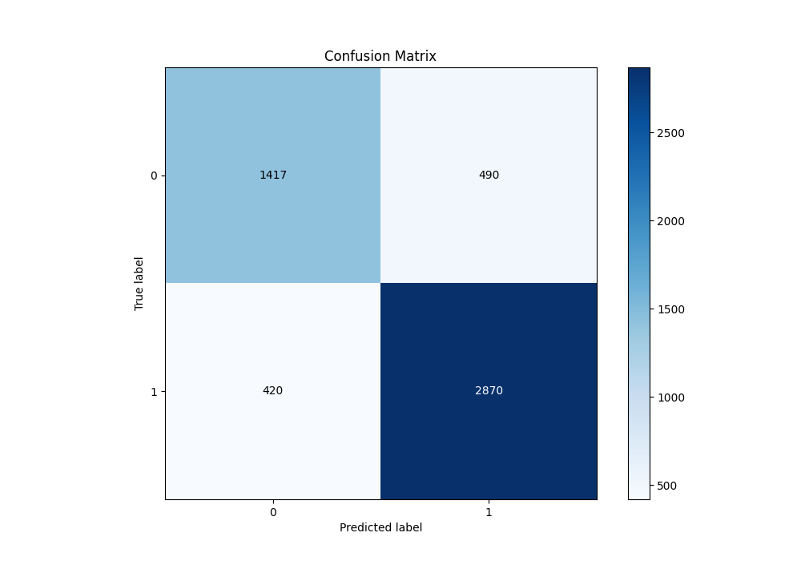
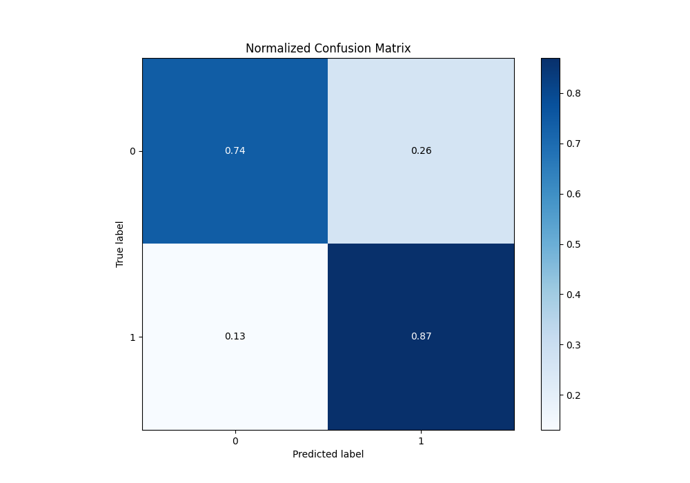
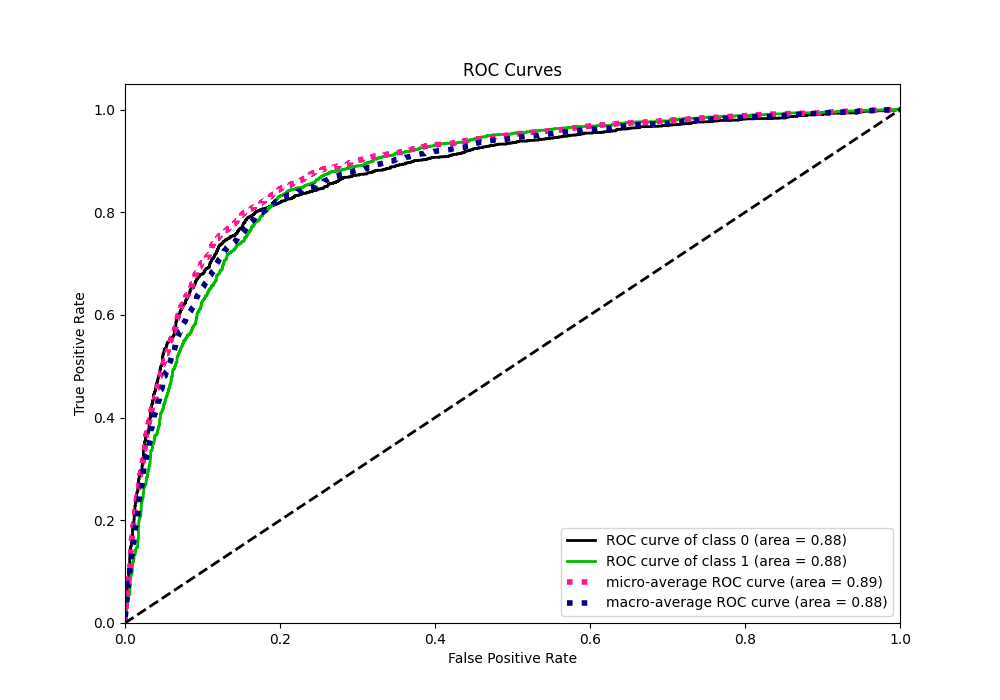
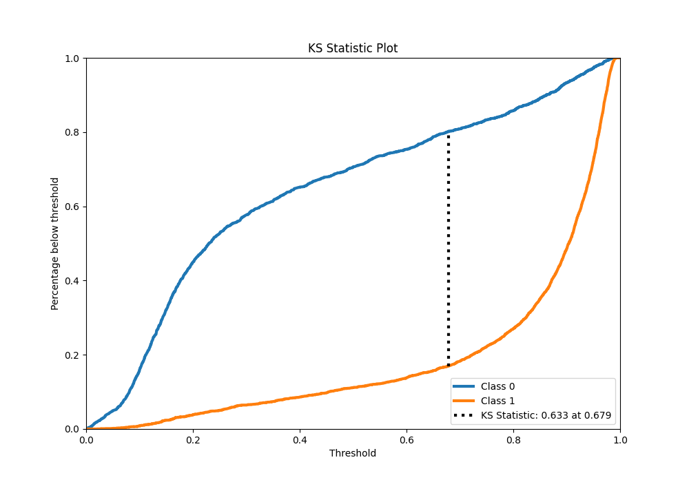
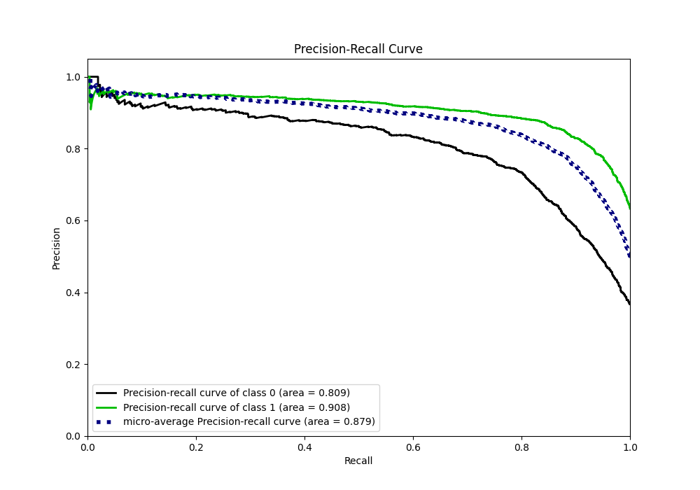
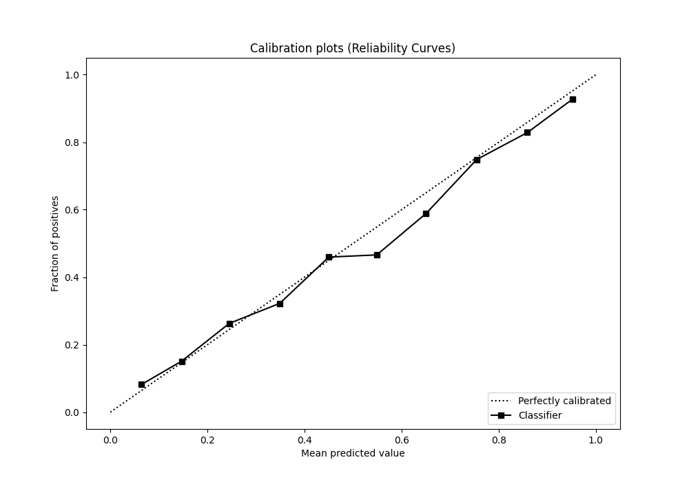
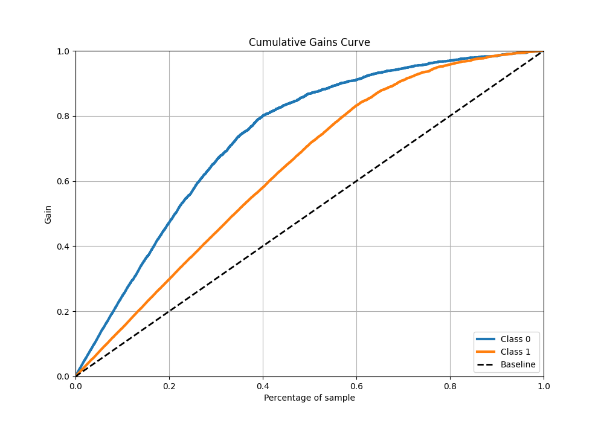
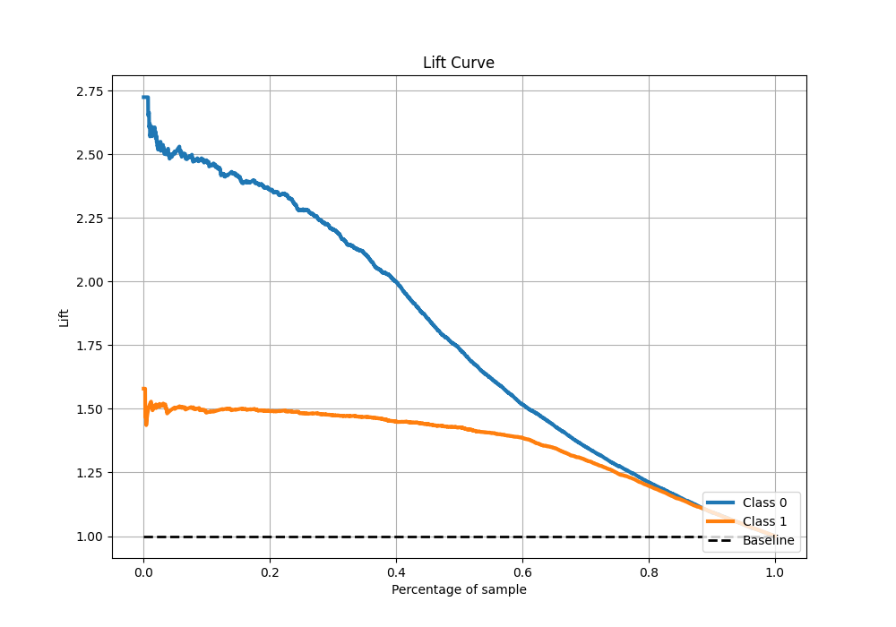

# Summary of 62_NeuralNetwork_Stacked

[<< Go back](../README.md)

## Neural Network
- **n_jobs**: -1
- **dense_1_size**: 64
- **dense_2_size**: 4
- **learning_rate**: 0.01
- **explain_level**: 1

## Validation
 - **validation_type**: kfold
 - **k_folds**: 10
 - **shuffle**: True
 - **stratify**: True
 - **random_seed**: 12

## Optimized metric
f1

## Training time

28.0 seconds

## Metric details
|           |    score |     threshold |
|:----------|---------:|--------------:|
| logloss   | 0.420866 | nan           |
| auc       | 0.875561 | nan           |
| f1        | 0.864301 |   0.430532    |
| accuracy  | 0.824899 |   0.569492    |
| precision | 0.959184 |   0.980708    |
| recall    | 1        |   0.000628827 |
| mcc       | 0.622177 |   0.65798     |

## Metric details with threshold from accuracy metric
|           |    score |   threshold |
|:----------|---------:|------------:|
| logloss   | 0.420866 |  nan        |
| auc       | 0.875561 |  nan        |
| f1        | 0.863158 |    0.569492 |
| accuracy  | 0.824899 |    0.569492 |
| precision | 0.854167 |    0.569492 |
| recall    | 0.87234  |    0.569492 |
| mcc       | 0.620442 |    0.569492 |

## Confusion matrix (at threshold=0.569492)
|              |   Predicted as 0 |   Predicted as 1 |
|:-------------|-----------------:|-----------------:|
| Labeled as 0 |             1417 |              490 |
| Labeled as 1 |              420 |             2870 |

## Learning curves

## Permutation-based Importance

## Confusion Matrix

## Normalized Confusion Matrix

## ROC Curve

## Kolmogorov-Smirnov Statistic

## Precision-Recall Curve

## Calibration Curve

## Cumulative Gains Curve

## Lift Curve

[<< Go back](../README.md)
