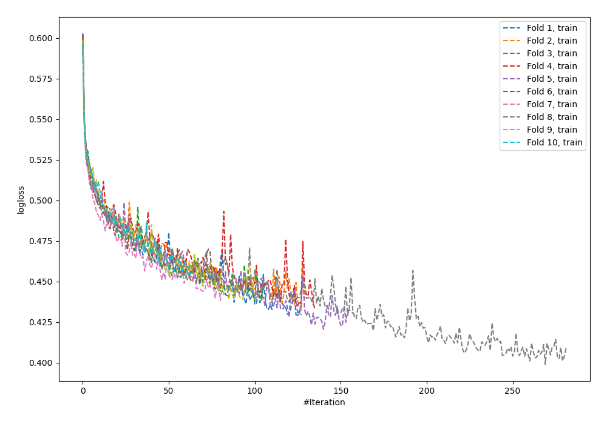
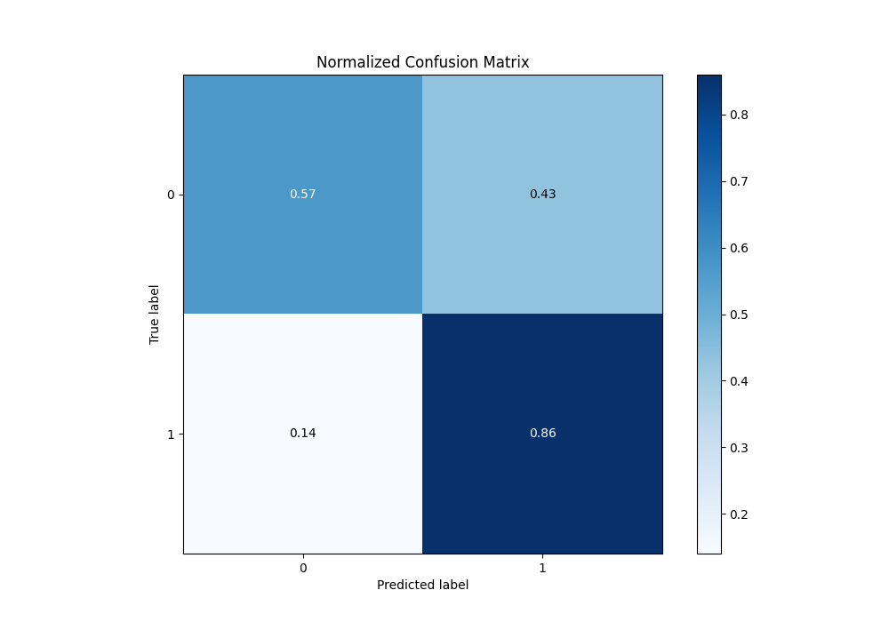

# Summary of 63_NeuralNetwork

[<< Go back](../README.md)

## Neural Network
- **n_jobs**: -1
- **dense_1_size**: 16
- **dense_2_size**: 16
- **learning_rate**: 0.01
- **explain_level**: 1

## Validation
 - **validation_type**: kfold
 - **k_folds**: 10
 - **shuffle**: True
 - **stratify**: True
 - **random_seed**: 12

## Optimized metric
f1

## Training time

13.1 seconds

## Metric details
|           |    score |     threshold |
|:----------|---------:|--------------:|
| logloss   | 0.50975  | nan           |
| auc       | 0.81521  | nan           |
| f1        | 0.818436 |   0.399709    |
| accuracy  | 0.754859 |   0.449033    |
| precision | 0.979592 |   0.994654    |
| recall    | 1        |   0.000402918 |
| mcc       | 0.470015 |   0.579495    |

## Metric details with threshold from accuracy metric
|           |    score |   threshold |
|:----------|---------:|------------:|
| logloss   | 0.50975  |  nan        |
| auc       | 0.81521  |  nan        |
| f1        | 0.816849 |    0.449033 |
| accuracy  | 0.754859 |    0.449033 |
| precision | 0.774959 |    0.449033 |
| recall    | 0.863526 |    0.449033 |
| mcc       | 0.455591 |    0.449033 |

## Confusion matrix (at threshold=0.449033)
|              |   Predicted as 0 |   Predicted as 1 |
|:-------------|-----------------:|-----------------:|
| Labeled as 0 |             1082 |              825 |
| Labeled as 1 |              449 |             2841 |

## Learning curves

## Permutation-based Importance

## Confusion Matrix

## Normalized Confusion Matrix

## ROC Curve

## Kolmogorov-Smirnov Statistic

## Precision-Recall Curve

## Calibration Curve

## Cumulative Gains Curve

## Lift Curve

[<< Go back](../README.md)
