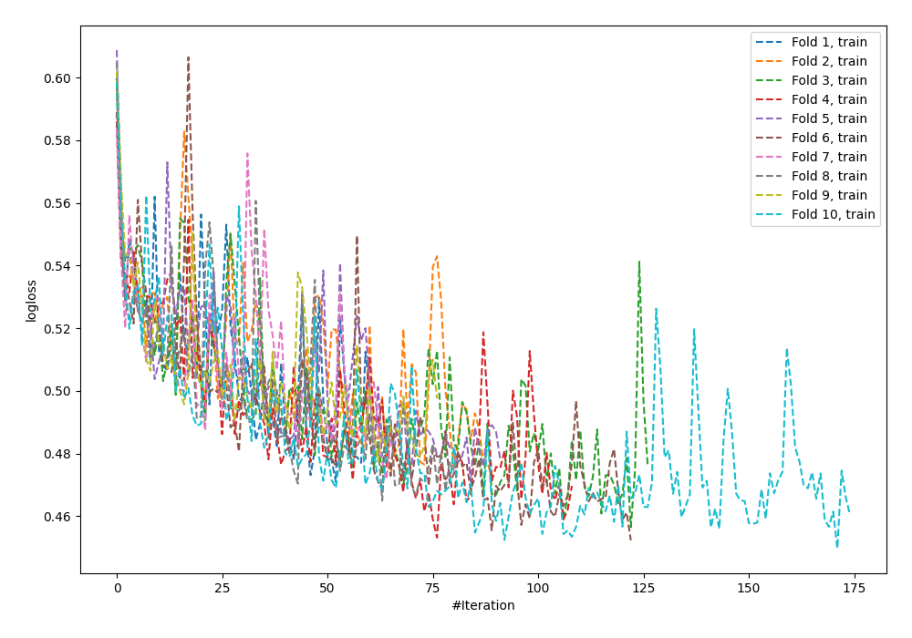
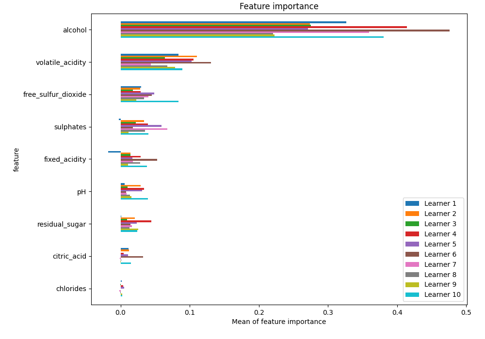
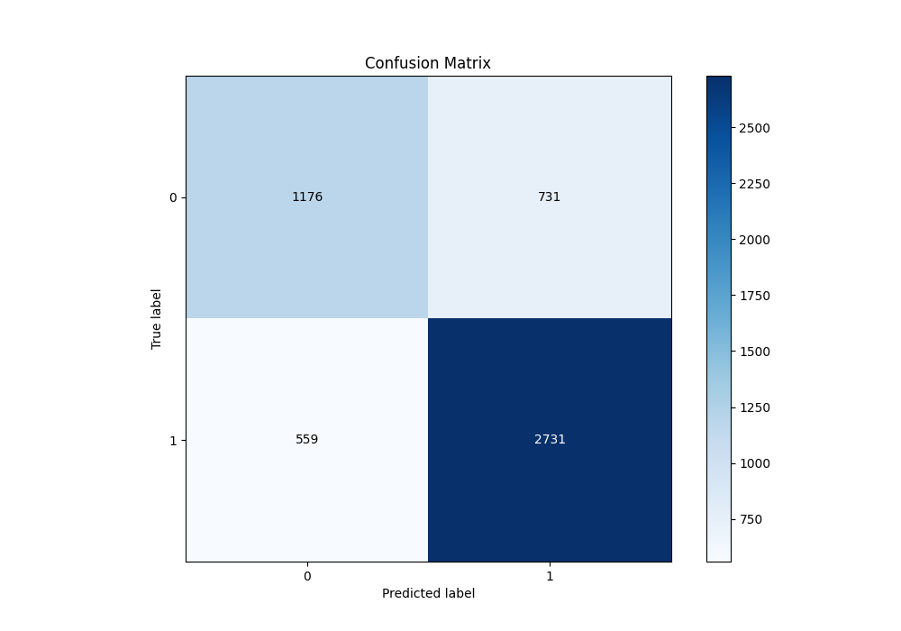
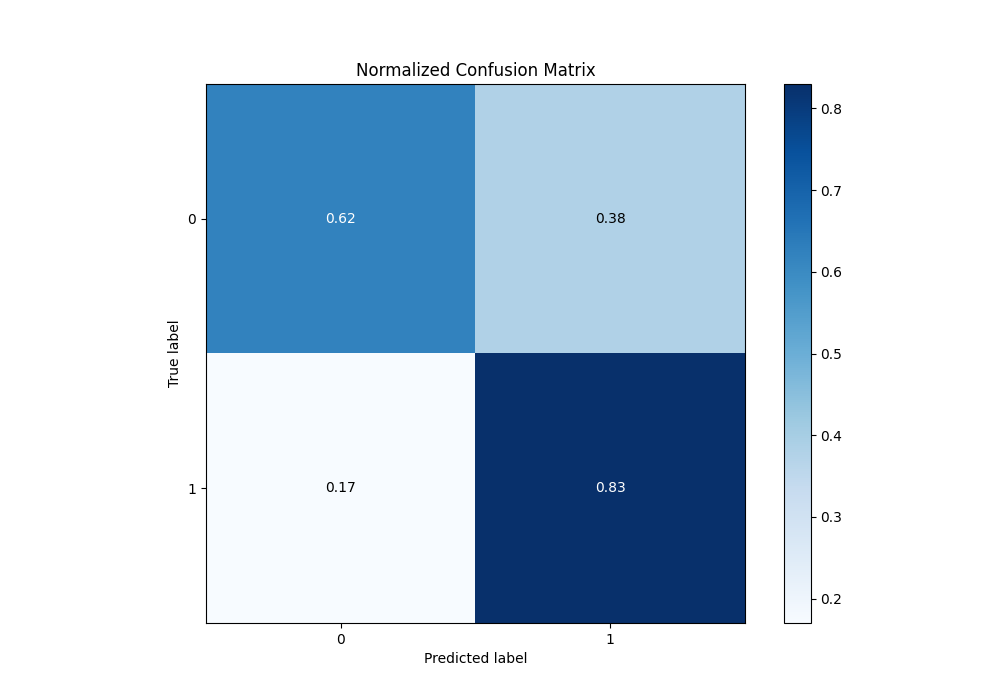
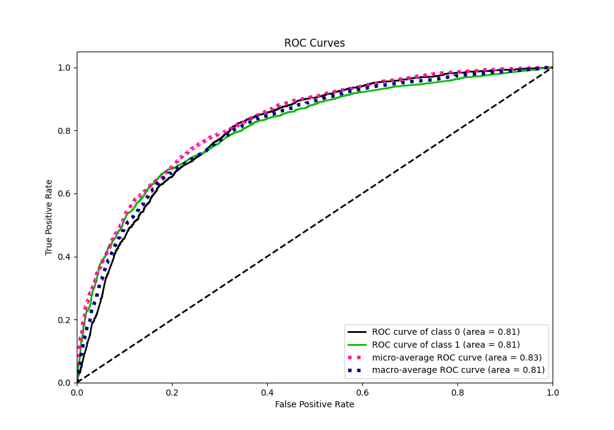
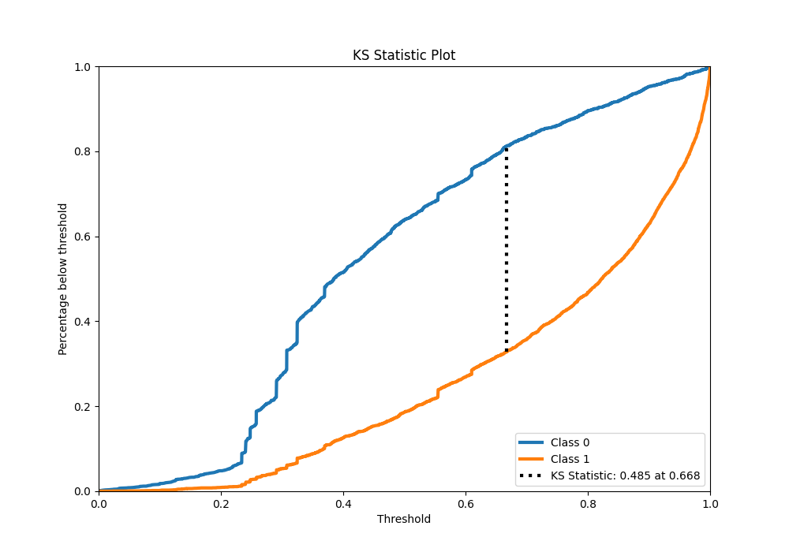
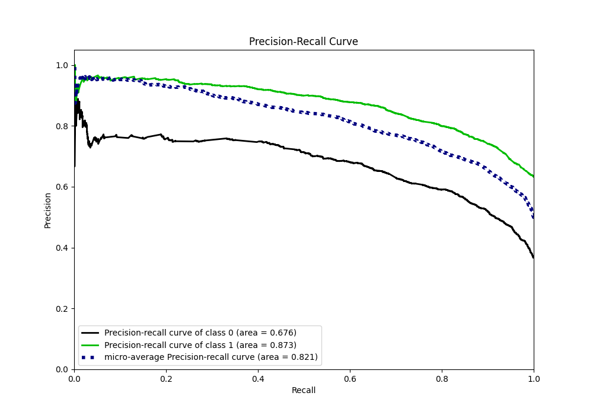
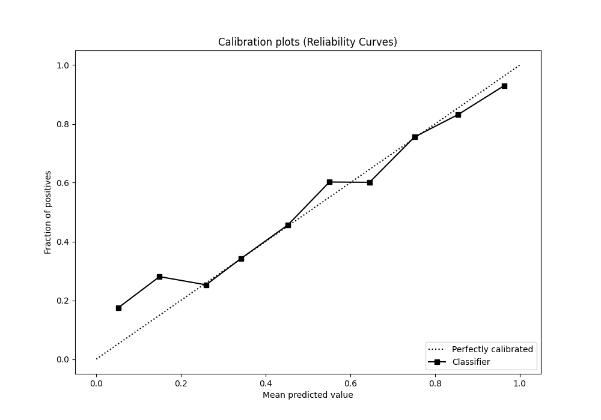
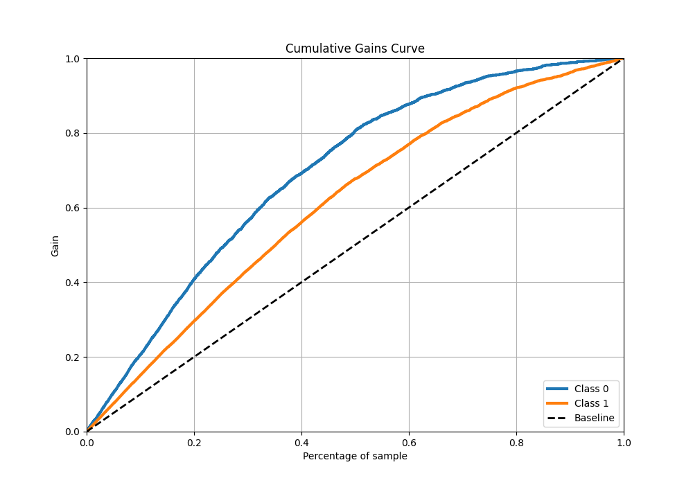
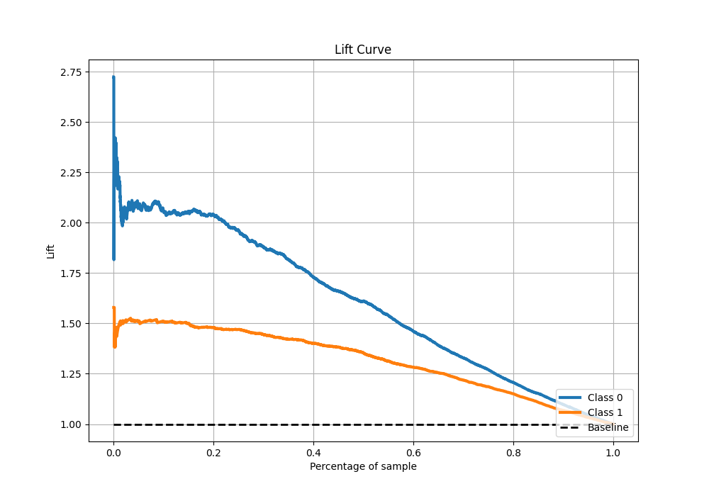

# Summary of 64_NeuralNetwork

[<< Go back](../README.md)

## Neural Network
- **n_jobs**: -1
- **dense_1_size**: 64
- **dense_2_size**: 8
- **learning_rate**: 0.1
- **explain_level**: 1

## Validation
 - **validation_type**: kfold
 - **k_folds**: 10
 - **shuffle**: True
 - **stratify**: True
 - **random_seed**: 12

## Optimized metric
f1

## Training time

16.5 seconds

## Metric details
|           |    score |     threshold |
|:----------|---------:|--------------:|
| logloss   | 0.522355 | nan           |
| auc       | 0.808014 | nan           |
| f1        | 0.814076 |   0.369737    |
| accuracy  | 0.75178  |   0.480772    |
| precision | 0.959596 |   0.995478    |
| recall    | 1        |   0.000336774 |
| mcc       | 0.466983 |   0.66199     |

## Metric details with threshold from accuracy metric
|           |    score |   threshold |
|:----------|---------:|------------:|
| logloss   | 0.522355 |  nan        |
| auc       | 0.808014 |  nan        |
| f1        | 0.808945 |    0.480772 |
| accuracy  | 0.75178  |    0.480772 |
| precision | 0.78885  |    0.480772 |
| recall    | 0.830091 |    0.480772 |
| mcc       | 0.456605 |    0.480772 |

## Confusion matrix (at threshold=0.480772)
|              |   Predicted as 0 |   Predicted as 1 |
|:-------------|-----------------:|-----------------:|
| Labeled as 0 |             1176 |              731 |
| Labeled as 1 |              559 |             2731 |

## Learning curves

## Permutation-based Importance

## Confusion Matrix

## Normalized Confusion Matrix

## ROC Curve

## Kolmogorov-Smirnov Statistic

## Precision-Recall Curve

## Calibration Curve

## Cumulative Gains Curve

## Lift Curve

[<< Go back](../README.md)
