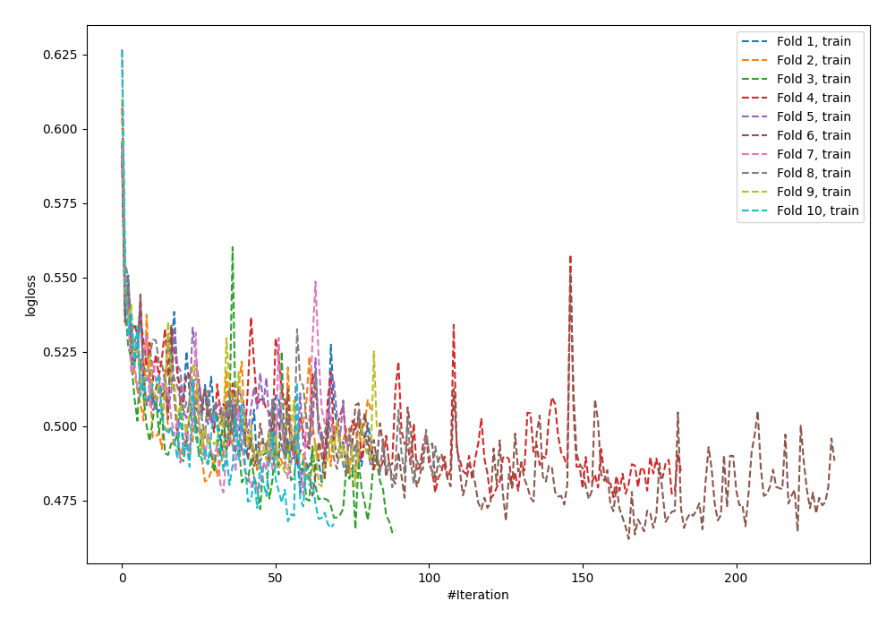
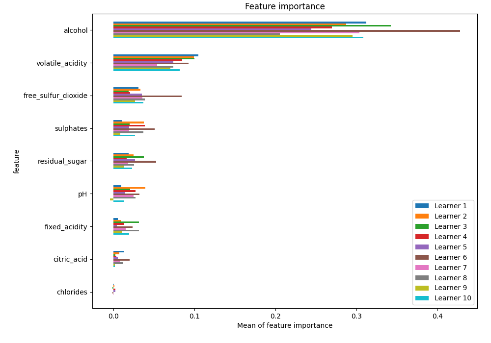
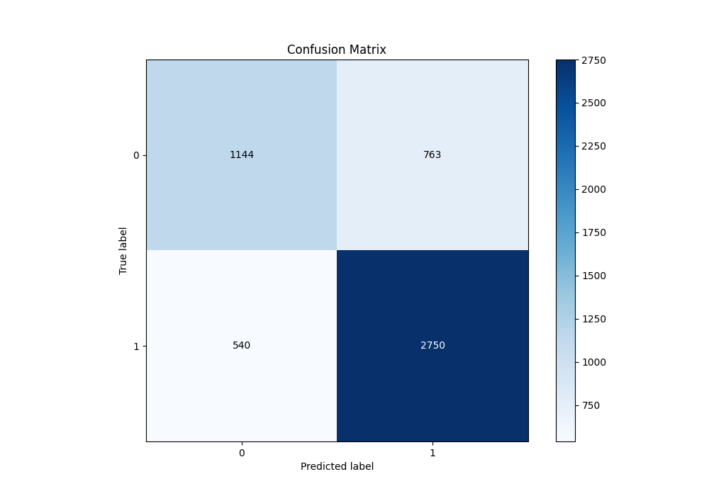
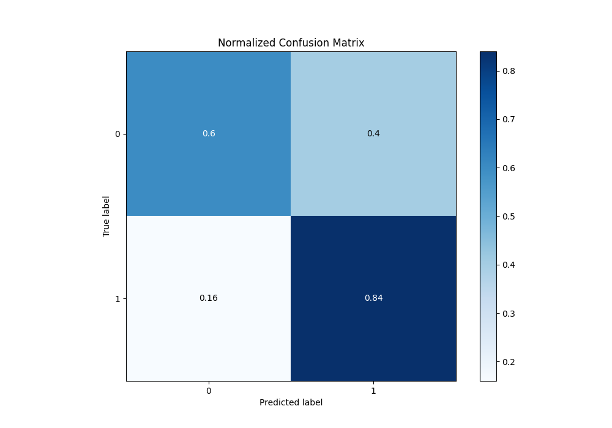
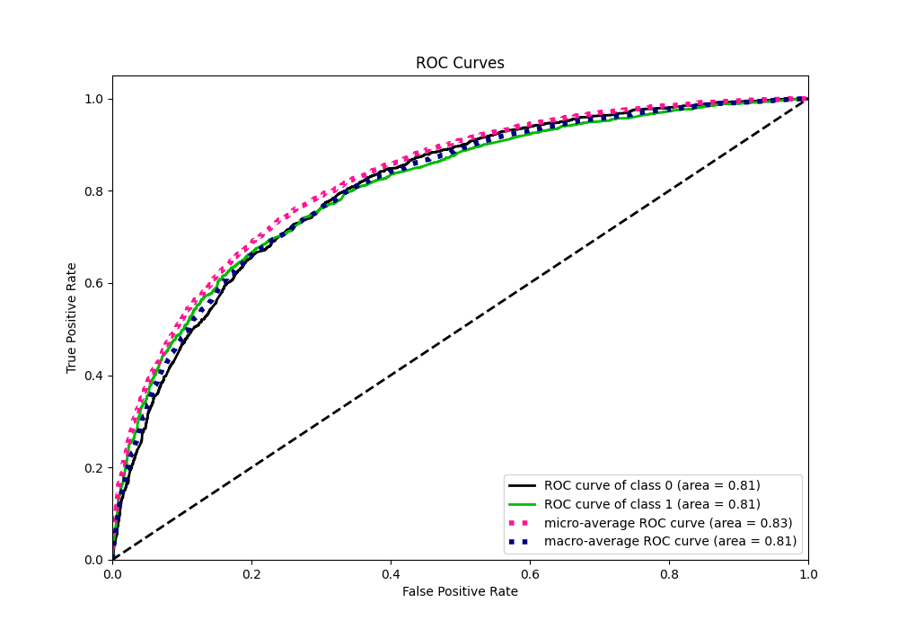
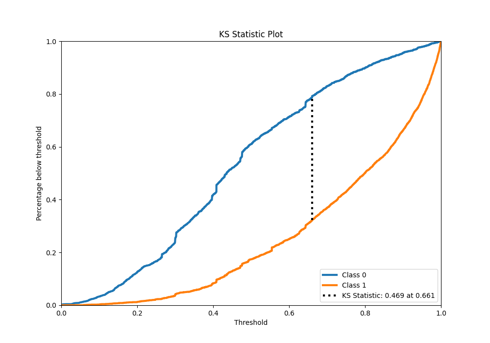
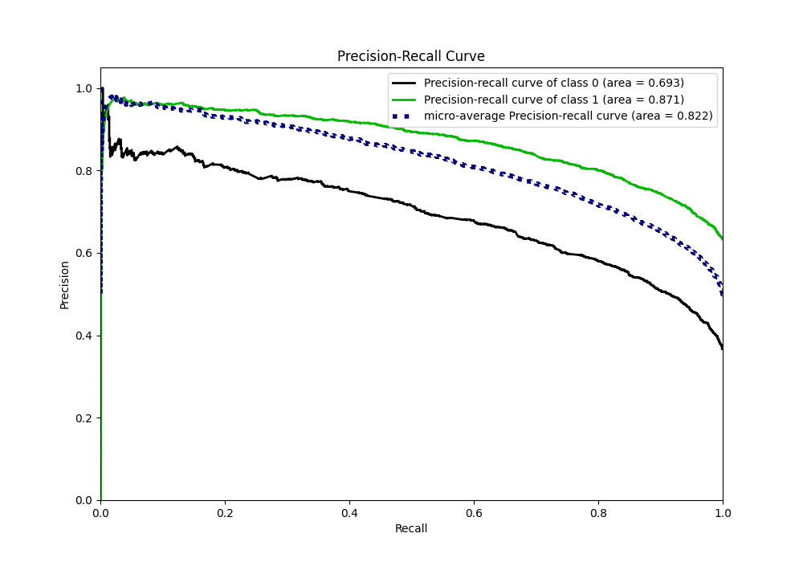
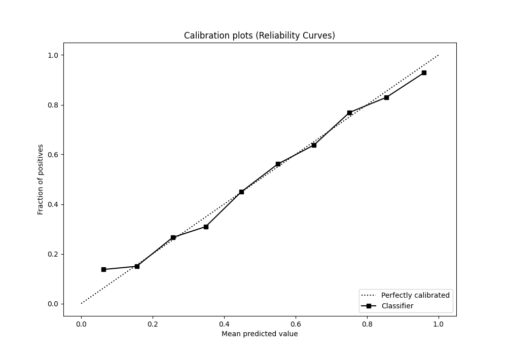
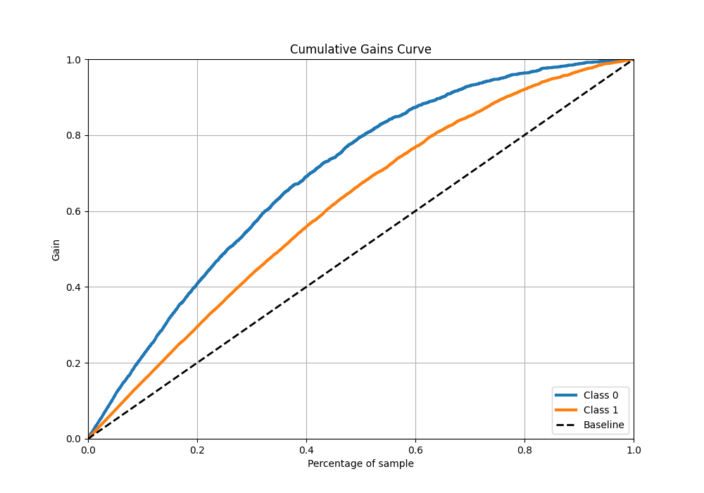
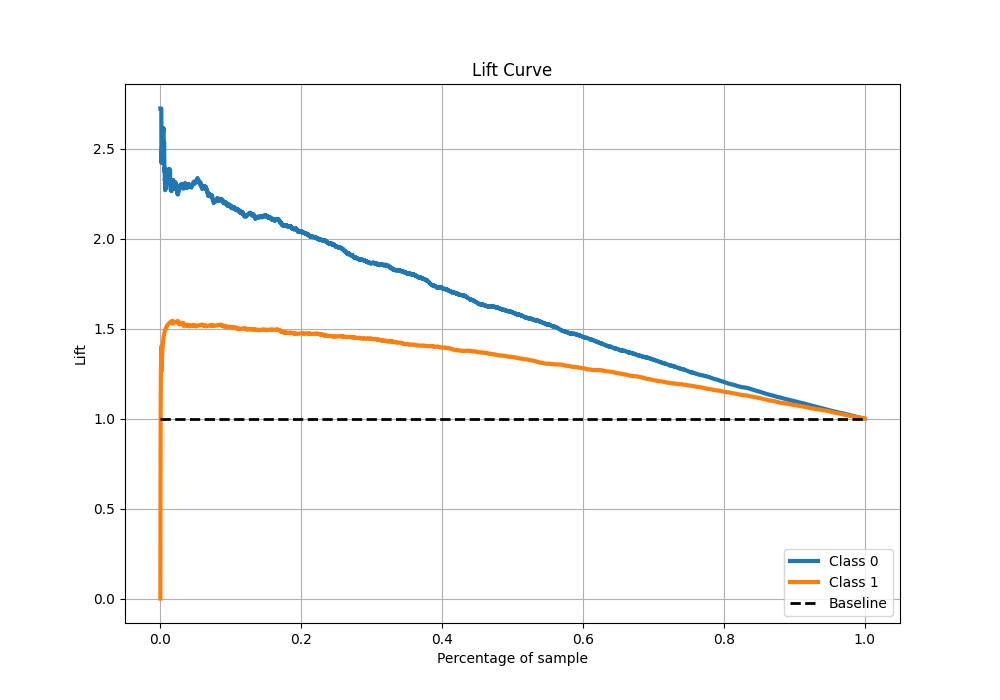

# Summary of 65_NeuralNetwork

[<< Go back](../README.md)

## Neural Network
- **n_jobs**: -1
- **dense_1_size**: 16
- **dense_2_size**: 32
- **learning_rate**: 0.08
- **explain_level**: 1

## Validation
 - **validation_type**: kfold
 - **k_folds**: 10
 - **shuffle**: True
 - **stratify**: True
 - **random_seed**: 12

## Optimized metric
f1

## Training time

14.1 seconds

## Metric details
|           |    score |     threshold |
|:----------|---------:|--------------:|
| logloss   | 0.517884 | nan           |
| auc       | 0.807294 | nan           |
| f1        | 0.814652 |   0.417601    |
| accuracy  | 0.749278 |   0.491493    |
| precision | 0.965986 |   0.994099    |
| recall    | 1        |   4.88261e-09 |
| mcc       | 0.456911 |   0.551442    |

## Metric details with threshold from accuracy metric
|           |    score |   threshold |
|:----------|---------:|------------:|
| logloss   | 0.517884 |  nan        |
| auc       | 0.807294 |  nan        |
| f1        | 0.808467 |    0.491493 |
| accuracy  | 0.749278 |    0.491493 |
| precision | 0.782807 |    0.491493 |
| recall    | 0.835866 |    0.491493 |
| mcc       | 0.448758 |    0.491493 |

## Confusion matrix (at threshold=0.491493)
|              |   Predicted as 0 |   Predicted as 1 |
|:-------------|-----------------:|-----------------:|
| Labeled as 0 |             1144 |              763 |
| Labeled as 1 |              540 |             2750 |

## Learning curves

## Permutation-based Importance

## Confusion Matrix

## Normalized Confusion Matrix

## ROC Curve

## Kolmogorov-Smirnov Statistic

## Precision-Recall Curve

## Calibration Curve

## Cumulative Gains Curve

## Lift Curve

[<< Go back](../README.md)
