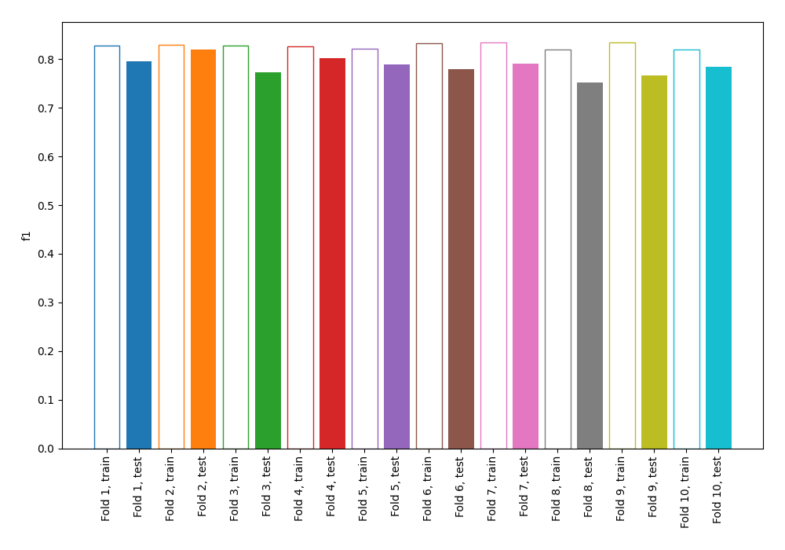
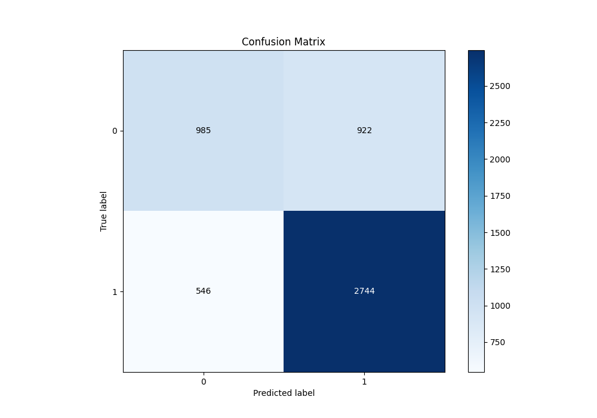
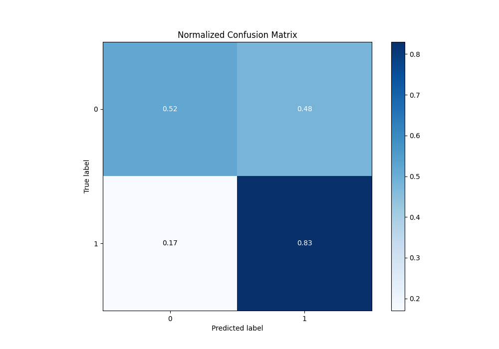
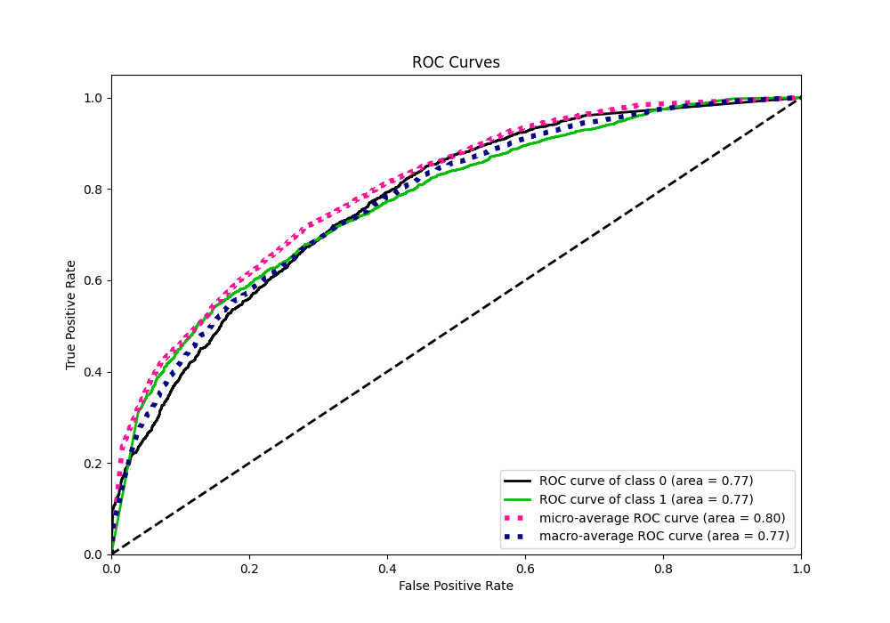
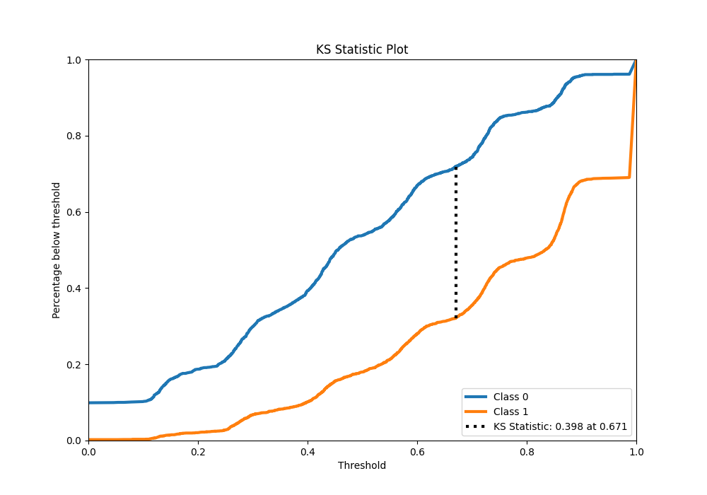
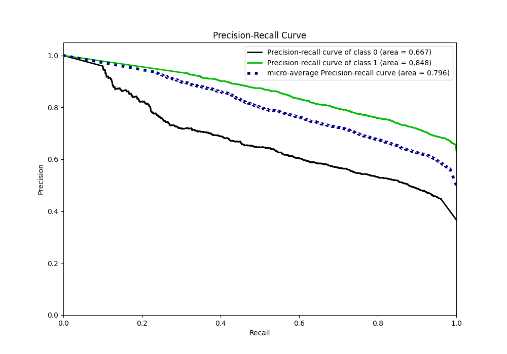
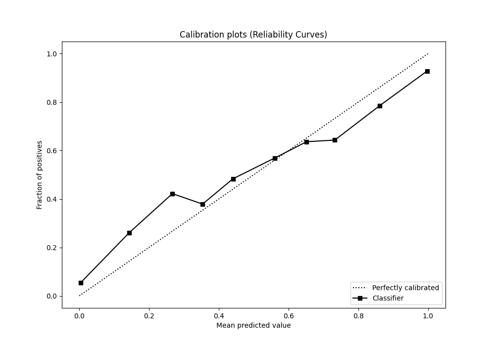
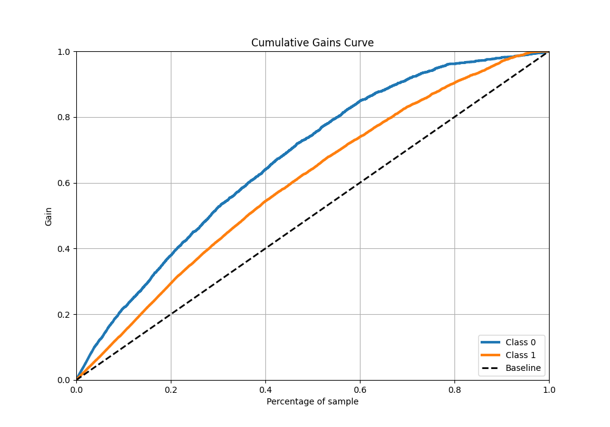
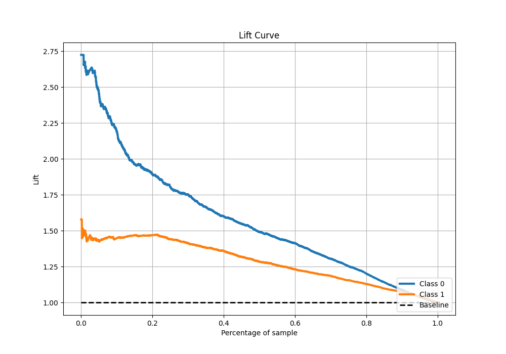

# Summary of 67_NearestNeighbors

[<< Go back](../README.md)

## k-Nearest Neighbors (Nearest Neighbors)
- **n_jobs**: -1
- **n_neighbors**: 7
- **weights**: distance
- **explain_level**: 1

## Validation
 - **validation_type**: kfold
 - **k_folds**: 10
 - **shuffle**: True
 - **stratify**: True
 - **random_seed**: 12

## Optimized metric
f1

## Training time

5.4 seconds

## Metric details
|           |    score |   threshold |
|:----------|---------:|------------:|
| logloss   | 0.739282 |  nan        |
| auc       | 0.773295 |  nan        |
| f1        | 0.800652 |    0.254199 |
| accuracy  | 0.717529 |    0.468562 |
| precision | 0.9319   |    0.907612 |
| recall    | 0.997568 |    0        |
| mcc       | 0.385333 |    0.751839 |

## Metric details with threshold from accuracy metric
|           |    score |   threshold |
|:----------|---------:|------------:|
| logloss   | 0.739282 |  nan        |
| auc       | 0.773295 |  nan        |
| f1        | 0.788959 |    0.468562 |
| accuracy  | 0.717529 |    0.468562 |
| precision | 0.7485   |    0.468562 |
| recall    | 0.834043 |    0.468562 |
| mcc       | 0.37064  |    0.468562 |

## Confusion matrix (at threshold=0.468562)
|              |   Predicted as 0 |   Predicted as 1 |
|:-------------|-----------------:|-----------------:|
| Labeled as 0 |              985 |              922 |
| Labeled as 1 |              546 |             2744 |

## Learning curves

## Confusion Matrix

## Normalized Confusion Matrix

## ROC Curve

## Kolmogorov-Smirnov Statistic

## Precision-Recall Curve

## Calibration Curve

## Cumulative Gains Curve

## Lift Curve

[<< Go back](../README.md)
