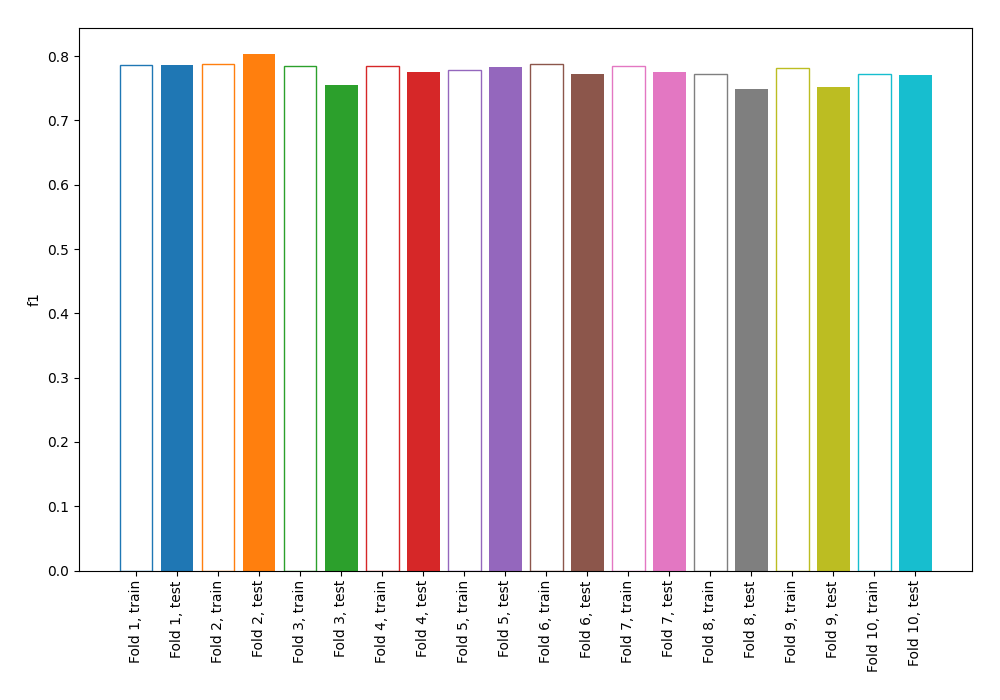
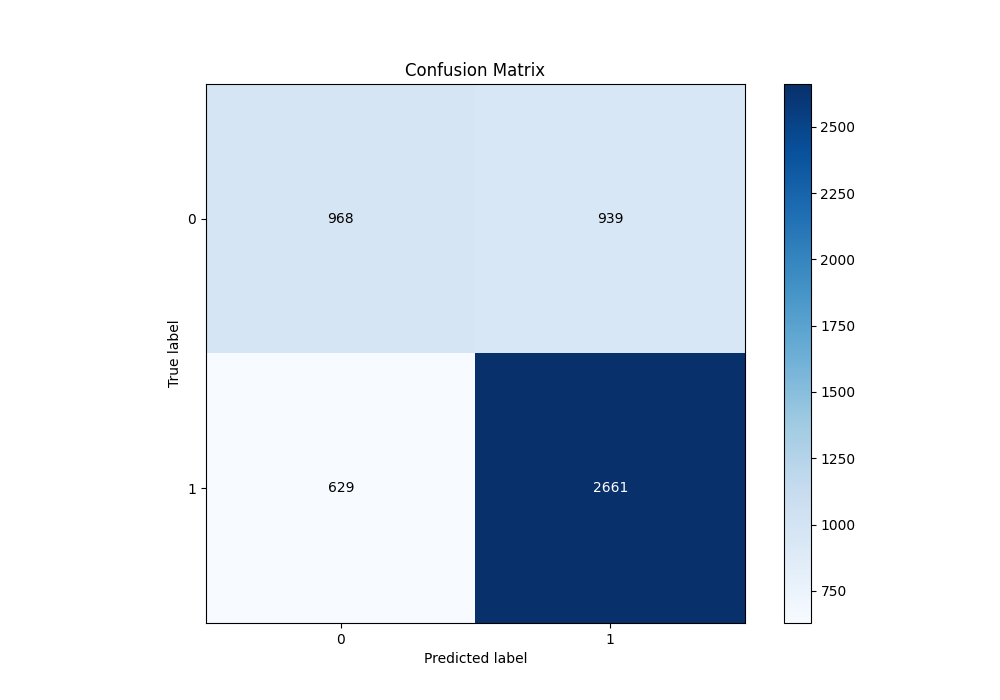
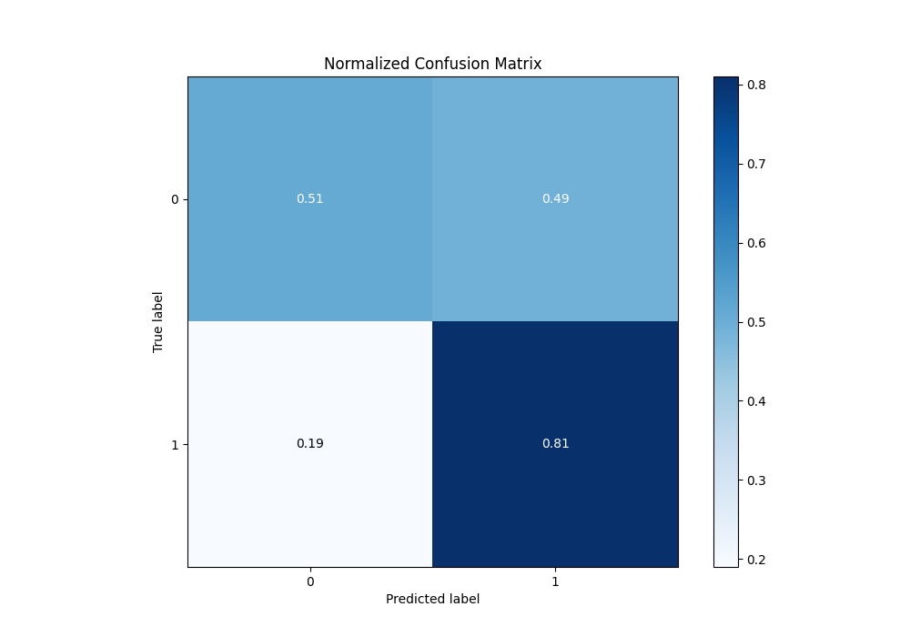
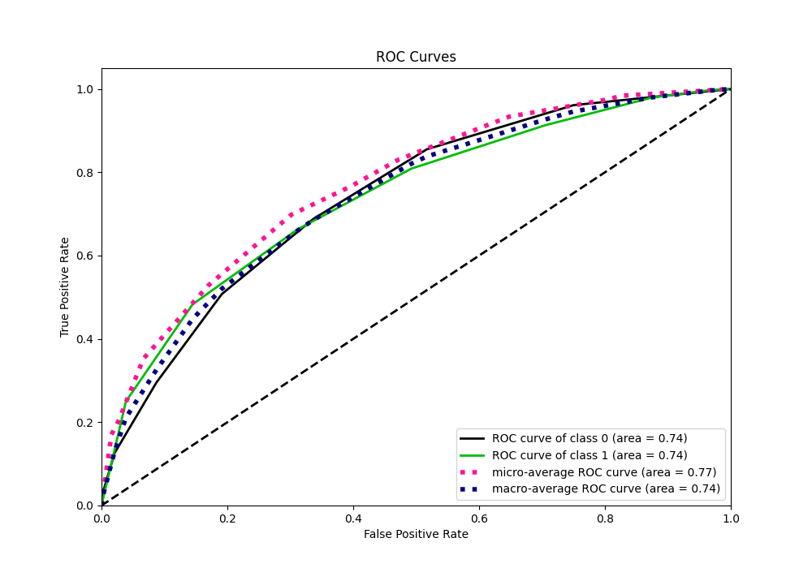
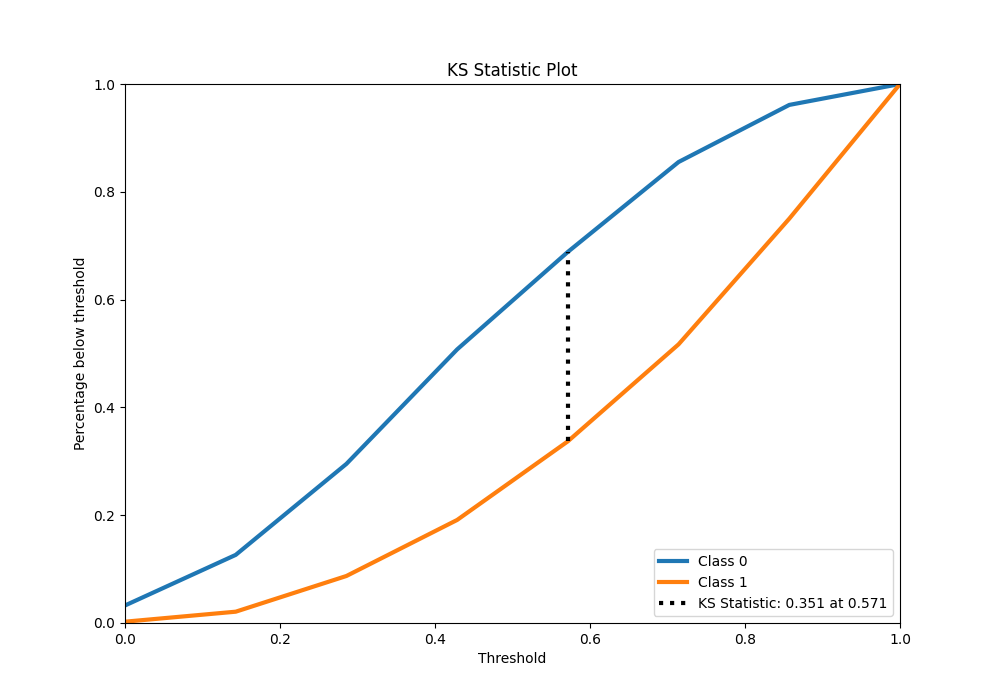
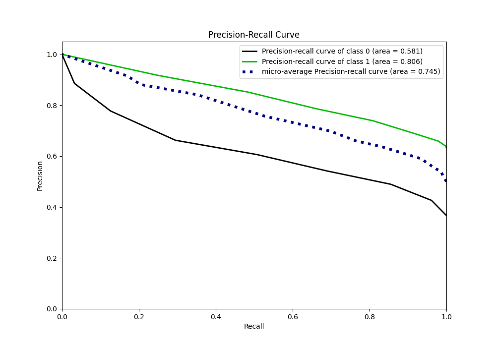
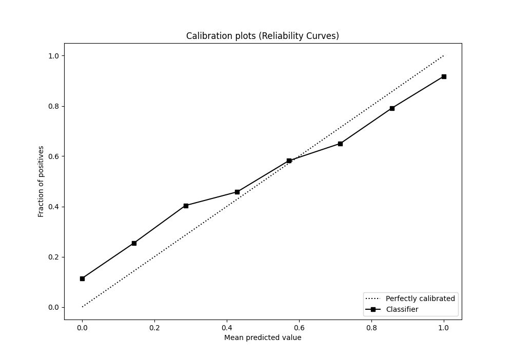
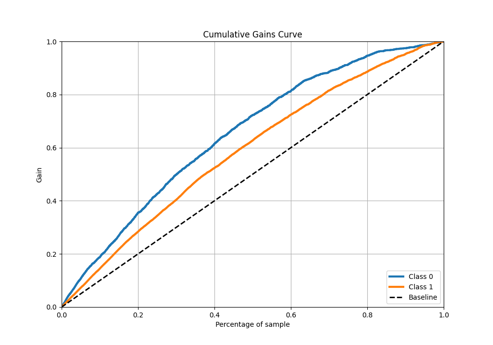
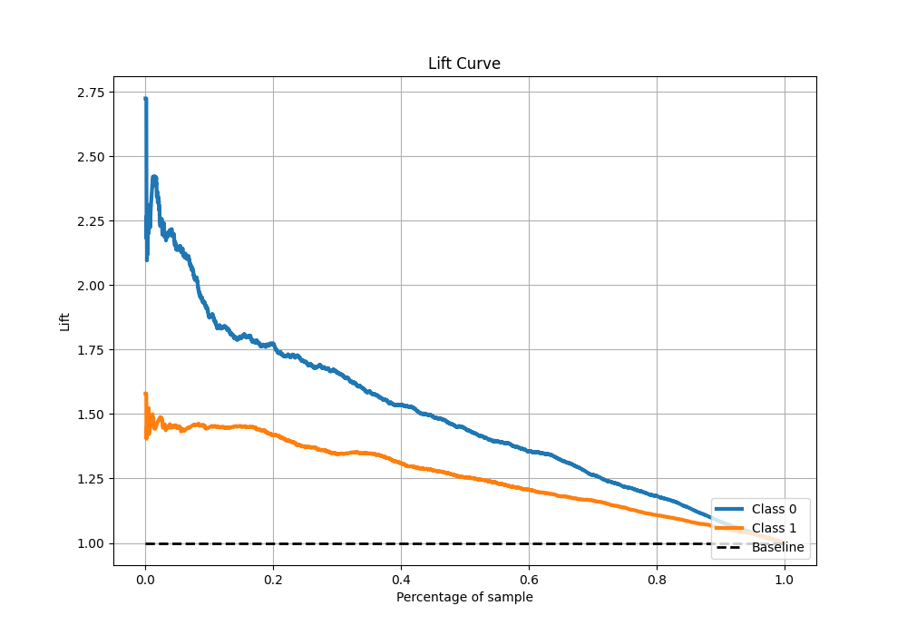

# Summary of 71_NearestNeighbors

[<< Go back](../README.md)

## k-Nearest Neighbors (Nearest Neighbors)
- **n_jobs**: -1
- **n_neighbors**: 7
- **weights**: uniform
- **explain_level**: 1

## Validation
 - **validation_type**: kfold
 - **k_folds**: 10
 - **shuffle**: True
 - **stratify**: True
 - **random_seed**: 12

## Optimized metric
f1

## Training time

7.9 seconds

## Metric details
|           |    score |   threshold |
|:----------|---------:|------------:|
| logloss   | 0.773763 |  nan        |
| auc       | 0.740094 |  nan        |
| f1        | 0.787819 |    0.142857 |
| accuracy  | 0.698287 |    0.428571 |
| precision | 0.917411 |    0.857143 |
| recall    | 0.997568 |    0        |
| mcc       | 0.339874 |    0.714286 |

## Metric details with threshold from accuracy metric
|           |    score |   threshold |
|:----------|---------:|------------:|
| logloss   | 0.773763 |  nan        |
| auc       | 0.740094 |  nan        |
| f1        | 0.772424 |    0.428571 |
| accuracy  | 0.698287 |    0.428571 |
| precision | 0.739167 |    0.428571 |
| recall    | 0.808815 |    0.428571 |
| mcc       | 0.330545 |    0.428571 |

## Confusion matrix (at threshold=0.428571)
|              |   Predicted as 0 |   Predicted as 1 |
|:-------------|-----------------:|-----------------:|
| Labeled as 0 |              968 |              939 |
| Labeled as 1 |              629 |             2661 |

## Learning curves

## Confusion Matrix

## Normalized Confusion Matrix

## ROC Curve

## Kolmogorov-Smirnov Statistic

## Precision-Recall Curve

## Calibration Curve

## Cumulative Gains Curve

## Lift Curve

[<< Go back](../README.md)
