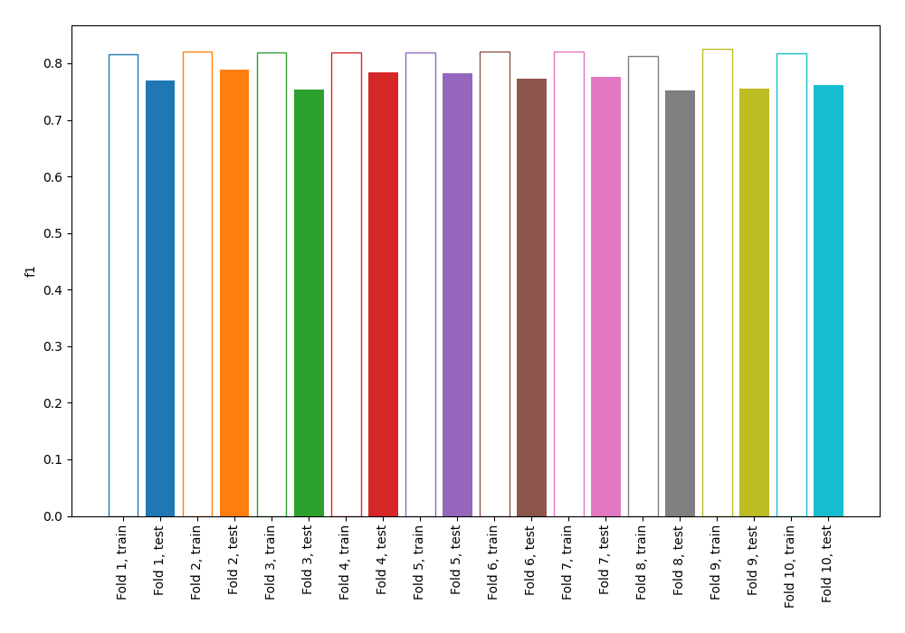
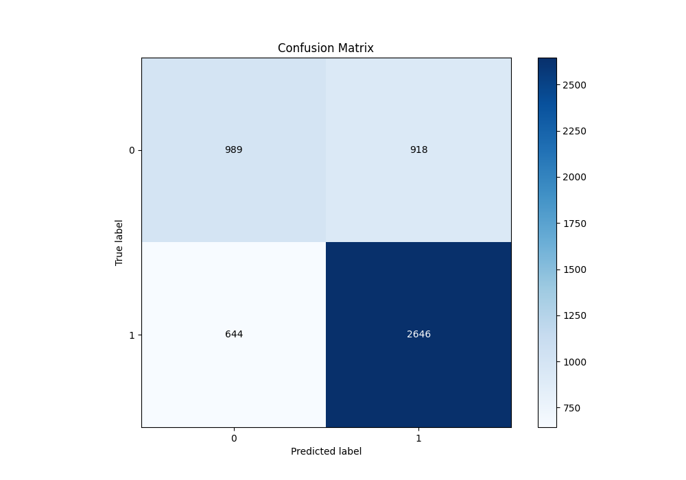
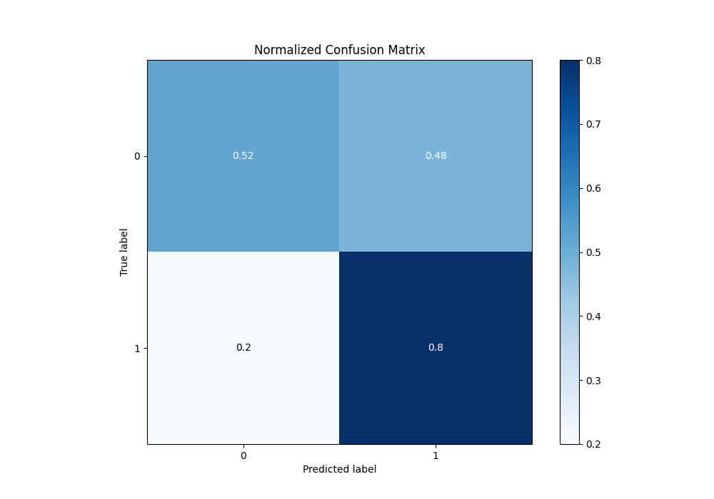
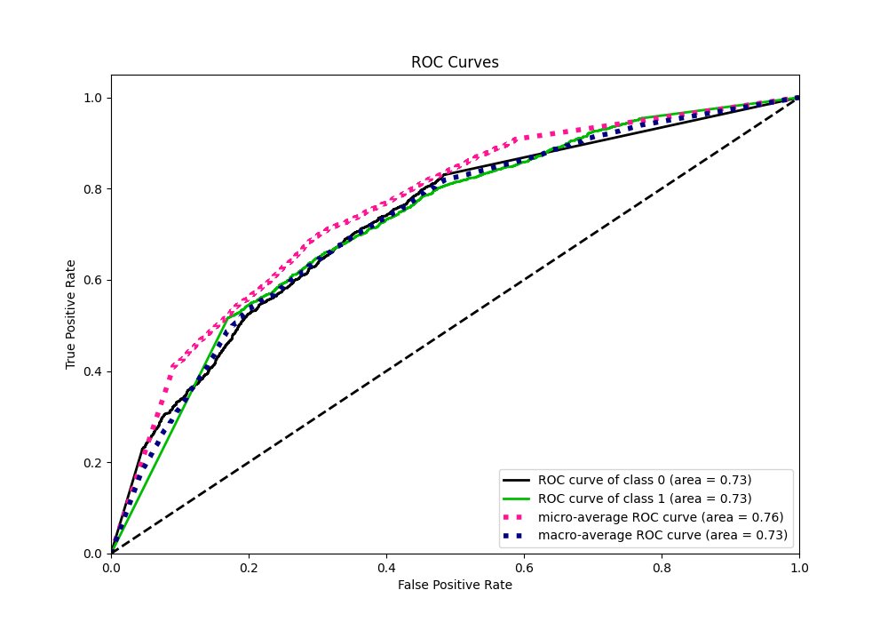
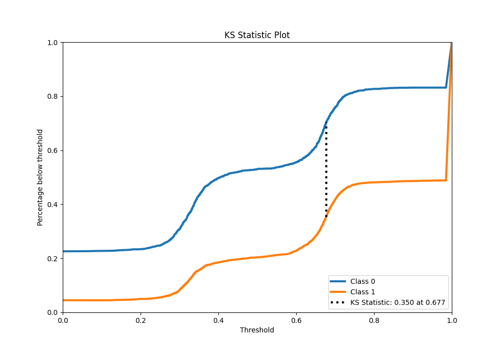
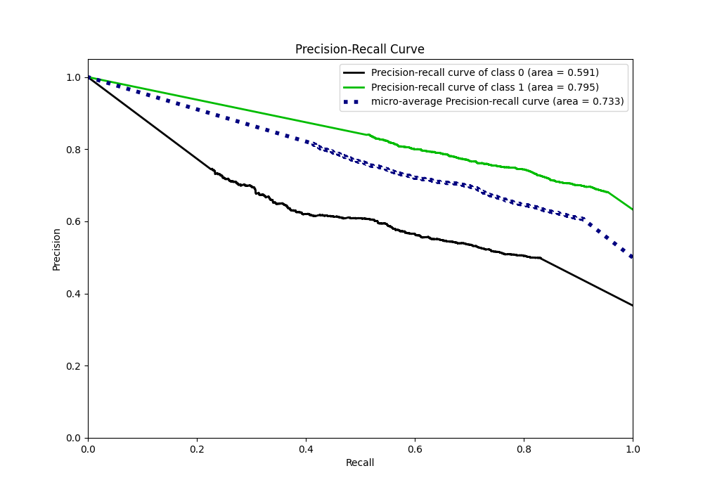
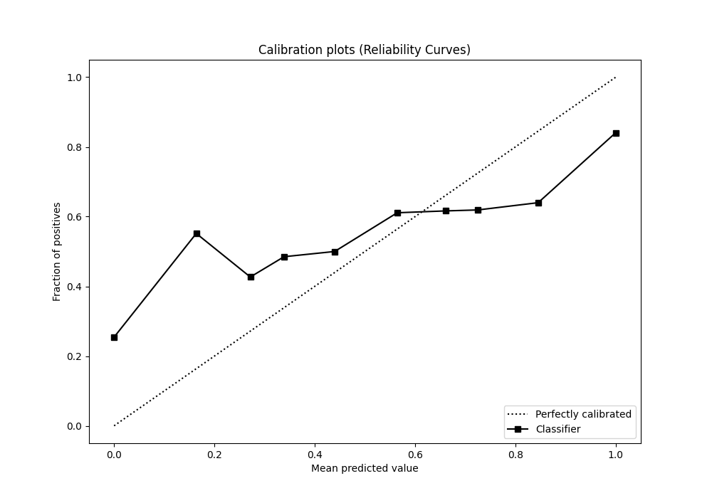
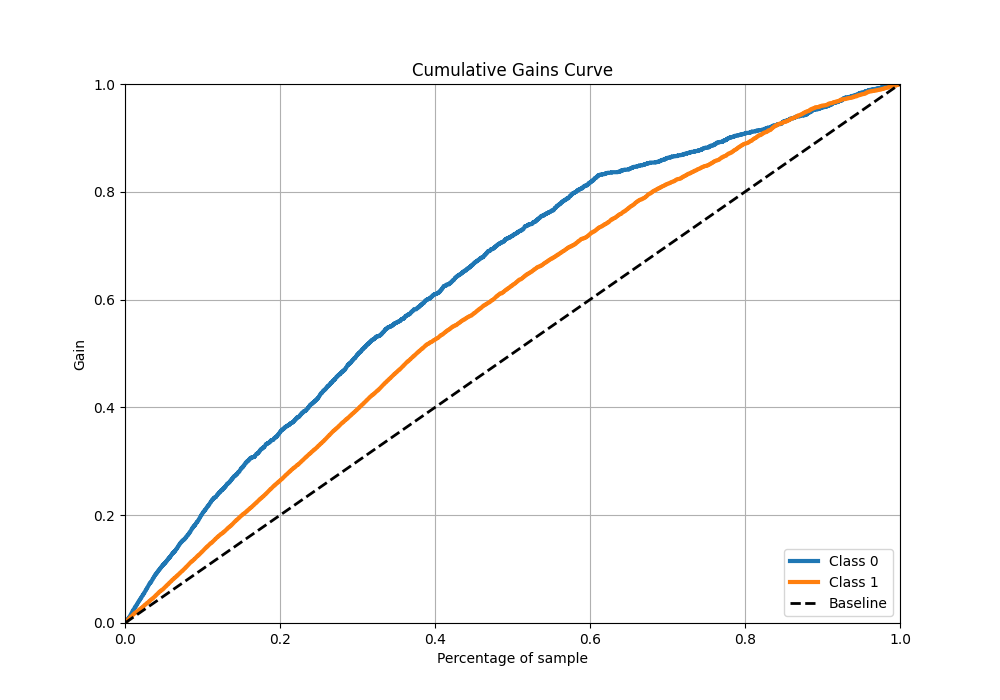
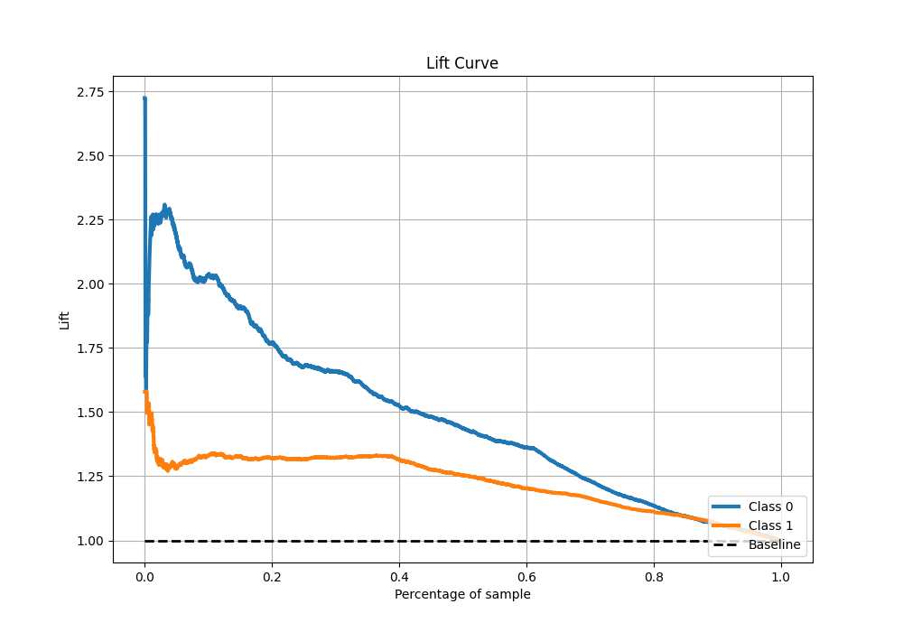

# Summary of 72_NearestNeighbors

[<< Go back](../README.md)

## k-Nearest Neighbors (Nearest Neighbors)
- **n_jobs**: -1
- **n_neighbors**: 3
- **weights**: distance
- **explain_level**: 1

## Validation
 - **validation_type**: kfold
 - **k_folds**: 10
 - **shuffle**: True
 - **stratify**: True
 - **random_seed**: 12

## Optimized metric
f1

## Training time

8.1 seconds

## Metric details
|           |    score |   threshold |
|:----------|---------:|------------:|
| logloss   | 1.7929   |  nan        |
| auc       | 0.728556 |  nan        |
| f1        | 0.794638 |    0        |
| accuracy  | 0.699442 |    0.447293 |
| precision | 0.837758 |    0.815424 |
| recall    | 0.955015 |    0        |
| mcc       | 0.340584 |    0.815424 |

## Metric details with threshold from accuracy metric
|           |    score |   threshold |
|:----------|---------:|------------:|
| logloss   | 1.7929   |  nan        |
| auc       | 0.728556 |  nan        |
| f1        | 0.772104 |    0.447293 |
| accuracy  | 0.699442 |    0.447293 |
| precision | 0.742424 |    0.447293 |
| recall    | 0.804255 |    0.447293 |
| mcc       | 0.335228 |    0.447293 |

## Confusion matrix (at threshold=0.447293)
|              |   Predicted as 0 |   Predicted as 1 |
|:-------------|-----------------:|-----------------:|
| Labeled as 0 |              989 |              918 |
| Labeled as 1 |              644 |             2646 |

## Learning curves

## Confusion Matrix

## Normalized Confusion Matrix

## ROC Curve

## Kolmogorov-Smirnov Statistic

## Precision-Recall Curve

## Calibration Curve

## Cumulative Gains Curve

## Lift Curve

[<< Go back](../README.md)
