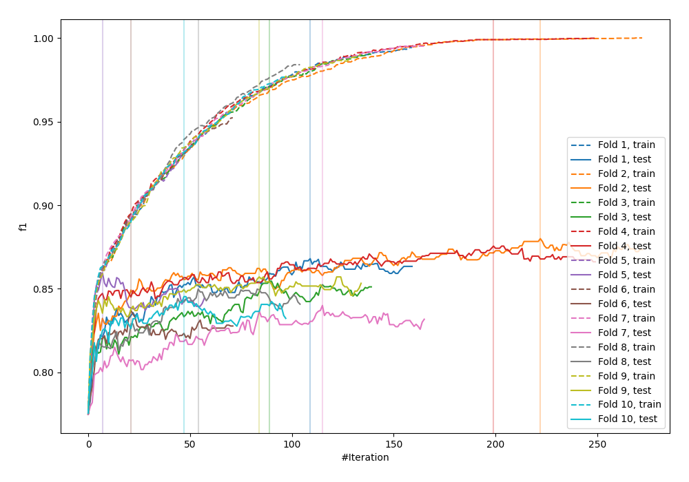
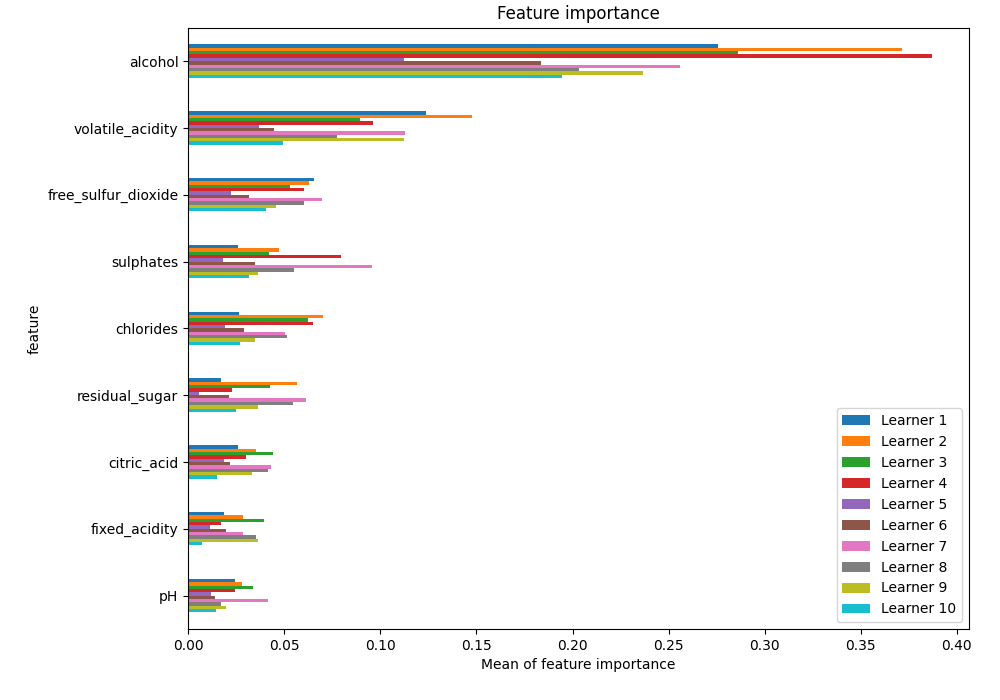
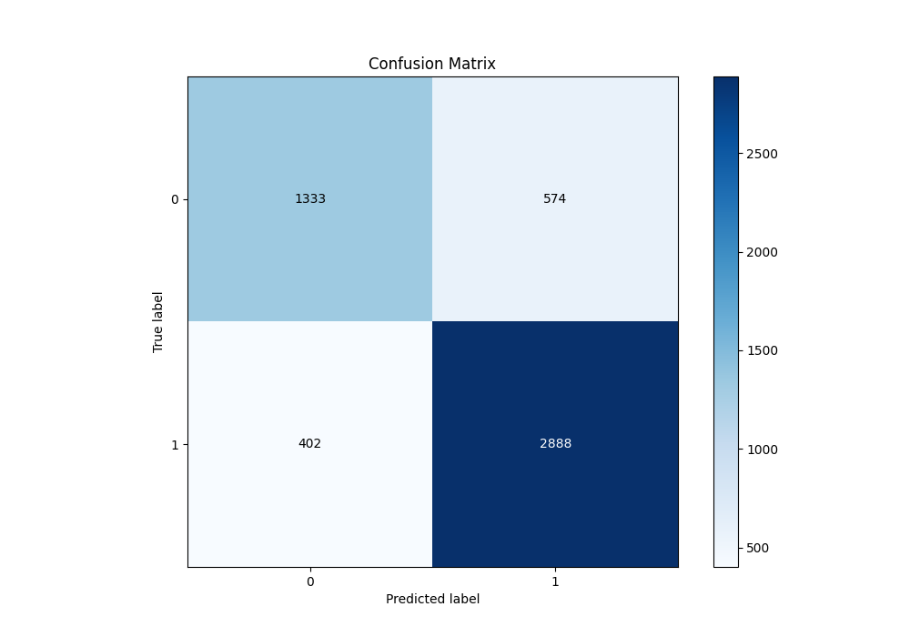
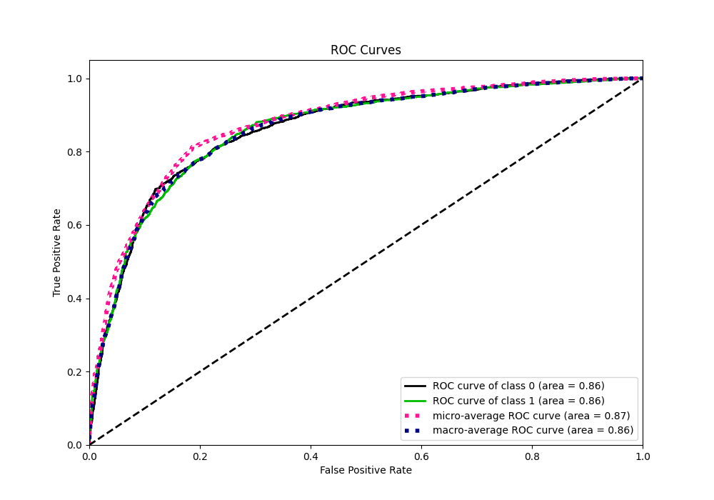
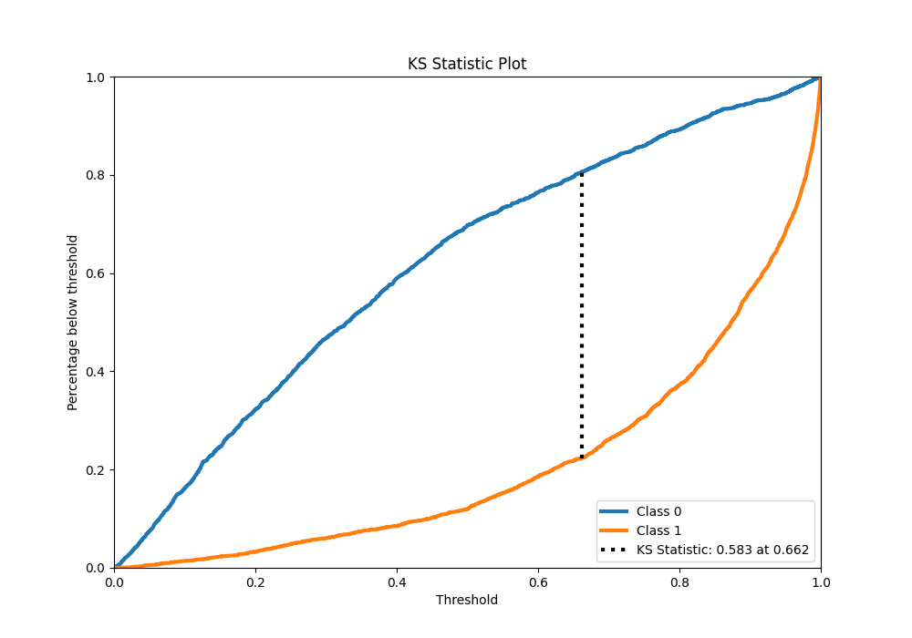
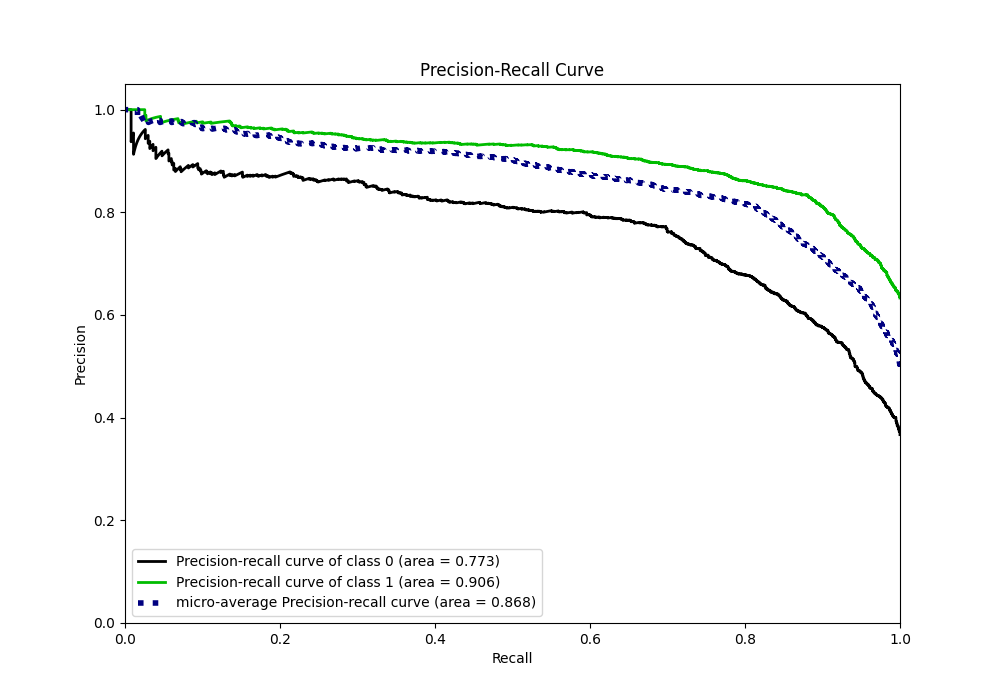
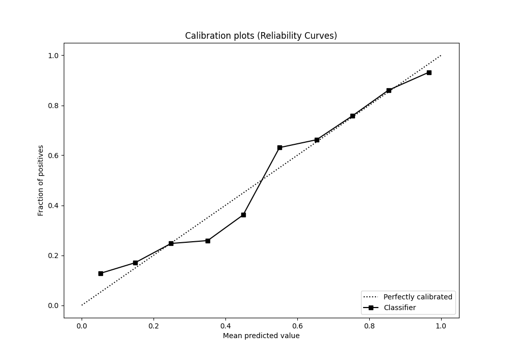
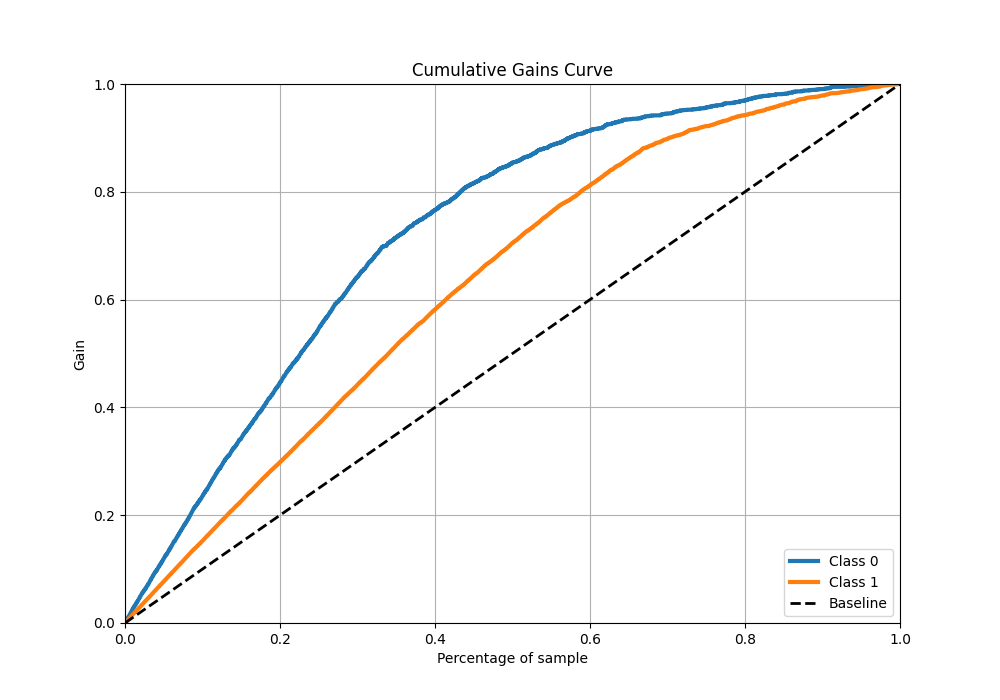
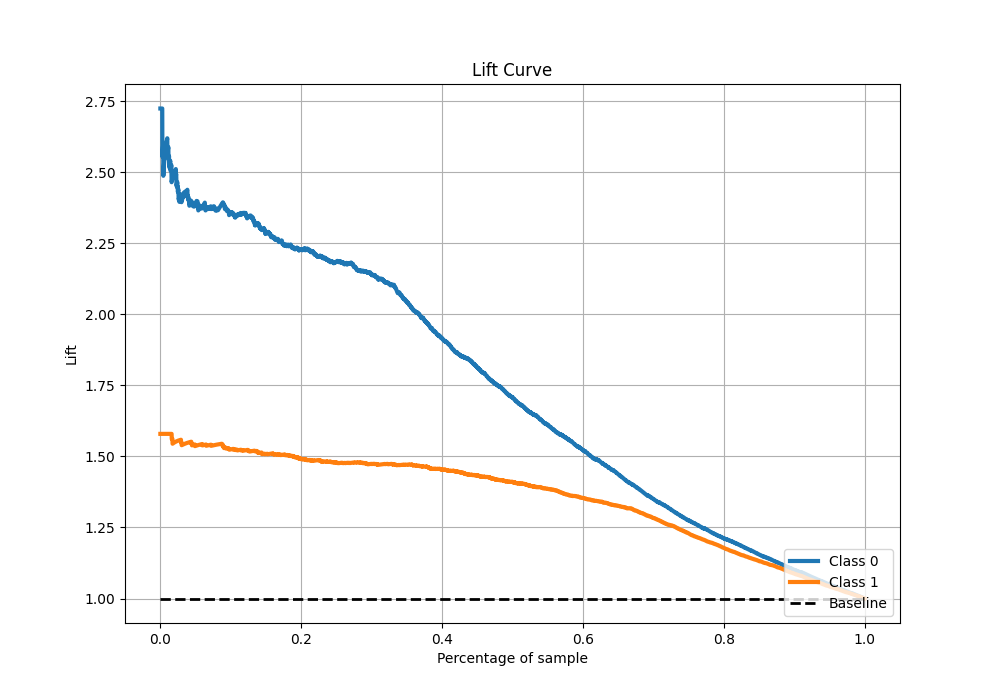

# Summary of 74_LightGBM

[<< Go back](../README.md)

## LightGBM
- **n_jobs**: -1
- **objective**: binary
- **num_leaves**: 31
- **learning_rate**: 0.2
- **feature_fraction**: 0.5
- **bagging_fraction**: 1.0
- **min_data_in_leaf**: 10
- **metric**: custom
- **custom_eval_metric_name**: f1
- **explain_level**: 1

## Validation
 - **validation_type**: kfold
 - **k_folds**: 10
 - **shuffle**: True
 - **stratify**: True
 - **random_seed**: 12

## Optimized metric
f1

## Training time

21.3 seconds

## Metric details
|           |    score |    threshold |
|:----------|---------:|-------------:|
| logloss   | 0.454294 | nan          |
| auc       | 0.861183 | nan          |
| f1        | 0.855505 |   0.486481   |
| accuracy  | 0.812199 |   0.502764   |
| precision | 0.986395 |   0.997563   |
| recall    | 1        |   0.00179518 |
| mcc       | 0.589518 |   0.502764   |

## Metric details with threshold from accuracy metric
|           |    score |   threshold |
|:----------|---------:|------------:|
| logloss   | 0.454294 |  nan        |
| auc       | 0.861183 |  nan        |
| f1        | 0.85545  |    0.502764 |
| accuracy  | 0.812199 |    0.502764 |
| precision | 0.8342   |    0.502764 |
| recall    | 0.877812 |    0.502764 |
| mcc       | 0.589518 |    0.502764 |

## Confusion matrix (at threshold=0.502764)
|              |   Predicted as 0 |   Predicted as 1 |
|:-------------|-----------------:|-----------------:|
| Labeled as 0 |             1333 |              574 |
| Labeled as 1 |              402 |             2888 |

## Learning curves

## Permutation-based Importance

## Confusion Matrix

## Normalized Confusion Matrix

## ROC Curve

## Kolmogorov-Smirnov Statistic

## Precision-Recall Curve

## Calibration Curve

## Cumulative Gains Curve

## Lift Curve

[<< Go back](../README.md)
