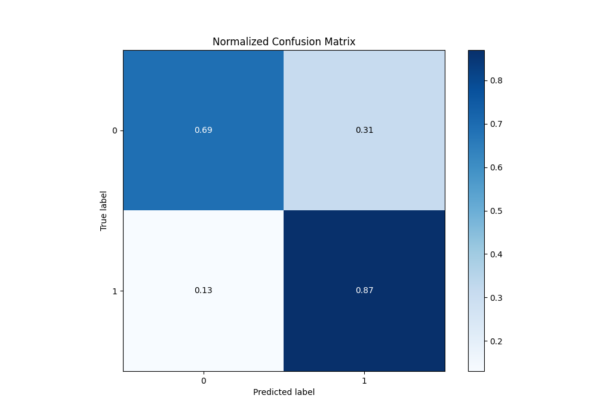

# Summary of 78_CatBoost

[<< Go back](../README.md)

## CatBoost
- **n_jobs**: -1
- **learning_rate**: 0.2
- **depth**: 7
- **rsm**: 1.0
- **loss_function**: Logloss
- **eval_metric**: F1
- **explain_level**: 1

## Validation
 - **validation_type**: kfold
 - **k_folds**: 10
 - **shuffle**: True
 - **stratify**: True
 - **random_seed**: 12

## Optimized metric
f1

## Training time

13.1 seconds

## Metric details
|           |    score |    threshold |
|:----------|---------:|-------------:|
| logloss   | 0.448077 | nan          |
| auc       | 0.860953 | nan          |
| f1        | 0.849037 |   0.49316    |
| accuracy  | 0.802963 |   0.506867   |
| precision | 1        |   0.990879   |
| recall    | 1        |   0.00712704 |
| mcc       | 0.5692   |   0.506867   |

## Metric details with threshold from accuracy metric
|           |    score |   threshold |
|:----------|---------:|------------:|
| logloss   | 0.448077 |  nan        |
| auc       | 0.860953 |  nan        |
| f1        | 0.848341 |    0.506867 |
| accuracy  | 0.802963 |    0.506867 |
| precision | 0.827267 |    0.506867 |
| recall    | 0.870517 |    0.506867 |
| mcc       | 0.5692   |    0.506867 |

## Confusion matrix (at threshold=0.506867)
|              |   Predicted as 0 |   Predicted as 1 |
|:-------------|-----------------:|-----------------:|
| Labeled as 0 |             1309 |              598 |
| Labeled as 1 |              426 |             2864 |

## Learning curves

## Permutation-based Importance

## Confusion Matrix

## Normalized Confusion Matrix

## ROC Curve

## Kolmogorov-Smirnov Statistic

## Precision-Recall Curve

## Calibration Curve

## Cumulative Gains Curve

## Lift Curve

[<< Go back](../README.md)
