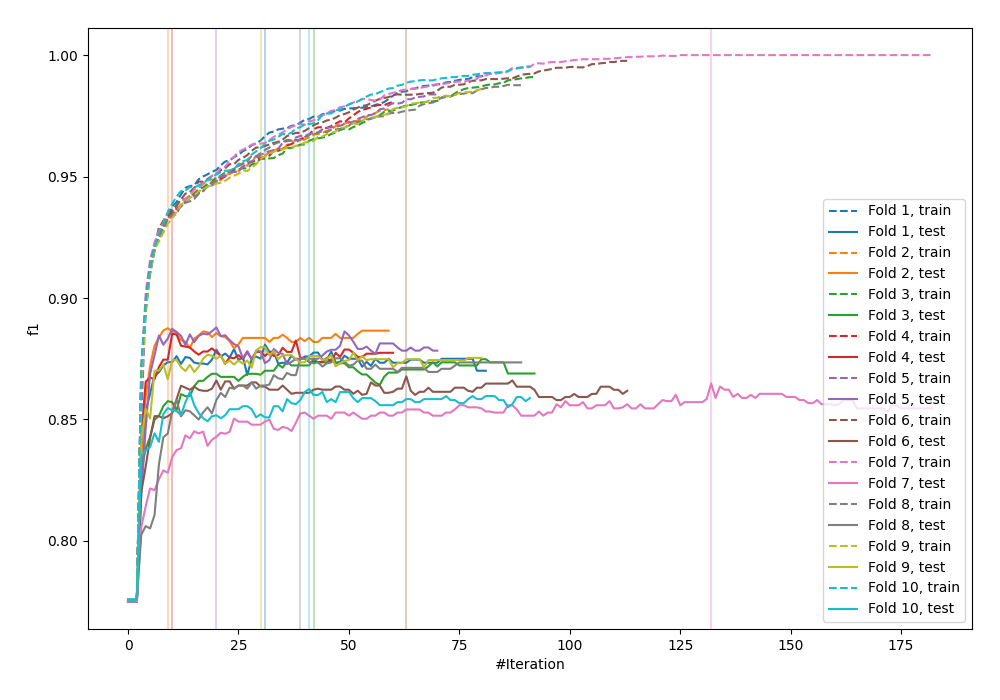
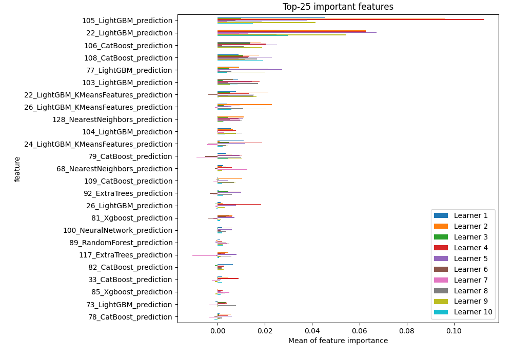
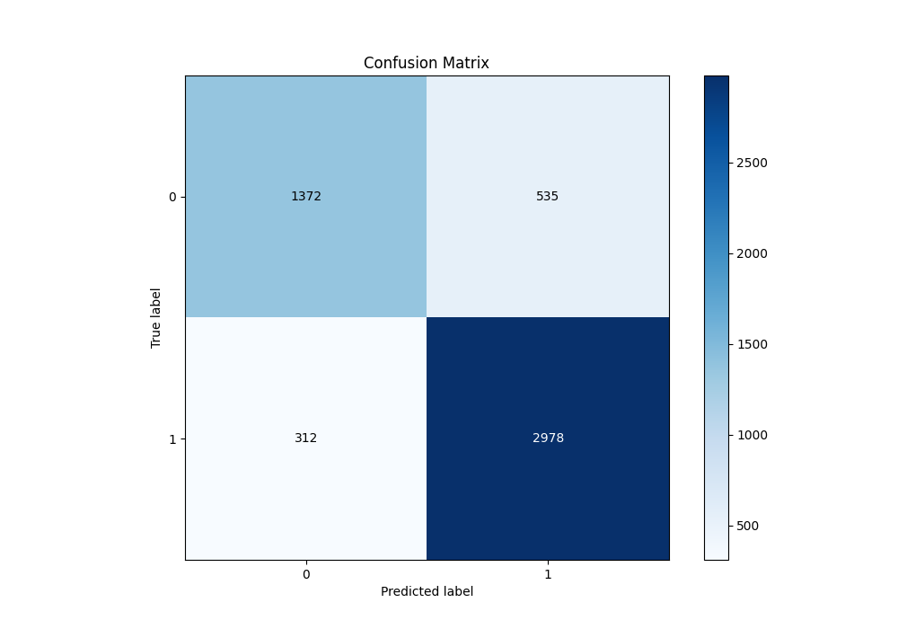
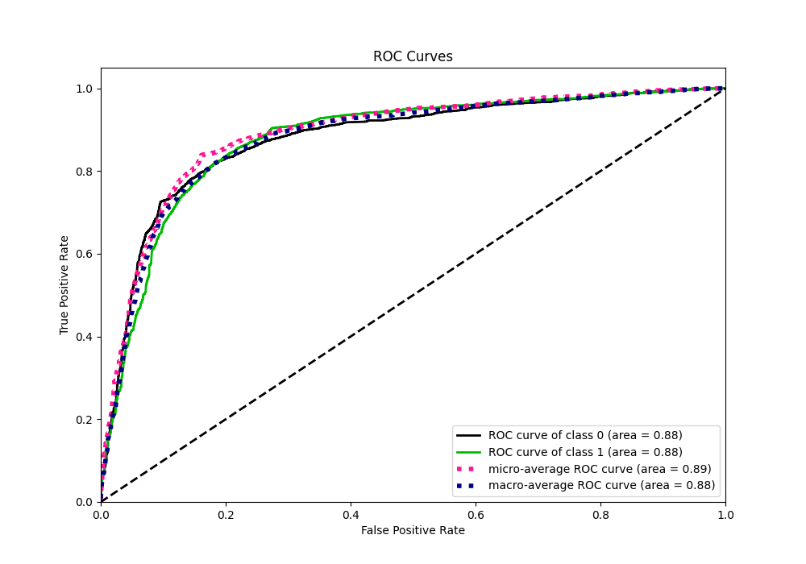
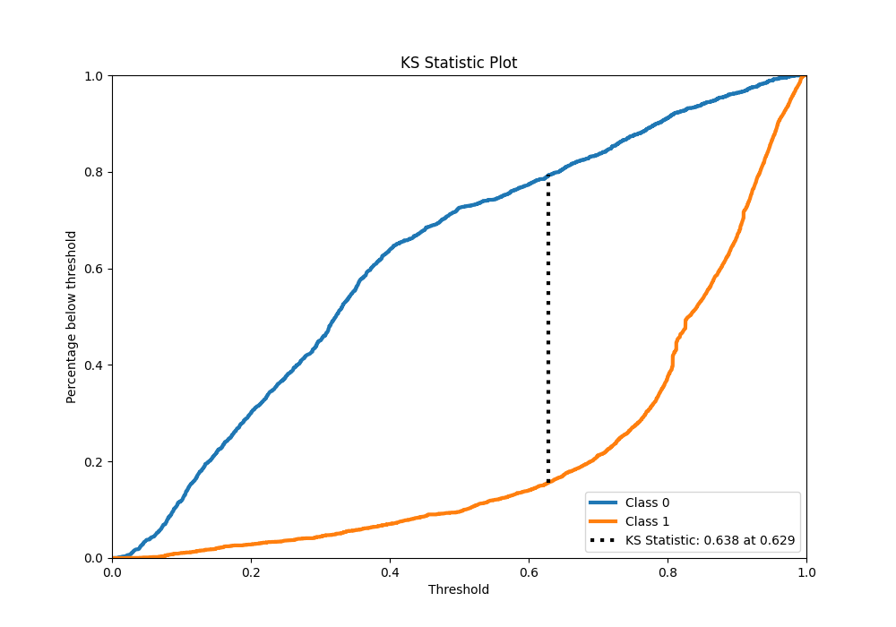
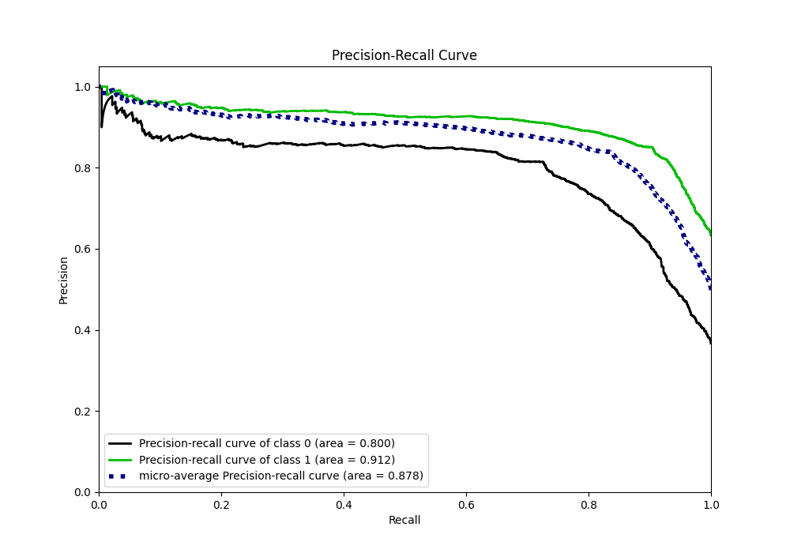
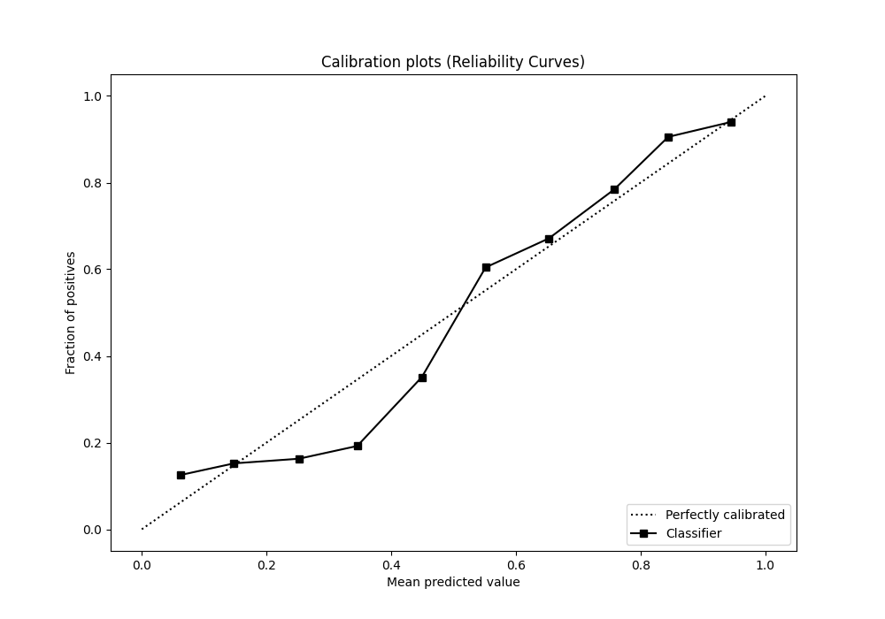
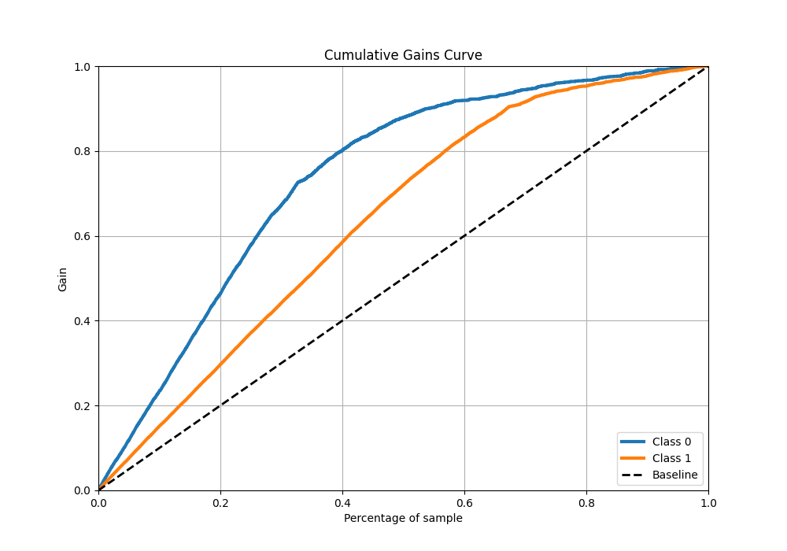
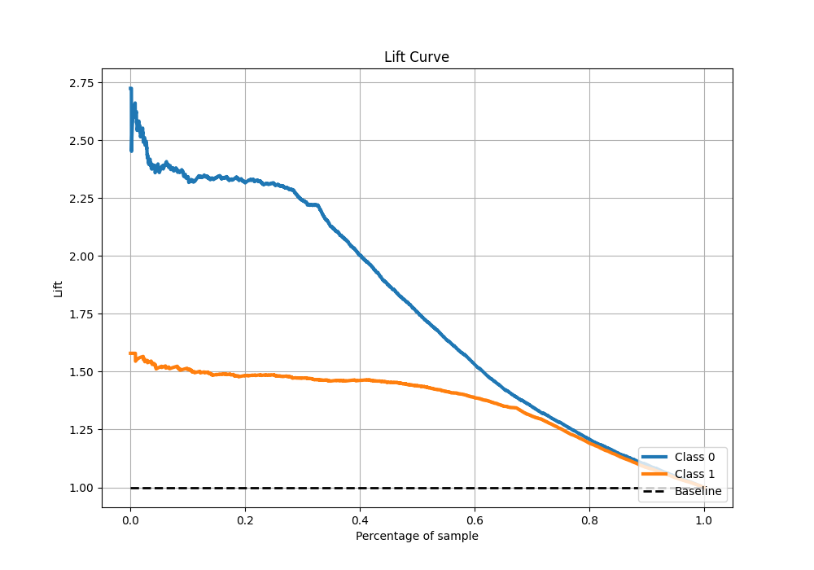

# Summary of 80_Xgboost_Stacked

[<< Go back](../README.md)

## Extreme Gradient Boosting (Xgboost)
- **n_jobs**: -1
- **objective**: binary:logistic
- **eta**: 0.075
- **max_depth**: 8
- **min_child_weight**: 1
- **subsample**: 1.0
- **colsample_bytree**: 1.0
- **eval_metric**: f1
- **explain_level**: 1

## Validation
 - **validation_type**: kfold
 - **k_folds**: 10
 - **shuffle**: True
 - **stratify**: True
 - **random_seed**: 12

## Optimized metric
f1

## Training time

26.8 seconds

## Metric details
|           |    score |    threshold |
|:----------|---------:|-------------:|
| logloss   | 0.421483 | nan          |
| auc       | 0.878324 | nan          |
| f1        | 0.875496 |   0.496179   |
| accuracy  | 0.837021 |   0.496179   |
| precision | 0.979592 |   0.979843   |
| recall    | 1        |   0.00827692 |
| mcc       | 0.643251 |   0.496179   |

## Metric details with threshold from accuracy metric
|           |    score |   threshold |
|:----------|---------:|------------:|
| logloss   | 0.421483 |  nan        |
| auc       | 0.878324 |  nan        |
| f1        | 0.875496 |    0.496179 |
| accuracy  | 0.837021 |    0.496179 |
| precision | 0.847709 |    0.496179 |
| recall    | 0.905167 |    0.496179 |
| mcc       | 0.643251 |    0.496179 |

## Confusion matrix (at threshold=0.496179)
|              |   Predicted as 0 |   Predicted as 1 |
|:-------------|-----------------:|-----------------:|
| Labeled as 0 |             1372 |              535 |
| Labeled as 1 |              312 |             2978 |

## Learning curves

## Permutation-based Importance

## Confusion Matrix

## Normalized Confusion Matrix

## ROC Curve

## Kolmogorov-Smirnov Statistic

## Precision-Recall Curve

## Calibration Curve

## Cumulative Gains Curve

## Lift Curve

[<< Go back](../README.md)
