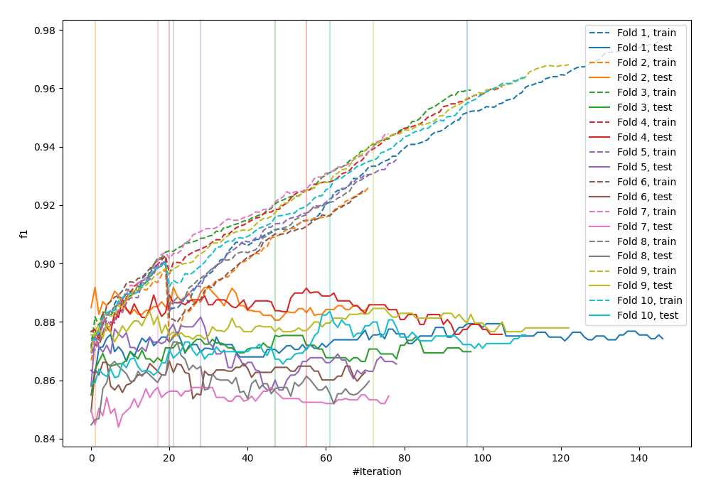
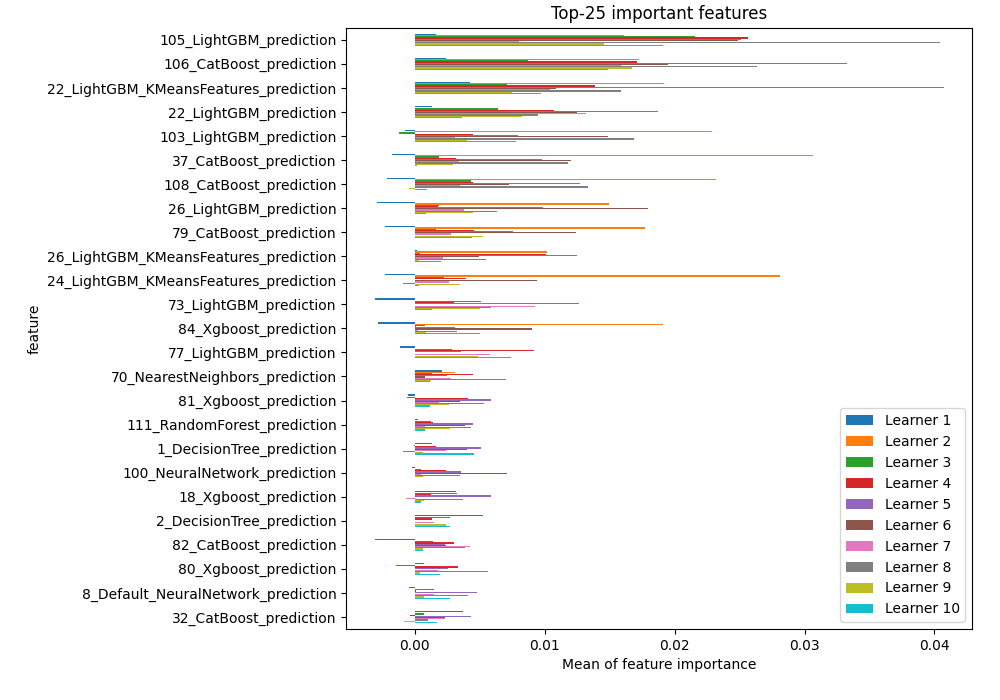
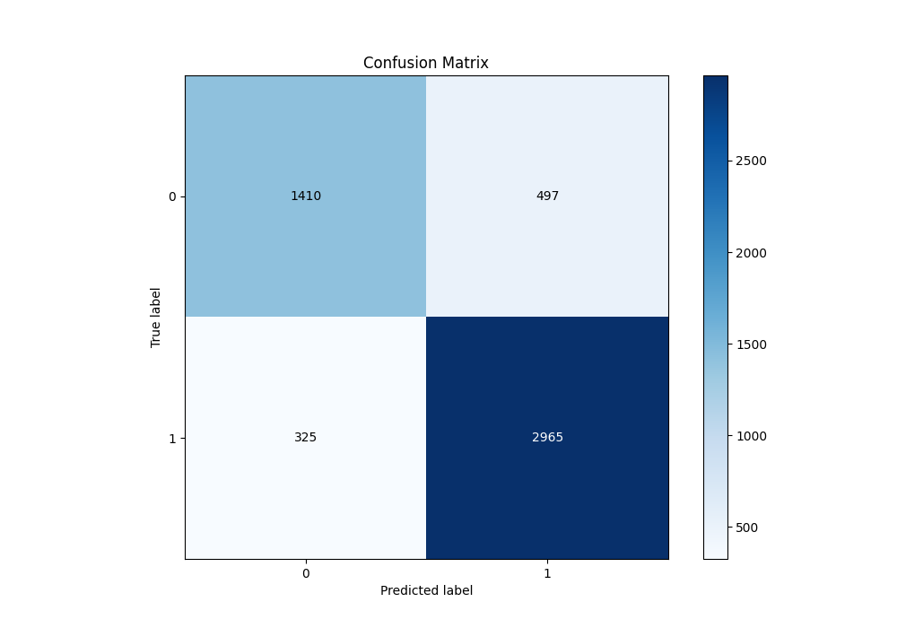
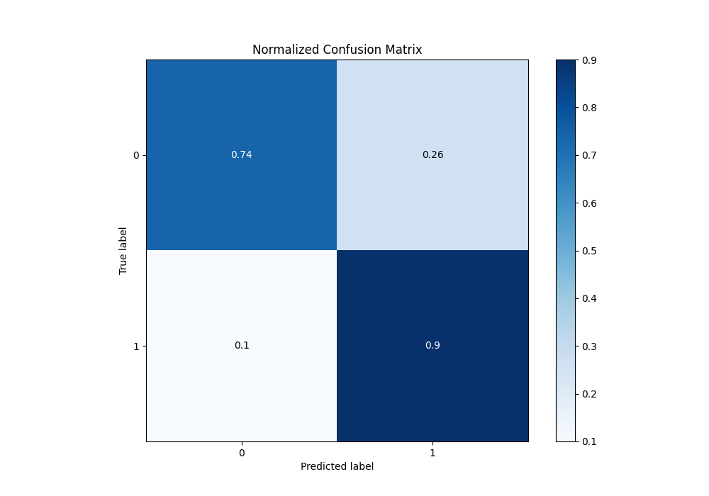
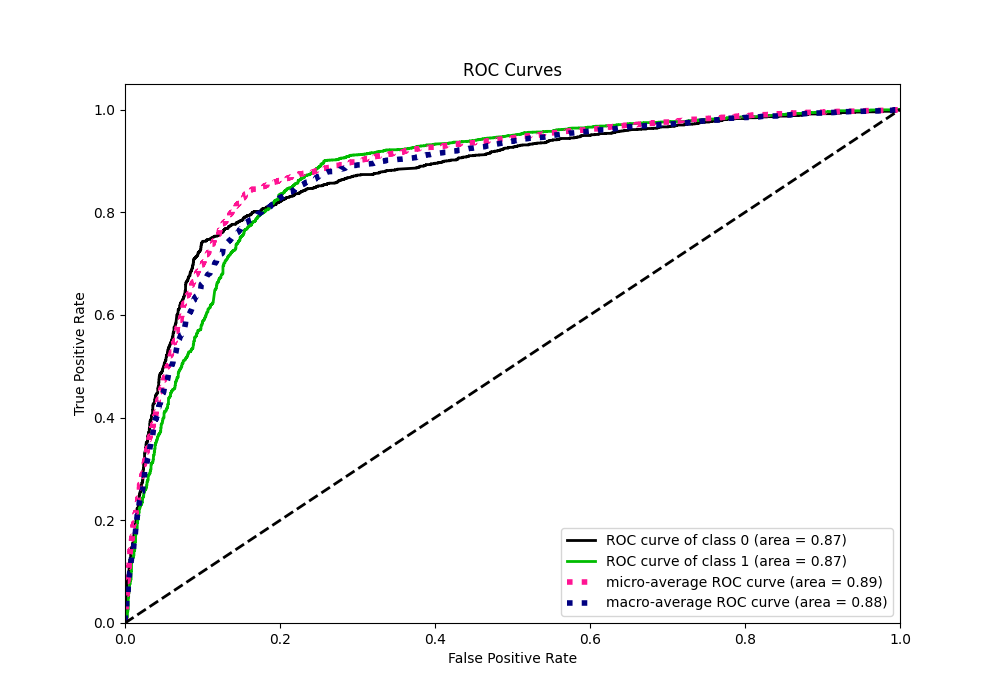
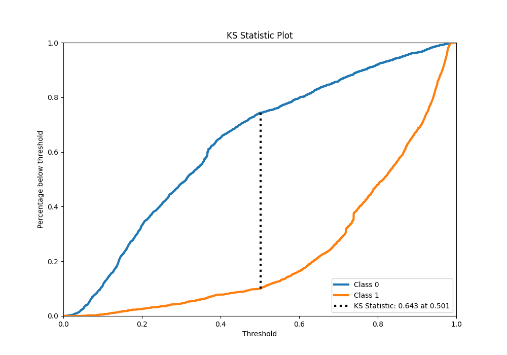
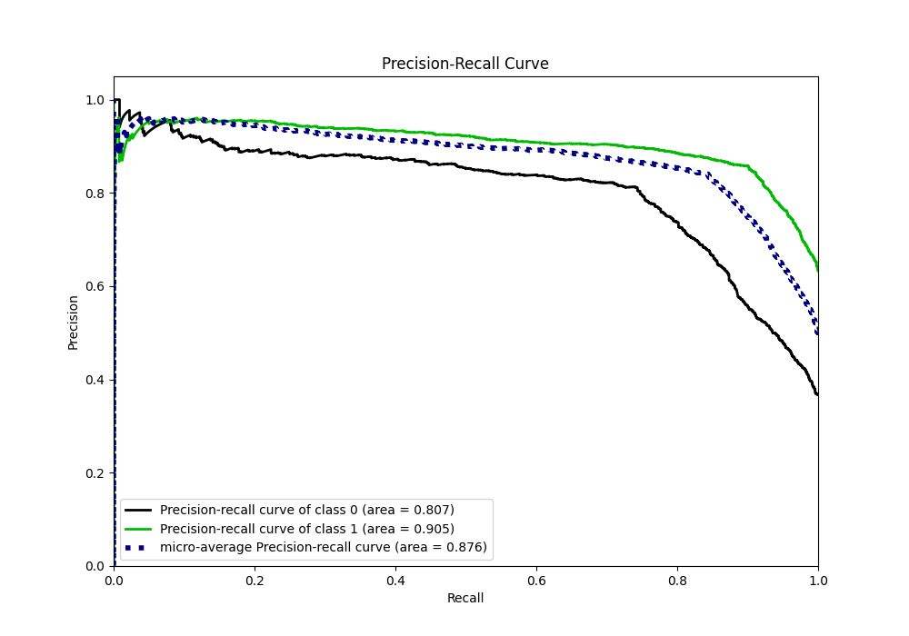
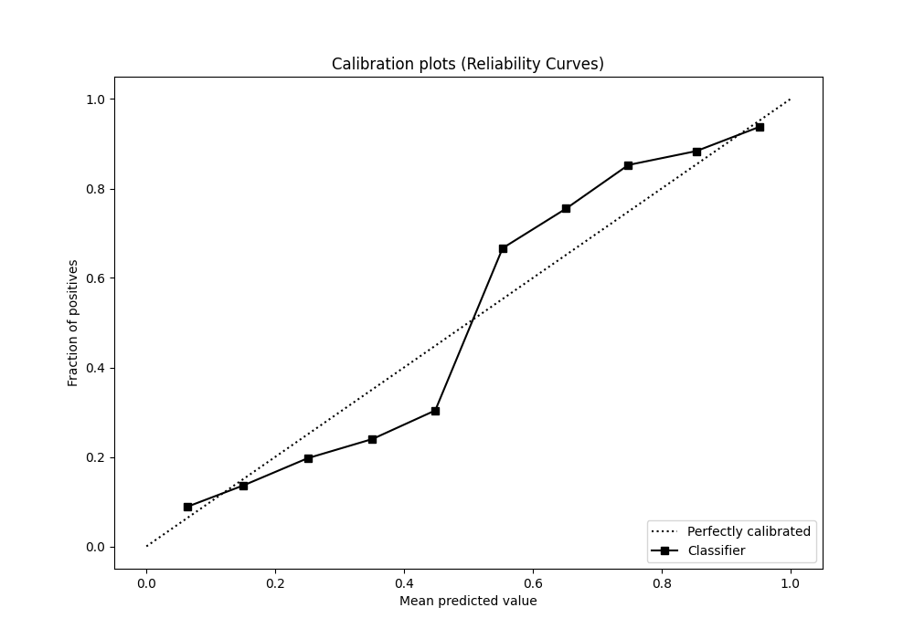
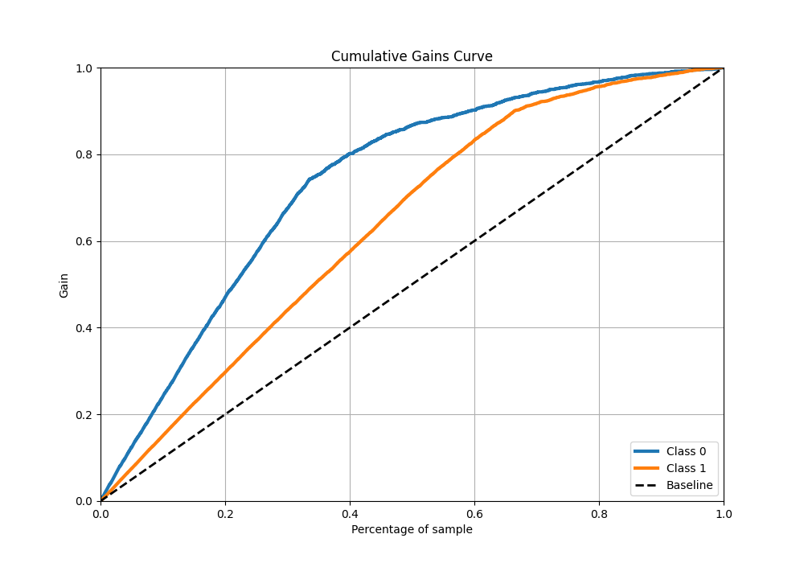
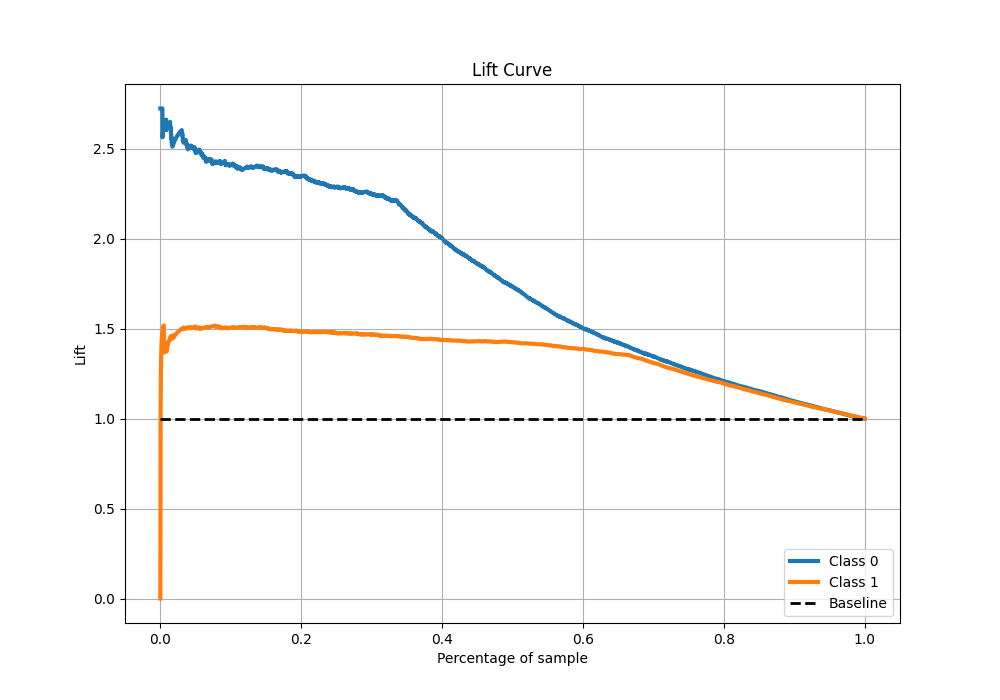

# Summary of 82_CatBoost_Stacked

[<< Go back](../README.md)

## CatBoost
- **n_jobs**: -1
- **learning_rate**: 0.1
- **depth**: 9
- **rsm**: 1.0
- **loss_function**: Logloss
- **eval_metric**: F1
- **explain_level**: 1

## Validation
 - **validation_type**: kfold
 - **k_folds**: 10
 - **shuffle**: True
 - **stratify**: True
 - **random_seed**: 12

## Optimized metric
f1

## Training time

33.6 seconds

## Metric details
|           |    score |    threshold |
|:----------|---------:|-------------:|
| logloss   | 0.426105 | nan          |
| auc       | 0.874834 | nan          |
| f1        | 0.878258 |   0.49594    |
| accuracy  | 0.841832 |   0.49594    |
| precision | 0.960199 |   0.959578   |
| recall    | 1        |   0.00829511 |
| mcc       | 0.654704 |   0.49594    |

## Metric details with threshold from accuracy metric
|           |    score |   threshold |
|:----------|---------:|------------:|
| logloss   | 0.426105 |   nan       |
| auc       | 0.874834 |   nan       |
| f1        | 0.878258 |     0.49594 |
| accuracy  | 0.841832 |     0.49594 |
| precision | 0.856441 |     0.49594 |
| recall    | 0.901216 |     0.49594 |
| mcc       | 0.654704 |     0.49594 |

## Confusion matrix (at threshold=0.49594)
|              |   Predicted as 0 |   Predicted as 1 |
|:-------------|-----------------:|-----------------:|
| Labeled as 0 |             1410 |              497 |
| Labeled as 1 |              325 |             2965 |

## Learning curves

## Permutation-based Importance

## Confusion Matrix

## Normalized Confusion Matrix

## ROC Curve

## Kolmogorov-Smirnov Statistic

## Precision-Recall Curve

## Calibration Curve

## Cumulative Gains Curve

## Lift Curve

[<< Go back](../README.md)
