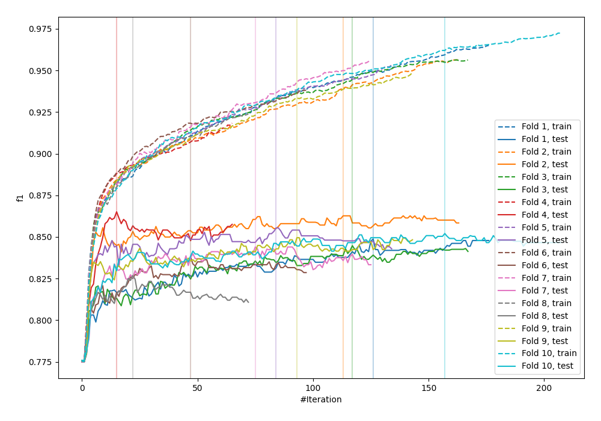
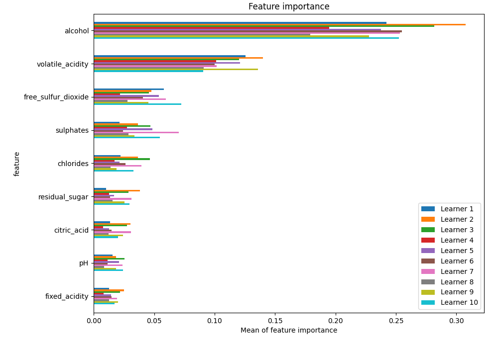
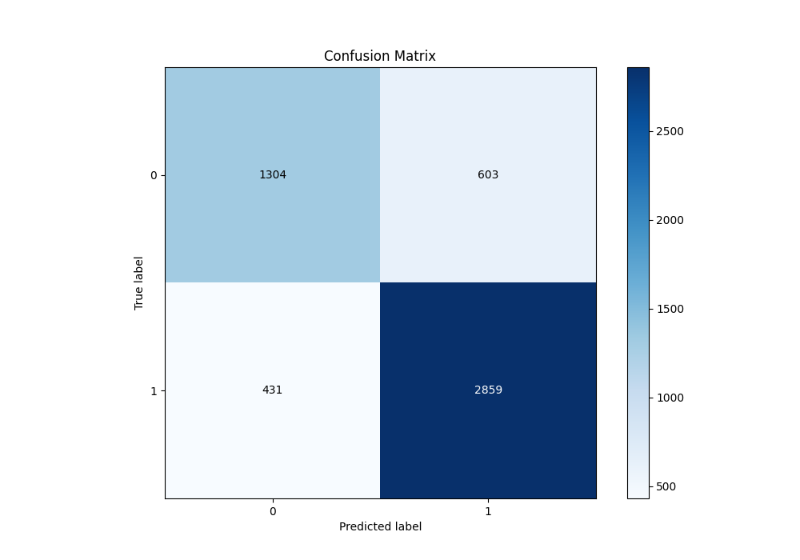
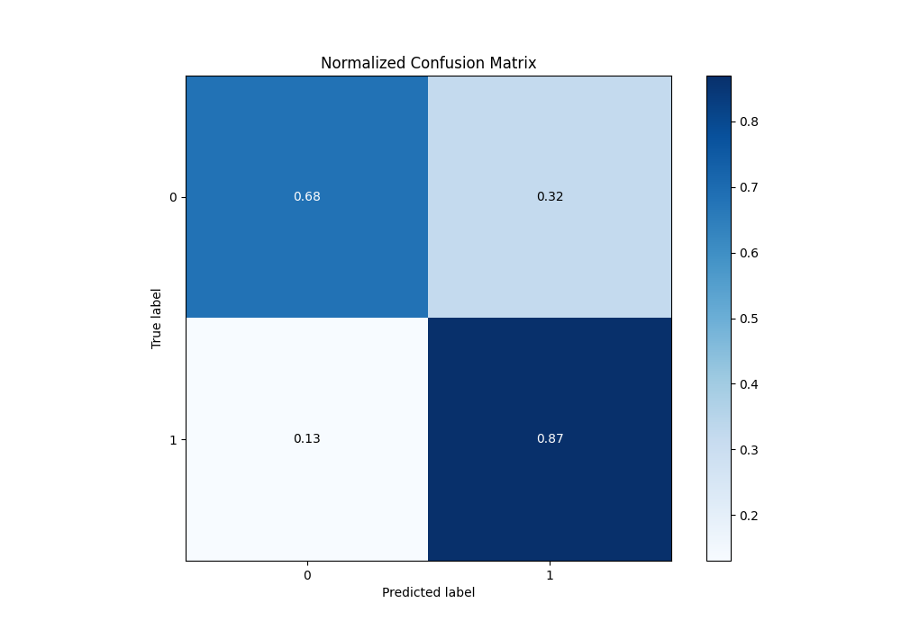
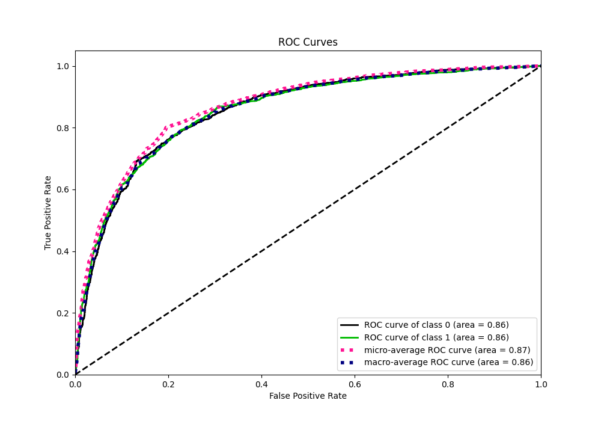
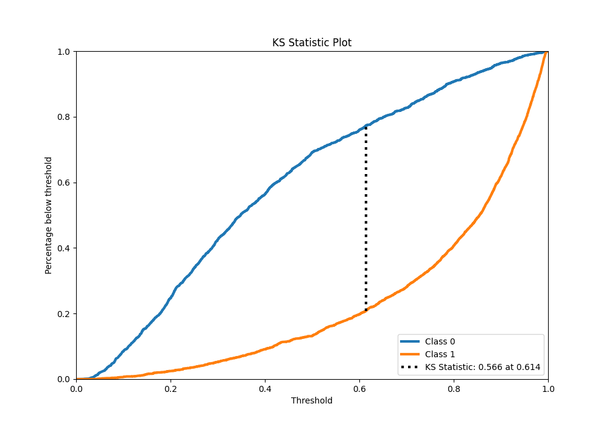
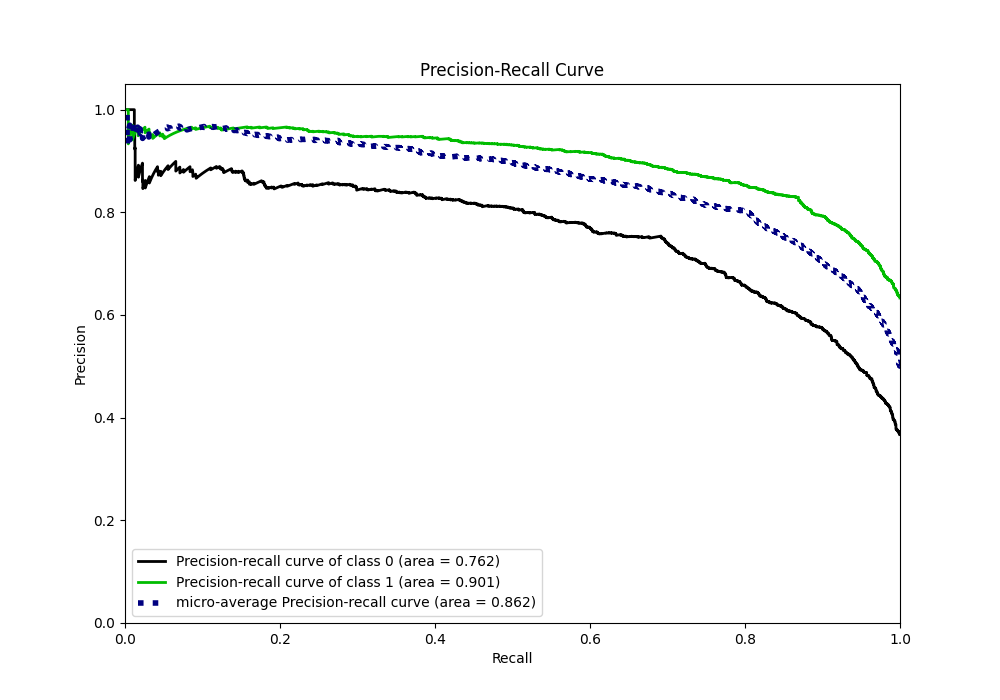
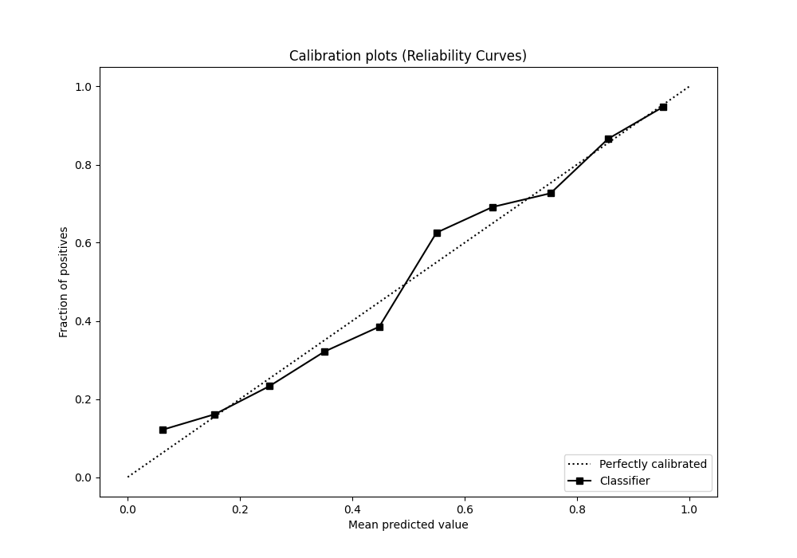
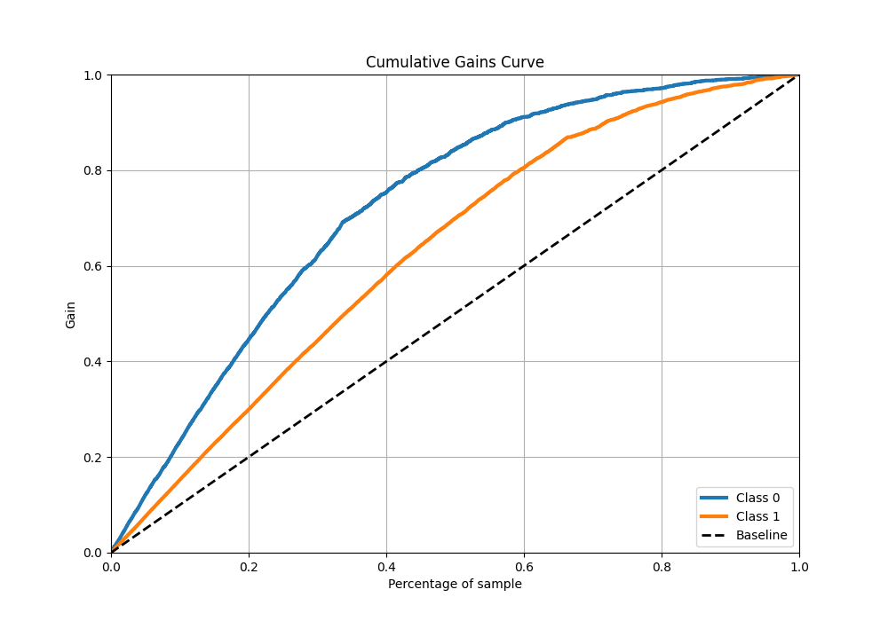
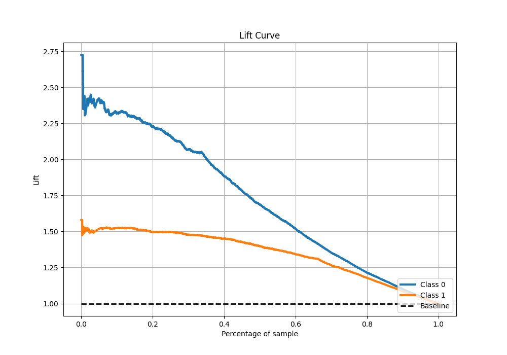

# Summary of 84_Xgboost

[<< Go back](../README.md)

## Extreme Gradient Boosting (Xgboost)
- **n_jobs**: -1
- **objective**: binary:logistic
- **eta**: 0.1
- **max_depth**: 8
- **min_child_weight**: 5
- **subsample**: 1.0
- **colsample_bytree**: 1.0
- **eval_metric**: f1
- **explain_level**: 1

## Validation
 - **validation_type**: kfold
 - **k_folds**: 10
 - **shuffle**: True
 - **stratify**: True
 - **random_seed**: 12

## Optimized metric
f1

## Training time

16.7 seconds

## Metric details
|           |    score |   threshold |
|:----------|---------:|------------:|
| logloss   | 0.456057 | nan         |
| auc       | 0.855002 | nan         |
| f1        | 0.84686  |   0.496324  |
| accuracy  | 0.801039 |   0.496324  |
| precision | 0.966102 |   0.952895  |
| recall    | 1        |   0.0138604 |
| mcc       | 0.566273 |   0.509192  |

## Metric details with threshold from accuracy metric
|           |    score |   threshold |
|:----------|---------:|------------:|
| logloss   | 0.456057 |  nan        |
| auc       | 0.855002 |  nan        |
| f1        | 0.84686  |    0.496324 |
| accuracy  | 0.801039 |    0.496324 |
| precision | 0.825823 |    0.496324 |
| recall    | 0.868997 |    0.496324 |
| mcc       | 0.564967 |    0.496324 |

## Confusion matrix (at threshold=0.496324)
|              |   Predicted as 0 |   Predicted as 1 |
|:-------------|-----------------:|-----------------:|
| Labeled as 0 |             1304 |              603 |
| Labeled as 1 |              431 |             2859 |

## Learning curves

## Permutation-based Importance

## Confusion Matrix

## Normalized Confusion Matrix

## ROC Curve

## Kolmogorov-Smirnov Statistic

## Precision-Recall Curve

## Calibration Curve

## Cumulative Gains Curve

## Lift Curve

[<< Go back](../README.md)
