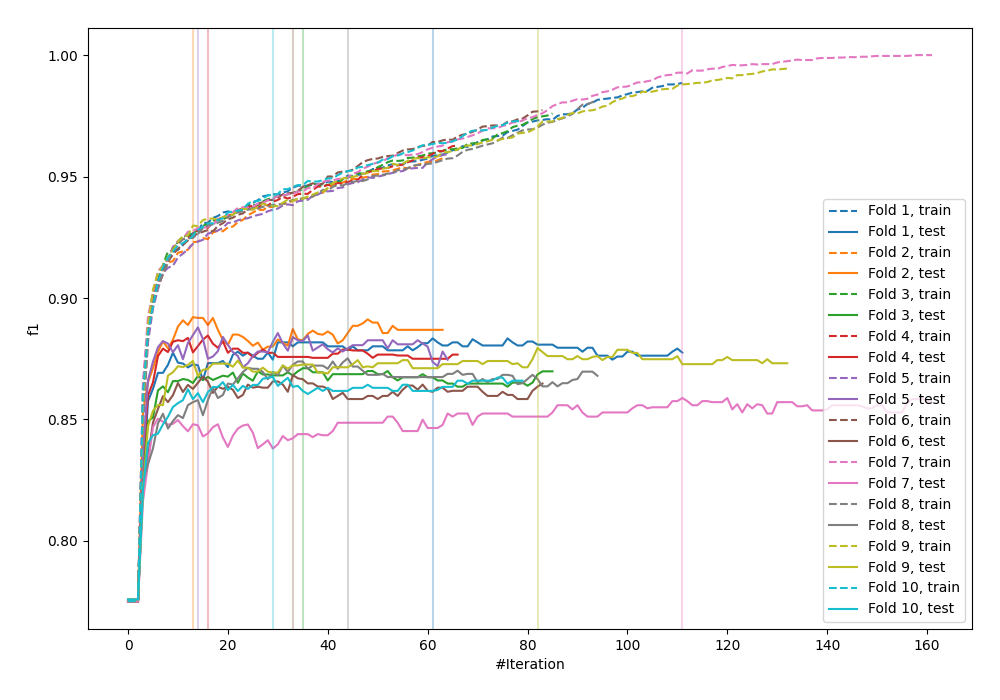
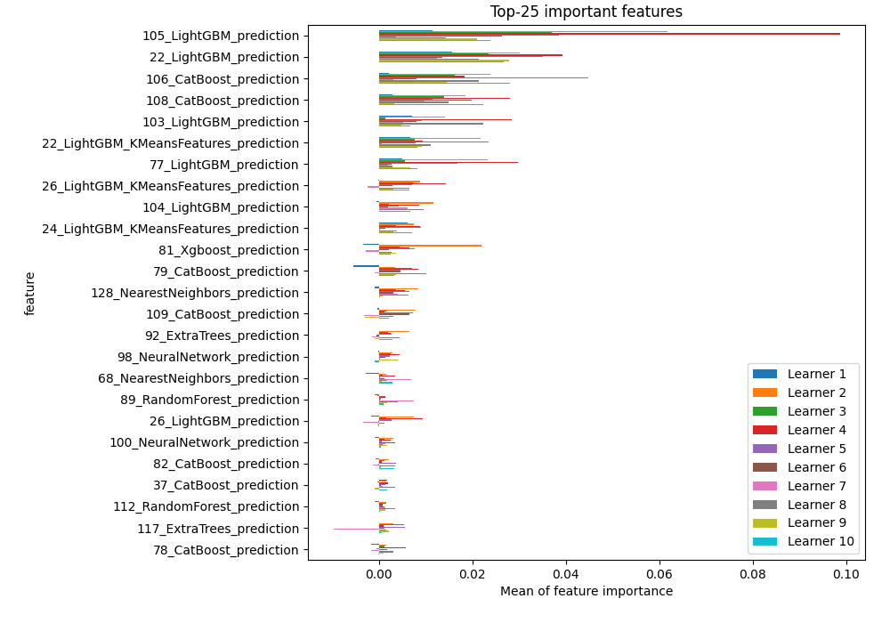
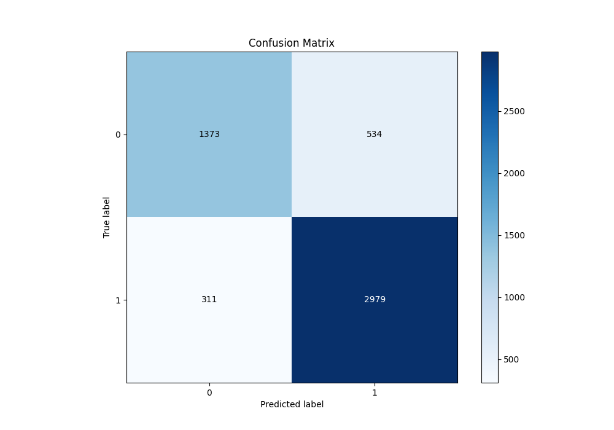
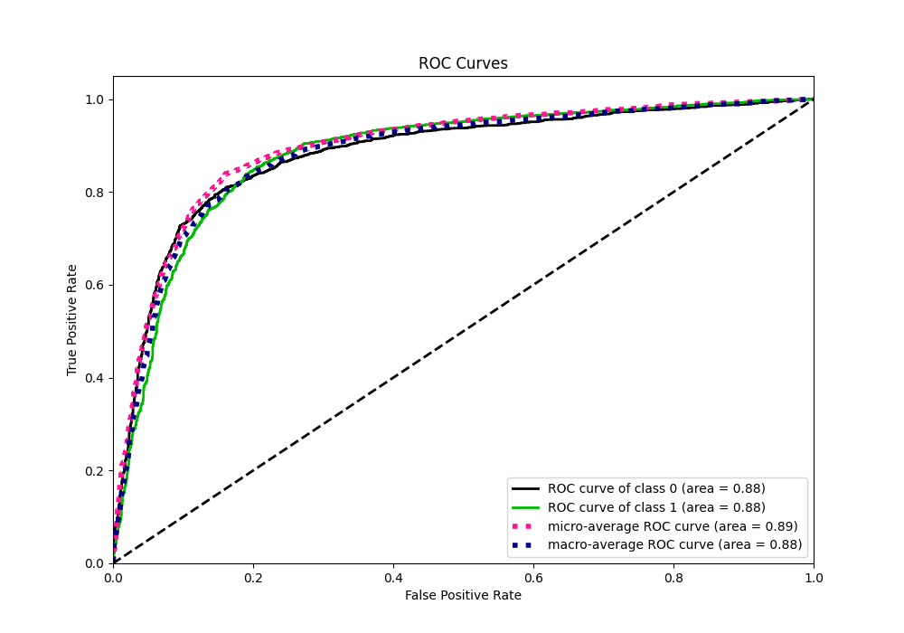
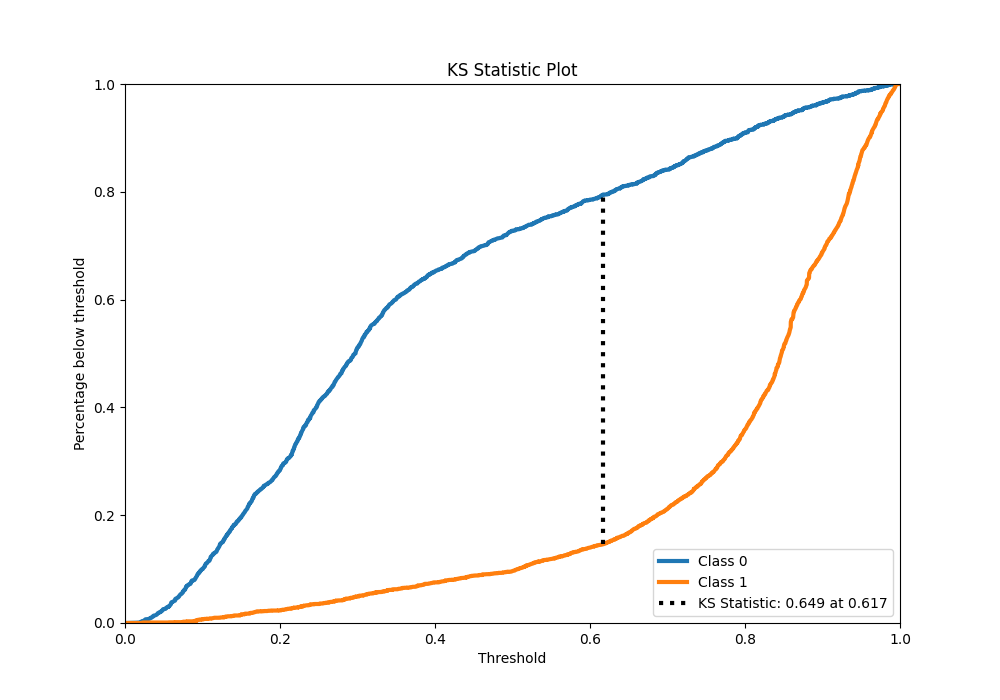
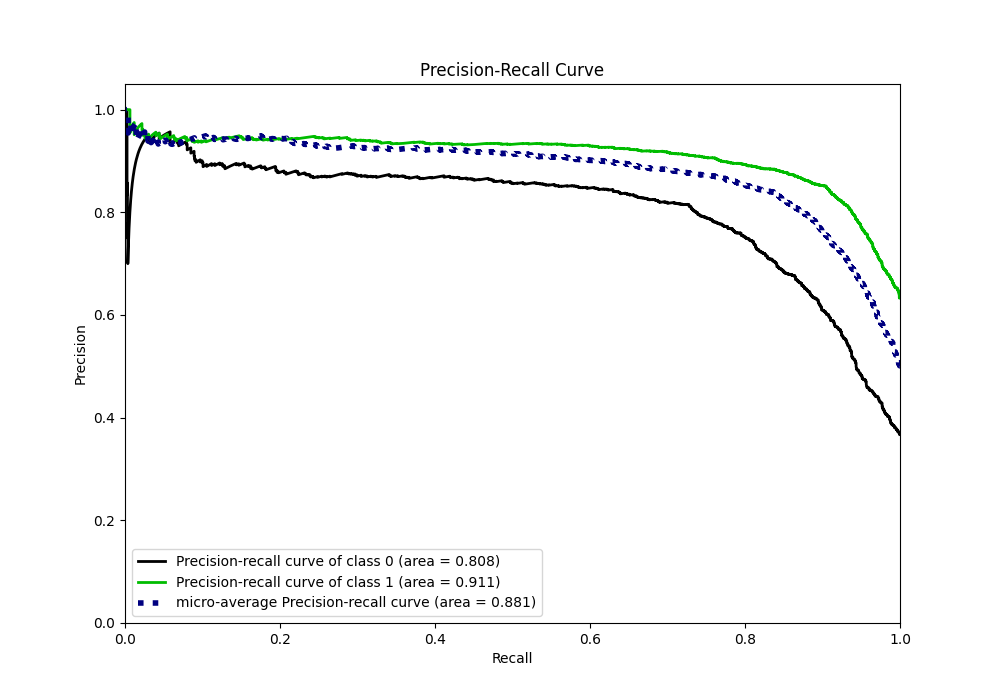
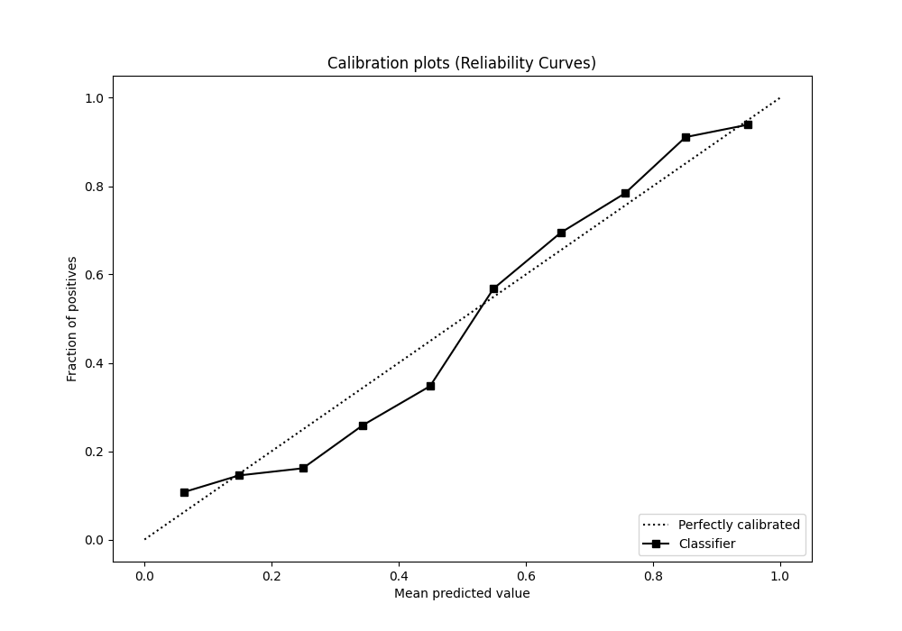
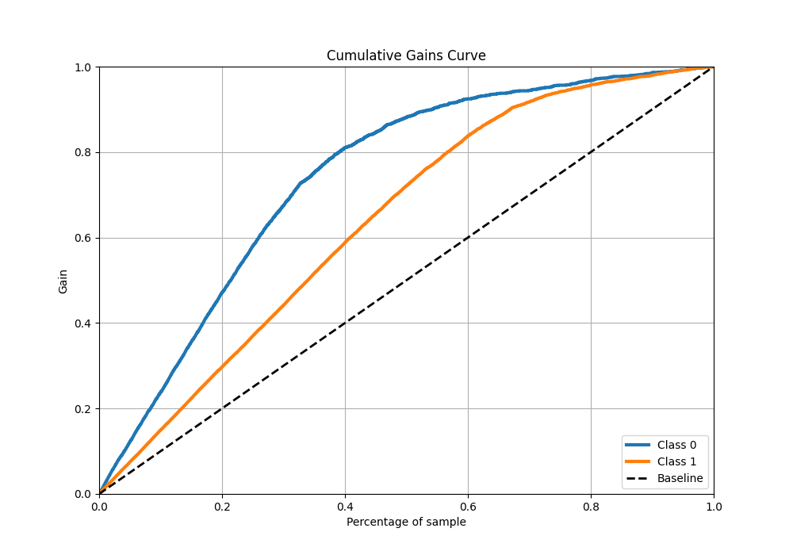
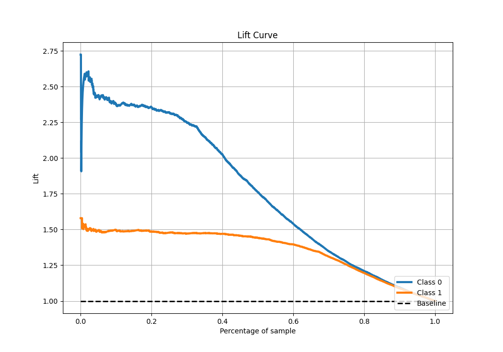

# Summary of 85_Xgboost_Stacked

[<< Go back](../README.md)

## Extreme Gradient Boosting (Xgboost)
- **n_jobs**: -1
- **objective**: binary:logistic
- **eta**: 0.075
- **max_depth**: 7
- **min_child_weight**: 1
- **subsample**: 0.9
- **colsample_bytree**: 0.9
- **eval_metric**: f1
- **explain_level**: 1

## Validation
 - **validation_type**: kfold
 - **k_folds**: 10
 - **shuffle**: True
 - **stratify**: True
 - **random_seed**: 12

## Optimized metric
f1

## Training time

26.8 seconds

## Metric details
|           |    score |   threshold |
|:----------|---------:|------------:|
| logloss   | 0.41503  | nan         |
| auc       | 0.881559 | nan         |
| f1        | 0.87579  |   0.491806  |
| accuracy  | 0.837406 |   0.491806  |
| precision | 0.952381 |   0.979502  |
| recall    | 1        |   0.0134622 |
| mcc       | 0.644104 |   0.491806  |

## Metric details with threshold from accuracy metric
|           |    score |   threshold |
|:----------|---------:|------------:|
| logloss   | 0.41503  |  nan        |
| auc       | 0.881559 |  nan        |
| f1        | 0.87579  |    0.491806 |
| accuracy  | 0.837406 |    0.491806 |
| precision | 0.847993 |    0.491806 |
| recall    | 0.905471 |    0.491806 |
| mcc       | 0.644104 |    0.491806 |

## Confusion matrix (at threshold=0.491806)
|              |   Predicted as 0 |   Predicted as 1 |
|:-------------|-----------------:|-----------------:|
| Labeled as 0 |             1373 |              534 |
| Labeled as 1 |              311 |             2979 |

## Learning curves

## Permutation-based Importance

## Confusion Matrix

## Normalized Confusion Matrix

## ROC Curve

## Kolmogorov-Smirnov Statistic

## Precision-Recall Curve

## Calibration Curve

## Cumulative Gains Curve

## Lift Curve

[<< Go back](../README.md)
