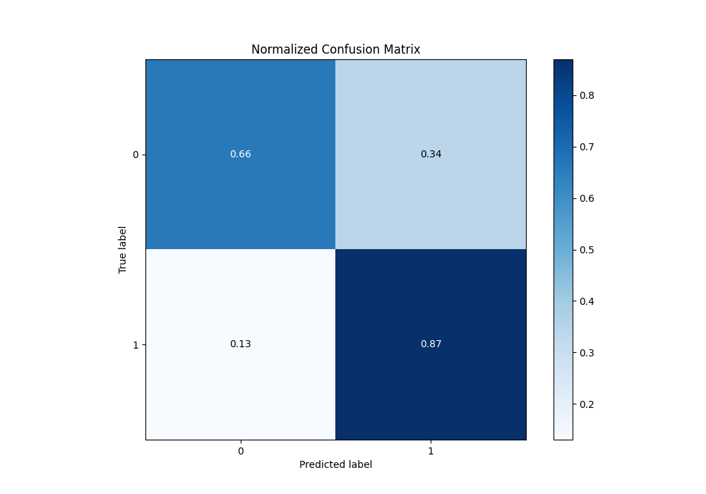

# Summary of 86_CatBoost

[<< Go back](../README.md)

## CatBoost
- **n_jobs**: -1
- **learning_rate**: 0.1
- **depth**: 6
- **rsm**: 1.0
- **loss_function**: Logloss
- **eval_metric**: F1
- **explain_level**: 1

## Validation
 - **validation_type**: kfold
 - **k_folds**: 10
 - **shuffle**: True
 - **stratify**: True
 - **random_seed**: 12

## Optimized metric
f1

## Training time

13.3 seconds

## Metric details
|           |    score |   threshold |
|:----------|---------:|------------:|
| logloss   | 0.460533 |  nan        |
| auc       | 0.851172 |  nan        |
| f1        | 0.844627 |    0.500023 |
| accuracy  | 0.796613 |    0.500023 |
| precision | 1        |    0.977213 |
| recall    | 1        |    0.017738 |
| mcc       | 0.553682 |    0.500023 |

## Metric details with threshold from accuracy metric
|           |    score |   threshold |
|:----------|---------:|------------:|
| logloss   | 0.460533 |  nan        |
| auc       | 0.851172 |  nan        |
| f1        | 0.844627 |    0.500023 |
| accuracy  | 0.796613 |    0.500023 |
| precision | 0.81782  |    0.500023 |
| recall    | 0.873252 |    0.500023 |
| mcc       | 0.553682 |    0.500023 |

## Confusion matrix (at threshold=0.500023)
|              |   Predicted as 0 |   Predicted as 1 |
|:-------------|-----------------:|-----------------:|
| Labeled as 0 |             1267 |              640 |
| Labeled as 1 |              417 |             2873 |

## Learning curves

## Permutation-based Importance

## Confusion Matrix

## Normalized Confusion Matrix

## ROC Curve

## Kolmogorov-Smirnov Statistic

## Precision-Recall Curve

## Calibration Curve

## Cumulative Gains Curve

## Lift Curve

[<< Go back](../README.md)
